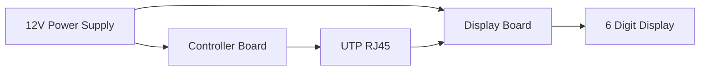
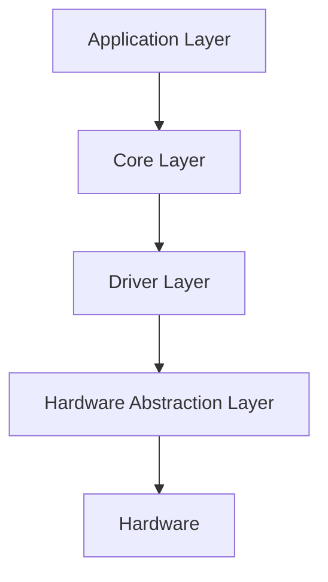

# 00 - Project Overview

> Project overview and high-level specification for Operation Timer.

**Document ID** : OT-DOC-000  
**Document Name** : Project Overview  
**Project** : Operation Timer  
**Version** : 1.0.0  
**Status** : Draft  
**Last Update** : 2026-07-30

---

# Revision History

| Version | Date | Author | Description |
|----------|------------|----------------|------------------------------|
| 1.0.0 | 2026-07-30 | Development Team | Initial Document |

---

# 1. Purpose

Dokumen ini menjelaskan gambaran umum proyek **Operation Timer**, termasuk tujuan pengembangan, ruang lingkup sistem, kebutuhan utama, arsitektur tingkat tinggi, serta prinsip pengembangan firmware dan hardware.

Dokumen ini menjadi acuan utama sebelum membaca dokumen teknis lainnya.

---

# 2. Project Background

Operation Timer merupakan perangkat digital yang dirancang untuk membantu tenaga medis dalam memonitor waktu selama proses operasi.

Perangkat harus memiliki tingkat keandalan tinggi, antarmuka yang sederhana, serta mampu beroperasi secara terus-menerus (24/7).

Firmware dikembangkan menggunakan pendekatan modular sehingga mudah dipelihara dan dikembangkan di masa depan.

---

# 3. Project Objectives

Tujuan utama proyek adalah membangun perangkat yang memiliki karakteristik berikut:

- Akurasi waktu tinggi menggunakan RTC DS3231.
- Tampilan besar dan mudah dibaca dari jarak jauh.
- Respon tombol cepat dan konsisten.
- Operasi non-blocking tanpa penggunaan `delay()`.
- Firmware modular dan reusable.
- Siap digunakan pada lingkungan operasi dengan waktu kerja panjang.
- Mudah diproduksi dan dipelihara.

---

# 4. Scope

## Included

Project ini mencakup:

- Firmware Embedded
- Hardware Controller
- Hardware Display
- Dokumentasi
- Testing
- Production Guideline

---

## Excluded

Project ini tidak mencakup:

- Wireless Communication
- Internet Connectivity
- Data Logging
- Touch Screen
- Battery Backup System
- Remote Monitoring

Fitur di atas dapat ditambahkan pada revisi berikutnya.

---

# 5. Main Features

## Clock

- Format 24 Jam
- RTC DS3231
- Sinkronisasi otomatis
- Update setiap 1 detik

---

## Stopwatch

Range

```
00:00:00

↓

99:99:99
```

Fitur

- Start
- Pause
- Resume
- Reset

---

## Countdown

Range

```
99:99:99

↓

00:00:00
```

Fitur

- Set Time
- Start
- Pause
- Resume
- Stop
- Alarm saat selesai

---

# 6. User Interface

## Input

Jumlah tombol

```
5
```

Tombol

- Power
- Next
- Select
- Up
- Down

Seluruh tombol menggunakan:

- INPUT_PULLUP
- Active Low

Button Event

- Short Press
- Hold
- Auto Repeat

---

## Output

- 6 Digit 7 Segment
- Colon / Tick
- Active Low Buzzer
- Active Low Power LED

---

# 7. Hardware Overview

## Controller Board

Komponen:

- Arduino Nano
- DS3231 RTC
- Buck Converter 12V → 5V
- Active Low Buzzer
- Active Low Power LED
- Push Button

---

## Display Board

Komponen:

- 6 Digit 2.3" Common Anode
- 74HC595 ×2
- ULN2803
- BC547C
- S8550
- Colon / Tick LED
- Buck Converter 12V → 5V

---

# 8. System Overview



---

# 9. Firmware Overview

Firmware dibangun menggunakan layered architecture.



---

# 10. Application Modules

Application Layer terdiri dari:

- Clock
- Stopwatch
- Countdown
- Mode Manager

Core Layer terdiri dari:

- Scheduler
- Event Queue
- Software Timer

Driver Layer terdiri dari:

- Display Driver
- Button Driver
- RTC Driver
- Buzzer Driver
- LED Driver

HAL terdiri dari:

- GPIO
- Timer
- Wire (I²C)
- Shift Register Interface

---

# 11. Hardware Specification

| Item | Specification |
|------|---------------|
| MCU | ATmega328P |
| Board | Arduino Nano |
| RTC | DS3231 |
| Display | 6 Digit 2.3" Common Anode |
| Display Method | Multiplex |
| Driver IC | 74HC595 ×2 |
| Segment Driver | ULN2803 |
| Digit Driver | BC547C + S8550 |
| Supply Voltage | 12VDC |
| Logic Voltage | 5VDC |

---

# 12. Development Environment

| Item | Value |
|------|-------|
| IDE | Visual Studio Code |
| Extension | PlatformIO |
| Framework | Arduino |
| Language | C++17 |
| Version Control | Git |
| Documentation | Markdown |
| Diagram | Mermaid |

---

# 13. Design Principles

Firmware harus mengikuti prinsip berikut:

- Non Blocking
- Event Driven
- Modular
- Layered Architecture
- Reusable Driver
- Deterministic Timing
- Low Memory Usage
- Production Ready

---

# 14. Project Constraints

Target platform menggunakan Arduino Nano dengan spesifikasi:

| Resource | Capacity |
|----------|----------|
| Flash | 32 KB |
| SRAM | 2 KB |
| EEPROM | 1 KB |

Oleh karena itu firmware harus:

- Tidak menggunakan Dynamic Memory.
- Tidak menggunakan class yang menghasilkan copy object besar.
- Mengutamakan Passing by Reference untuk object berukuran lebih dari 4 Byte.
- Menggunakan Passing by Value untuk parameter ≤ 4 Byte.
- Menghindari penggunaan `String`.
- Mengoptimalkan penggunaan SRAM.

---

# 15. Project Documentation

Dokumentasi proyek dibagi menjadi beberapa dokumen.

| Document | Description |
|-----------|-------------|
| 00_Project_Overview | Gambaran umum proyek |
| 01_System_Requirements | Functional & Non Functional Requirements |
| 02_Hardware_Architecture | Arsitektur Hardware |
| 03_Pin_Mapping | Mapping seluruh pin |
| 04_Display_Driver | Driver Display |
| 05_Button_System | Sistem Button |
| 06_Mode_Manager | FSM Aplikasi |
| 07_RTC_System | RTC & Timekeeping |
| 08_Buzzer_LED | Driver Output |
| 09_Firmware_Architecture | Arsitektur Firmware |
| 10_Coding_Standard | Standar Penulisan Kode |
| 11_Project_Structure | Struktur Project PlatformIO |
| 12_Testing_Checklist | Validasi Firmware |
| 13_UI_UX_Specification | Perilaku User Interface |
| 14_Manufacturing_BOM | Bill of Materials |
| 15_Production_Guide | Panduan Produksi |
| 16_Firmware_Versioning | Firmware Versioning |

---

# 16. Success Criteria

Firmware dinyatakan memenuhi spesifikasi apabila:

- Seluruh fitur berjalan sesuai requirement.
- Display bebas flicker.
- Clock sinkron dengan RTC.
- Stopwatch dan Countdown berjalan akurat.
- Seluruh tombol menghasilkan event dengan benar.
- Tidak menggunakan `delay()`.
- Tidak menggunakan Dynamic Memory.
- Memenuhi target penggunaan Flash dan SRAM.
- Lulus seluruh pengujian pada dokumen **12_Testing_Checklist.md**.

---

# 17. Related Documents

- README.md
- 01_System_Requirements.md
- 02_Hardware_Architecture.md
- 09_Firmware_Architecture.md
- 10_Coding_Standard.md

---

# Implementation Notes

- Seluruh pengembangan firmware menggunakan **PlatformIO**.
- Seluruh dokumentasi menggunakan **Markdown**.
- Diagram menggunakan **Mermaid** agar kompatibel dengan GitHub dan Visual Studio Code.
- Seluruh perubahan firmware harus mengikuti **Semantic Versioning**.
- Setiap perubahan spesifikasi wajib memperbarui dokumen terkait.

---

# Production Notes

- Firmware dan hardware harus memiliki nomor revisi yang saling terkait.
- Setiap unit produksi harus dapat diidentifikasi berdasarkan versi firmware dan revisi hardware.
- Seluruh perubahan hardware harus dievaluasi terhadap kompatibilitas firmware.

---

**End of Document**