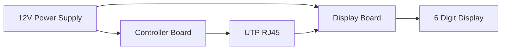

# 01 - System Requirements

> Functional and Non-Functional Requirements for Operation Timer Firmware

**Document ID** : OT-DOC-001  
**Document Name** : System Requirements  
**Project** : Operation Timer  
**Version** : 1.0.0  
**Status** : Draft  
**Last Update** : 2026-07-30

---

# Revision History

| Version | Date | Author | Description |
|----------|------------|----------------|------------------------------|
| 1.0.0 | 2026-07-30 | Development Team | Initial Document |

---

# 1. Purpose

Dokumen ini mendefinisikan seluruh kebutuhan sistem (System Requirements) yang harus dipenuhi oleh firmware Operation Timer.

Dokumen ini menjadi acuan utama selama proses desain firmware, implementasi, pengujian, dan validasi.

---

# 2. Scope

Dokumen ini mencakup:

- Functional Requirements
- Non-Functional Requirements
- Hardware Requirements
- Software Requirements
- Performance Requirements
- Reliability Requirements
- Future Expansion Requirements

---

# 3. System Overview

Operation Timer merupakan perangkat timer digital untuk kebutuhan ruang operasi (Operating Room).

Perangkat terdiri dari dua PCB yang saling terhubung menggunakan kabel RJ45.



---

# 4. Functional Requirements

## FR-001 Clock Mode

Firmware harus menyediakan mode Clock.

Requirement:

- Format 24 jam.
- Menampilkan HH:MM:SS.
- Menggunakan RTC DS3231 sebagai sumber waktu.
- Update setiap 1 detik menggunakan SQW 1 Hz.
- Clock tetap berjalan setelah restart selama baterai RTC tersedia.

Priority

High

---

## FR-002 Stopwatch Mode

Firmware harus menyediakan mode Stopwatch.

Requirement:

- Range 00:00:00 sampai 99:99:99.
- Resolusi 1 detik.
- Start.
- Pause.
- Resume.
- Reset.
- Tick indikator setiap detik.

Priority

High

---

## FR-003 Countdown Mode

Firmware harus menyediakan mode Countdown.

Requirement:

- Range 99:99:99 sampai 00:00:00.
- Pengaturan waktu menggunakan tombol.
- Start.
- Pause.
- Resume.
- Stop.
- Alarm saat mencapai nol.
- Countdown berhenti otomatis setelah selesai.

Priority

High

---

## FR-004 Mode Switching

Firmware harus menyediakan perpindahan mode.

Urutan:

```text
Clock

↓

Stopwatch

↓

Countdown

↓

Clock
```

Perpindahan dilakukan menggunakan tombol NEXT.

Priority

High

---

## FR-005 Display

Firmware harus mengendalikan display.

Requirement:

- 6 Digit.
- Multiplex.
- Refresh minimum 800 Hz.
- Target refresh 1000 Hz.
- Tidak terlihat flicker.
- Brightness seragam.

Priority

High

---

## FR-006 Button

Firmware harus membaca lima tombol.

Button

- Power
- Next
- Select
- Up
- Down

Setiap tombol mendukung:

- Short Press
- Hold
- Repeat

Priority

High

---

## FR-007 Buzzer

Firmware harus menghasilkan bunyi sebagai indikator.

Jenis bunyi:

- Button
- Save
- Reset
- Mode Change
- Countdown Finish
- Error (Reserved)

Priority

Medium

---

## FR-008 LED Indicator

Firmware harus mengendalikan LED Power.

Priority

Medium

---

## FR-009 RTC Synchronization

Firmware harus membaca waktu dari DS3231.

Requirement:

- Sinkron setiap interrupt SQW.
- Tidak menggunakan software clock sebagai referensi utama.

Priority

High

---

## FR-010 Self Test

Saat perangkat dinyalakan.

Firmware harus:

- Menginisialisasi seluruh hardware.
- Menguji display.
- Menguji RTC.
- Menginisialisasi scheduler.
- Menginisialisasi seluruh driver.

Priority

Medium

---

# 5. Hardware Requirements

## Controller Board

Komponen wajib:

- Arduino Nano
- DS3231
- Buck Converter 12V → 5V
- Active Low Buzzer
- Active Low Power LED
- 5 Push Button

---

## Display Board

Komponen wajib:

- 74HC595 ×2
- ULN2803
- BC547C
- S8550
- 6 Digit 2.3" Common Anode
- Colon LED
- Buck Converter 12V → 5V

---

## Communication

Controller Board dan Display Board menggunakan kabel RJ45.

Komunikasi meliputi:

- DATA
- CLOCK
- LATCH
- OE
- 12V
- GND

---

# 6. Software Requirements

Firmware harus dikembangkan menggunakan:

| Item | Requirement |
|------|-------------|
| IDE | Visual Studio Code |
| Extension | PlatformIO |
| Framework | Arduino |
| Language | C++17 |
| Documentation | Markdown |
| Diagram | Mermaid |
| Version Control | Git |

---

# 7. Coding Requirements

Firmware wajib mengikuti Coding Standard.

Persyaratan utama:

- Tidak menggunakan `delay()`.
- Tidak menggunakan `String`.
- Tidak menggunakan Dynamic Memory.
- Menggunakan `enum class`.
- Menggunakan `constexpr`.
- Menggunakan `const`.
- Menggunakan Passing by Reference untuk object > 4 Byte.
- Menggunakan Passing by Value untuk parameter ≤ 4 Byte.
- Menggunakan PROGMEM untuk string tetap.
- Seluruh modul bersifat reusable.

Seluruh aturan dijelaskan pada:

```
10_Coding_Standard.md
```

---

# 8. Performance Requirements

| Requirement | Target |
|-------------|---------|
| Boot Time | < 500 ms |
| Display Refresh | 1000 Hz |
| Digit Refresh | 166 Hz |
| Button Scan | 10 ms |
| Button Response | < 20 ms |
| Loop Execution | < 1 ms |
| ISR Execution | < 100 µs |
| CPU Usage | < 30 % |
| Flash Usage | < 70 % |
| SRAM Usage | < 60 % |

---

# 9. Memory Requirements

Target platform:

ATmega328P

| Resource | Capacity | Target Usage |
|----------|-----------|--------------|
| Flash | 32 KB | < 22 KB |
| SRAM | 2 KB | < 1.2 KB |
| EEPROM | 1 KB | < 256 Byte |

Firmware harus mengoptimalkan penggunaan SRAM.

Prioritas optimasi:

1. Static Allocation
2. Stack Allocation
3. Passing by Const Reference
4. Passing by Reference
5. Passing by Value (≤ 4 Byte)

Dynamic Memory Allocation tidak diperbolehkan.

---

# 10. Timing Requirements

| Function | Source |
|----------|--------|
| Clock | RTC SQW 1 Hz |
| Stopwatch | RTC SQW 1 Hz |
| Countdown | RTC SQW 1 Hz |
| Display Refresh | Timer Interrupt |
| Button Scan | Scheduler |
| UI Update | Scheduler |
| LED Update | Scheduler |
| Buzzer Update | Scheduler |

---

# 11. Reliability Requirements

Firmware harus memenuhi persyaratan berikut:

- Beroperasi 24 jam × 7 hari.
- Tidak mengalami memory leak.
- Tidak mengalami display flicker.
- Tidak kehilangan sinkronisasi RTC.
- Tetap stabil setelah power cycle.
- Tidak menggunakan blocking function.
- Tidak terjadi deadlock antar modul.

---

# 12. Maintainability Requirements

Firmware harus:

- Modular.
- Mudah diuji.
- Mudah dikembangkan.
- Memiliki dokumentasi lengkap.
- Menggunakan Layered Architecture.
- Memiliki Coding Standard yang konsisten.

---

# 13. Scalability Requirements

Firmware harus mudah ditambahkan fitur berikut tanpa perubahan besar pada arsitektur:

- Brightness Control
- EEPROM Configuration
- UART Debug
- RS-485 Communication
- External Foot Switch
- Alarm Schedule
- Display Test Mode
- Factory Test Mode
- Firmware Information Menu

---

# 14. Acceptance Criteria

Firmware dianggap memenuhi spesifikasi apabila:

- Semua Functional Requirement (FR-001 sampai FR-010) terpenuhi.
- Semua target performa tercapai.
- Semua target penggunaan memori tercapai.
- Seluruh pengujian pada **12_Testing_Checklist.md** dinyatakan lulus.
- Tidak ditemukan warning compiler pada konfigurasi Release.
- Dokumentasi selalu sesuai dengan implementasi firmware.

---

# 15. Traceability Matrix

| Requirement | Reference Document |
|-------------|--------------------|
| Clock | 06_Mode_Manager.md |
| Stopwatch | 06_Mode_Manager.md |
| Countdown | 06_Mode_Manager.md |
| Display | 04_Display_Driver.md |
| Button | 05_Button_System.md |
| RTC | 07_RTC_System.md |
| Buzzer | 08_Buzzer_LED.md |
| Firmware | 09_Firmware_Architecture.md |
| Coding | 10_Coding_Standard.md |

---

# 16. Implementation Notes

- Semua timing harus bersifat non-blocking.
- Multiplex display dijalankan melalui Timer Interrupt.
- RTC SQW digunakan sebagai referensi waktu utama.
- Scheduler bersifat cooperative.
- Seluruh komunikasi antar modul dilakukan melalui interface yang jelas.
- Firmware harus dapat dikompilasi menggunakan PlatformIO tanpa modifikasi tambahan.

---

# 17. Production Notes

- Firmware Release harus memiliki nomor versi yang valid.
- Firmware harus sesuai dengan revisi hardware yang didukung.
- Setiap perubahan requirement wajib memperbarui dokumen ini.
- Setiap perubahan requirement harus ditelusuri hingga implementasi dan pengujian (traceability).

---

# 18. Related Documents

- README.md
- 00_Project_Overview.md
- 02_Hardware_Architecture.md
- 09_Firmware_Architecture.md
- 10_Coding_Standard.md
- 12_Testing_Checklist.md
- 16_Firmware_Versioning.md

---

**End of Document**