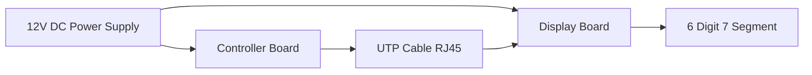
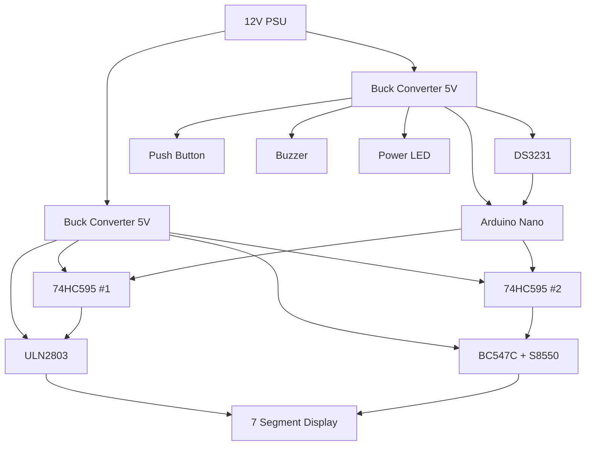
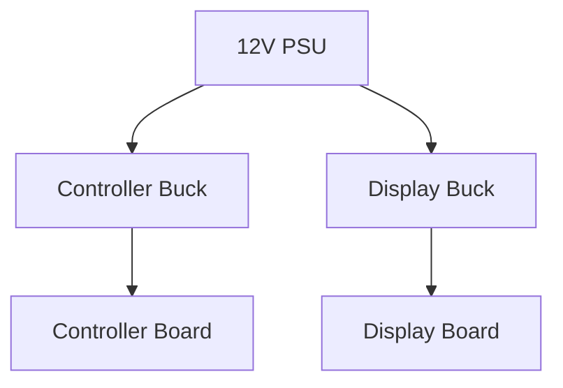
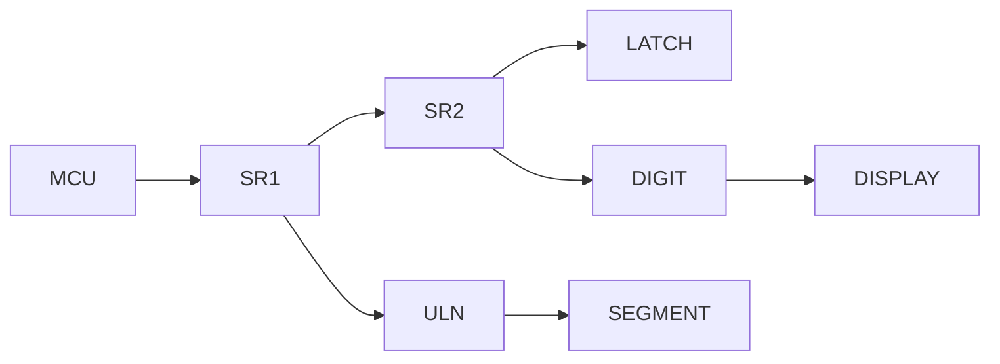

# 02 - Hardware Architecture

> Hardware Architecture Specification for Operation Timer

**Document ID** : OT-DOC-002  
**Document Name** : Hardware Architecture  
**Project** : Operation Timer  
**Version** : 1.0.0  
**Status** : Draft  
**Last Update** : 2026-07-30

---

# Revision History

| Version | Date | Author | Description |
|----------|------------|----------------|------------------------------|
| 1.0.0 | 2026-07-30 | Development Team | Initial Document |

---

# 1. Purpose

Dokumen ini menjelaskan arsitektur hardware Operation Timer, hubungan antar modul, distribusi daya, komunikasi antar board, serta standar desain hardware yang harus diikuti selama proses pengembangan dan produksi.

Dokumen ini menjadi acuan utama bagi firmware engineer, hardware engineer, dan production engineer.

---

# 2. Scope

Dokumen ini mencakup:

- Hardware Block Diagram
- Board Architecture
- Power Distribution
- Signal Distribution
- Display Architecture
- Communication Architecture
- Design Rules
- Production Rules

---

# 3. System Overview

Operation Timer terdiri dari dua buah PCB.

1. Controller Board
2. Display Board

Kedua board dihubungkan menggunakan kabel UTP dengan konektor RJ45.



---

# 4. Hardware Block Diagram



---

# 5. Controller Board

## Main Components

| Component | Function |
|-----------|----------|
| Arduino Nano | Main Controller |
| DS3231 | RTC |
| Buck Converter | 12V → 5V |
| Push Button | User Input |
| Active Low Buzzer | Audio Indicator |
| Active Low LED | Power Indicator |

---

## Responsibilities

Controller Board bertanggung jawab terhadap:

- User Interface
- RTC Communication
- Firmware Execution
- Scheduler
- Mode Manager
- Display Data Generation
- Button Processing

Controller Board **tidak** melakukan penguatan arus display.

---

# 6. Display Board

## Main Components

| Component | Function |
|-----------|----------|
| 74HC595 #1 | Segment Shift Register |
| ULN2803 | Segment Driver |
| 74HC595 #2 | Digit Shift Register |
| BC547C | Digit Driver (NPN) |
| S8550 | Digit Driver (PNP) |
| 6 Digit Display | Visual Output |
| Tick LED | Second Indicator |
| Buck Converter | 12V → 5V |

---

## Responsibilities

Display Board bertanggung jawab terhadap:

- Multiplex Display
- Segment Driver
- Digit Driver
- Tick LED

Display Board tidak memiliki logika aplikasi.

---

# 7. Power Distribution

Supply utama menggunakan:

```
12V DC
```

Distribusi daya:



---

## Design Rules

- Setiap board memiliki Buck Converter sendiri.
- Tidak mendistribusikan tegangan 5V antar board.
- Tegangan yang dikirim melalui RJ45 adalah 12V.
- Ground harus terhubung antar board.

---

# 8. Estimated Current Consumption

## Controller Board

| Component | Maximum Current |
|-----------|----------------:|
| Arduino Nano | 50 mA |
| RTC | 2 mA |
| LED | 10 mA |
| Buzzer | 35 mA |
| Push Button | Negligible |
| Total | ~100 mA |

---

## Display Board

| Component | Maximum Current |
|-----------|----------------:|
| Display | ~140 mA |
| 74HC595 x2 | 16 mA |
| ULN2803 | 5 mA |
| Tick LED | 10 mA |
| Total | ~175 mA |

---

## Total System

Maximum

```
≈300 mA @5V
```

Power Supply Recommendation

```
12V 3A
```

---

# 9. Communication Architecture

Controller Board dan Display Board dihubungkan menggunakan RJ45.

Media

```
UTP CAT5e
```

Target Panjang

```
≤10 meter
```

---

## Recommended Signal

| Signal | Description |
|----------|------------|
| DATA | Shift Register Data |
| CLOCK | Shift Register Clock |
| LATCH | Shift Register Latch |
| OE | Output Enable |
| 12V | Power |
| GND | Ground |

---

# 10. Display Architecture

Display menggunakan:

- 6 Digit
- Common Anode
- Multiplex
- Daisy Chain Shift Register



---

# 11. Shift Register Architecture

## IC #1

Segment Control

Mengendalikan:

- Segment A
- Segment B
- Segment C
- Segment D
- Segment E
- Segment F
- Segment G

Output menuju ULN2803.

---

## IC #2

Digit Control

Mengendalikan:

- Digit 1
- Digit 2
- Digit 3
- Digit 4
- Digit 5
- Digit 6
- Colon / Tick LED

---

# 12. Multiplex Strategy

Target Refresh

```
1000 Hz
```

Digit Refresh

```
≈166 Hz
```

ISR hanya melakukan:

- Blank Display
- Shift Register Update
- Latch
- Enable Digit

ISR tidak boleh melakukan:

- Konversi angka
- Pembacaan RTC
- Pembacaan tombol
- Perhitungan aplikasi

---

# 13. Hardware Design Rules

## PCB

- Ground Plane penuh pada kedua PCB.
- Pisahkan area logika dan area arus display.
- Jalur arus display dibuat lebih lebar daripada jalur logika.
- Jalur clock shift register dibuat sependek mungkin.
- Hindari loop ground.

---

## Decoupling Capacitor

Setiap IC wajib memiliki:

- 100 nF ceramic capacitor

Ditempatkan sedekat mungkin dengan pin VCC.

---

## Bulk Capacitor

Setiap board wajib memiliki:

- 470–1000 µF electrolytic capacitor

Ditempatkan dekat regulator 5V.

---

## Power Input

Disarankan menambahkan:

- Fuse
- Reverse Polarity Protection
- TVS Diode

---

# 14. Signal Naming Standard

| Signal | Description |
|----------|------------|
| SR_DATA | Shift Register Data |
| SR_CLK | Shift Register Clock |
| SR_LATCH | Shift Register Latch |
| SR_OE | Output Enable |
| RTC_SQW | RTC Interrupt |
| PB_PWR | Power Button |
| PB_NXT | Next Button |
| PB_SLC | Select Button |
| PB_UP | Up Button |
| PB_DWN | Down Button |
| BUZZER | Active Low Buzzer |
| LED_PWR | Power LED |

Seluruh firmware wajib menggunakan nama sinyal ini.

---

# 15. Connector Standard

Konektor antar board menggunakan:

```
RJ45
```

Standar kabel

```
T568B
```

Rekomendasi penggunaan pasangan kabel:

| Pair | Signal |
|------|---------|
| Pair 1 | DATA + GND |
| Pair 2 | CLOCK + GND |
| Pair 3 | LATCH + OE |
| Pair 4 | 12V + 12V |

Catatan:

- Ground harus memiliki impedansi rendah.
- Jalur clock dipasangkan dengan ground untuk mengurangi noise.
- Jika panjang kabel bertambah, pertimbangkan penambahan resistor seri 22–47 Ω pada DATA, CLOCK, dan LATCH untuk meredam ringing.

---

# 16. EMI & Noise Consideration

Untuk meningkatkan keandalan sistem:

- Gunakan Ground Plane.
- Gunakan jalur pendek untuk sinyal digital.
- Hindari jalur CLOCK sejajar dengan jalur arus display.
- Pisahkan jalur regulator switching dari RTC.
- Tempatkan RTC sejauh mungkin dari buck converter.

---

# 17. Production Rules

Seluruh PCB produksi harus memenuhi:

- Seluruh komponen memiliki Reference Designator.
- Silkscreen jelas.
- Revisi PCB tercetak pada PCB.
- Test Point tersedia untuk:
  - 12V
  - 5V Controller
  - 5V Display
  - GND
  - DATA
  - CLOCK
  - LATCH
  - OE
  - RTC SQW

---

# 18. Future Expansion

Hardware dirancang agar dapat mendukung:

- Brightness Control (PWM OE)
- RS-485 Communication
- External Foot Switch
- UART Debug Header
- Firmware Update Header
- Factory Test Connector

Tanpa perubahan besar pada arsitektur utama.

---

# 19. Related Documents

- 00_Project_Overview.md
- 01_System_Requirements.md
- 03_Pin_Mapping.md
- 04_Display_Driver.md
- 09_Firmware_Architecture.md
- 14_Manufacturing_BOM.md

---

# Implementation Notes

- Controller Board hanya bertanggung jawab pada logika aplikasi dan menghasilkan data display.
- Display Board hanya bertanggung jawab pada penggerak display (display engine).
- Seluruh sinyal antar board harus menggunakan level logika 5V TTL.
- Firmware tidak boleh bergantung pada panjang kabel RJ45; desain hardware harus menjaga integritas sinyal dalam batas spesifikasi.

---

# Production Notes

- Setiap revisi hardware wajib meningkatkan nomor revisi PCB (misalnya Rev A, Rev B).
- Kompatibilitas antara revisi hardware dan firmware harus dicatat pada `16_Firmware_Versioning.md`.
- Setiap perubahan pin, komponen, atau topologi rangkaian wajib diikuti pembaruan dokumen ini dan dokumen terkait.

---

**End of Document**