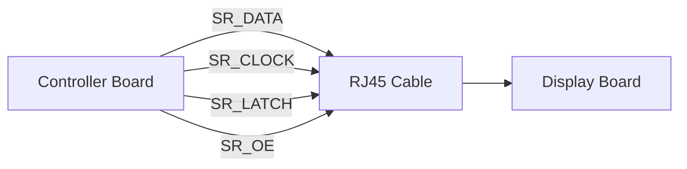

# 03 - Pin Mapping

> Hardware Pin Mapping Specification for Operation Timer

**Document ID** : OT-DOC-003  
**Document Name** : Pin Mapping  
**Project** : Operation Timer  
**Version** : 1.0.0  
**Status** : Draft  
**Last Update** : 2026-07-30

---

# Revision History

| Version | Date | Author | Description |
|----------|------------|----------------|------------------------------|
| 1.0.0 | 2026-07-30 | Development Team | Initial Document |

---

# 1. Purpose

Dokumen ini mendefinisikan seluruh mapping pin hardware yang digunakan pada proyek Operation Timer.

Dokumen ini menjadi **single source of truth** untuk seluruh koneksi hardware dan firmware.

Seluruh driver firmware **tidak boleh menggunakan nomor pin Arduino secara langsung**. Driver hanya boleh menggunakan nama sinyal (Signal Name) yang didefinisikan pada dokumen ini.

---

# 2. Scope

Dokumen ini mencakup:

- Arduino Nano Pin Mapping
- Signal Naming
- RJ45 Pin Mapping
- Shift Register Mapping
- ULN2803 Mapping
- Digit Driver Mapping
- Display Segment Mapping
- Hardware Design Rules

---

# 3. Design Philosophy

Firmware **tidak mengenal pin fisik Arduino**.

Firmware hanya mengenal nama sinyal.

Contoh:

```
SR_DATA
```

bukan

```
D11
```

Nomor pin Arduino hanya boleh didefinisikan di:

```
config/BoardConfig.h
```

Dengan pendekatan ini firmware menjadi portable apabila suatu saat MCU diganti.

---

# 4. Signal Naming Standard

| Signal | Description |
|----------|------------|
| SR_DATA | Shift Register Data |
| SR_CLOCK | Shift Register Clock |
| SR_LATCH | Shift Register Latch |
| SR_OE | Shift Register Output Enable |
| RTC_SQW | RTC 1Hz Interrupt |
| PB_PWR | Power Button |
| PB_SLC | Select Button |
| PB_NXT | Next Button |
| PB_UP | Up Button |
| PB_DWN | Down Button |
| LED_PWR | Power LED |
| BUZZER | Active Low Buzzer |
| I2C_SDA | I²C SDA |
| I2C_SCL | I²C SCL |

---

# 5. Arduino Nano Pin Mapping

| Arduino Pin | Signal | Direction | Description |
|--------------|---------|-----------|-------------|
| D2 | RTC_SQW | Input | RTC Interrupt |
| D3 | BUZZER | Output | Active Low Buzzer |
| D4 | PB_PWR | Input | Power Button |
| D5 | PB_SLC | Input | Select Button |
| D6 | PB_NXT | Input | Next Button |
| D7 | PB_UP | Input | Up Button |
| D8 | PB_DWN | Input | Down Button |
| D9 | SR_OE | Output | Shift Register Output Enable |
| D10 | SR_LATCH | Output | Shift Register Latch |
| D11 | SR_DATA | Output | Shift Register Serial Data |
| D12 | LED_PWR | Output | Power LED |
| D13 | SR_CLOCK | Output | Shift Register Clock |
| A4 | I2C_SDA | Bidirectional | DS3231 SDA |
| A5 | I2C_SCL | Bidirectional | DS3231 SCL |

---

# 6. GPIO Configuration

| Signal | Mode | Initial State |
|----------|------|---------------|
| RTC_SQW | INPUT_PULLUP | HIGH |
| PB_PWR | INPUT_PULLUP | HIGH |
| PB_SLC | INPUT_PULLUP | HIGH |
| PB_NXT | INPUT_PULLUP | HIGH |
| PB_UP | INPUT_PULLUP | HIGH |
| PB_DWN | INPUT_PULLUP | HIGH |
| BUZZER | OUTPUT | HIGH |
| LED_PWR | OUTPUT | HIGH |
| SR_DATA | OUTPUT | LOW |
| SR_CLOCK | OUTPUT | LOW |
| SR_LATCH | OUTPUT | LOW |
| SR_OE | OUTPUT | HIGH |

Catatan:

- Button menggunakan **INPUT_PULLUP**.
- Buzzer bersifat **Active Low**.
- LED Power bersifat **Active Low**.
- Output display dinonaktifkan saat startup (`SR_OE = HIGH`).

---

# 7. RTC Connection

DS3231 menggunakan antarmuka I²C.

| RTC Pin | Arduino Signal |
|-----------|----------------|
| SDA | I2C_SDA |
| SCL | I2C_SCL |
| SQW | RTC_SQW |
| VCC | +5V |
| GND | GND |

Konfigurasi SQW:

- 1 Hz Output
- Open Drain
- Interrupt Trigger

---

# 8. Shift Register Architecture

Dua buah 74HC595 dihubungkan secara daisy chain.


---

# 9. Shift Register #1 Mapping (Segment Driver)

74HC595 #1 mengendalikan ULN2803.

| 74HC595 Pin | ULN2803 Input | Segment |
|--------------|---------------|----------|
| QA | NC | Reserved |
| QB | I7 | B |
| QC | I6 | A |
| QD | I5 | F |
| QE | I4 | G |
| QF | I3 | C |
| QG | I2 | D |
| QH | I1 | E |

---

# 10. ULN2803 Mapping

| ULN Output | Segment |
|-------------|----------|
| O1 | E |
| O2 | D |
| O3 | C |
| O4 | G |
| O5 | F |
| O6 | A |
| O7 | B |
| O8 | Reserved |

---

# 11. Segment Bitmap Order

Firmware menggunakan urutan segment berikut:

```
Bit6  Bit5  Bit4  Bit3  Bit2  Bit1  Bit0

 B     A     F     G     C     D     E
```

Seluruh font pada `DisplayDriver` harus mengikuti urutan ini.

---

# 12. Shift Register #2 Mapping (Digit Driver)

| 74HC595 Pin | Function |
|--------------|----------|
| QA | Reserved |
| QB | Digit 6 (Second Unit) |
| QC | Digit 5 (Second Ten) |
| QD | Digit 4 (Minute Unit) |
| QE | Digit 3 (Minute Ten) |
| QF | Colon / Tick LED |
| QG | Digit 2 (Hour Unit) |
| QH | Digit 1 (Hour Ten) |

---

# 13. Display Layout

```
+--------------------------------+

 D1   D2 : D3   D4 : D5   D6

 HH      MM      SS

+--------------------------------+
```

| Digit | Description |
|----------|-------------|
| D1 | Hour Ten |
| D2 | Hour Unit |
| D3 | Minute Ten |
| D4 | Minute Unit |
| D5 | Second Ten |
| D6 | Second Unit |

---

# 14. Digit Scan Order

Urutan multiplex:

```
D1

↓

D2

↓

D3

↓

D4

↓

D5

↓

D6

↓

Repeat
```

Target refresh:

| Parameter | Value |
|------------|--------|
| Total Refresh | 1000 Hz |
| Digit Refresh | ≈166 Hz |

---

# 15. RJ45 Pin Mapping

Menggunakan standar konektor RJ45 (T568B).

| RJ45 Pin | Signal |
|------------|---------|
| 1 | +12V |
| 2 | +12V |
| 3 | GND |
| 4 | SR_DATA |
| 5 | SR_CLOCK |
| 6 | SR_LATCH |
| 7 | SR_OE |
| 8 | GND |

---

# 16. Board Interface



---

# 17. BoardConfig.h Mapping

Seluruh nomor pin fisik hanya boleh berada pada file berikut:

```
config/BoardConfig.h
```

Contoh:

```cpp
namespace Board
{
    constexpr uint8_t kRtcSqwPin      = 2;
    constexpr uint8_t kBuzzerPin      = 3;
    constexpr uint8_t kPowerButtonPin = 4;
    constexpr uint8_t kSelectButtonPin= 5;
    constexpr uint8_t kNextButtonPin  = 6;
    constexpr uint8_t kUpButtonPin    = 7;
    constexpr uint8_t kDownButtonPin  = 8;

    constexpr uint8_t kShiftOePin     = 9;
    constexpr uint8_t kShiftLatchPin  = 10;
    constexpr uint8_t kShiftDataPin   = 11;
    constexpr uint8_t kPowerLedPin    = 12;
    constexpr uint8_t kShiftClockPin  = 13;
}
```

Driver tidak diperbolehkan menggunakan angka literal (`magic number`) seperti:

```cpp
digitalWrite(11, HIGH);    // ❌
```

Gunakan:

```cpp
digitalWrite(Board::kShiftDataPin, HIGH);    // ✅
```

---

# 18. Hardware Constraints

Firmware harus menganggap:

- Semua button adalah Active Low.
- Semua input button menggunakan internal pull-up.
- LED Power Active Low.
- Buzzer Active Low.
- Display menggunakan Common Anode.
- Display dimatikan selama proses startup.

---

# 19. Hardware Design Rules

- Seluruh nama sinyal menggunakan format `UPPER_SNAKE_CASE`.
- Seluruh konstanta pin menggunakan prefix `k`.
- Tidak boleh ada duplikasi nama sinyal.
- Satu sinyal hanya memiliki satu fungsi.
- Mapping hardware harus konsisten dengan skematik dan PCB.

---

# 20. Validation Checklist

Sebelum firmware diuji, pastikan:

- ☐ Semua pin sesuai skematik.
- ☐ Semua pin sesuai PCB.
- ☐ Semua pin sesuai `BoardConfig.h`.
- ☐ Mapping 74HC595 sesuai PCB.
- ☐ Mapping ULN2803 sesuai PCB.
- ☐ Mapping digit sesuai display.
- ☐ Semua tombol bekerja sebagai Active Low.
- ☐ Buzzer dan LED bekerja sebagai Active Low.

---

# 21. Related Documents

- README.md
- 00_Project_Overview.md
- 01_System_Requirements.md
- 02_Hardware_Architecture.md
- 04_Display_Driver.md
- 09_Firmware_Architecture.md
- 10_Coding_Standard.md

---

# Implementation Notes

- Semua modul firmware harus menggunakan nama sinyal, bukan nomor pin.
- Seluruh akses GPIO dilakukan melalui HAL atau `BoardConfig.h`.
- Perubahan pin hardware hanya boleh dilakukan pada `BoardConfig.h` tanpa mengubah kode aplikasi.
- Mapping bit segment harus konsisten dengan tabel pada dokumen ini dan font display.

---

# Production Notes

- Revisi PCB yang mengubah pin atau jalur sinyal wajib disertai pembaruan dokumen ini.
- Setiap unit produksi harus divalidasi menggunakan **Validation Checklist** sebelum firmware final diprogram.
- Dokumen ini menjadi referensi utama saat proses debugging hardware dan inspeksi produksi.

---

**End of Document**