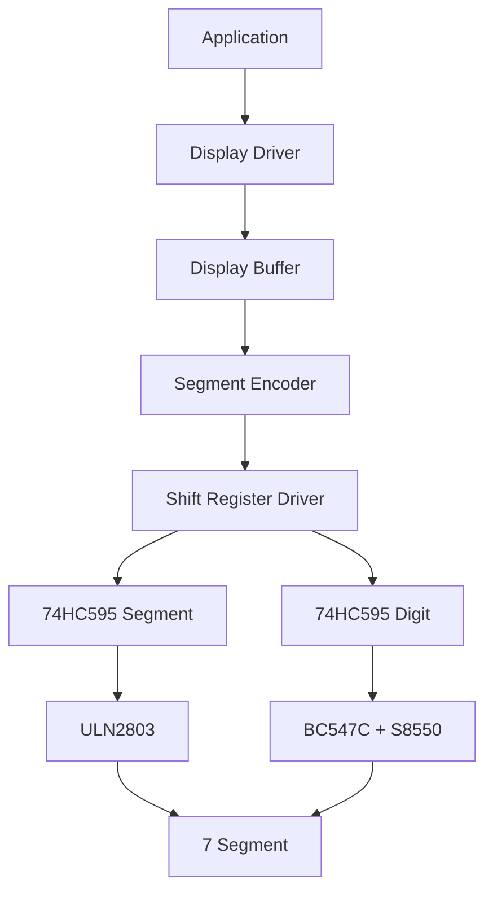
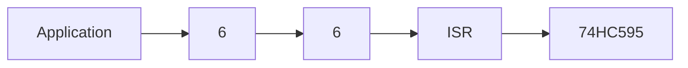
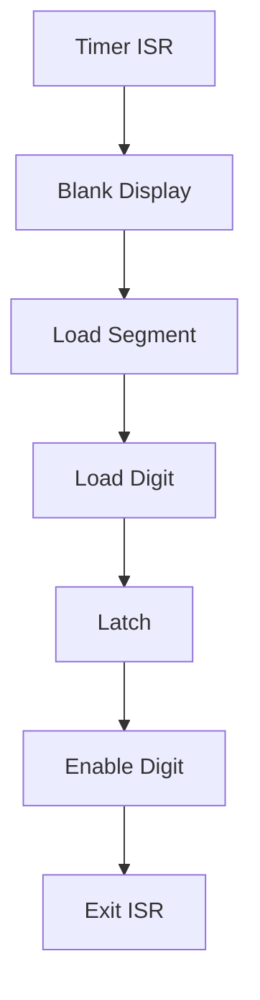
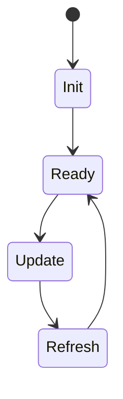

# 04 - Display Driver

> Display Driver Architecture Specification for Operation Timer

**Document ID** : OT-DOC-004  
**Document Name** : Display Driver  
**Project** : Operation Timer  
**Version** : 1.0.0  
**Status** : Draft  
**Last Update** : 2026-07-30

---

# Revision History

| Version | Date | Author | Description |
|----------|------------|----------------|------------------------------|
| 1.0.0 | 2026-07-30 | Development Team | Initial Document |

---

# 1. Purpose

Dokumen ini menjelaskan desain dan implementasi Display Driver yang digunakan pada firmware Operation Timer.

Display Driver bertanggung jawab terhadap seluruh proses penampilan data ke display 7-segment menggunakan metode multiplex dengan dua buah IC 74HC595.

Dokumen ini juga menjadi acuan implementasi firmware sehingga seluruh developer mengikuti arsitektur yang sama.

---

# 2. Scope

Dokumen ini mencakup:

- Display Architecture
- Display Buffer
- Segment Encoder
- Shift Register Driver
- Multiplex Engine
- Font Table
- Display API
- Refresh Timing
- Memory Optimization
- Coding Rules

---

# 3. Display Overview

Display terdiri dari:

- 6 Digit
- 2.3 inch
- Common Anode
- Multiplex
- Colon / Tick LED

Format tampilan

```
 HH : MM : SS
```

---

# 4. Hardware Architecture



---

# 5. Layer Responsibility

## Application Layer

Bertugas:

- Menampilkan waktu
- Menampilkan stopwatch
- Menampilkan countdown
- Menampilkan status

Application **tidak boleh** mengakses Shift Register.

---

## Display Driver

Bertugas:

- Mengelola Display Buffer
- Mengubah angka menjadi bitmap segment
- Mengontrol Tick LED
- Mengontrol Blank Display

---

## Shift Register Driver

Bertugas:

- Mengirim data ke 74HC595
- Mengontrol OE
- Mengontrol LATCH
- Mengontrol CLOCK
- Tidak mengetahui arti data yang dikirim

---

# 6. Display Data Flow

```mermaid
flowchart LR

Application

-->

Display Buffer

-->

Segment Encoder

-->

Shift Register

-->

Display
```

---

# 7. Display Buffer

Display menggunakan buffer statis.

Ukuran

```
6 Byte
```

Struktur

```cpp
displayBuffer[6]
```

Keterangan

| Index | Digit |
|---------|--------|
| 0 | Hour Ten |
| 1 | Hour Unit |
| 2 | Minute Ten |
| 3 | Minute Unit |
| 4 | Second Ten |
| 5 | Second Unit |

Isi buffer berupa:

```
0-9

atau

bitmap segment
```

sesuai hasil Segment Encoder.

---

# 8. Segment Encoder

Segment Encoder mengubah angka menjadi bitmap.

Contoh

```
1

↓

0b00100100
```

Encoder **tidak mengetahui posisi digit**.

Encoder hanya mengetahui:

- angka
- karakter
- simbol

---

# 9. Font Table

Font disimpan menggunakan:

```
PROGMEM
```

Tidak boleh disimpan di SRAM.

Contoh karakter

```
0-9

A-Z

-

_

Blank
```

Target penggunaan Flash lebih diprioritaskan daripada SRAM.

---

# 10. Display Memory Layout



---

# 11. Multiplex Strategy

Display menggunakan:

```
Timer Interrupt
```

Target refresh

```
1000 Hz
```

Digit refresh

```
166 Hz
```

Urutan scan

```
D1

↓

D2

↓

D3

↓

D4

↓

D5

↓

D6
```

---

# 12. ISR Flow



ISR harus sesingkat mungkin.

---

# 13. ISR Rules

ISR hanya boleh melakukan:

- Blank Display
- Update Shift Register
- Latch
- Enable Digit
- Increment Digit Index

ISR **tidak boleh**:

- Membaca RTC
- Membaca Button
- Mengakses I2C
- Melakukan perhitungan matematika kompleks
- Menggunakan Serial
- Menggunakan delay()

---

# 14. Refresh Timing

| Parameter | Target |
|------------|--------|
| Total Refresh | 1000 Hz |
| Digit Refresh | 166 Hz |
| ISR Time | <100 us |
| Flicker | Tidak terlihat |

---

# 15. Colon / Tick LED

Tick LED dikendalikan oleh:

```
74HC595 #2
```

Tick digunakan sebagai:

- Clock Second Indicator
- Stopwatch Tick
- Countdown Tick

Tick dikontrol secara independen dari digit.

---

# 16. Display API

Display Driver menyediakan API berikut.

```cpp
begin()

update()

refreshISR()

clear()

setDigit()

setNumber()

setTime()

setColon()

setBrightness()

displayTest()
```

Seluruh parameter object menggunakan:

```
const &
```

apabila ukurannya lebih dari 4 Byte.

---

# 17. Display State Machine



---

# 18. Display Modes

Display dapat menampilkan:

- Clock
- Stopwatch
- Countdown
- Blank
- Test Mode

Mode tidak mempengaruhi Driver.

Mode hanya mengubah isi Display Buffer.

---

# 19. Brightness Control

Brightness direncanakan menggunakan:

```
OE PWM
```

PWM diberikan pada:

```
SR_OE
```

Saat ini fitur disiapkan namun belum diimplementasikan.

---

# 20. Display Test Mode

Saat boot firmware.

Display melakukan:

```
888888

↓

All OFF

↓

Ready
```

Tujuan

- Menguji semua segment.
- Menguji semua digit.
- Menguji Tick LED.

---

# 21. Error Handling

Jika terjadi kesalahan:

- Buffer overflow → tidak diperbolehkan.
- Invalid digit → tampil Blank.
- Invalid font → tampil Blank.

Firmware tidak boleh crash.

---

# 22. Memory Optimization

Display Driver menggunakan:

- Static Allocation
- PROGMEM Font
- constexpr
- const
- Passing by Reference

Tidak menggunakan:

- malloc()
- free()
- new
- delete
- String

---

# 23. Coding Rules

Display Driver wajib:

- Non Blocking.
- ISR Safe.
- Reentrant jika diperlukan.
- Tidak menggunakan global variable yang dapat dimodifikasi sembarang modul.
- Tidak mengetahui Mode aplikasi.
- Tidak mengetahui RTC.
- Tidak mengetahui Stopwatch.

Driver hanya bertugas menampilkan data.

---

# 24. Future Expansion

Driver harus mudah ditambahkan fitur:

- Brightness Control
- Blink Digit
- Blink Colon
- Animation
- Scrolling
- Diagnostic Mode

Tanpa mengubah API utama.

---

# 25. Validation Checklist

Display Driver dinyatakan lulus apabila:

- ☐ Semua digit tampil benar.
- ☐ Semua segment aktif.
- ☐ Tick LED bekerja.
- ☐ Tidak ada ghosting.
- ☐ Tidak ada flicker.
- ☐ Refresh stabil.
- ☐ ISR memenuhi target waktu.
- ☐ Font sesuai spesifikasi.
- ☐ Boot Test berjalan.

---

# 26. Related Documents

- 02_Hardware_Architecture.md
- 03_Pin_Mapping.md
- 05_Button_System.md
- 06_Mode_Manager.md
- 09_Firmware_Architecture.md
- 10_Coding_Standard.md

---

# Implementation Notes

## Display Driver Architecture

Display Driver **tidak berhubungan langsung** dengan aplikasi.

Struktur yang digunakan adalah:

```mermaid
graph TD

Application

-->

Display

-->

Display Buffer

-->

Segment Encoder

-->

Shift Register

-->

74HC595
```

Dengan arsitektur ini:

- Driver tidak bergantung pada layout PCB.
- Font dapat diganti tanpa mengubah driver.
- Revisi hardware cukup mengubah Segment Encoder.
- Display Buffer dapat diuji secara unit test.

---

## Buffer Update Rule

Application **tidak boleh** mengakses ISR.

Application hanya diperbolehkan mengubah Display Buffer.

ISR hanya membaca Display Buffer.

Dengan aturan ini tidak terjadi konflik akses hardware.

---

## Thread Safety

Walaupun Arduino Nano tidak memiliki RTOS, akses Display Buffer tetap harus aman.

Jika diperlukan perubahan seluruh buffer sekaligus, gunakan mekanisme berikut:

1. Tulis ke back buffer.
2. Nonaktifkan interrupt sesingkat mungkin.
3. Salin back buffer ke active buffer.
4. Aktifkan kembali interrupt.

Hal ini mencegah tampilan setengah ter-update (tearing).

---

## Recommended Internal Class Structure

Disarankan memisahkan modul menjadi beberapa kelas:

```text
Display
│
├── DisplayBuffer
├── SegmentEncoder
├── ShiftRegister
├── Multiplexer
└── Font
```

Masing-masing kelas memiliki satu tanggung jawab (Single Responsibility Principle).

---

# Production Notes

- Font Table merupakan bagian dari firmware release dan harus dikendalikan melalui version control.
- Perubahan mapping segment atau digit wajib memperbarui dokumen **03_Pin_Mapping.md**.
- Target penggunaan SRAM untuk seluruh Display Driver (buffer, state, variabel internal) sebaiknya tidak melebihi **32 Byte**, sehingga tetap menyisakan ruang yang cukup untuk modul lain pada ATmega328P.
- Setiap perubahan pada ISR harus divalidasi kembali terhadap target refresh dan bebas ghosting menggunakan checklist pengujian.

---

**End of Document**