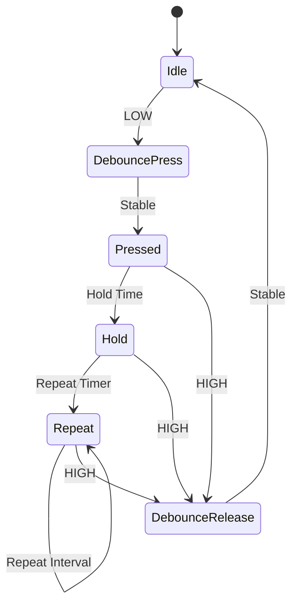

# 05 - Button System

> Button Input System Specification for Operation Timer

**Document ID** : OT-DOC-005  
**Document Name** : Button System  
**Project** : Operation Timer  
**Version** : 1.0.0  
**Status** : Draft  
**Last Update** : 2026-07-30

---

# Revision History

| Version | Date | Author | Description |
|----------|------------|----------------|------------------------------|
| 1.0.0 | 2026-07-30 | Development Team | Initial Document |

---

# 1. Purpose

Dokumen ini menjelaskan spesifikasi sistem pembacaan tombol (Button System) pada firmware Operation Timer.

Tujuan utama Button System adalah:

- Membaca seluruh input tombol secara konsisten.
- Menghasilkan event yang bebas bounce.
- Mendukung Short Press, Hold, dan Auto Repeat.
- Tidak menggunakan interrupt.
- Tidak menggunakan delay().
- Menghasilkan event yang mudah digunakan oleh Application Layer.

---

# 2. Scope

Dokumen ini mencakup:

- Hardware Configuration
- Button Driver
- Debounce Algorithm
- Event Generation
- State Machine
- Timing Configuration
- Scheduler Integration
- API
- Coding Rules

---

# 3. Hardware Overview

Jumlah tombol

```
5 Button
```

Jenis

```
Tactile Switch
```

Konfigurasi

```
INPUT_PULLUP
```

Logika

```
Pressed  = LOW

Released = HIGH
```

---

# 4. Button Layout

| Signal | Function |
|----------|----------|
| PB_PWR | Power |
| PB_NXT | Next Mode |
| PB_SLC | Select |
| PB_UP | Increment |
| PB_DWN | Decrement |

---

# 5. Button Architecture

```mermaid
graph TD

GPIO

-->

Button Driver

-->

Debounce

-->

State Machine

-->

Event Queue

-->

Application
```

Button Driver **tidak mengetahui fungsi tombol**.

Driver hanya menghasilkan event.

---

# 6. Design Philosophy

Button Driver bertanggung jawab terhadap:

- Debounce
- Timing
- Hold Detection
- Repeat Detection
- Event Generation

Button Driver **tidak boleh**:

- Mengubah Mode
- Mengakses RTC
- Mengakses Display
- Mengontrol Buzzer

Semua aksi dilakukan oleh Application Layer.

---

# 7. Button Events

Firmware menghasilkan event berikut.

| Event | Description |
|---------|-------------|
| None | Tidak ada event |
| Press | Tombol baru ditekan |
| Release | Tombol dilepas |
| ShortPress | Tekan singkat |
| Hold | Tekan lama |
| Repeat | Auto Repeat |

---

# 8. Event Flow

```mermaid
flowchart LR

GPIO

-->

Debounce

-->

FSM

-->

Button Event

-->

Application
```

---

# 9. State Machine



---

# 10. Timing Configuration

| Parameter | Default |
|------------|----------|
| Scan Period | 10 ms |
| Debounce Time | 30 ms |
| Hold Time | 700 ms |
| Repeat Delay | 500 ms |
| Repeat Interval | 150 ms |

Seluruh nilai harus disimpan sebagai `constexpr`.

---

# 11. Scheduler Integration

Button Driver dipanggil secara periodik.

```mermaid
flowchart LR

Scheduler

-->

Button::update()

-->

Event Queue
```

Frekuensi scan

```
100 Hz
```

---

# 12. Debounce Algorithm

Metode yang digunakan

```
Time Based Debounce
```

Flow

```
Input Change

↓

Start Timer

↓

Stable ?

↓

Yes

↓

Generate Event
```

Button dianggap valid apabila kondisi stabil selama waktu debounce.

---

# 13. Event Generation

Button Driver menghasilkan event hanya satu kali.

Contoh

```
Press

↓

ShortPress

↓

Release
```

atau

```
Press

↓

Hold

↓

Repeat

↓

Repeat

↓

Release
```

Tidak boleh menghasilkan event ganda.

---

# 14. Event Queue

Application membaca event dari Event Queue.

```mermaid
graph LR

Button

-->

Queue

-->

Mode Manager

-->

Application
```

Queue harus FIFO.

Target ukuran

```
8 Event
```

Static Allocation.

---

# 15. Button Mapping

## Power

| Event | Action |
|---------|----------|
| Short | Reserved |
| Hold | Reserved |
| Repeat | None |

---

## Next

| Event | Action |
|---------|----------|
| Short | Next Mode |
| Hold | Reserved |
| Repeat | None |

---

## Select

| Event | Action |
|---------|----------|
| Short | Select |
| Hold | Save |
| Repeat | None |

---

## Up

| Event | Action |
|---------|----------|
| Short | +1 |
| Hold | Continuous Increment |
| Repeat | Auto Increment |

---

## Down

| Event | Action |
|---------|----------|
| Short | -1 |
| Hold | Continuous Decrement |
| Repeat | Auto Decrement |

---

# 16. Button API

Disarankan API berikut.

```cpp
begin()

update()

getEvent()

clear()

isPressed()

isHeld()
```

Semua object besar harus dikirim menggunakan

```
const &
```

---

# 17. Internal Data Structure

Setiap tombol memiliki state sendiri.

Disarankan struktur

```text
Button

├── Current State

├── Previous State

├── Debounce Timer

├── Hold Timer

├── Repeat Timer

└── Event
```

Tidak boleh menggunakan alokasi dinamis.

---

# 18. Memory Requirement

Target penggunaan SRAM

```
< 64 Byte
```

Button Driver harus menggunakan:

- Static Allocation
- constexpr
- enum class
- const
- Passing by Reference

---

# 19. Error Handling

Jika terjadi kondisi tidak valid.

Contoh

- Bounce berlebihan
- Timing overflow
- Event invalid

Maka:

- Event dibuang.
- Driver tetap berjalan.
- Firmware tidak boleh crash.

---

# 20. Coding Rules

Button Driver wajib:

- Non Blocking
- ISR Safe
- Tidak menggunakan delay()
- Tidak menggunakan String
- Tidak menggunakan malloc()
- Tidak menggunakan new/delete
- Tidak mengakses Application Layer

---

# 21. Unit Test Requirement

Driver harus dapat diuji tanpa hardware.

Minimal pengujian:

- Debounce
- Hold
- Repeat
- Release
- Queue
- Overflow Queue

---

# 22. Future Expansion

Button Driver harus mendukung penambahan:

- Double Click
- Triple Click
- Long Hold
- Combination Button
- Factory Mode
- Secret Key Sequence

Tanpa mengubah API utama.

---

# 23. Validation Checklist

Button Driver dinyatakan lulus apabila:

- ☐ Semua tombol terbaca.
- ☐ Debounce bekerja.
- ☐ Short Press benar.
- ☐ Hold benar.
- ☐ Repeat benar.
- ☐ Release benar.
- ☐ Tidak ada event ganda.
- ☐ Queue FIFO berjalan.
- ☐ Tidak kehilangan event.
- ☐ Tidak menggunakan interrupt.

---

# 24. Related Documents

- 01_System_Requirements.md
- 03_Pin_Mapping.md
- 06_Mode_Manager.md
- 08_Buzzer_LED.md
- 09_Firmware_Architecture.md
- 10_Coding_Standard.md
- 12_Testing_Checklist.md

---

# Implementation Notes

## Layer Architecture

Button System mengikuti arsitektur berikut.

```mermaid
graph TD

GPIO

-->

Button HAL

-->

Button Driver

-->

Button FSM

-->

Event Queue

-->

Mode Manager

-->

Application
```

Setiap layer memiliki satu tanggung jawab (Single Responsibility Principle).

---

## Driver Independence

Button Driver **tidak mengetahui**:

- Clock Mode
- Stopwatch Mode
- Countdown Mode

Driver hanya menghasilkan event.

Interpretasi event dilakukan oleh Mode Manager.

---

## Event Queue Policy

Queue menggunakan Static Ring Buffer.

Karakteristik:

- FIFO
- Static Memory
- Tanpa Dynamic Allocation
- Overflow terdeteksi

Jika queue penuh:

- Event baru dibuang.
- Counter overflow ditambah.
- Firmware tetap berjalan.

---

## Recommended Internal Class

Disarankan struktur kelas berikut.

```text
ButtonManager
│
├── Button
├── Debounce
├── EventQueue
├── ButtonEvent
└── ButtonConfig
```

---

## Timer Source

Seluruh timing menggunakan Scheduler.

Tidak menggunakan:

- millis() blocking
- delay()
- interrupt eksternal

Scheduler menjadi satu-satunya sumber waktu untuk Button Driver.

---

## Parameter Configuration

Seluruh parameter timing disimpan pada

```
ButtonConfig.h
```

Contoh

```cpp
constexpr uint16_t kDebounceTimeMs = 30;
constexpr uint16_t kHoldTimeMs = 700;
constexpr uint16_t kRepeatDelayMs = 500;
constexpr uint16_t kRepeatIntervalMs = 150;
```

Parameter tidak boleh berupa magic number di dalam kode.

---

# Production Notes

- Nilai debounce, hold, dan repeat harus divalidasi menggunakan hardware final, karena karakteristik tactile switch dapat berbeda antar pemasok.
- Seluruh tombol harus diuji minimal **1000 siklus penekanan** selama proses validasi prototipe.
- Jika terjadi perubahan tipe tombol atau nilai resistor pull-up/pull-down, dokumen ini wajib diperbarui.
- Event yang dihasilkan Button Driver harus tetap kompatibel dengan `ModeManager` agar perubahan hardware tidak memerlukan perubahan logika aplikasi.

---

**End of Document**