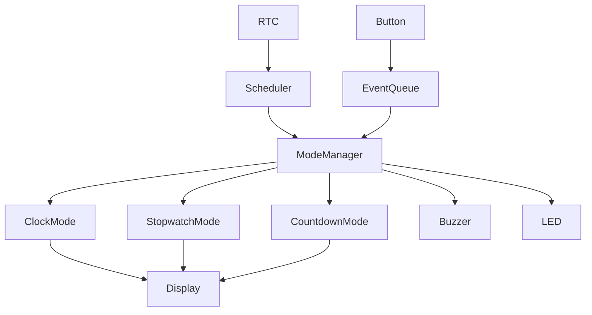
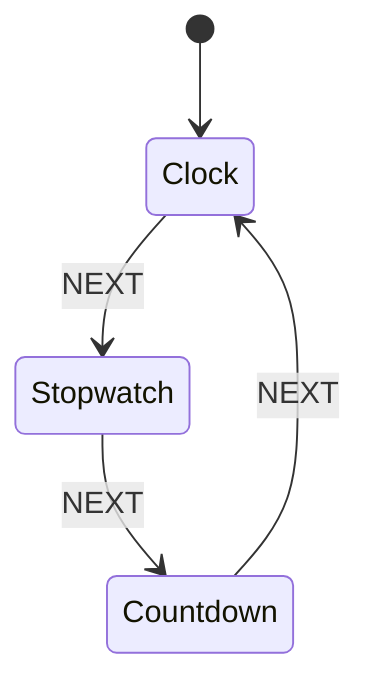
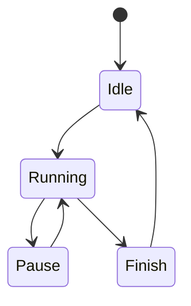
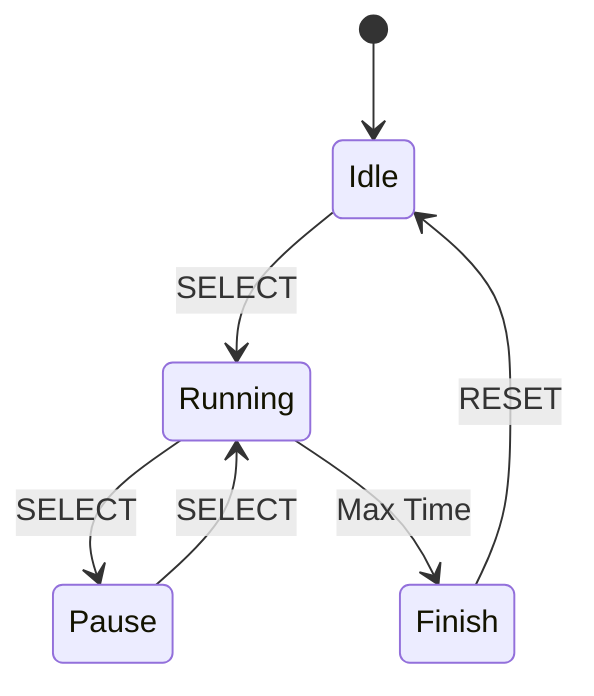
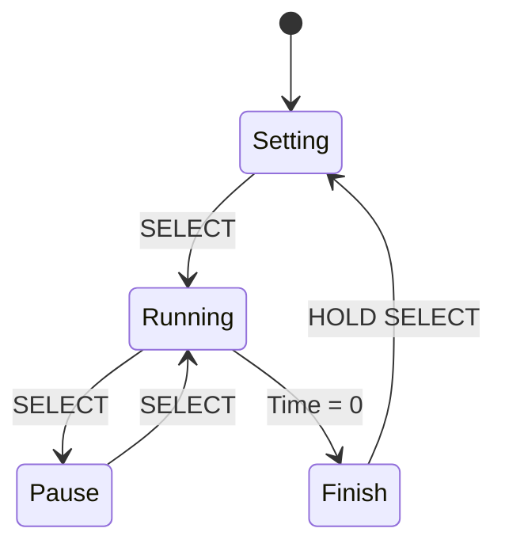
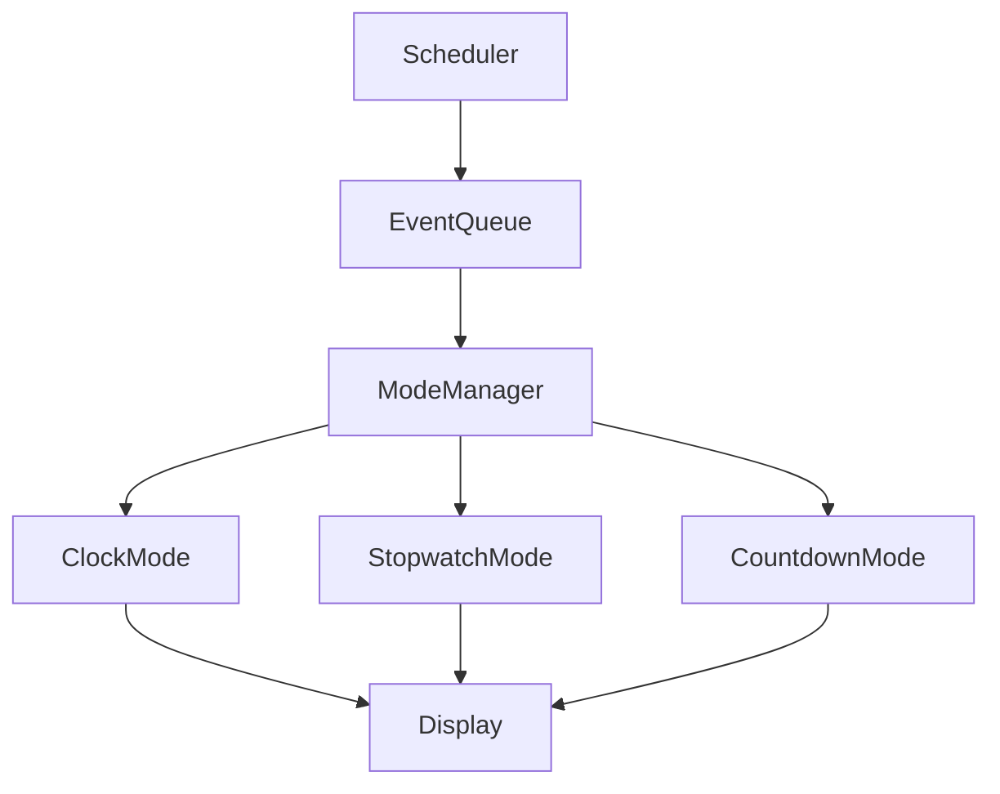

# 06 - Mode Manager

> Application Mode Manager Specification for Operation Timer

**Document ID** : OT-DOC-006  
**Document Name** : Mode Manager  
**Project** : Operation Timer  
**Version** : 1.0.0  
**Status** : Draft  
**Last Update** : 2026-07-30

---

# Revision History

| Version | Date | Author | Description |
|----------|------------|----------------|------------------------------|
| 1.0.0 | 2026-07-30 | Development Team | Initial Document |

---

# 1. Purpose

Dokumen ini mendefinisikan arsitektur **Mode Manager** sebagai pusat logika aplikasi (Application Layer).

Mode Manager bertanggung jawab untuk:

- Mengelola mode operasi sistem.
- Menerima event dari Button System.
- Mengontrol perpindahan mode.
- Mengontrol Clock, Stopwatch, dan Countdown.
- Mengirim data ke Display Driver.
- Mengontrol Buzzer dan LED melalui event.

Mode Manager **tidak mengakses hardware secara langsung**.

---

# 2. Scope

Dokumen ini mencakup:

- Application Architecture
- Mode State Machine
- Event Flow
- Clock Mode
- Stopwatch Mode
- Countdown Mode
- UI State
- Event Processing
- API
- Coding Rules

---

# 3. Architecture Overview



Mode Manager merupakan **single entry point** seluruh logika aplikasi.

---

# 4. Responsibilities

Mode Manager bertanggung jawab terhadap:

- Current Mode
- Mode Switching
- Event Dispatching
- UI State
- Display Update
- Time Synchronization
- Alarm Trigger

Mode Manager **tidak bertanggung jawab** terhadap:

- GPIO
- Shift Register
- RTC Driver
- Display Multiplex
- Button Debounce

---

# 5. Application Modes

Firmware memiliki tiga mode utama.

| Mode | Description |
|--------|-------------|
| Clock | Menampilkan waktu RTC |
| Stopwatch | Stopwatch |
| Countdown | Timer mundur |

---

# 6. Mode Transition



Perpindahan mode hanya menggunakan tombol **NEXT**.

---

# 7. UI State Machine

Selain Mode, setiap mode memiliki UI State.



State ini digunakan oleh Stopwatch dan Countdown.

Clock hanya menggunakan **Idle**.

---

# 8. Event Driven Architecture

Seluruh logika menggunakan Event.

```mermaid
flowchart LR

Button

-->

Button Event

-->

Event Queue

-->

Mode Manager

-->

Application

-->

Display
```

Tidak ada polling button di Application.

---

# 9. Scheduler Integration

Mode Manager dipanggil oleh Scheduler.

```mermaid
flowchart LR

Scheduler

-->

ModeManager::update()

-->

Application Logic
```

Target periode update

```
10 ms
```

---

# 10. Clock Mode

## Description

Menampilkan waktu dari RTC.

Format

```
HH:MM:SS
```

Data berasal dari:

```
RTC Driver
```

Clock tidak memiliki status Running maupun Pause.

---

## Clock Event

| Event | Action |
|---------|---------|
| RTC Tick | Update Display |
| NEXT | Stopwatch Mode |

---

# 11. Stopwatch Mode

## Description

Stopwatch menggunakan resolusi 1 detik.

Range

```
00:00:00

↓

99:99:99
```

---

## Stopwatch State Machine



---

## Stopwatch Events

| Button | Action |
|----------|----------|
| SELECT | Start / Pause / Resume |
| HOLD SELECT | Reset |
| NEXT | Countdown Mode |

---

# 12. Countdown Mode

## Description

Countdown menghitung mundur.

Range

```
99:99:99

↓

00:00:00
```

---

## Countdown State Machine



---

## Countdown Events

| Button | Action |
|----------|----------|
| UP | Increment |
| DOWN | Decrement |
| HOLD UP | Auto Increment |
| HOLD DOWN | Auto Decrement |
| SELECT | Start / Pause |
| HOLD SELECT | Reset |
| NEXT | Clock |

---

# 13. Mode Data Structure

Setiap mode memiliki data sendiri.

Disarankan

```text
Clock

Stopwatch

Countdown
```

Mode Manager hanya menyimpan:

- Current Mode
- Previous Mode
- Current State

---

# 14. Mode Enumeration

Disarankan menggunakan

```cpp
enum class Mode
{
    Clock,
    Stopwatch,
    Countdown
};
```

UI State

```cpp
enum class State
{
    Idle,
    Setting,
    Running,
    Pause,
    Finish
};
```

---

# 15. Display Update Policy

Mode Manager **tidak mengakses Shift Register**.

Mode Manager hanya memanggil

```
Display.setTime()

Display.setNumber()

Display.clear()
```

Display Driver bertanggung jawab terhadap multiplex.

---

# 16. RTC Integration

Clock menggunakan RTC.

Stopwatch dan Countdown menggunakan Tick 1Hz dari Scheduler yang disinkronkan dengan RTC SQW.

Keuntungan:

- Seluruh fungsi waktu memiliki sumber referensi yang sama.
- Tidak terjadi drift antar mode.

---

# 17. Event Processing

Semua event diproses secara FIFO.

```mermaid
flowchart TD

Event Queue

-->

Mode Manager

-->

Current Mode

-->

Handle Event

-->

Update State

-->

Update Display

-->

Return
```

---

# 18. Mode Switching Policy

Saat pindah mode.

Yang dilakukan:

- Simpan state lama bila diperlukan.
- Bersihkan Display Buffer.
- Bunyikan Buzzer.
- Perbarui Display.

Yang **tidak** dilakukan:

- Reset Stopwatch.
- Reset Countdown.

Kecuali diperintahkan user.

---

# 19. Alarm Policy

Countdown Finish

↓

Generate Event

↓

Buzzer Driver

↓

Alarm Pattern

Mode Manager tidak menghasilkan bunyi secara langsung.

---

# 20. Error Handling

Jika terjadi event tidak valid.

Contoh

- UP pada Clock
- DOWN pada Clock

Maka

- Event diabaikan.
- Tidak menghasilkan error.

Firmware tetap berjalan.

---

# 21. Memory Requirement

Target penggunaan SRAM

```
<128 Byte
```

Mode Manager menggunakan:

- Static Allocation
- constexpr
- enum class
- const
- Passing by Reference

Tidak menggunakan:

- malloc()
- new
- delete
- String

---

# 22. API

Disarankan

```cpp
begin()

update()

setMode()

getMode()

getState()

handleEvent()

reset()
```

---

# 23. Internal Class Structure

```text
ModeManager
│
├── ClockMode
├── StopwatchMode
├── CountdownMode
├── ModeState
├── EventDispatcher
└── DisplayInterface
```

Setiap Mode merupakan class terpisah.

---

# 24. Future Expansion

Mode baru dapat ditambahkan.

Misalnya

- Setting
- Service
- Factory Test
- Firmware Info
- Display Test

Tanpa mengubah Mode yang sudah ada.

---

# 25. Validation Checklist

Mode Manager dinyatakan lulus apabila:

- ☐ Mode Switching benar.
- ☐ Clock benar.
- ☐ Stopwatch benar.
- ☐ Countdown benar.
- ☐ Display selalu sinkron.
- ☐ Event FIFO.
- ☐ Tidak ada Mode Invalid.
- ☐ Tidak ada deadlock.
- ☐ Tidak menggunakan delay().

---

# 26. Related Documents

- 01_System_Requirements.md
- 04_Display_Driver.md
- 05_Button_System.md
- 07_RTC_System.md
- 08_Buzzer_LED.md
- 09_Firmware_Architecture.md
- 10_Coding_Standard.md

---

# Implementation Notes

## Architecture

Seluruh Application Layer mengikuti arsitektur berikut.



---

## Single Responsibility

Setiap Mode hanya bertanggung jawab terhadap logikanya sendiri.

Contoh

ClockMode

- Membaca RTC
- Menampilkan waktu

StopwatchMode

- Menghitung waktu
- Mengelola Running/Pause

CountdownMode

- Menghitung mundur
- Mengelola alarm

Mode Manager hanya mengatur perpindahan mode dan distribusi event.

---

## Event Dispatching

Mode Manager hanya mengirim event ke mode yang sedang aktif.

Contoh

```
Current Mode

↓

Countdown

↓

Event

↓

Countdown::handleEvent()
```

Mode lain tidak menerima event.

---

## Display Ownership

Hanya **Mode aktif** yang diperbolehkan memperbarui Display Buffer.

Hal ini mencegah konflik antar mode.

---

## Timing Source

Seluruh Mode menggunakan sumber waktu yang sama.

```
RTC SQW

↓

Scheduler

↓

Mode
```

Dengan demikian:

- Clock akurat.
- Stopwatch tidak drift.
- Countdown tetap sinkron.

---

## Dependency Rule

Dependency diperbolehkan:

```
Mode

↓

Display

Mode

↓

Buzzer

Mode

↓

RTC
```

Dependency yang **dilarang**:

```
Display

↓

Mode

Button

↓

Mode

RTC

↓

Display
```

Semua komunikasi harus melalui Mode Manager atau Driver.

---

# Production Notes

- Penambahan mode baru tidak boleh mengubah perilaku mode yang telah divalidasi.
- Semua mode wajib memiliki state machine yang terdokumentasi sebelum implementasi.
- Perubahan logika mode harus disertai pembaruan diagram Mermaid dan checklist pengujian.
- Semua event yang memengaruhi keselamatan operasi harus memiliki umpan balik visual (display) dan/atau audio (buzzer) yang konsisten.

---

**End of Document**