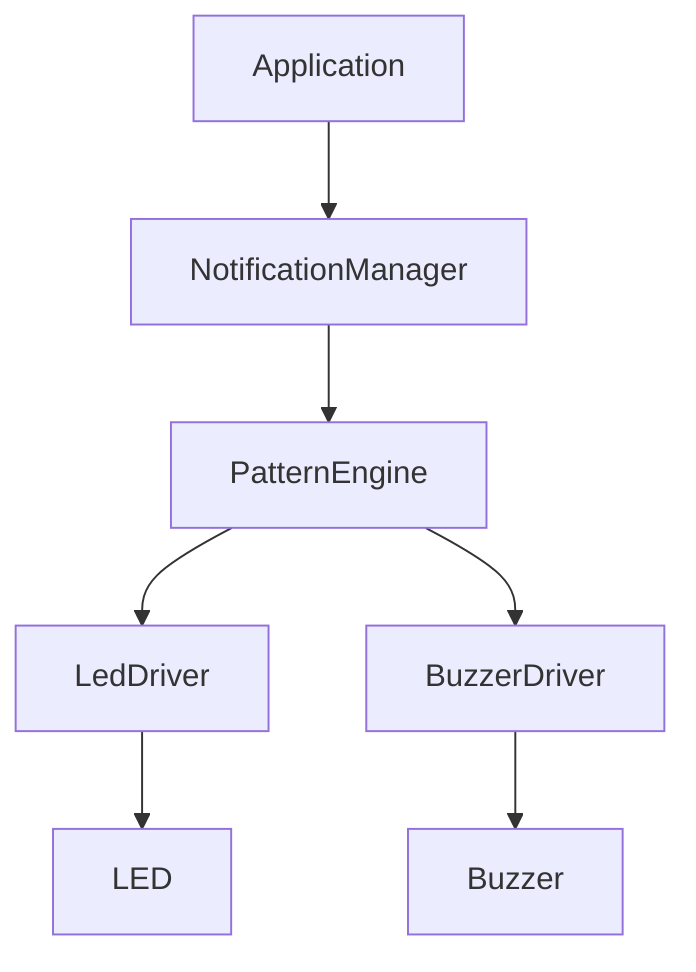
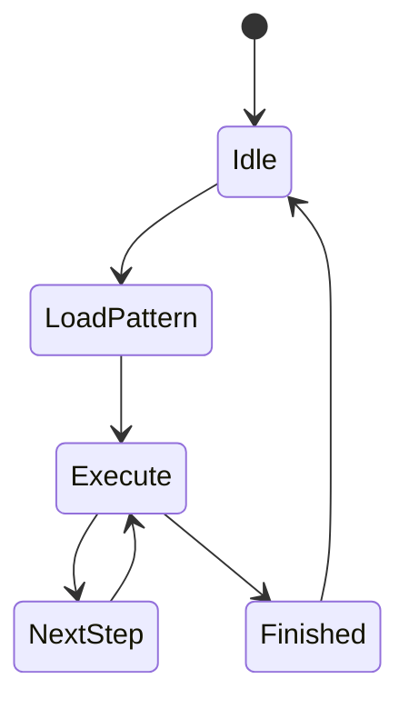

# 08 - Buzzer & LED System

> Buzzer and LED Driver Specification for Operation Timer

**Document ID** : OT-DOC-008  
**Document Name** : Buzzer & LED System  
**Project** : Operation Timer  
**Version** : 1.1.0  
**Status** : Draft  
**Last Update** : 2026-07-30

> **Architecture Update**
>
> Dokumen ini telah mengimplementasikan peningkatan arsitektur yang direkomendasikan sebelumnya, yaitu penggunaan **Notification Manager** sebagai lapisan abstraksi antara Application dan hardware. Dengan demikian seluruh modul aplikasi tidak lagi mengendalikan buzzer maupun LED secara langsung.

---

# Revision History

| Version | Date | Author | Description |
|----------|------------|----------------|------------------------------|
| 1.0.0 | 2026-07-30 | Development Team | Initial Document |
| 1.1.0 | 2026-07-30 | Development Team | Add Notification Manager Architecture |

---

# 1. Purpose

Dokumen ini mendefinisikan sistem indikator audio dan visual pada Operation Timer.

Komponen indikator terdiri dari:

- Power LED
- Active Low Buzzer

Sistem ini menggunakan pendekatan **Event Driven Notification**, sehingga seluruh aplikasi hanya menghasilkan event, sedangkan Notification Manager menentukan pola LED dan buzzer yang akan dimainkan.

---

# 2. Scope

Dokumen ini mencakup:

- Notification Architecture
- Notification Manager
- LED Driver
- Buzzer Driver
- Pattern Engine
- Scheduler Integration
- Priority System
- API
- Coding Rules

---

# 3. Hardware Overview

## LED

Jenis

```
Power Indicator LED
```

Logic

```
Active Low
```

Arduino Pin

```
D12
```

Signal Name

```
LED_PWR
```

---

## Buzzer

Jenis

```
Active Buzzer
```

Logic

```
Active Low
```

Arduino Pin

```
D3
```

Signal Name

```
BUZZER
```

---

# 4. Architecture Overview



Application **tidak diperbolehkan** mengontrol GPIO secara langsung.

---

# 5. Design Philosophy

Semua modul aplikasi hanya mengirim:

```
Notification Event
```

Contoh:

```
Button Click

↓

Notification::ButtonClick
```

Notification Manager menentukan:

- LED Pattern
- Buzzer Pattern
- Priority
- Duration

---

# 6. Notification Events

Firmware menggunakan event berikut.

| Event | Description |
|---------|-------------|
| ButtonClick | Tombol ditekan |
| SaveSuccess | Data berhasil disimpan |
| Reset | Reset berhasil |
| ModeChanged | Pindah Mode |
| CountdownFinish | Countdown selesai |
| Error | Error System |
| Startup | Power ON |
| Shutdown | Power OFF |
| DisplayTest | Boot Test |

Event dapat ditambahkan tanpa mengubah driver.

---

# 7. Notification Priority

| Priority | Event |
|-----------|----------------|
| Critical | Error |
| High | Countdown Finish |
| Medium | Save |
| Medium | Reset |
| Low | Mode Change |
| Low | Button Click |

Priority tertinggi selalu didahulukan.

---

# 8. Notification Flow

```mermaid
flowchart LR

Application

-->

Notification Event

-->

Notification Queue

-->

Notification Manager

-->

Pattern Engine

-->

Driver

-->

Hardware
```

---

# 9. Notification Queue

Queue menggunakan:

- Ring Buffer
- Static Allocation
- FIFO

Ukuran

```
8 Event
```

Jika queue penuh:

- Event baru dibuang.
- Overflow Counter bertambah.
- Firmware tetap berjalan.

---

# 10. Pattern Engine

Pattern Engine bertanggung jawab terhadap:

- ON/OFF Timing
- Blink
- Beep
- Sequence
- Repeat

Pattern Engine dipanggil Scheduler setiap

```
10 ms
```

---

# 11. LED Driver

LED Driver hanya memiliki fungsi:

- ON
- OFF
- Toggle

Driver tidak mengetahui arti pola.

---

# 12. Buzzer Driver

Buzzer Driver hanya memiliki fungsi:

- ON
- OFF

Driver tidak mengetahui jenis event.

---

# 13. Pattern Definition

Setiap pola didefinisikan menggunakan struktur konstan.

Contoh:

```cpp
struct NotificationPattern
{
    uint16_t onTimeMs;
    uint16_t offTimeMs;
    uint8_t repeat;
    bool ledEnable;
    bool buzzerEnable;
};
```

Semua pattern disimpan sebagai:

```
constexpr
```

Tidak menggunakan RAM.

---

# 14. Standard Notification Pattern

| Event | LED | Buzzer |
|---------|-----|---------|
| Button Click | OFF | 30 ms |
| Save | Blink 2x | 2 Beep |
| Reset | Blink 3x | 3 Beep |
| Mode Change | Blink 1x | 50 ms |
| Startup | ON | 100 ms |
| Countdown Finish | Blink Continuous | Continuous Pattern |
| Error | Fast Blink | Fast Beep |

---

# 15. Countdown Finish Pattern

```text
LED : 200 ON / 200 OFF

Buzzer : 200 ON / 200 OFF

Repeat : Infinite
```

Berhenti ketika:

- SELECT ditekan
- NEXT ditekan
- POWER ditekan

---

# 16. Startup Pattern

```text
LED

↓

ON

↓

Buzzer 100 ms

↓

Ready
```

---

# 17. Scheduler Integration

```mermaid
graph LR

Scheduler

-->

NotificationManager::update()

-->

PatternEngine

-->

LED

PatternEngine

-->

Buzzer
```

Target Update

```
10 ms
```

---

# 18. Driver API

## Notification Manager

```cpp
begin()

update()

push()

clear()

stop()

isBusy()
```

---

## LED Driver

```cpp
begin()

on()

off()

toggle()
```

---

## Buzzer Driver

```cpp
begin()

on()

off()
```

---

# 19. Memory Optimization

Menggunakan:

- Static Allocation
- constexpr
- const
- enum class
- Passing by Reference

Tidak menggunakan:

- malloc()
- free()
- new
- delete()
- String

---

# 20. Recommended Internal Structure

```text
NotificationManager
│
├── NotificationQueue
├── PatternEngine
├── LedDriver
├── BuzzerDriver
└── NotificationPattern
```

---

# 21. Notification State Machine



---

# 22. Pattern Timing

Resolusi scheduler

```
10 ms
```

Semua timing merupakan kelipatan

```
10 ms
```

Contoh

```
30 ms

50 ms

100 ms

200 ms

500 ms
```

---

# 23. Coding Rules

Notification System wajib:

- Non Blocking
- Tidak menggunakan delay()
- Tidak menggunakan ISR
- Tidak menggunakan Dynamic Memory
- Tidak mengakses Mode secara langsung
- Tidak mengetahui Clock/Stopwatch/Countdown

---

# 24. Future Expansion

Dirancang untuk mendukung:

- RGB LED
- PWM Buzzer
- Melody Player
- Volume Control
- Brightness Control
- External Alarm

Tanpa mengubah API utama.

---

# 25. Validation Checklist

- ☐ LED ON/OFF benar.
- ☐ Buzzer ON/OFF benar.
- ☐ Startup Pattern berjalan.
- ☐ Button Pattern berjalan.
- ☐ Save Pattern berjalan.
- ☐ Reset Pattern berjalan.
- ☐ Countdown Alarm berjalan.
- ☐ Queue FIFO berjalan.
- ☐ Priority berjalan.
- ☐ Tidak Blocking.

---

# 26. Related Documents

- 05_Button_System.md
- 06_Mode_Manager.md
- 07_RTC_System.md
- 09_Firmware_Architecture.md
- 10_Coding_Standard.md
- 12_Testing_Checklist.md

---

# Implementation Notes

## Event Driven Notification

Seluruh aplikasi hanya menghasilkan event.

Contoh:

```text
Button

↓

ModeManager

↓

NotificationManager.push(ButtonClick)
```

Tidak ada pemanggilan langsung:

```cpp
digitalWrite(BUZZER, LOW);   // DILARANG
```

---

## Hardware Abstraction

Semua akses GPIO dilakukan melalui:

```text
NotificationManager

↓

LedDriver

↓

BuzzerDriver
```

Driver tidak mengetahui logika aplikasi.

---

## Pattern Storage

Seluruh pattern disimpan di Flash Memory.

```cpp
constexpr NotificationPattern kButtonClick;
constexpr NotificationPattern kSaveSuccess;
constexpr NotificationPattern kCountdownFinish;
```

Tidak ada pattern yang dialokasikan secara dinamis.

---

## Passing by Reference Rule

Seluruh fungsi menggunakan referensi konstan.

Contoh:

```cpp
void push(const NotificationEvent& event);

void play(const NotificationPattern& pattern);
```

Tidak diperbolehkan:

```cpp
void push(NotificationEvent event);
```

---

## Dependency Rule

Dependency yang diperbolehkan:

```text
Application

↓

NotificationManager

↓

PatternEngine

↓

Driver
```

Dependency yang dilarang:

```text
Application

↓

GPIO

Mode

↓

Buzzer

Mode

↓

LED
```

---

## Production Rule

Seluruh pola indikator harus berasal dari satu lokasi.

```
NotificationPattern.h
```

Sehingga perubahan bunyi atau pola LED tidak memerlukan perubahan kode aplikasi.

---

# Production Notes

- Semua pola notifikasi harus divalidasi pada hardware produksi untuk memastikan durasi bunyi dan kedipan sesuai spesifikasi.
- Active buzzer dari vendor yang berbeda dapat memiliki karakteristik suara yang berbeda, sehingga level kenyaringan harus diverifikasi pada tahap produksi.
- Notification Manager menjadi **satu-satunya modul** yang diperbolehkan mengendalikan LED dan buzzer.
- Penambahan pola baru hanya dilakukan melalui `NotificationPattern.h` tanpa mengubah `ModeManager` maupun driver hardware.
- Semua durasi harus menggunakan basis waktu Scheduler (10 ms), sehingga perilaku sistem tetap konsisten pada seluruh versi firmware.

---

**End of Document**