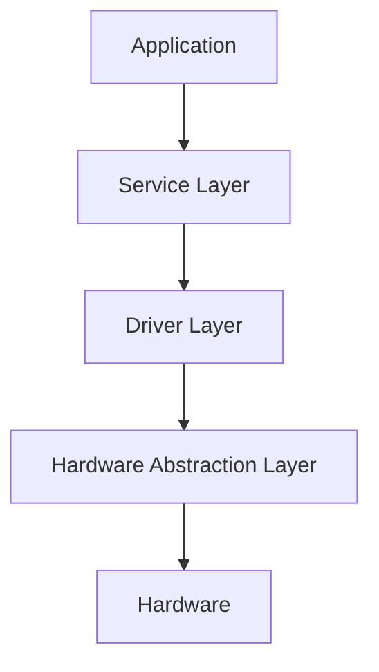
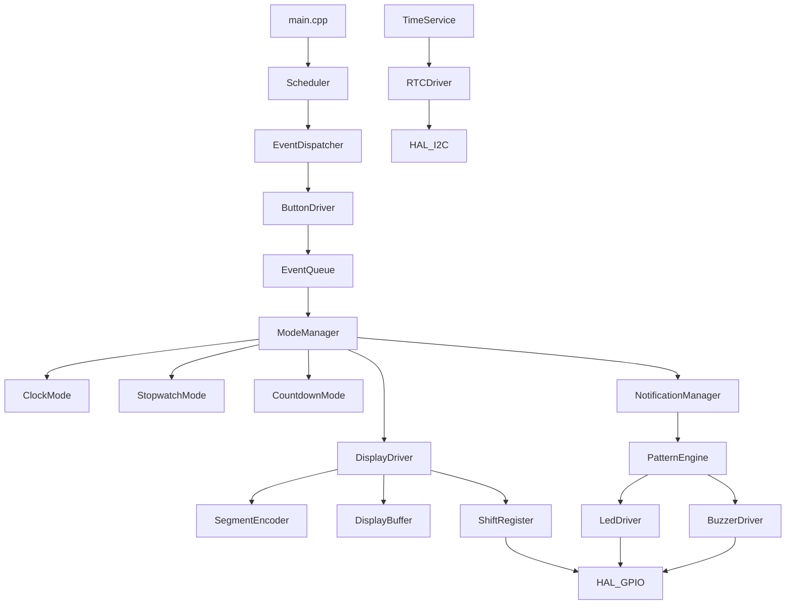
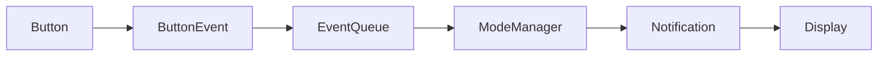
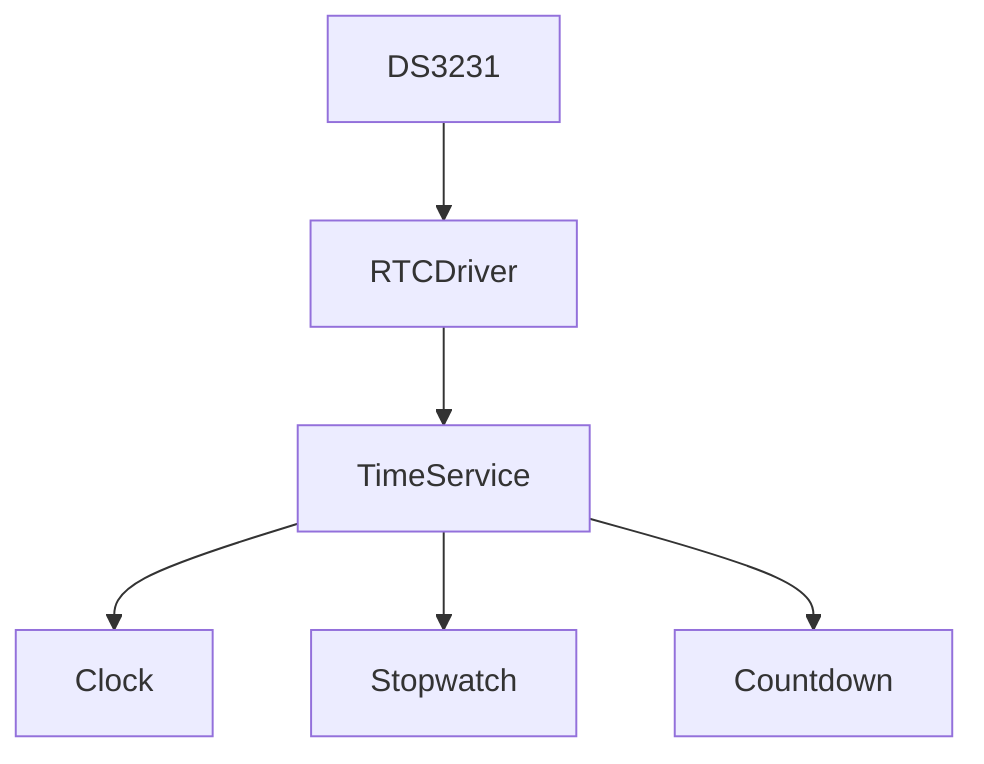
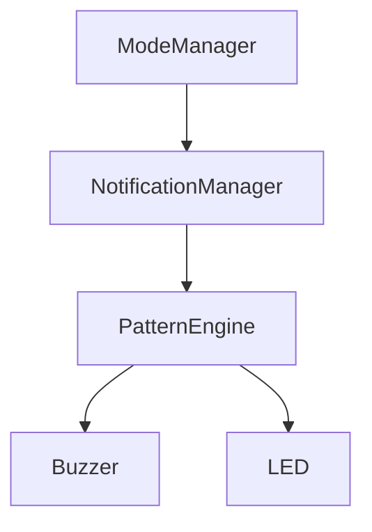
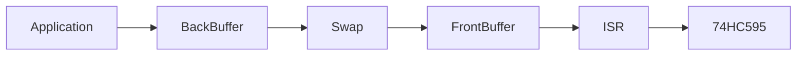
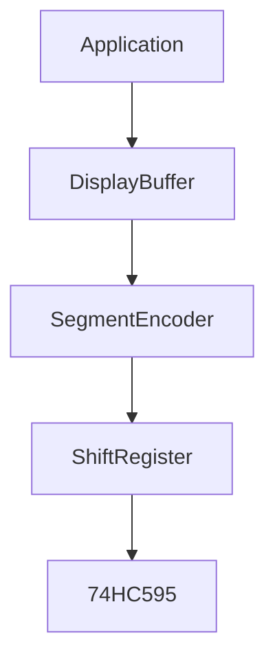
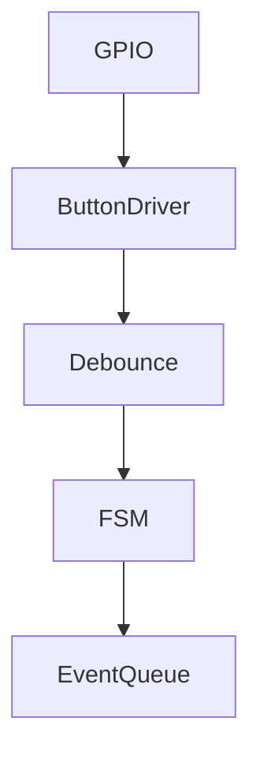
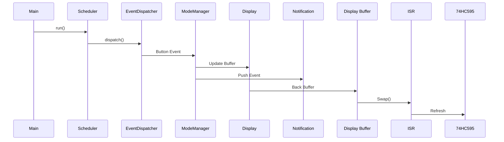

# 09 - Firmware Architecture

> Firmware Architecture Specification for Operation Timer

**Document ID** : OT-DOC-009  
**Document Name** : Firmware Architecture  
**Project** : Operation Timer  
**Version** : 2.0.0  
**Status** : Architecture Baseline  
**Last Update** : 2026-07-30

> **Architecture Baseline**
>
> Dokumen ini merupakan dokumen inti firmware. Seluruh peningkatan arsitektur dari dokumen sebelumnya telah diintegrasikan menjadi satu arsitektur terpadu yang menjadi standar implementasi proyek Operation Timer.

---

# Revision History

| Version | Date | Author | Description |
|----------|------------|----------------|------------------------------|
|1.0.0|2026-07-30|Development Team|Initial Architecture|
|2.0.0|2026-07-30|Development Team|Architecture Refactoring & Production Ready|

---

# 1. Purpose

Dokumen ini mendefinisikan arsitektur firmware secara keseluruhan.

Firmware harus memenuhi karakteristik berikut:

- Deterministic
- Event Driven
- Non Blocking
- Modular
- Testable
- Portable
- Low Memory
- Production Ready

Seluruh source code harus mengikuti dokumen ini.

---

# 2. Design Goals

Firmware dirancang dengan tujuan:

- Mudah dipelihara
- Mudah diuji
- Mudah dikembangkan
- Mudah dipindahkan ke MCU lain
- Tidak menggunakan Dynamic Memory
- Aman terhadap ISR
- Konsisten terhadap Coding Standard

---

# 3. Architecture Overview

Firmware menggunakan pendekatan **Layered Event Driven Architecture**.



Setiap layer hanya boleh berkomunikasi dengan layer di bawahnya.

---

# 4. Firmware Layer

## Layer 1

Application

- ModeManager
- ClockMode
- StopwatchMode
- CountdownMode

---

## Layer 2

Services

- TimeService
- NotificationManager
- Scheduler
- EventDispatcher

---

## Layer 3

Drivers

- DisplayDriver
- ButtonDriver
- RTCDriver
- ShiftRegister
- LedDriver
- BuzzerDriver

---

## Layer 4

HAL

- GPIO
- Timer
- I2C
- SPI(BitBang)
- EEPROM

---

# 5. Complete Architecture



---

# 6. Main Loop

Firmware menggunakan satu Main Loop.

```cpp
while(true)
{
    scheduler.run();
}
```

Tidak boleh terdapat:

```cpp
delay();
```

di seluruh firmware.

TimeService menggunakan DS3231 sebagai authoritative second reference untuk
Stopwatch dan Countdown. Resolusi kedua fungsi adalah satu detik. SQW 1 Hz
ditangani oleh ISR yang hanya mencatat event; pembacaan I2C dan logika aplikasi
berjalan di main context. Timer1 tetap independen untuk multiplex display,
Timer2 untuk scheduler/background tasks, dan `millis()` untuk timing UI atau
housekeeping non-kritis.

---

# 7. Scheduler

Scheduler adalah pusat eksekusi firmware.

Task period:

| Task | Period |
|-------|---------|
|Display Refresh ISR|1 ms|
|Scheduler|10 ms|
|Button Update|10 ms|
|Notification|10 ms|
|Mode Update|10 ms|
|RTC Update|1000 ms|

---

# 8. Event Driven Architecture

Semua komunikasi menggunakan Event.



Polling antar modul tidak diperbolehkan.

---

# 9. TimeService

## Purpose

Seluruh waktu berasal dari TimeService.



Mode tidak membaca RTC secara langsung.

---

# 10. NotificationManager

Semua notifikasi dikendalikan oleh NotificationManager.



---

# 11. Display Architecture

Display Driver menggunakan Double Buffer.



ISR hanya membaca Front Buffer.

---

# 12. Display Pipeline



---

# 13. Button Architecture



Button Driver tidak mengetahui fungsi tombol.

---

# 14. Mode Architecture

Semua mode mengikuti interface yang sama.

```cpp
class IMode
{
public:
    virtual void enter() = 0;
    virtual void exit() = 0;
    virtual void update() = 0;
    virtual void handleEvent(const ButtonEvent&) = 0;
    virtual void onTick1Hz() = 0;
};
```

Implementasi:

- ClockMode
- StopwatchMode
- CountdownMode

---

# 15. Dependency Rule

Dependency diperbolehkan.

```text
Application

↓

Service

↓

Driver

↓

HAL
```

Dependency berikut dilarang.

```text
Driver

↓

Application

HAL

↓

Application

Driver

↓

Driver
```

---

# 16. Folder Structure

```
Firmware/

├── include/
│
├── src/
│   ├── app/
│   ├── services/
│   ├── drivers/
│   ├── hal/
│   ├── config/
│   └── main.cpp
│
├── docs/
│
├── test/
│
├── tools/
│
├── scripts/
│
├── platformio.ini
│
└── README.md
```

---

# 17. Source Tree

```
app
│
├── ModeManager
├── ClockMode
├── StopwatchMode
└── CountdownMode

services
│
├── Scheduler
├── TimeService
├── NotificationManager
└── EventDispatcher

drivers
│
├── Display
├── RTC
├── Button
├── ShiftRegister
├── LED
└── Buzzer

hal
│
├── GPIO
├── Timer
├── I2C
└── EEPROM
```

---

# 18. Event Queue

Semua event menggunakan Queue.

Jenis Queue:

- Button Event
- Notification Event
- System Event

Static Ring Buffer.

---

# 19. ISR Policy

ISR hanya diperbolehkan:

- Set Flag
- Display Refresh
- Exit

ISR dilarang:

- Serial
- I2C
- EEPROM
- RTC
- Delay
- Dynamic Memory

---

# 20. Memory Policy

Firmware menggunakan:

- Static Allocation
- constexpr
- const
- enum class
- PROGMEM
- Passing by Reference

Dilarang menggunakan:

- malloc()
- calloc()
- realloc()
- free()
- new
- delete()
- String

---

# 21. Passing by Reference Standard

Semua object berukuran lebih dari 4 byte wajib dikirim menggunakan referensi.

Contoh:

```cpp
void setTime(const Time& time);

void push(const ButtonEvent& event);

void show(const DisplayBuffer& buffer);
```

Tidak diperbolehkan:

```cpp
void setTime(Time time);

void push(ButtonEvent event);
```

---

# 22. Version Management

Firmware menggunakan:

```
Version.h
```

```cpp
constexpr uint8_t VERSION_MAJOR = 1;
constexpr uint8_t VERSION_MINOR = 0;
constexpr uint8_t VERSION_PATCH = 0;
constexpr uint16_t VERSION_BUILD = 1;
```

Versi firmware dapat ditampilkan pada Factory Mode.

---

# 23. Configuration Files

```
config/

BoardConfig.h

DisplayConfig.h

ButtonConfig.h

FirmwareConfig.h

Version.h
```

Seluruh parameter sistem berada pada folder ini.

---

# 24. Boot Sequence

```mermaid
flowchart TD

Power ON

-->

HAL Init

-->

Board Init

-->

RTC Init

-->

Display Init

-->

Button Init

-->

Notification Init

-->

Mode Init

-->

Display Test

-->

Ready
```

---

# 25. Shutdown Sequence

```
Stop Notification

↓

Blank Display

↓

Save Required Data

↓

Sleep (Future)
```

---

# 26. Error Management

Error diklasifikasikan menjadi:

- Warning
- Recoverable
- Fatal

Fatal Error:

- Masuk Error State
- Display Error Code
- Aktifkan Notification Pattern

Firmware tidak boleh restart sendiri.

---

# 27. Unit Testing

Minimal module test:

- Display
- Button
- RTC
- Notification
- Scheduler
- ModeManager
- SegmentEncoder
- EventQueue

---

# 28. Performance Target

| Parameter | Target |
|------------|---------|
|Flash|<24 KB|
|SRAM|<1.2 KB|
|ISR|<100 µs|
|Main Loop|<10 ms|
|Display Refresh|1000 Hz|
|CPU Usage|<40%|

---

# 29. Coding Rules

Seluruh firmware wajib:

- SOLID Principle
- Single Responsibility
- Dependency Injection (constructor)
- Const Correctness
- Passing by Reference
- RAII (jika memungkinkan)
- Zero Warning Compilation
- No Magic Number
- No Blocking Function

---

# 30. Production Rules

Semua release wajib memiliki:

- Version.h
- Release Notes
- Git Tag
- CHANGELOG.md
- Test Report
- Production Checklist

---

# 31. Future Expansion

Firmware dirancang mendukung:

- Brightness PWM
- Factory Mode
- EEPROM Settings
- UART Debug
- RS485
- Wireless Module
- OTA (Future MCU)
- Multi Display

Tanpa mengubah arsitektur inti.

---

# 32. Related Documents

- README.md
- 00_Project_Overview.md
- 01_System_Requirements.md
- 02_Hardware_Architecture.md
- 03_Pin_Mapping.md
- 04_Display_Driver.md
- 05_Button_System.md
- 06_Mode_Manager.md
- 07_RTC_System.md
- 08_Buzzer_LED.md
- 10_Coding_Standard.md

---

# Implementation Notes

## Main Execution Flow



---

## Architecture Improvements Implemented

### 1. Hardware Abstraction Layer (HAL)

Seluruh akses hardware berada pada HAL.

Tidak ada driver yang memanggil `digitalWrite()`, `digitalRead()`, atau `Wire` secara langsung.

---

### 2. TimeService

Seluruh modul memperoleh waktu melalui `TimeService`.

RTC hanya diakses oleh `RtcDriver`.

---

### 3. NotificationManager

Semua LED dan buzzer dikendalikan oleh Notification Manager menggunakan Pattern Engine.

---

### 4. Display Double Buffer

Application menulis ke Back Buffer.

ISR hanya membaca Front Buffer.

Swap dilakukan secara atomik di critical section.

---

### 5. Event Queue

Setiap jenis event memiliki Ring Buffer statis.

- ButtonEventQueue
- NotificationQueue
- SystemEventQueue

Tidak ada komunikasi langsung antar modul.

---

### 6. Dependency Injection

Setiap modul menerima dependensi melalui constructor.

Contoh:

```cpp
ModeManager(
    TimeService& timeService,
    DisplayDriver& display,
    NotificationManager& notification);
```

Tidak menggunakan singleton global.

---

### 7. Configuration Separation

Seluruh konfigurasi berada pada folder `config/`.

Tidak ada nilai konfigurasi yang ditulis langsung di source code.

---

### 8. Deterministic Scheduler

Scheduler menggunakan task period tetap.

Tidak bergantung pada urutan eksekusi `loop()` Arduino.

---

### 9. Memory Safety

- Static allocation only.
- Zero dynamic allocation.
- PROGMEM untuk font dan pattern.
- `constexpr` untuk konfigurasi.
- Passing by reference untuk seluruh object >4 byte.

---

### 10. Production Readiness

Firmware dirancang agar:

- Mudah diuji (unit test).
- Mudah di-porting ke MCU lain.
- Mudah di-maintain.
- Mudah diproduksi massal.
- Mudah ditelusuri versinya melalui `Version.h`.

---

# Production Notes

- Seluruh modul wajib dikompilasi tanpa warning (`-Wall -Wextra`).
- Build PlatformIO harus menghasilkan file firmware yang dapat direproduksi dengan konfigurasi yang sama.
- Setiap release wajib memiliki Git Tag yang sesuai dengan `Version.h`.
- Dokumentasi di folder `docs/` harus selalu diperbarui bersamaan dengan perubahan arsitektur firmware.
- Setiap perubahan layer atau dependency harus direfleksikan pada diagram Mermaid di dokumen ini sebelum implementasi dimulai.

---

**End of Document**