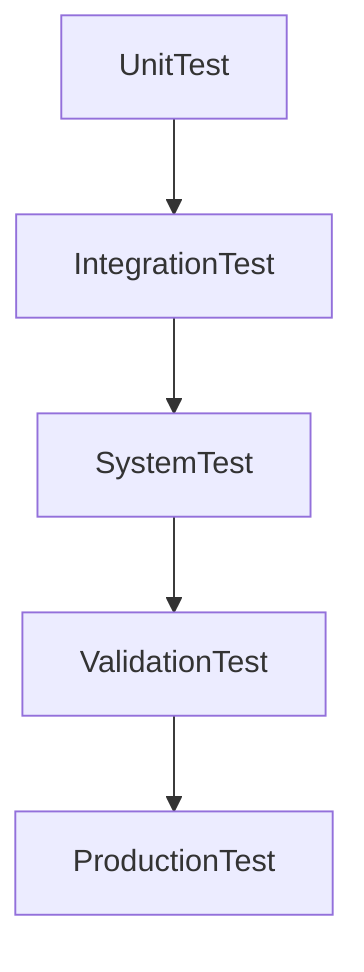
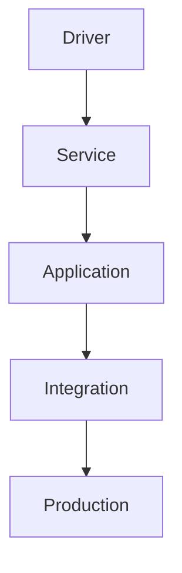

# 12 - Testing Checklist

> Verification, Validation and Production Testing Specification for Operation Timer Firmware

**Document ID** : OT-DOC-012  
**Document Name** : Testing Checklist  
**Project** : Operation Timer  
**Version** : 2.0.0  
**Status** : Production Standard  
**Last Update** : 2026-07-30

> **Quality Assurance Note**
>
> Dokumen ini merupakan standar pengujian firmware dan hardware Operation Timer. Seluruh unit harus lulus seluruh pengujian pada dokumen ini sebelum dinyatakan layak untuk diproduksi atau dirilis.

---

# Revision History

| Version | Date | Author | Description |
|----------|------------|----------------|------------------------------|
|1.0.0|2026-07-30|Development Team|Initial Document|
|2.0.0|2026-07-30|Development Team|Production QA Standard|

---

# 1. Purpose

Dokumen ini mendefinisikan seluruh prosedur pengujian firmware, hardware, dan integrasi sistem.

Tujuan:

- Memastikan seluruh fitur bekerja sesuai spesifikasi.
- Menjamin stabilitas firmware.
- Menjamin kualitas produksi.
- Mengurangi kemungkinan kegagalan di lapangan.
- Menjadi acuan QA dan Manufacturing.

---

# 2. Testing Scope

Pengujian meliputi:

- Hardware Verification
- Driver Test
- Service Test
- Application Test
- Integration Test
- Stress Test
- Long Run Test
- Production Test

---

# 3. Testing Level



Seluruh level wajib lulus.

---

# 4. Test Environment

| Item | Requirement |
|------|-------------|
| Board | Arduino Nano |
| Supply | 12V DC |
| Display | 6 Digit 7 Segment |
| RTC | DS3231 |
| Logic Analyzer | Recommended |
| Oscilloscope | Recommended |
| Multimeter | Required |

---

# 5. Firmware Information

Catat informasi berikut sebelum pengujian.

| Item | Value |
|------|-------|
| Firmware Version | |
| Build Number | |
| Git Commit | |
| Tester | |
| Date | |
| Hardware Revision | |

---

# 6. Hardware Inspection

| Item | Pass |
|------|------|
| PCB bersih | ☐ |
| Tidak ada solder bridge | ☐ |
| Polaritas LED benar | ☐ |
| Polaritas buzzer benar | ☐ |
| RTC terpasang | ☐ |
| Arduino Nano benar | ☐ |
| RJ45 benar | ☐ |
| Step Down 5V benar | ☐ |

---

# 7. Power Test

| Test | Expected Result | Pass |
|------|-----------------|------|
| Input 12V | Sistem hidup | ☐ |
| LED Power | Menyala | ☐ |
| Arus Idle | Sesuai spesifikasi | ☐ |
| Tegangan 5V | 4.9–5.1V | ☐ |
| Tidak panas berlebih | Ya | ☐ |

---

# 8. Boot Test

Saat power dinyalakan.

Checklist:

- ☐ Display Test berjalan.
- ☐ LED Power aktif.
- ☐ Startup Beep.
- ☐ RTC terdeteksi.
- ☐ Firmware masuk Clock Mode.
- ☐ Tidak reset berulang.

---

# 9. RTC Test

| Test | Expected Result | Pass |
|------|-----------------|------|
| RTC Read | OK | ☐ |
| RTC Write | OK | ☐ |
| SQW 1Hz | OK | ☐ |
| Waktu stabil | OK | ☐ |
| Backup Battery | OK | ☐ |

---

# 10. Display Driver Test

Checklist:

- ☐ Semua digit menyala.
- ☐ Tidak ghosting.
- ☐ Tidak flicker.
- ☐ Semua segment benar.
- ☐ Colon bekerja.
- ☐ Tick 1Hz bekerja.
- ☐ Brightness seragam.

---

# 11. Segment Verification

Aktifkan Display Test Mode.

| Segment | Pass |
|----------|------|
| A | ☐ |
| B | ☐ |
| C | ☐ |
| D | ☐ |
| E | ☐ |
| F | ☐ |
| G | ☐ |
| Colon | ☐ |

---

# 12. Multiplex Test

| Item | Expected |
|------|----------|
| Refresh Rate | 1000 Hz |
| Ghosting | Tidak ada |
| Flicker | Tidak ada |
| Digit Timing | Konsisten |

---

# 13. Button Test

Lakukan untuk seluruh tombol.

| Button | Short | Hold | Repeat |
|----------|-------|------|--------|
| POWER | ☐ | ☐ | ☐ |
| NEXT | ☐ | ☐ | ☐ |
| SELECT | ☐ | ☐ | ☐ |
| UP | ☐ | ☐ | ☐ |
| DOWN | ☐ | ☐ | ☐ |

---

# 14. Debounce Test

Checklist:

- ☐ Tidak double click.
- ☐ Hold tepat.
- ☐ Repeat tepat.
- ☐ Release tepat.
- ☐ Tidak kehilangan event.

---

# 15. Clock Mode Test

| Test | Expected |
|------|----------|
| Display Time | Benar |
| RTC Sinkron | Ya |
| Tick 1Hz | Ya |
| NEXT | Stopwatch |

---

# 16. Stopwatch Test

Checklist:

- ☐ Start.
- ☐ Pause.
- ☐ Resume.
- ☐ Reset.
- ☐ Hitung benar.
- ☐ Tidak drift.
- ☐ Max 99:99:99.

---

# 17. Countdown Test

Checklist:

- ☐ Setting.
- ☐ Increment.
- ☐ Decrement.
- ☐ Hold Increment.
- ☐ Hold Decrement.
- ☐ Start.
- ☐ Pause.
- ☐ Resume.
- ☐ Finish.
- ☐ Alarm aktif.
- ☐ Reset.

---

# 18. Notification Test

| Event | LED | Buzzer | Pass |
|--------|-----|---------|------|
| Startup | ✔ | ✔ | ☐ |
| Button | ✔ | ✔ | ☐ |
| Save | ✔ | ✔ | ☐ |
| Reset | ✔ | ✔ | ☐ |
| Countdown Finish | ✔ | ✔ | ☐ |
| Error | ✔ | ✔ | ☐ |

---

# 19. Scheduler Test

Checklist:

- ☐ Task 10ms berjalan.
- ☐ Tick 1Hz stabil.
- ☐ Tidak ada blocking.
- ☐ Tidak ada task terlewat.

---

# 20. Event Queue Test

Checklist:

- ☐ FIFO benar.
- ☐ Queue Overflow terdeteksi.
- ☐ Event tidak hilang.
- ☐ Priority berjalan.

---

# 21. Long Run Test

Operasikan sistem minimal:

```
24 Jam
```

Checklist:

- ☐ Tidak restart.
- ☐ Tidak freeze.
- ☐ RTC tetap akurat.
- ☐ Display stabil.
- ☐ Tidak memory leak.
- ☐ Tidak watchdog reset.

---

# 22. Stress Test

Lakukan:

- Tekan tombol cepat selama 5 menit.
- Pindah mode terus menerus.
- Jalankan countdown berulang.
- Jalankan stopwatch berulang.

Checklist:

- ☐ Tidak crash.
- ☐ Tidak hang.
- ☐ Tidak kehilangan event.

---

# 23. Power Cycling Test

Lakukan minimal:

```
100 kali
```

Checklist:

- ☐ Boot normal.
- ☐ Tidak corrupt.
- ☐ RTC tetap benar.

---

# 24. Brown-Out Test

Turunkan tegangan input secara perlahan.

Checklist:

- ☐ Tidak corrupt display.
- ☐ Recovery normal.
- ☐ Tidak merusak RTC.

---

# 25. EMI Basic Test

Lakukan pengujian sederhana:

- Switching beban sekitar.
- Dekat adaptor switching.
- Dekat motor DC kecil.

Checklist:

- ☐ Display tetap stabil.
- ☐ Tidak reset.
- ☐ RTC tetap berjalan.

---

# 26. Memory Verification

| Parameter | Target |
|------------|--------|
| Flash | <24 KB |
| SRAM | <1.2 KB |
| EEPROM | Sesuai kebutuhan |

---

# 27. Static Analysis

Checklist:

- ☐ Zero Warning.
- ☐ clang-tidy Pass.
- ☐ clang-format Pass.
- ☐ No Dynamic Memory.
- ☐ No delay().

---

# 28. Manufacturing Test

Setiap unit produksi wajib:

- ☐ Flash Firmware.
- ☐ Verify Firmware.
- ☐ Display Test.
- ☐ Button Test.
- ☐ RTC Test.
- ☐ Alarm Test.
- ☐ Burn-In Test.
- ☐ Label Firmware Version.

---

# 29. Burn-In Test

Minimal:

```
8 Jam
```

Mode:

- Clock
- Stopwatch
- Countdown

Checklist:

- ☐ Stabil.
- ☐ Tidak panas berlebih.
- ☐ Tidak restart.

---

# 30. Factory Acceptance Test (FAT)

Unit dinyatakan lulus apabila:

- Semua checklist lulus.
- Tidak ditemukan bug kritis.
- Firmware sesuai versi.
- Hardware sesuai revisi.

Status:

```
PASS

atau

FAIL
```

---

# 31. Test Report

Setelah pengujian.

Catat:

| Item | Value |
|------|-------|
| Tester | |
| Date | |
| Firmware Version | |
| Hardware Revision | |
| Total Test | |
| Pass | |
| Fail | |
| Remark | |

---

# 32. Recommended Test Equipment

| Equipment | Required |
|------------|----------|
| Digital Multimeter | ✔ |
| Oscilloscope | ✔ |
| Logic Analyzer | ✔ |
| Bench Power Supply | ✔ |
| USB Serial | ✔ |
| Stopwatch | Optional |

---

# 33. Related Documents

- 01_System_Requirements.md
- 04_Display_Driver.md
- 05_Button_System.md
- 07_RTC_System.md
- 08_Buzzer_LED.md
- 09_Firmware_Architecture.md
- 10_Coding_Standard.md
- 11_Project_Structure.md

---

# Implementation Notes

## Test Classification

Seluruh test dikelompokkan menjadi:



Hal ini memudahkan identifikasi sumber masalah.

---

## Regression Testing

Setiap perubahan firmware wajib menjalankan ulang minimal:

- Button Test
- Display Test
- RTC Test
- Scheduler Test
- Mode Test

Tidak diperbolehkan hanya menguji fitur yang diubah.

---

## Automated Testing

Target jangka panjang:

```
GitHub Action

↓

Build

↓

Static Analysis

↓

Unit Test

↓

Release Candidate
```

Firmware yang gagal salah satu tahap tidak boleh masuk branch `main`.

---

## Factory Test Mode

Direkomendasikan menambahkan **Factory Test Mode** pada firmware.

Fitur:

- Display Test
- Segment Test
- Button Test
- RTC Test
- LED Test
- Buzzer Test
- Firmware Version
- Build Number
- Hardware Revision

Factory Test dapat diakses menggunakan kombinasi tombol saat boot.

---

## Hardware Self-Test (POST)

Saat startup firmware melakukan **Power-On Self-Test (POST)**.

Urutan:

```mermaid
flowchart TD

Power ON

-->

Display Test

-->

RTC Detection

-->

Button Scan

-->

Notification Test

-->

Ready
```

Jika salah satu pemeriksaan gagal, firmware menampilkan **Error Code** dan menyimpan status kegagalan untuk kebutuhan diagnosis.

---

## Production Traceability

Setiap unit yang diproduksi harus dapat diidentifikasi menggunakan:

- Firmware Version
- Build Number
- Git Commit Hash
- Hardware Revision
- Manufacturing Date
- Serial Number (Future)

Informasi ini harus tersedia melalui Factory Test Mode.

---

## Acceptance Criteria

Firmware dinyatakan siap dirilis apabila memenuhi seluruh persyaratan berikut:

- 100% Unit Test lulus.
- 100% Integration Test lulus.
- 100% Factory Acceptance Test lulus.
- Zero compiler warning.
- Zero penggunaan dynamic memory.
- Penggunaan Flash dan SRAM masih berada di bawah target desain.
- Dokumentasi dan `CHANGELOG.md` telah diperbarui.

---

# Production Notes

- Seluruh hasil pengujian harus didokumentasikan dan disimpan bersama artefak release firmware.
- Unit yang gagal pada salah satu tahap pengujian tidak boleh dikirim ke pengguna sebelum dilakukan analisis dan perbaikan.
- Setiap revisi hardware atau firmware wajib menjalani pengujian regresi sesuai dokumen ini.
- Factory Test Mode harus tetap kompatibel dengan seluruh revisi hardware yang didukung.
- Checklist ini merupakan dokumen hidup dan harus diperbarui apabila terdapat fitur baru atau perubahan arsitektur.

---

**End of Document**