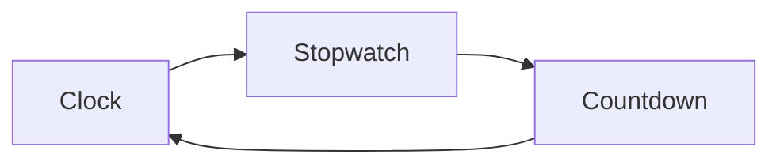
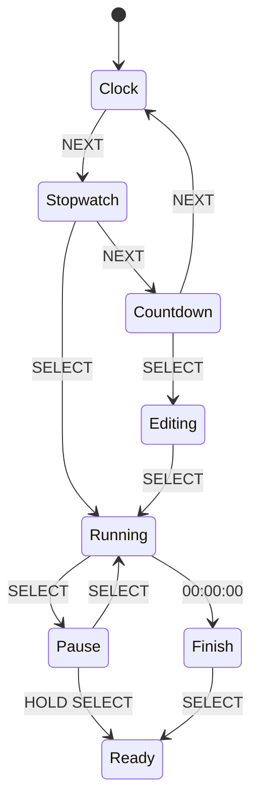

# 13 - UI / UX Specification

> User Interface & User Experience Specification for Operation Timer Firmware

**Document ID** : OT-DOC-013  
**Document Name** : UI / UX Specification  
**Project** : Operation Timer  
**Version** : 2.0.0  
**Status** : Production Standard  
**Last Update** : 2026-07-30

> **Design Philosophy**
>
> Operation Timer digunakan di ruang operasi (Operating Room), sehingga antarmuka harus **sederhana, cepat dipahami, minim kesalahan operasi (Human Error), dapat digunakan dengan sarung tangan medis, serta tidak mengganggu aktivitas dokter dan perawat.**

---

# Revision History

| Version | Date | Author | Description |
|----------|------------|----------------|---------------------------|
|1.0.0|2026-07-30|Development Team|Initial Document|
|2.0.0|2026-07-30|Development Team|Production UI/UX Standard|

---

# 1. Design Principles

Firmware harus memenuhi prinsip berikut.

- Minimal Learning Curve
- One Hand Operation
- Large Visual Information
- Fast Response
- No Hidden Function
- Predictable Behavior
- Consistent Navigation
- Audible Feedback
- Visual Confirmation
- Safe Against Accidental Press

---

# 2. Display Layout

Display terdiri dari 6 digit.

```
HH : MM : SS
```

Contoh

```
12:35:48
```

Digit:

```
D1 D2 : D3 D4 : D5 D6
```

| Digit | Function |
|---------|----------|
|D1|Hour Tens|
|D2|Hour Units|
|D3|Minute Tens|
|D4|Minute Units|
|D5|Second Tens|
|D6|Second Units|

---

# 3. Display Priority

Prioritas informasi.

| Priority | Information |
|------------|-------------|
|1|Current Mode|
|2|Time Value|
|3|Alarm Status|
|4|Button Feedback|

Display tidak boleh menampilkan informasi yang tidak relevan.

---

# 4. UI Modes

Firmware memiliki tiga mode utama.

```
Clock

↓

Stopwatch

↓

Countdown

↓

Clock
```

Mode berpindah menggunakan tombol **NEXT**.

---

# 5. Screen Flow



Tidak ada submenu bertingkat.

---

# 6. Clock Screen

Contoh

```
14:25:32
```

Karakteristik:

- RTC Real Time.
- Colon berkedip 1Hz.
- Tidak dapat dijeda.
- Menjadi mode default saat boot.

---

# 7. Stopwatch Screen

Contoh

```
00:15:48
```

Status:

- Ready
- Running
- Pause

---

# 8. Countdown Screen

Contoh

```
01:30:00
```

Status:

- Ready
- Editing
- Running
- Pause
- Finish

---

# 9. Button Mapping

| Button | Primary Function |
|----------|-----------------|
|POWER|Power / Sleep (Future)|
|NEXT|Mode Change|
|SELECT|Action|
|UP|Increase|
|DOWN|Decrease|

---

# 10. Button Event

Setiap tombol mendukung:

- Short Press
- Hold
- Auto Repeat

---

# 11. Navigation Rules

Clock

```
NEXT

↓

Stopwatch

↓

NEXT

↓

Countdown

↓

NEXT

↓

Clock
```

Tidak diperbolehkan:

- Long Menu
- Nested Menu
- Hidden Menu

---

# 12. Stopwatch UX

## Ready

SELECT

↓

Start

## Running

SELECT

↓

Pause

## Pause

SELECT

↓

Resume

Hold SELECT

↓

Reset

---

# 13. Countdown UX

Ready

↓

Edit

↓

Start

↓

Pause

↓

Resume

↓

Finish

↓

Reset

---

# 14. Countdown Editing

Urutan editing:

```
Hour

↓

Minute

↓

Second

↓

Save
```

Digit yang sedang diedit berkedip dengan frekuensi ±2 Hz.

---

# 15. Button Feedback

Setiap tombol memberikan feedback.

| Action | Beep | Display |
|----------|------|----------|
|Short|✔|Tetap|
|Hold|✔✔|Tetap|
|Repeat|Opsional|Tetap|

---

# 16. Save Feedback

Saat parameter berhasil disimpan.

LED:

```
Flash
```

Buzzer:

```
Beep Beep
```

Display:

Tetap menampilkan data baru.

---

# 17. Reset Feedback

Buzzer:

```
Long Beep
```

Display:

Nilai kembali ke default.

---

# 18. Countdown Finish

Saat mencapai

```
00:00:00
```

Terjadi:

- Countdown berhenti.
- Buzzer Pattern.
- LED berkedip.
- Display tetap menunjukkan `00:00:00`.

Alarm berhenti saat pengguna menekan **SELECT**.

---

# 19. Colon Behavior

| Mode | Colon |
|--------|-------|
|Clock|Blink 1 Hz|
|Stopwatch|Blink 1 Hz|
|Countdown Running|Blink 1 Hz|
|Countdown Pause|ON|
|Editing|OFF|

---

# 20. Tick Indicator

Tick menggunakan LED/Colon.

```
ON

↓

OFF

↓

ON
```

Frekuensi:

```
1Hz
```

Sinkron terhadap SQW DS3231.

---

# 21. Buzzer Pattern

| Event | Pattern |
|---------|---------|
|Boot|Beep|
|Button|Short|
|Save|Double|
|Reset|Long|
|Finish|Repeated|
|Error|Triple|

---

# 22. LED Pattern

| Event | LED |
|---------|------|
|Power|ON|
|Save|Flash|
|Alarm|Blink|
|Error|Fast Blink|

---

# 23. Error Display

Jika terjadi error.

Contoh:

```
Err001
```

atau

```
rtcErr
```

(Khusus Factory/Test Mode jika mendukung alfanumerik di masa depan.)

Untuk display 7-segment saat ini gunakan kode numerik.

Contoh:

```
E001
```

Didokumentasikan pada tabel Error Code.

---

# 24. Error Priority

Urutan prioritas.

1. Fatal Error
2. Countdown Finish
3. User Editing
4. Current Mode

---

# 25. Audible Design

Pedoman bunyi.

- Maksimal 150 ms untuk Button.
- Maksimal 300 ms untuk Save.
- Alarm berulang hingga diakui pengguna.
- Tidak menghasilkan bunyi terus-menerus tanpa alasan.

---

# 26. Human Factors

Firmware dirancang untuk operator yang:

- Menggunakan sarung tangan.
- Bekerja di bawah tekanan.
- Membutuhkan informasi cepat.
- Tidak memiliki waktu membuka manual.

---

# 27. Accessibility

Display harus dapat dibaca dari jarak:

```
3~8 meter
```

Dengan tinggi karakter:

```
2.3 inch
```

---

# 28. UI Timing

| Item | Target |
|------|--------|
|Button Response|<50 ms|
|Mode Change|<100 ms|
|Display Update|<20 ms|
|Alarm Response|<100 ms|

---

# 29. Anti Human Error

Firmware harus mencegah:

- Reset tidak sengaja.
- Pergantian mode saat editing.
- Perubahan countdown saat running.
- Multiple trigger akibat bouncing.
- Kehilangan data akibat salah tekan.

---

# 30. UX Rules

Seluruh aksi penting harus memberikan minimal satu feedback:

- Visual
- Audio

Idealnya keduanya.

---

# 31. State Machine



---

# 32. UI Consistency Rules

- Tombol **NEXT** selalu berpindah mode.
- Tombol **SELECT** selalu menjalankan aksi utama.
- Tombol **UP/DOWN** hanya mengubah nilai saat mode edit.
- Tidak ada fungsi tombol yang berubah tanpa indikasi visual.

---

# 33. Recommended Timing

| Action | Duration |
|----------|----------|
|Short Press|30–300 ms|
|Hold|≥800 ms|
|Auto Repeat Start|600 ms|
|Repeat Interval|150 ms|

---

# 34. Display Refresh Policy

- Refresh multiplex minimal 1000 Hz.
- Pergantian tampilan tidak boleh menyebabkan flicker.
- Update tampilan menggunakan **Double Buffer**.
- Perubahan isi display hanya terjadi setelah proses buffer swap selesai.

---

# 35. Factory UI

Saat masuk Factory Test.

Urutan layar:

```
Display Test

↓

Segment Test

↓

Button Test

↓

RTC Test

↓

Buzzer Test

↓

LED Test

↓

Version

↓

Build

↓

Exit
```

---

# 36. UX Improvement — Editing Cursor

Selama proses edit countdown:

- Digit aktif berkedip.
- Digit lain tetap menyala.
- Nilai tidak berubah sebelum pengguna melakukan konfirmasi.

Hal ini mengurangi risiko salah membaca digit yang sedang diubah.

---

# 37. UX Improvement — Confirmation Policy

Aksi yang bersifat destruktif memerlukan **Hold**.

| Action | Confirmation |
|----------|-------------|
|Reset Stopwatch|Hold SELECT|
|Reset Countdown|Hold SELECT|
|Factory Reset (Future)|Hold POWER + SELECT|

Short Press tidak boleh menghapus data.

---

# 38. UX Improvement — Power Recovery

Jika listrik padam:

- Clock kembali membaca RTC.
- Stopwatch kembali ke kondisi Ready.
- Countdown kembali ke kondisi Ready (default).

> **Catatan:** Countdown dan Stopwatch **tidak** melakukan auto-resume setelah kehilangan daya untuk menghindari informasi waktu yang menyesatkan di lingkungan medis.

---

# 39. UX Improvement — Alarm Acknowledgement

Saat Countdown selesai:

```
00:00:00
```

Alarm akan:

- Bunyi berulang.
- LED berkedip.
- Display tetap pada `00:00:00`.

Alarm hanya berhenti jika:

- SELECT ditekan (Acknowledgement).

Mode **NEXT** tidak menghentikan alarm.

---

# 40. UX Improvement — Safe Editing Lock

Selama Countdown Running:

- NEXT diabaikan.
- UP diabaikan.
- DOWN diabaikan.
- SELECT hanya Pause.

Hal ini mencegah perubahan nilai timer secara tidak sengaja.

---

# 41. Recommended Default Behavior

| Event | Default Action |
|---------|----------------|
|Boot|Clock Mode|
|RTC Error|Error Screen + Beep|
|Countdown Finish|Alarm|
|Idle|Tetap aktif|
|Power Restore|Clock Mode|

---

# 42. Related Documents

- 04_Display_Driver.md
- 05_Button_System.md
- 06_Mode_Manager.md
- 07_RTC_System.md
- 08_Buzzer_LED.md
- 09_Firmware_Architecture.md
- 12_Testing_Checklist.md

---

# Production Notes

- Seluruh perilaku UI harus konsisten pada setiap revisi firmware.
- Setiap perubahan alur navigasi wajib diperbarui pada diagram state machine.
- Tidak diperbolehkan menambahkan fungsi tombol yang tersembunyi pada mode normal.
- Semua feedback visual dan audio harus memiliki tujuan yang jelas dan tidak mengganggu lingkungan ruang operasi.
- UX harus diprioritaskan untuk mengurangi human error dibandingkan menambah fitur.

---

**End of Document**