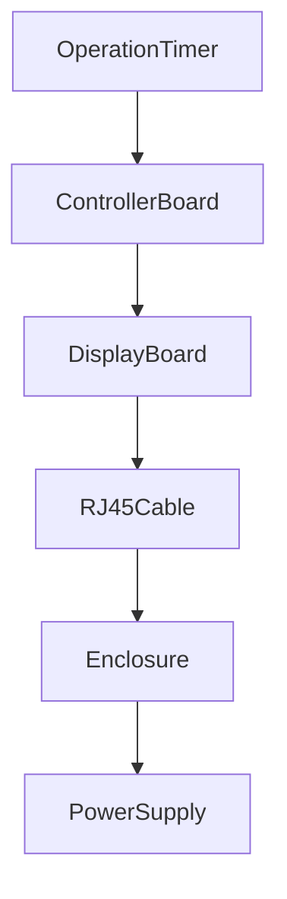

# 14 - Manufacturing BOM

> Manufacturing Bill of Materials (BOM) Specification for Operation Timer

**Document ID** : OT-DOC-014  
**Document Name** : Manufacturing BOM  
**Project** : Operation Timer  
**Version** : 2.0.0  
**Status** : Production Standard  
**Last Update** : 2026-07-30

> **Manufacturing Note**
>
> Dokumen ini merupakan acuan resmi Bill of Materials (BOM) untuk proses produksi Operation Timer. Seluruh komponen yang digunakan harus memiliki spesifikasi yang setara atau lebih baik dari yang tercantum pada dokumen ini.

---

# Revision History

| Version | Date | Author | Description |
|----------|------------|----------------|----------------------------|
|1.0.0|2026-07-30|Development Team|Initial BOM|
|2.0.0|2026-07-30|Development Team|Production Release|

---

# 1. Purpose

Dokumen ini mendefinisikan:

- Komponen elektronik
- Komponen mekanik
- Komponen perakitan
- Material produksi
- Komponen opsional
- Approved Vendor List (AVL)

---

# 2. Product Overview

Operation Timer terdiri dari dua PCB.

```
+-------------------------+

Display Board

- 6 Digit Display
- Shift Register
- Driver
- Step Down

+-------------------------+

RJ45 Cable

+-------------------------+

Controller Board

- Arduino Nano
- RTC
- Button
- LED
- Buzzer
- Step Down

+-------------------------+
```

---

# 3. Assembly Structure



---

# 4. Main Electronic Components

| No | Component | Qty | Description |
|----|-----------|-----|-------------|
|1|Arduino Nano|1|ATmega328P|
|2|DS3231 RTC Module|1|I2C RTC|
|3|74HC595|2|Shift Register|
|4|ULN2803A|1|Segment Driver|
|5|BC547C|6|Digit Driver (NPN)|
|6|S8550|6|Digit Driver (PNP)|
|7|7 Segment 2.3" Common Anode|6|Display|
|8|LM2596 Step Down 12V→5V|2|Power Module|
|9|Active Buzzer 5V|1|Notification|
|10|LED 5mm Green|1|Power Indicator|
|11|LED 3mm Red|1|Tick Indicator|
|12|Tactile Switch 6x6mm|5|Input|

---

# 5. Passive Components

## Resistor

| Value | Qty | Function |
|---------|-----|----------|
|220Ω|7|Segment Current Limiter|
|1kΩ|6|BC547 Base|
|4.7kΩ|6|S8550 Base|
|10kΩ|2|Optional Pull-up/Pull-down|
|100Ω|1|Power LED|

---

## Capacitor

| Value | Qty | Function |
|----------|-----|---------|
|100nF|6|IC Decoupling|
|10µF|4|Power Filtering|
|220µF|2|Step Down Output|

---

# 6. Connector

| Item | Qty |
|------|-----|
|RJ45 Female|2|
|RJ45 Cable CAT5e/CAT6|1|
|ICSP Header|1|
|USB Mini/Micro (Nano)|1|

---

# 7. Power Supply

| Item | Specification |
|------|---------------|
|Input|12VDC|
|Current|3A Minimum|
|Protection|Short Circuit|
|Efficiency|>85%|

---

# 8. Controller Board BOM

| Component | Qty |
|------------|-----|
|Arduino Nano|1|
|RTC Module|1|
|LM2596|1|
|Button|5|
|Power LED|1|
|Active Buzzer|1|
|RJ45 Connector|1|

---

# 9. Display Board BOM

| Component | Qty |
|------------|-----|
|74HC595|2|
|ULN2803A|1|
|BC547C|6|
|S8550|6|
|7 Segment 2.3"|6|
|LM2596|1|
|RJ45 Connector|1|
|Tick LED|1|

---

# 10. Estimated Power Budget

| Rail | Maximum Current |
|------|-----------------|
|12V Input|≈700 mA|
|5V Controller|≈120 mA|
|5V Display|≈1.2 A Peak|
|Total 12V Input|<1 A|

**Power Supply Recommendation**

```
12V 3A
```

Memberikan margin yang sangat besar untuk operasi kontinu.

---

# 11. PCB Requirements

Controller Board:

- 2 Layer
- FR4
- 1.6 mm
- 1 oz Copper
- HASL Lead-Free

Display Board:

- 2 Layer
- FR4
- 1.6 mm
- 1 oz Copper
- HASL Lead-Free

---

# 12. PCB Design Rules

| Item | Value |
|------|-------|
|Track Width Signal|0.25 mm|
|Track Width Power|1.0 mm Minimum|
|Clearance|0.20 mm|
|Via Hole|0.30 mm|
|Via Pad|0.60 mm|

---

# 13. Decoupling Policy

Setiap IC wajib memiliki:

```
100nF Ceramic

≤10 mm dari pin VCC
```

Tidak diperbolehkan berbagi satu kapasitor untuk beberapa IC.

---

# 14. Approved Vendor List (AVL)

| Component | Preferred Vendor |
|------------|-----------------|
|74HC595|Nexperia / TI / ON Semi|
|ULN2803A|TI / ST|
|BC547C|ON Semi / NXP|
|S8550|CJ / UTC|
|Arduino Nano|Official / Compatible Berkualitas|
|DS3231|Maxim / Analog Devices Module|
|LM2596|TI Design Compatible|

---

# 15. Alternate Components

| Original | Alternative |
|-----------|-------------|
|74HC595|SN74HC595|
|ULN2803A|ULN2803AN|
|BC547C|2N2222 (perlu evaluasi)|
|LM2596|MP1584 Module|

Seluruh alternatif harus diverifikasi melalui proses validasi.

---

# 16. Mechanical BOM

| Component | Qty |
|------------|-----|
|Enclosure ABS|1|
|Acrylic Front Panel|1|
|M3 Spacer 10 mm|4|
|M3 Screw|8|
|Rubber Foot|4|

---

# 17. Cable Assembly

RJ45 digunakan sebagai interkoneksi antar PCB.

Konfigurasi minimum:

| Pair | Function |
|------|----------|
|Pair 1|+12V & GND|
|Pair 2|DATA & CLOCK|
|Pair 3|LATCH & OE|
|Pair 4|SQW & Reserved|

**Catatan:** Gunakan pasangan twisted untuk sinyal yang berjalan bersama (misalnya DATA dengan GND referensi jika memungkinkan) untuk mengurangi EMI.

---

# 18. Manufacturing Process

```mermaid
flowchart TD

Incoming Inspection

-->

PCB Assembly

-->

Visual Inspection

-->

Programming

-->

Functional Test

-->

Burn-In Test

-->

QC Inspection

-->

Packaging
```

---

# 19. Incoming Inspection

Periksa:

- Jumlah komponen
- Nilai resistor
- Polaritas kapasitor
- Kondisi display
- Kualitas solder pin modul
- Tanggal produksi modul (jika tersedia)

---

# 20. Assembly Checklist

- ☐ Semua IC sesuai orientasi
- ☐ Polaritas LED benar
- ☐ Polaritas elektrolit benar
- ☐ Tidak ada solder bridge
- ☐ RJ45 lurus
- ☐ Display rata
- ☐ Spacer terpasang

---

# 21. Programming Checklist

- ☐ Bootloader OK
- ☐ Firmware sesuai Version.h
- ☐ Build Number benar
- ☐ Verify Flash berhasil
- ☐ Fuse sesuai spesifikasi

---

# 22. Quality Control Checklist

- ☐ Display normal
- ☐ Semua tombol bekerja
- ☐ RTC bekerja
- ☐ Tick 1 Hz sesuai
- ☐ Alarm bekerja
- ☐ Arus idle sesuai spesifikasi
- ☐ Tidak ada komponen panas berlebih

---

# 23. Packaging

Isi paket:

- Operation Timer
- Power Supply 12V 3A
- Kabel Power
- Manual Pengguna
- QC Pass Card

---

# 24. Label Specification

Label belakang produk memuat:

```
Product Name

Hardware Revision

Firmware Version

Build Number

Serial Number

Manufacturing Date
```

Gunakan label tahan panas dan tahan alkohol medis.

---

# 25. Traceability

Setiap unit harus memiliki identitas unik.

| Item | Source |
|------|--------|
|Hardware Revision|PCB Silkscreen|
|Firmware Version|Version.h|
|Build Number|BuildInfo.h|
|Serial Number|Label Produksi|
|QC Inspector|QC Card|

---

# 26. Storage Requirements

- Suhu: 10–35°C
- RH: <70%
- Bebas debu
- Bebas ESD
- Hindari sinar matahari langsung

---

# 27. ESD Protection

Selama proses produksi:

- Gunakan ESD Mat
- Gunakan Wrist Strap
- Gunakan ESD Tray
- Simpan IC dalam ESD Bag

---

# 28. Reliability Recommendations

- Gunakan konektor berkualitas industri.
- Gunakan resistor toleransi 1%.
- Gunakan kapasitor X7R untuk bypass.
- Hindari komponen tanpa datasheet yang jelas.
- Sediakan minimal satu vendor alternatif untuk komponen kritis.

---

# 29. Future Manufacturing Options

Dokumen ini mendukung pengembangan berikut:

- SMT Assembly
- Automated Optical Inspection (AOI)
- ICT Fixture
- Functional Test Jig
- Barcode / QR Traceability
- Serial Number EEPROM
- Automatic Firmware Programming

---

# 30. Related Documents

- 02_Hardware_Architecture.md
- 03_Pin_Mapping.md
- 09_Firmware_Architecture.md
- 11_Project_Structure.md
- 12_Testing_Checklist.md

---

# Manufacturing Improvements Implemented

## 1. Dual-Board Production

Controller Board dan Display Board diproduksi serta diuji secara terpisah sebelum dilakukan final assembly.

Keuntungan:

- Mempermudah troubleshooting.
- Mengurangi biaya rework.
- Mempercepat proses QC.

---

## 2. Build Traceability

Setiap unit dapat ditelusuri berdasarkan:

- Firmware Version
- Build Number
- Hardware Revision
- Serial Number
- Manufacturing Date

---

## 3. Burn-In Requirement

Setiap unit wajib menjalani burn-in minimal:

```
8 Jam
```

Dengan mode:

- Clock
- Stopwatch
- Countdown

---

## 4. Functional Test Jig (Recommended)

Direkomendasikan membuat jig produksi yang mampu:

- Memberi catu daya 12V.
- Memprogram firmware.
- Menguji semua tombol.
- Memverifikasi RTC.
- Memeriksa seluruh segmen display.
- Mengukur arus konsumsi.
- Menghasilkan laporan PASS/FAIL.

---

## 5. Golden Sample

Sediakan minimal:

- 1 Golden Hardware
- 1 Golden Firmware

Sebagai referensi saat kalibrasi dan validasi produksi.

---

## 6. Manufacturing Revision Policy

Perubahan berikut wajib menaikkan revisi dokumen:

| Perubahan | Update |
|-----------|--------|
|Hardware PCB|Hardware Revision|
|Firmware|Firmware Version|
|BOM|Document Version|
|Vendor Komponen|AVL Revision|

---

# Production Notes

- Seluruh perubahan komponen harus melalui proses Engineering Change Order (ECO).
- Komponen pengganti harus memiliki spesifikasi listrik dan mekanik yang setara atau lebih baik.
- Dokumen BOM harus disinkronkan dengan skematik, PCB, dan firmware sebelum proses produksi massal.
- Setiap revisi BOM harus disertai validasi fungsional dan pembaruan dokumen terkait.
- Untuk produksi massal, disarankan menggunakan sistem ERP atau spreadsheet BOM yang memiliki Part Number internal untuk setiap komponen.

---

**End of Document**