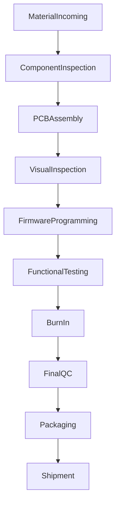
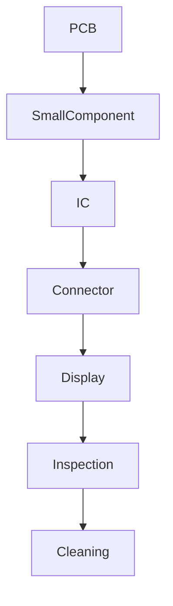
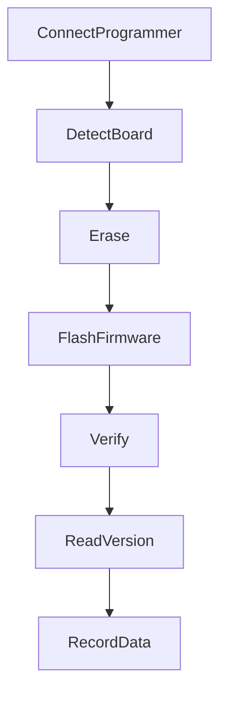
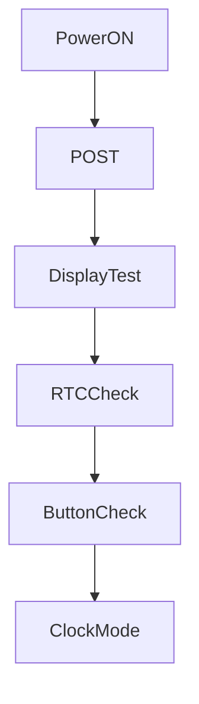
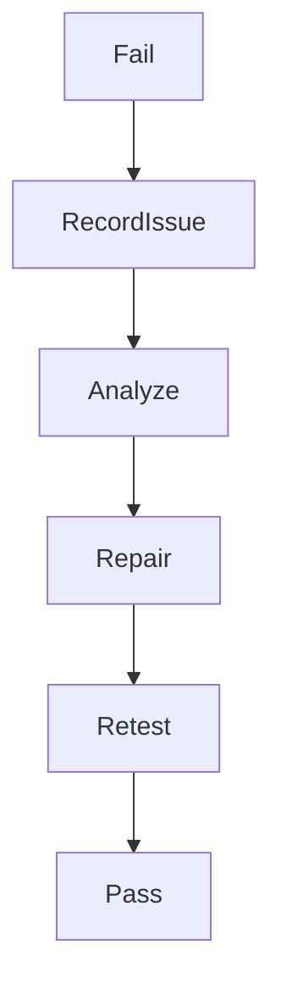

# 15 - Production Guide

> Production Assembly, Programming, Quality Control, and Release Guide for Operation Timer

**Document ID** : OT-DOC-015  
**Document Name** : Production Guide  
**Project** : Operation Timer  
**Version** : 2.0.0  
**Status** : Production Standard  
**Last Update** : 2026-07-30

> **Production Philosophy**
>
> Dokumen ini mendefinisikan proses produksi Operation Timer mulai dari penerimaan material, assembly PCB, programming firmware, functional test, burn-in, hingga produk siap dikirim.
>
> Tujuan utama adalah memastikan setiap unit memiliki kualitas, firmware, hardware, dan identitas produksi yang konsisten.

---

# Revision History

| Version | Date | Author | Description |
|----------|------------|----------------|----------------------------|
|1.0.0|2026-07-30|Development Team|Initial Production Guide|
|2.0.0|2026-07-30|Development Team|Manufacturing Workflow Standard|

---

# 1. Production Scope

Dokumen ini mencakup:

- Material preparation
- PCB assembly
- Firmware programming
- Hardware inspection
- Functional test
- Burn-in test
- Final QC
- Packaging
- Traceability

---

# 2. Production Flow Overview



---

# 3. Production Organization

Struktur produksi:

```
Production

├── Warehouse

├── Assembly

├── Programming

├── Testing

├── Quality Control

└── Packaging
```

---

# 4. Production Area Requirement

## Assembly Area

Requirement:

- ESD protection
- Clean workspace
- Good lighting
- Temperature controlled

Recommended:

```
20-30°C

RH 40-70%
```

---

## Programming Area

Equipment:

- PC/Laptop
- USB Programmer
- Programming Cable
- Firmware Repository Access

---

## Testing Area

Equipment:

- Bench Power Supply
- Multimeter
- Stopwatch Reference
- QC Computer

---

# 5. Material Receiving

Setiap material yang datang harus melalui inspection.

Checklist:

- ☐ Part Number sesuai
- ☐ Quantity sesuai
- ☐ Tidak rusak
- ☐ Datasheet tersedia
- ☐ Supplier tercatat

---

# 6. Material Identification

Setiap komponen memiliki:

| Data | Requirement |
|------|-------------|
|Part Number|Required|
|Supplier|Required|
|Lot Number|Recommended|
|Date Code|Recommended|

---

# 7. Component Storage

Komponen harus disimpan sesuai karakteristik.

## IC

- ESD Bag
- Dry Storage

## PCB

- Dry Storage
- Anti moisture

## Display

- Anti scratch
- Anti static

---

# 8. PCB Assembly Process

Urutan assembly:



---

# 9. Soldering Standard

Requirement:

- Solder joint mengkilap.
- Tidak ada crack.
- Tidak ada bridge.
- Tidak ada cold solder.

---

# 10. Controller Board Assembly

Komponen utama:

```
Controller Board

- Arduino Nano
- DS3231
- Step Down
- Button
- LED
- Buzzer
- RJ45
```

---

# 11. Display Board Assembly

Komponen utama:

```
Display Board

- 7 Segment x6
- 74HC595 x2
- ULN2803
- BC547C
- S8550
- Step Down
- RJ45
```

---

# 12. Assembly Inspection

Visual check:

- ☐ Orientasi IC benar
- ☐ LED polarity benar
- ☐ Capacitor polarity benar
- ☐ Display alignment benar
- ☐ Connector kuat
- ☐ Tidak ada solder bridge

---

# 13. Initial Power Test

Sebelum firmware:

Input:

```
12V DC
```

Check:

| Parameter | Target |
|-|-|
|5V Rail|4.9-5.1V|
|Short Circuit|Tidak ada|
|Current abnormal|Tidak ada|

---

# 14. Firmware Programming Process



---

# 15. Firmware Release Package

Setiap produksi menggunakan package:

```
Release/

Firmware.hex

Version.txt

BuildInfo.txt

Checksum.txt

ReleaseNote.md
```

---

# 16. Programming Checklist

| Item | Status |
|-|-|
|Board detected|☐|
|Firmware flash success|☐|
|Verify success|☐|
|Version correct|☐|
|Build correct|☐|

---

# 17. Firmware Identification

Setiap unit menyimpan:

```
Firmware Version

Major.Minor.Patch

Build Number

Git Commit
```

Contoh:

```
v1.2.5-build034
```

---

# 18. First Boot Procedure

Setelah programming:



---

# 19. Functional Test

## Display Test

Checklist:

- ☐ Semua digit hidup
- ☐ Segment benar
- ☐ Colon benar
- ☐ Tick benar
- ☐ Tidak flicker

---

## Button Test

Checklist:

- ☐ POWER
- ☐ NEXT
- ☐ SELECT
- ☐ UP
- ☐ DOWN

Test:

- Short
- Hold
- Repeat

---

## RTC Test

Checklist:

- ☐ Read RTC
- ☐ SQW 1Hz
- ☐ Time accuracy

---

## Stopwatch Test

Checklist:

- ☐ Start
- ☐ Pause
- ☐ Resume
- ☐ Reset

---

## Countdown Test

Checklist:

- ☐ Set Time
- ☐ Start
- ☐ Pause
- ☐ Finish Alarm
- ☐ Reset

---

# 20. Current Consumption Test

Measurement:

```
Input:

12V DC
```

Test kondisi:

| Condition | Expected |
|-|-|
|Idle|Normal|
|Maximum Display|Normal|
|Alarm|Normal|

Catat:

```
Measured Current:

________ A
```

---

# 21. Burn-In Test

Tujuan:

- Menemukan komponen gagal awal.
- Memastikan stabilitas firmware.

Durasi:

```
8 Hours Minimum
```

---

# 22. Burn-In Scenario

Cycle:

```
Clock

↓

Stopwatch

↓

Countdown

↓

Alarm

↓

Repeat
```

---

# 23. Burn-In Monitoring

Monitor:

- ☐ Reset
- ☐ Freeze
- ☐ Display failure
- ☐ Excessive heat
- ☐ Noise

---

# 24. Final Quality Control

QC melakukan:

- Visual inspection
- Functional verification
- Firmware verification
- Serial recording

---

# 25. Serial Number Assignment

Format:

```
OT-YYYY-XXXX
```

Contoh:

```
OT-2026-0001
```

---

# 26. Production Database Record

Simpan:

| Data | Required |
|-|-|
|Serial Number|Yes|
|Firmware Version|Yes|
|Build Number|Yes|
|Hardware Revision|Yes|
|Production Date|Yes|
|QC Result|Yes|

---

# 27. Label Installation

Label harus berisi:

```
Operation Timer

Model

Hardware Rev

Firmware

Serial Number

Date
```

---

# 28. Packaging Process

Isi:

- Timer Unit
- Power Adapter
- Cable
- Manual
- QC Certificate

---

# 29. Shipment Inspection

Checklist:

- ☐ Packaging aman
- ☐ Label benar
- ☐ Accessories lengkap
- ☐ QC Pass

---

# 30. Failure Handling

Jika FAIL:



---

# 31. Repair Classification

## Minor

Contoh:

- Button solder ulang
- Connector replacement

## Major

Contoh:

- MCU replacement
- PCB repair

## Reject

Contoh:

- PCB damage
- Display failure permanen

---

# 32. Engineering Change Process

Perubahan wajib melalui:

```
ECO

Engineering Change Order
```

Meliputi:

- Hardware change
- BOM change
- Firmware change
- Process change

---

# 33. Production Version Control

Setiap produksi harus menggunakan kombinasi:

```
Hardware Revision

+

Firmware Version

+

BOM Revision
```

---

# 34. Manufacturing Test Fixture

Direkomendasikan membuat fixture otomatis.

Kemampuan:

- Power supply
- Firmware flashing
- Button test
- Display test
- Current measurement
- Report generation

---

# 35. Recommended Production Tools

| Tool | Function |
|-|-|
|ESD Station|Assembly|
|Digital Microscope|Inspection|
|Programmer|Firmware|
|Multimeter|Measurement|
|Power Supply|Testing|
|Barcode Scanner|Traceability|

---

# 36. Production Metrics

Monitor:

| Metric | Target |
|-|-|
|First Pass Yield|>95%|
|Repair Rate|<5%|
|Firmware Failure|0%|
|Field Return|Minimum|

---

# 37. Production Documentation

Dokumen wajib tersedia:

- BOM
- Schematic
- PCB
- Firmware Release
- Test Report
- QC Checklist
- User Manual

---

# 38. Future Improvement

Direkomendasikan:

- Automated Test Jig
- Barcode Tracking
- ERP Integration
- Automatic Firmware Update
- Cloud Production Database

---

# 39. Related Documents

- 02_Hardware_Architecture.md
- 10_Coding_Standard.md
- 12_Testing_Checklist.md
- 14_Manufacturing_BOM.md

---

# Production Improvements Implemented

## 1. Production Gate System

Ditambahkan sistem gate agar unit tidak dapat berpindah tahap sebelum lolos inspeksi.


Setiap tahap memiliki status:

```
PASS / FAIL / HOLD
```

---

## 2. Golden Unit Reference

Ditambahkan konsep **Golden Unit**.

Satu unit referensi harus disimpan untuk:

- Perbandingan display brightness.
- Referensi suara buzzer.
- Referensi konsumsi arus.
- Validasi firmware.

---

## 3. Automated Production Record

Setiap unit produksi direkomendasikan menghasilkan record:

```
Serial Number

Firmware Version

Build Number

Test Result

Operator

Date
```

---

## 4. Firmware Locking

Firmware produksi harus memiliki:

- Release Version.
- Verified checksum.
- Tidak menggunakan firmware development.

---

## 5. Traceability Improvement

Ditambahkan hubungan:

```
Serial Number

↓

Hardware Revision

↓

BOM Revision

↓

Firmware Build

↓

QC Result
```

Sehingga setiap unit dapat ditelusuri sepanjang lifecycle.

---

# Production Notes

- Tidak ada unit yang boleh dikirim tanpa melewati Functional Test dan Final QC.
- Firmware development tidak boleh digunakan untuk produksi.
- Setiap perubahan firmware produksi harus melalui release process.
- BOM, firmware, dan dokumen produksi harus selalu memiliki versi yang sinkron.
- Semua data hasil testing harus disimpan sebagai bagian dari histori produk.

---

**End of Document**