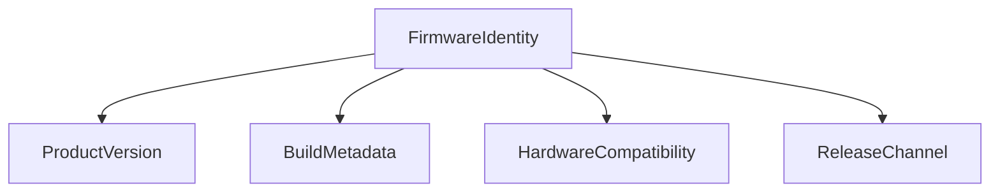
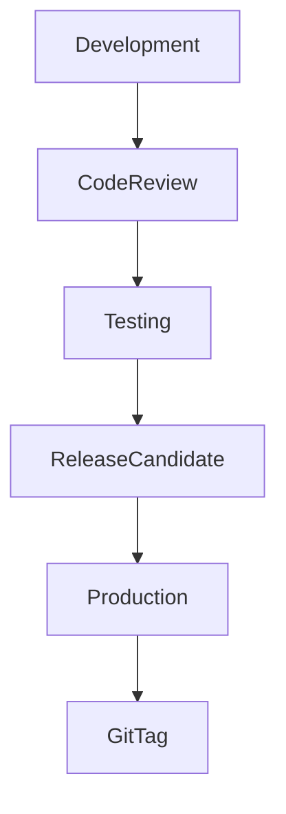
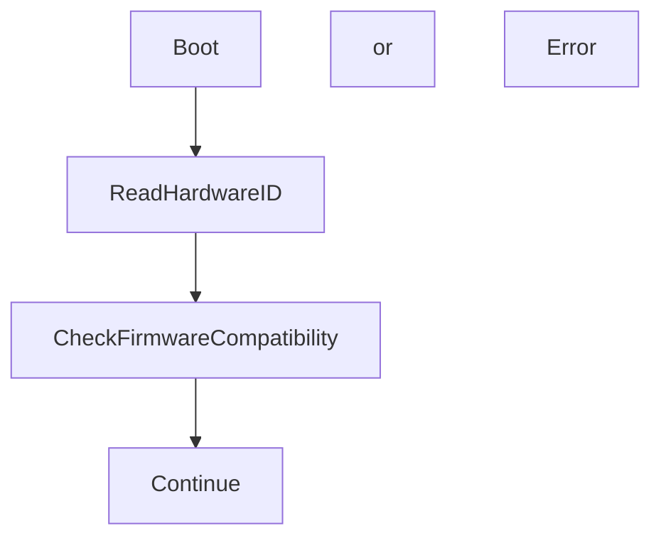

# 16 - Firmware Versioning

> Firmware Identification, Version Control, Build Management, and Release Traceability Specification for Operation Timer

**Document ID** : OT-DOC-016  
**Document Name** : Firmware Versioning  
**Project** : Operation Timer  
**Version** : 2.0.0  
**Status** : Production Standard  
**Last Update** : 2026-07-30

> **Versioning Philosophy**
>
> Firmware Operation Timer harus memiliki identitas unik yang memungkinkan setiap unit produksi ditelusuri kembali ke source code, hardware revision, dan proses build yang digunakan.
>
> Sistem versioning menggunakan kombinasi:
>
> - Semantic Versioning
> - Automatic Build Number
> - Git Commit Identification
> - Hardware Revision Tracking
> - Release Channel Identification

---

# Revision History

| Version | Date | Author | Description |
|----------|------------|----------------|----------------------------|
|1.0.0|2026-07-30|Development Team|Initial Versioning Concept|
|2.0.0|2026-07-30|Development Team|Production Versioning Standard|

---

# 1. Purpose

Dokumen ini mendefinisikan standar:

- Firmware numbering
- Build identification
- Release management
- Production traceability
- Firmware compatibility tracking

---

# 2. Versioning Architecture



---

# 3. Firmware Identity Format

Format utama:

```
OT-FW MAJOR.MINOR.PATCH+BUILD
```

Contoh:

```
OT-FW 1.2.0+345
```

Artinya:

| Parameter | Value |
|-|-|
|Product|Operation Timer|
|Major|1|
|Minor|2|
|Patch|0|
|Build|345|

---

# 4. Semantic Versioning

Format:

```
MAJOR.MINOR.PATCH
```

---

# 5. Major Version

Major berubah apabila terdapat perubahan besar.

Contoh:

- Perubahan hardware besar.
- Perubahan protokol komunikasi.
- Migrasi MCU.
- Perubahan UI fundamental.

Contoh:

```
1.9.5

↓

2.0.0
```

---

# 6. Minor Version

Minor berubah untuk penambahan fitur.

Contoh:

- Tambah sleep mode.
- Tambah brightness control.
- Tambah factory mode.

Contoh:

```
1.2.0

↓

1.3.0
```

---

# 7. Patch Version

Patch digunakan untuk bug fix.

Contoh:

- Perbaikan debounce button.
- Perbaikan RTC.
- Optimasi memory.

Contoh:

```
1.2.0

↓

1.2.1
```

---

# 8. Build Number

Build number dibuat otomatis.

Format:

```
BUILD
```

Contoh:

```
v1.2.0+345
```

Build number tidak boleh diedit manual.

---

# 9. Build Number Source

Prioritas sumber:

1. CI Build Counter
2. Git Commit Count
3. Automatic Timestamp

Rekomendasi:

```
Git Commit Count
```

karena:

- Reproducible.
- Tidak tergantung waktu.
- Mudah dilacak.

---

# 10. Version File Structure

Struktur project:

```
OperationTimer/

├── VERSION

├── scripts/

│   └── generate_version.py

├── generated/

│   └── BuildInfo.h

└── src/
```

---

# 11. VERSION File

Developer hanya mengubah:

```
VERSION
```

Isi:

```text
MAJOR=1
MINOR=2
PATCH=0
```

---

# 12. Generated BuildInfo

File:

```
generated/BuildInfo.h
```

dibuat otomatis.

Contoh:

```cpp
#pragma once

#define FW_MAJOR 1
#define FW_MINOR 2
#define FW_PATCH 0

#define FW_BUILD 345

#define FW_BUILD_DATE "2026-07-30"

#define FW_BUILD_TIME "10:30:15"

#define FW_GIT_HASH "a84fd92"

#define FW_CHANNEL "PRODUCTION"
```

---

# 13. Firmware Information Class

Firmware menyediakan informasi melalui class.

Contoh:

```cpp
class FirmwareInfo
{
public:

    void getVersion(
        String &output
    );

};
```

---

# 14. Memory Optimization Rule

Karena menggunakan Arduino Nano:

- Hindari penggunaan String dinamis.
- Gunakan `const char[]`.
- Gunakan PROGMEM untuk teks statis.
- Gunakan passing by reference.

Contoh:

```cpp
void getVersion(
    char (&buffer)[32]
);
```

Tujuan:

- Mengurangi fragmentasi SRAM.
- Menghemat memory.
- Stabil untuk operasi jangka panjang.

---

# 15. Hardware Revision Tracking

Firmware harus mengetahui hardware target.

Format:

```
BOARD-REVISION
```

Contoh:

```
CTRL-A1
DISP-A1
```

---

# 16. Hardware Compatibility

File:

```
HardwareConfig.h
```

Contoh:

```cpp
#define CONTROLLER_HW "CTRL-A1"

#define DISPLAY_HW "DISP-A1"
```

---

# 17. Complete Firmware Identity

Contoh:

```
Operation Timer

Firmware:
v1.2.0+345

Hardware:
CTRL-A1

Display:
DISP-A1

Commit:
a84fd92

Build:
2026-07-30
```

---

# 18. Release Channel

Firmware memiliki channel:

| Channel | Function |
|-|-|
|Development|Internal development|
|Beta|Field testing|
|RC|Release Candidate|
|Production|Manufacturing|

---

# 19. Release Format

Development:

```
v1.2.0-dev+341
```

Beta:

```
v1.2.0-beta+350
```

Release Candidate:

```
v1.2.0-rc1+355
```

Production:

```
v1.2.0+360
```

---

# 20. Git Integration

Setiap production firmware wajib memiliki Git Tag.

Contoh:

```bash
git tag v1.2.0
```

---

# 21. Release Workflow



---

# 22. Production Release Package

Struktur:

```
Release/

OperationTimer_v1.2.0/

├── Firmware.hex

├── Version.txt

├── BuildInfo.txt

├── Checksum.sha256

├── ReleaseNote.md

└── TestReport.pdf
```

---

# 23. Version Display Factory Mode

Karena display menggunakan 7 segment:

Informasi ditampilkan bertahap.

Contoh:

```
v1

↓

2.0

↓

b345

↓

A1
```

---

# 24. UART Debug Output

Jika debug aktif:

Contoh:

```
================================

Operation Timer

Firmware : v1.2.0+345

Build    : 345

Commit   : a84fd92

HW       : CTRL-A1

Date     : 2026-07-30

================================
```

---

# 25. Production Traceability

Setiap unit harus memiliki:

| Data | Source |
|-|-|
|Serial Number|Production Label|
|Firmware Version|BuildInfo.h|
|Build Number|BuildInfo.h|
|Git Hash|BuildInfo.h|
|Hardware Revision|HardwareConfig.h|
|QC Result|Production Database|

---

# 26. Version Compatibility Check

Saat boot:



---

# 27. Firmware Migration Policy

Jika terdapat perubahan EEPROM atau konfigurasi:

Tambahkan:

```
CONFIG_VERSION
```

Contoh:

```cpp
#define CONFIG_VERSION 2
```

Firmware dapat melakukan migrasi data.

---

# 28. Changelog Requirement

Setiap perubahan firmware wajib memiliki:

```
CHANGELOG.md
```

Format:

```text
## v1.2.0

Added:
- Factory Test Mode

Fixed:
- RTC drift issue

Changed:
- Button debounce timing
```

---

# 29. Rollback Policy

Setiap release production harus menyimpan:

- Firmware sebelumnya.
- Source code tag.
- Build information.
- Test report.

---

# 30. Security Recommendation

Untuk produksi:

- Firmware checksum wajib.
- Release file diberi hash.
- Firmware development tidak boleh digunakan produksi.

---

# 31. PlatformIO Integration

Contoh:

```
platformio.ini
```

```ini
extra_scripts =
    pre:scripts/generate_version.py
```

---

# 32. Automatic Build Flow

```mermaid
flowchart TD

Start

-->

Read VERSION

-->

Read Git

-->

Generate BuildInfo.h

-->

Compile

-->

Generate HEX

-->

Generate Release Info
```

---

# 33. Recommended Implementation

Struktur akhir:

```
src/

config/

    Version.h


generated/

    BuildInfo.h


scripts/

    generate_version.py


VERSION

CHANGELOG.md
```

---

# 34. Coding Rules

Wajib:

- Tidak hardcode version di banyak file.
- Satu sumber version (`VERSION`).
- Generated file tidak diedit manual.
- Gunakan `constexpr`.
- Gunakan `const`.
- Passing by reference untuk object besar.

---

# 35. Example API

```cpp
FirmwareInfo info;

info.getVersion(buffer);
```

Output:

```
v1.2.0+345
```

---

# 36. Testing Requirement

Versioning harus diuji:

- ☐ Version tampil benar.
- ☐ Build number benar.
- ☐ Git hash benar.
- ☐ Hardware revision benar.
- ☐ Release package lengkap.

---

# 37. Manufacturing Requirement

Sebelum produksi:

- Firmware release disetujui.
- Checksum dibuat.
- Version dicatat.
- QC menggunakan firmware yang sama.

---

# 38. Future Improvement

Direkomendasikan:

- QR Code firmware identity.
- EEPROM serial number.
- Secure boot.
- Signed firmware.
- Remote update (jika hardware mendukung).

---

# 39. Related Documents

- 09_Firmware_Architecture.md
- 10_Coding_Standard.md
- 11_Project_Structure.md
- 12_Testing_Checklist.md
- 15_Production_Guide.md

---

# Implementation Improvements Added

## 1. Single Source Version

Ditambahkan aturan:

```
VERSION
```

menjadi sumber utama versi firmware.

Tidak diperbolehkan:

- Menulis versi manual di source code.
- Memiliki banyak file version.

---

## 2. Automatic Build Metadata

Build system menghasilkan:

- Build number.
- Date.
- Time.
- Git hash.

Tanpa intervensi developer.

---

## 3. Factory Traceability

Setiap unit dapat dilacak:

```
Serial Number

↓

Firmware Version

↓

Git Commit

↓

Hardware Revision

↓

QC Result
```

---

## 4. Arduino Nano Memory Optimization

Implementasi versioning dirancang untuk resource terbatas:

- Tidak memakai dynamic String.
- Menggunakan fixed buffer.
- Passing by reference.
- Data statis menggunakan PROGMEM.

---

## 5. Production Firmware Identification

Format final:

```
OT-FW v1.2.0+345
```

dengan metadata:

```
HW : CTRL-A1
BUILD : 345
COMMIT : a84fd92
DATE : 2026-07-30
```

---

# Production Notes

- Firmware produksi wajib berasal dari Git tag resmi.
- Build number harus unik untuk setiap firmware.
- File `BuildInfo.h` tidak boleh diedit manual.
- Setiap unit produksi harus dapat diidentifikasi tanpa membuka casing.
- Perubahan firmware wajib memperbarui changelog dan version.

---

**End of Document**