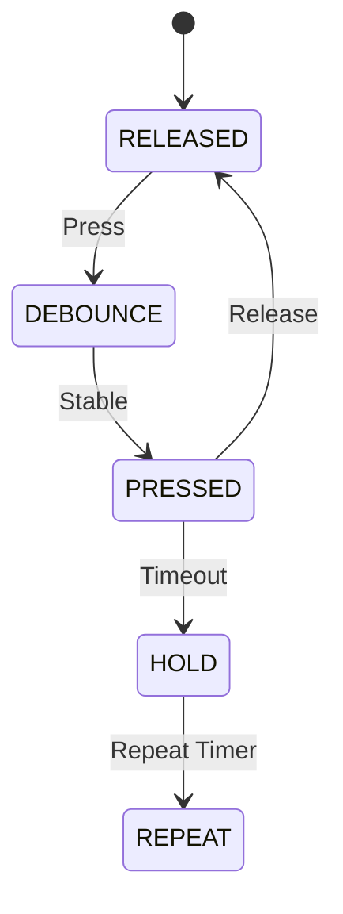

# Button Driver

## Overview

The button driver scans five tactile buttons using a small state machine and debounces changes without blocking. It emits compact event objects that can be consumed by the UI layer.

## State Machine

## Timing

- Debounce: 30 ms
- Hold: 800 ms
- Repeat: 150 ms

## Event Model

The driver uses a fixed-size event queue with five slots and emits:
- `BUTTON_SHORT_PRESS`
- `BUTTON_HOLD`
- `BUTTON_REPEAT`

## GPIO Handling

All reads are routed through the GPIO HAL with active-low logic for the buttons.
