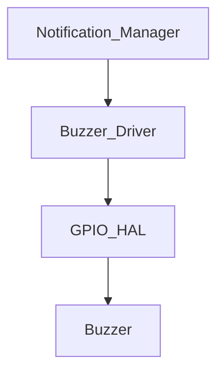

# Buzzer Driver

## Overview

The buzzer driver provides a small, non-blocking abstraction for generating beeps through the active-low buzzer pin. It exposes a simple pattern API that can be used by the notification layer.

## Architecture

## Patterns

Supported patterns:
- `BUZZER_SHORT`: 50 ms on / 50 ms off
- `BUZZER_DOUBLE`: 100 ms on / 100 ms off / 100 ms on
- `BUZZER_LONG`: 500 ms on
- `BUZZER_ERROR`: 200 ms on / 200 ms off, repeated 3 times

## Active-Low Logic

The hardware uses active-low signaling. The driver translates the logical on/off state to the physical GPIO state internally.
