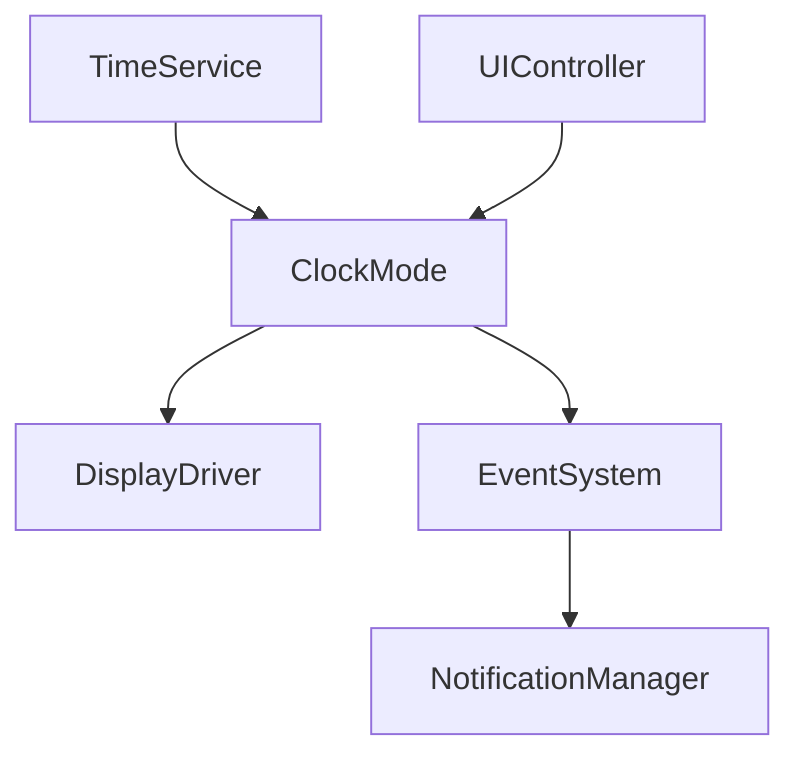
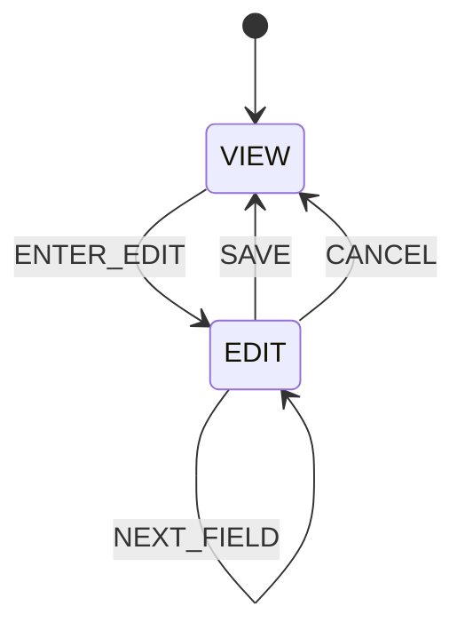

# Clock Mode

## Overview

Clock Mode is the primary time-display mode for the Operation Timer firmware. It follows the layered architecture and reads the current wall-clock time through `TimeService` instead of communicating directly with the DS3231 or hardware display drivers.

## Responsibilities

- Show the current time as `HH:MM:SS` in 24-hour format
- Keep the current time in the `TimeService` cache
- Allow edit mode with a temporary buffer
- Save changes only when the user confirms
- Keep RTC writes out of the mode logic itself
- Publish mode or UI events through the event system

## Architecture

## State machine

## Clock data flow

- The RTC is read by the RTC driver and synchronized in `TimeService`
- `ClockMode::update()` refreshes its local state from `TimeService`
- The display is refreshed only when data changes
- Edit actions update `editTime_` and write to the RTC only on save

## Edit behavior

The clock edit flow uses a temporary buffer:

- `HOUR`
- `MINUTE`
- `SECOND`

The system never writes the RTC on every button press. This avoids unnecessary I2C traffic and keeps the edit flow deterministic.

## RTC invalid handling

If the RTC is invalid, the clock mode displays a safe zeroed time and marks the state as invalid without touching hardware directly. Once the RTC becomes valid again, the mode refreshes and resumes normal display behavior.

## Constraints

The implementation follows the architecture constraints:

- No direct DS3231 access
- No direct button polling
- No direct GPIO access
- No `delay()` or `millis()` use
- No heap allocation
- No dynamic strings
- Display updates are protected by a dirty flag
