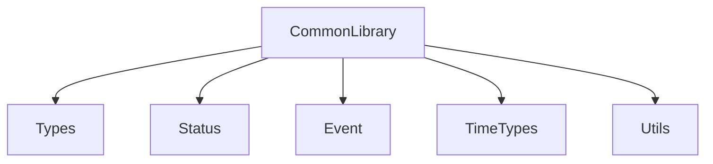

# Common Library

## Tujuan

Common Library adalah layer fondasi firmware Operation Timer. Modul ini menyediakan definisi tipe data, status, event, struktur waktu, konstanta, dan utility ringan yang dapat digunakan oleh application, service, driver, dan HAL.

## Struktur File

```text
src/common/
├── Types.h
├── Status.h
├── Event.h
├── TimeTypes.h
├── Constants.h
└── Utils.h
```

## API Ringkas

- `Types.h`: alias tipe data standar seperti `Byte`, `Word`, `DWord`
- `Status.h`: enum `StatusCode` untuk status antar modul
- `Event.h`: definisi `EventType`, `ButtonEvent`, dan `Event`
- `TimeTypes.h`: struktur `TimeValue`, `StopwatchValue`, `CountdownValue`
- `Constants.h`: konstanta firmware menggunakan `constexpr`
- `Utils.h`: fungsi `clampValue()` dan `isTimeValid()`

## Memory Usage

- Tidak menggunakan dynamic allocation
- Tidak menggunakan `String`, `std::vector`, atau `std::map`
- Struktur data dibuat tetap dan deterministik

## Example Usage

```cpp
#include "common/Utils.h"
#include "common/TimeTypes.h"

TimeValue time{12, 30, 45};
if (isTimeValid(time))
{
    uint8_t value = clampValue(5, 10, 20);
}
```

## Diagram


