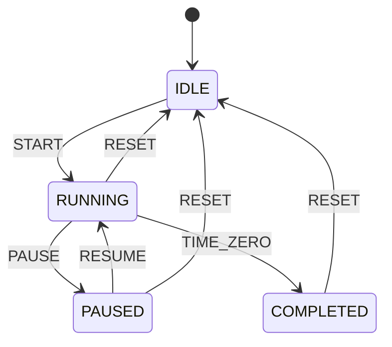

# Countdown Mode

## Overview

Countdown Mode implements a deterministic countdown based on monotonic elapsed time instead of scheduler invocation count. The countdown tracks a configured target in seconds and reduces remaining time until it reaches zero without relying on direct GPIO or RTC elapsed logic.

## State Machine



## Timing Rule

The countdown uses:

```text
remaining = configured - elapsed
```

with `elapsed` computed from monotonic timestamps. This prevents jitter and scheduler changes from changing the countdown duration.

## Display Format

The countdown displays time in `HH:MM:SS` form and writes a logical frame to the display driver. It does not access the hardware directly.

## Completion Behavior

When the remaining time reaches zero, the mode transitions to `COMPLETED` and emits a completion event for the notification layer to handle the buzzer and LED pattern.

## Safety Rules

- max range is `99:59:59` (`359999` seconds)
- zero is clamped to avoid unsigned underflow
- configuration changes while running are rejected
- RTC is not used as the countdown timer source
- direct hardware access is forbidden in this layer
- all timing logic remains non-blocking and heap-free
