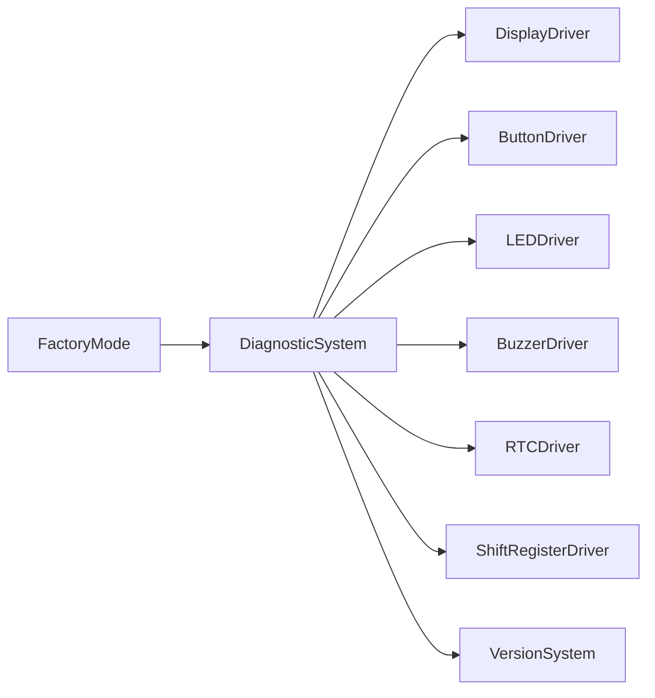
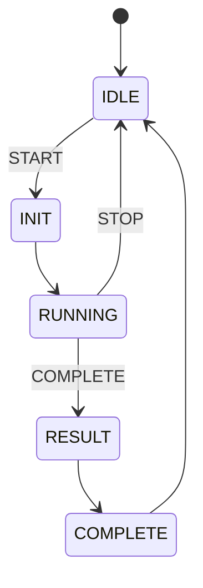

# Diagnostic System

## Purpose

The Diagnostic System provides a structured, non-blocking health check for the AVR firmware. It is intended for factory validation, maintenance checks, troubleshooting, and future service workflows without bypassing the existing driver and HAL abstraction layers.

## Architecture

The system sits above the hardware drivers and below the production workflow logic:



## Core Concepts

- DiagnosticId: identifies one diagnostic scope
- DiagnosticResult: PASS / FAIL / RUNNING / NOT_RUN / SKIPPED / TIMEOUT
- DiagnosticError: compact hardware or communication error taxonomy
- DiagnosticRecord: fixed-size outcome record with result, error, and detail
- DiagnosticState: explicit state machine for cooperative execution

## State Machine



## Scope

The current implementation covers:

- SYSTEM
- DISPLAY
- BUTTON
- LED
- BUZZER
- RTC
- SHIFT_REGISTER
- FIRMWARE

## Safety Rules

- No direct GPIO access from DiagnosticSystem
- No direct I2C register access from DiagnosticSystem
- No blocking delay loops
- No dynamic allocation
- No String usage
- No duplicate hardware driver implementations
- All runtime status uses existing abstraction layers

## Result Model

The system stores results in a fixed-size record array. Each diagnostic result is evaluated independently, and the overall result is derived as:

- FAIL when any required diagnostic fails
- RUNNING while a required diagnostic is still in progress
- NOT_RUN when required tests have not run yet
- PASS when all required diagnostics pass

## Factory Integration

The factory workflow can start a diagnostic with:

```cpp
diagnostic.start(ot::DiagnosticId::DISPLAY);
diagnostic.update();
```

Then it can read the result using:

```cpp
const auto status = diagnostic.result(ot::DiagnosticId::DISPLAY);
```

## Memory Strategy

This implementation prefers:

- fixed-size arrays
- enum class values
- uint8_t/uint16_t/uint32_t where appropriate
- pass-by-reference for object dependencies
- no STL containers

This keeps it compatible with the ATmega328P resource profile.

## Verification

The project build remains green with PlatformIO:

```bash
pio run
```

The firmware links successfully and the current build target remains successful.
