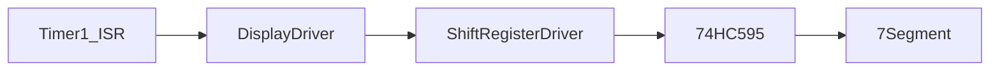

# Display Driver

## Overview

The display driver controls a 6-digit, common-anode 7-segment multiplex display using a pair of 74HC595 shift registers and an output-enable pin. The driver keeps a small front/back buffer so the application can update display content without causing visible glitches.

## Architecture

## Buffer Model

- The application writes into the back buffer.
- The ISR reads from the front buffer.
- A swap operation atomically exchanges the two buffers.

## Refresh Flow

The refresh path is driven by Timer1 and is designed to be:
- deterministic
- short
- free from blocking operations
- compatible with ISR usage

The ISR updates one digit at a time, disables the display temporarily, shifts out the segment data, latches, and re-enables the current digit.

## Digit Mapping

The driver uses a compact mapping where each digit position is represented by a bit mask in the second shift register chain.

## Colon Handling

The colon is driven through the control path and toggled by the application layer. The display driver accepts a boolean state and uses it during the refresh cycle.

## Notes

- The initial brightness implementation is fixed at 100%.
- The driver is written to stay within the AVR SRAM budget by using only two small 6-byte buffers.
- The ISR path does not use blocking calls such as delay(), millis(), or Serial operations.
