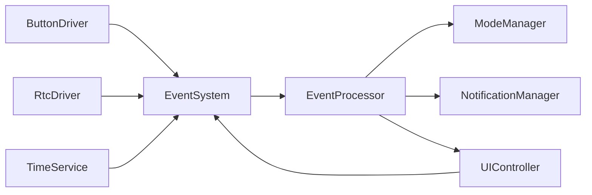
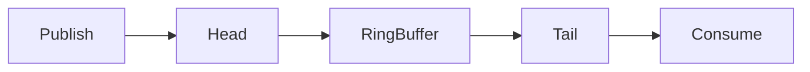

# Event System

## Overview

The event system provides a fixed-size FIFO queue for inter-module communication without introducing direct dependencies across layers.

## Architecture

## Queue Model

## Characteristics

- Fixed-size ring buffer
- FIFO ordering
- O(1) publish and consume
- No dynamic allocation
- Atomic protection for queue operations
- Overflow count available for diagnostics
