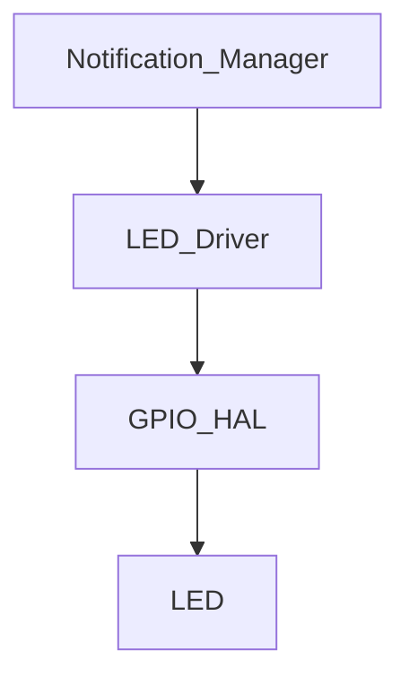

# LED Driver

## Overview

The LED driver provides a simple abstraction for controlling the power and tick indicators without using blocking delays. It uses a fixed-size state machine and a time-based blink engine.

## Architecture

## Active-Low Logic

The power LED uses active-low hardware behavior. The driver exposes logical `LED_ON` and `LED_OFF` states and translates them to the physical GPIO level internally.

## Patterns

Supported patterns:
- `LED_STEADY_OFF`
- `LED_STEADY_ON`
- `LED_BLINK_SLOW` (500 ms)
- `LED_BLINK_FAST` (100 ms)
- `LED_HEARTBEAT` (100 ms on / 900 ms off)

## Notes

The driver is intentionally simple and does not know about modes, timers, or application behavior. Those decisions remain with the notification layer.
