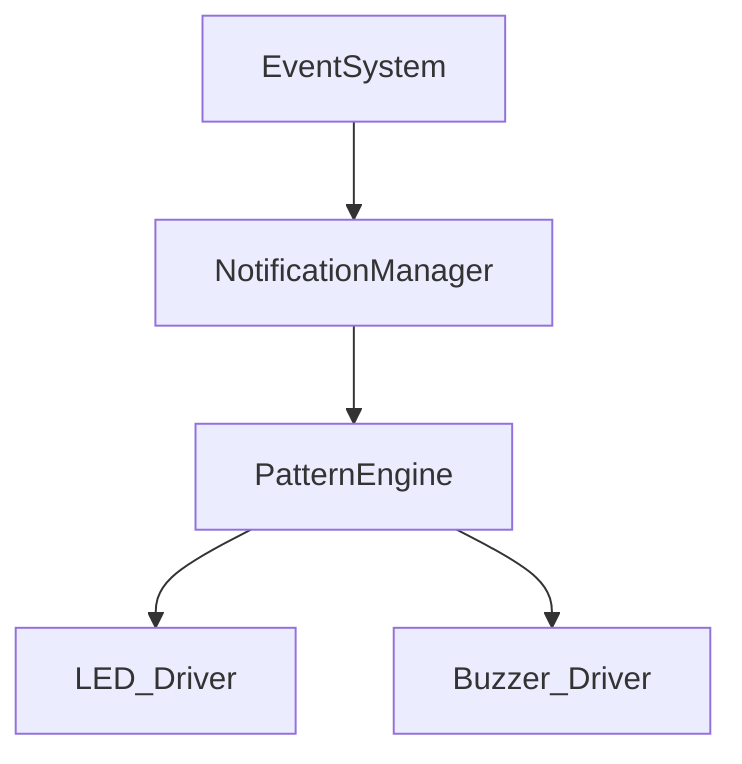
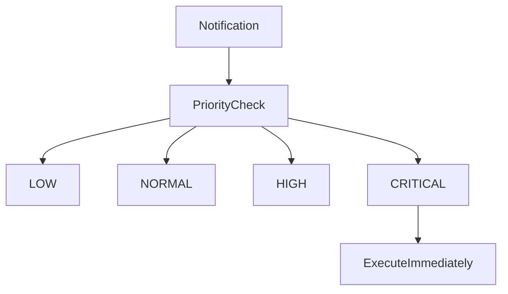
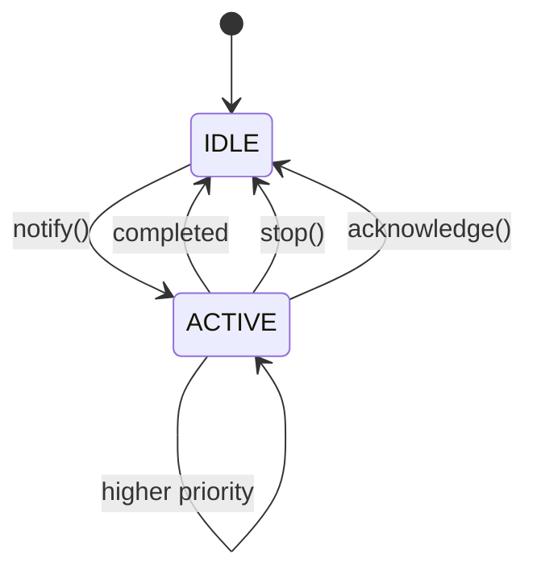

# Notification Manager

## Overview

Notification Manager is the firmware abstraction layer between application events and hardware output. It translates notification events into LED and buzzer patterns without exposing direct GPIO usage to higher layers.

## Architecture

## Priority model

## Lifecycle

## Pattern timing

Notification patterns are executed in fixed steps with scheduler-driven timing. Timing uses `uint32_t` delta logic to remain safe across rollover.

## Queue

The queue is fixed-size and ring-buffer based. It stores pending notifications without dynamic allocation.

## Persistent notifications

`TIMER_COMPLETE`, `ERROR`, and `SYSTEM_ERROR` may remain active until acknowledged or stopped.

## Hardware integration

The manager does not access raw pins, GPIO registers, or Arduino-level I/O. It only calls `LedDriver` and `BuzzerDriver` APIs.
