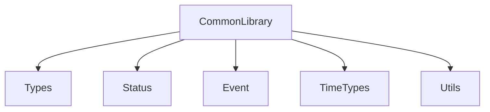

# PROMPT_01_Common_Library.md

# Vibe Coding Prompt
# Module: Common Library

---

Anda adalah Senior Embedded Firmware Engineer yang bertanggung jawab mengimplementasikan firmware production-grade untuk project:

# Operation Timer Embedded System

Target hardware:

- Arduino Nano
- ATmega328P
- Clock 16 MHz
- Flash 32 KB
- SRAM 2 KB
- PlatformIO
- Arduino Framework
- Embedded C++

---

# Task

Implementasikan modul:

```text
Common Library
```

Modul ini adalah fondasi paling dasar firmware dan akan digunakan oleh seluruh modul:

```text
Application Layer
|
Service Layer
|
Driver Layer
|
HAL Layer
|
Common Library
```

Common Library tidak boleh bergantung kepada modul lain.

---

# Objective

Buat library umum yang menyediakan:

1. Basic data type
2. System status
3. Event definition
4. Time data structure
5. Firmware constants
6. Lightweight utility function

Prioritas utama:

- hemat SRAM
- hemat flash
- deterministic execution
- mudah digunakan oleh module lain

---

# Mandatory Coding Rules

## Memory Optimization

Arduino Nano memiliki SRAM hanya:

```text
2048 byte
```

Maka wajib:

- Gunakan static allocation.
- Jangan gunakan dynamic memory.
- Hindari object copy.
- Gunakan passing by reference.
- Gunakan const reference untuk parameter read-only.

Dilarang:

```cpp
new
delete
malloc()
free()
String
std::vector
std::map
```

---

# Passing Reference Rule

Semua object atau struct harus menggunakan reference.

Contoh benar:

```cpp
void update(const TimeValue &time);
```

Contoh salah:

```cpp
void update(TimeValue time);
```

---

# Folder Structure

Buat:

```text
src/

└── common/

    ├── Types.h

    ├── Status.h

    ├── Event.h

    ├── TimeTypes.h

    ├── Constants.h

    └── Utils.h
```

---

# File Implementation Requirement

## 1. Types.h

Tujuan:

Menyediakan alias tipe data dengan ukuran pasti.

Gunakan:

```cpp
uint8_t
uint16_t
uint32_t
int8_t
int16_t
int32_t
```

Implementasikan:

```cpp
using Byte = uint8_t;
using Word = uint16_t;
using DWord = uint32_t;
```

Tambahkan:

```cpp
#pragma once
#include <stdint.h>
```

---

## 2. Status.h

Buat enum standard untuk komunikasi antar module.

Implementasikan:

```cpp
enum class StatusCode : uint8_t
{
    OK = 0,

    ERROR,

    INVALID_PARAMETER,

    NOT_READY,

    TIMEOUT,

    BUSY
};
```

Requirement:

- Ukuran enum harus 1 byte.
- Tidak menggunakan integer default.

---

## 3. Event.h

Buat sistem event dasar.

Event digunakan untuk komunikasi:

```text
Button
 |
 v
Event Queue
 |
 v
Application
```

Buat:

```cpp
enum class EventType : uint8_t
{
    NONE = 0,

    BUTTON,

    TIMER,

    RTC,

    DISPLAY,

    SYSTEM,

    ALARM
};
```

Buat button event:

```cpp
enum class ButtonEvent : uint8_t
{
    NONE = 0,

    POWER_SHORT,
    POWER_HOLD,

    NEXT_SHORT,
    NEXT_HOLD,

    SELECT_SHORT,
    SELECT_HOLD,

    UP_SHORT,
    UP_HOLD,

    DOWN_SHORT,
    DOWN_HOLD
};
```

Buat:

```cpp
struct Event
{
    EventType type;

    uint16_t code;

    uint32_t timestamp;
};
```

Pastikan:

```cpp
sizeof(Event) <= 8 byte
```

Jika tidak tercapai, optimasikan struktur.

---

## 4. TimeTypes.h

Buat struktur waktu yang digunakan oleh:

- Clock Mode
- Stopwatch Mode
- Countdown Mode

Implementasikan:

```cpp
struct TimeValue
{
    uint8_t hour;

    uint8_t minute;

    uint8_t second;
};
```

Tambahkan:

```cpp
struct StopwatchValue
{
    uint8_t hour;

    uint8_t minute;

    uint8_t second;
};
```

Tambahkan:

```cpp
struct CountdownValue
{
    uint8_t hour;

    uint8_t minute;

    uint8_t second;
};
```

Range:

Clock:

```text
00:00:00
-
23:59:59
```

Stopwatch:

```text
00:00:00
-
99:99:99
```

Countdown:

```text
99:99:99
-
00:00:00
```

---

## 5. Constants.h

Buat seluruh constant firmware.

Gunakan:

```cpp
constexpr
```

Jangan gunakan:

```cpp
#define
```

Tambahkan:

```cpp
constexpr uint8_t MAX_DISPLAY_DIGIT = 6;

constexpr uint8_t BUTTON_COUNT = 5;

constexpr uint8_t EVENT_QUEUE_SIZE = 16;
```

Tambahkan konfigurasi:

```cpp
constexpr uint16_t BUTTON_DEBOUNCE_MS = 20;

constexpr uint16_t BUTTON_HOLD_MS = 800;

constexpr uint16_t BUTTON_REPEAT_MS = 150;
```

---

## 6. Utils.h

Buat utility function sederhana.

Tidak boleh memiliki dependency hardware.

Implementasikan minimal:

### clampValue()

Contoh:

```cpp
uint8_t clampValue(uint8_t value, uint8_t minValue, uint8_t maxValue);
```

Fungsi:

Jika:

```text
value < min
```

return:

```text
min
```

Jika:

```text
value > max
```

return:

```text
max
```

Tambahkan helper:

```cpp
bool isTimeValid(const TimeValue &time);
```

Untuk validasi:

- hour
- minute
- second

---

# Header Rule

Semua header:

Gunakan:

```cpp
#pragma once
```

---

# Include Rule

Gunakan include minimal:

```cpp
#include <stdint.h>
```

Jangan include:

```cpp
Arduino.h
```

karena Common Library harus independen.

---

# Coding Style

Gunakan:

Class:

```text
PascalCase
```

Function:

```text
camelCase
```

Variable:

```text
camelCase
```

Constant:

```text
UPPER_CASE
```

---

# Testing Requirement

Buat unit test:

```text
test/common/
```

Test minimal:

## Test 1

StatusCode

Pastikan:

```cpp
OK
ERROR
BUSY
```

berfungsi.

---

## Test 2

Event

Check:

```cpp
sizeof(Event)
```

Target:

```text
<= 8 byte
```

---

## Test 3

Time Validation

Test:

Valid:

```text
12:30:45
```

Invalid:

```text
99:99:99
```

---

## Test 4

Clamp Function

Test:

Input:

```text
below minimum

normal

above maximum
```

---

# Documentation Requirement

Setelah implementasi selesai update:

```text
docs/Common_Library.md
```

Berisi:

- Tujuan modul
- Struktur file
- API reference
- Memory usage
- Example usage

Tambahkan diagram Mermaid:



---

# Expected Output

Berikan hasil:

1. Semua file `.h` selesai.
2. Unit test tersedia.
3. Tidak ada dynamic allocation.
4. Tidak ada warning compiler.
5. Memory usage report.
6. Contoh penggunaan oleh module lain.

---

# Before Finish Checklist

Pastikan:

[ ] PlatformIO compile sukses

[ ] Tidak memakai String

[ ] Tidak memakai malloc/new/delete

[ ] Semua parameter struct menggunakan reference

[ ] Tidak ada dependency hardware

[ ] SRAM usage optimal

[ ] Dokumentasi diperbarui

# End Task
```
