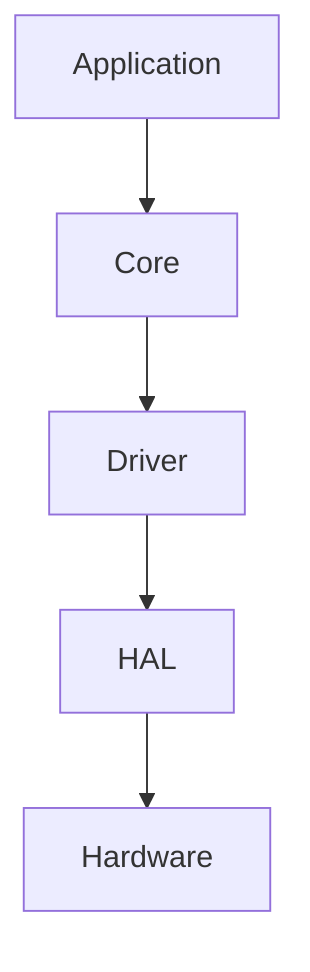

# Operation Timer

> Professional Embedded Operation Timer for Operating Room (OR)


---

# Overview

Operation Timer adalah perangkat timer digital berbasis **Arduino Nano (ATmega328P)** yang dirancang khusus untuk kebutuhan **Operating Room (OR)**.

Firmware dikembangkan dengan pendekatan **modular**, **event-driven**, dan **non-blocking**, sehingga mudah dipelihara, dikembangkan, dan siap digunakan untuk operasi jangka panjang (24/7).

---

# Features

## Clock

- 24-Hour Format
- RTC DS3231
- Automatic Time Synchronization
- 1 Hz Update

---

## Stopwatch

Range

```
00:00:00
↓

99:99:99
```

Features

- Start
- Pause
- Resume
- Reset

---

## Countdown

Range

```
99:99:99
↓

00:00:00
```

Features

- Set Time
- Start
- Pause
- Resume
- Stop
- Finish Alarm

---

## User Interface

Input

- Power Button
- Next Button
- Select Button
- Up Button
- Down Button

Button Event

- Short Press
- Hold
- Auto Repeat

Output

- 6 Digit 7-Segment Display
- Power LED
- Active Low Buzzer

---

# Hardware

## Controller Board

- Arduino Nano
- DS3231 RTC Module
- 5 Push Button
- Active Low Buzzer
- Active Low Power LED
- 12V → 5V Buck Converter

---

## Display Board

- 6 Digit 2.3" 7-Segment Common Anode
- 74HC595 ×2
- ULN2803
- BC547C
- S8550
- Colon / Tick LED
- 12V → 5V Buck Converter

---

# Display Architecture

- 6 Digit
- Common Anode
- Multiplex Display
- Daisy Chain Shift Register

```
74HC595 #1

↓

Segment Driver

↓

ULN2803

↓

7 Segment


74HC595 #2

↓

Digit Driver

↓

BC547C + S8550

↓

Digit Selection
```

---

# Firmware Architecture

```
Application
│
├── Clock
├── Stopwatch
├── Countdown
│
Core
│
├── Scheduler
├── Event Queue
├── Software Timer
│
Driver
│
├── Display
├── RTC
├── Button
├── Buzzer
├── LED
│
HAL
│
├── GPIO
├── Timer
├── Wire
└── Shift Register
```

Firmware menggunakan:

- Event Driven
- Cooperative Scheduler
- Finite State Machine (FSM)
- Modular Design

---

# Development Environment

| Item | Value |
|------|--------|
| IDE | Visual Studio Code |
| Extension | PlatformIO |
| Framework | Arduino |
| Language | C++17 |
| Target MCU | ATmega328P |
| Build System | PlatformIO |

---

# Project Structure

```
operation-timer/

docs/

include/

lib/

src/

test/

tools/

platformio.ini
```

Dokumentasi lengkap tersedia pada folder **docs/**.

---

# Documentation

| File | Description |
|------|-------------|
| 00_Project_Overview.md | Project Overview |
| 01_System_Requirements.md | Functional Requirements |
| 02_Hardware_Architecture.md | Hardware Design |
| 03_Pin_Mapping.md | Pin Mapping |
| 04_Display_Driver.md | Display Driver |
| 05_Button_System.md | Button FSM |
| 06_Mode_Manager.md | Application Mode |
| 07_RTC_System.md | RTC System |
| 08_Buzzer_LED.md | Buzzer & LED |
| 09_Firmware_Architecture.md | Firmware Architecture |
| 10_Coding_Standard.md | Coding Standard |
| 11_Project_Structure.md | Project Structure |
| 12_Testing_Checklist.md | Validation Checklist |
| 13_UI_UX_Specification.md | User Interface Specification |
| 14_Manufacturing_BOM.md | Bill of Materials |
| 15_Production_Guide.md | Production Guide |
| 16_Firmware_Versioning.md | Firmware Versioning |

---

# Design Principles

Firmware mengikuti prinsip berikut:

- Non Blocking
- Event Driven
- Modular
- Low Memory Usage
- Reusable Driver
- Layered Architecture
- Production Ready
- Easy Maintenance
- Deterministic Timing

---

# Coding Standard

Firmware wajib memenuhi aturan berikut.

- Tidak menggunakan `delay()`
- Tidak menggunakan `String`
- Tidak menggunakan Dynamic Memory
- Menggunakan `enum class`
- Menggunakan `constexpr`
- Menggunakan `const` sebanyak mungkin
- Menggunakan Passing by Reference untuk object > 4 Byte
- Menggunakan Passing by Value untuk tipe data ≤ 4 Byte
- Seluruh string literal menggunakan `PROGMEM`
- Driver tidak boleh bergantung pada Application Layer

---

# Versioning

Firmware menggunakan Semantic Versioning.

```
MAJOR.MINOR.PATCH+BUILD
```

Contoh

```
1.0.0+0001
```

Informasi firmware disimpan pada

```
Version.h
```

---

# Documentation Style

Seluruh dokumentasi menggunakan Markdown.

Diagram menggunakan Mermaid agar dapat ditampilkan langsung pada:

- GitHub
- Visual Studio Code
- Markdown Preview

---

# Development Workflow


---

# Firmware Layer



---

# Project Status

Current Status

```
Development
```

Current Version

```
1.0.0
```

Hardware Revision

```
Rev A
```

---

# License

Internal Project

Copyright © Operation Timer Project

All Rights Reserved.