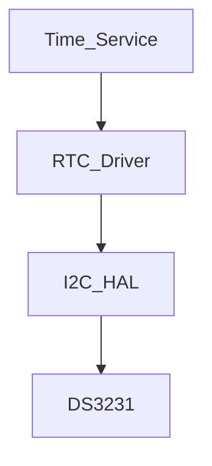

# RTC Driver

## Overview

The RTC driver provides a small, fixed-size abstraction over the DS3231 real-time clock using the existing I2C HAL. It exposes a simple API for reading and writing time values and performs basic validation before writes.

## Architecture

## Register Handling

The driver uses the DS3231 time registers from 0x00 to 0x06 and reads the status register at 0x0F.

## Time Format

The implementation uses 24-hour format and converts data between decimal and BCD representation.

## Validation

The driver validates hour, minute, second, date, month, and day before writing to the RTC. Invalid inputs return `StatusCode::INVALID_PARAMETER`.

## Error Handling

The driver reports:
- `StatusCode::OK` for successful operations
- `StatusCode::ERROR` for I2C transfer issues
- `StatusCode::INVALID_PARAMETER` for invalid time values
- `StatusCode::NOT_READY` when the oscillator stop flag is active or initialization failed
