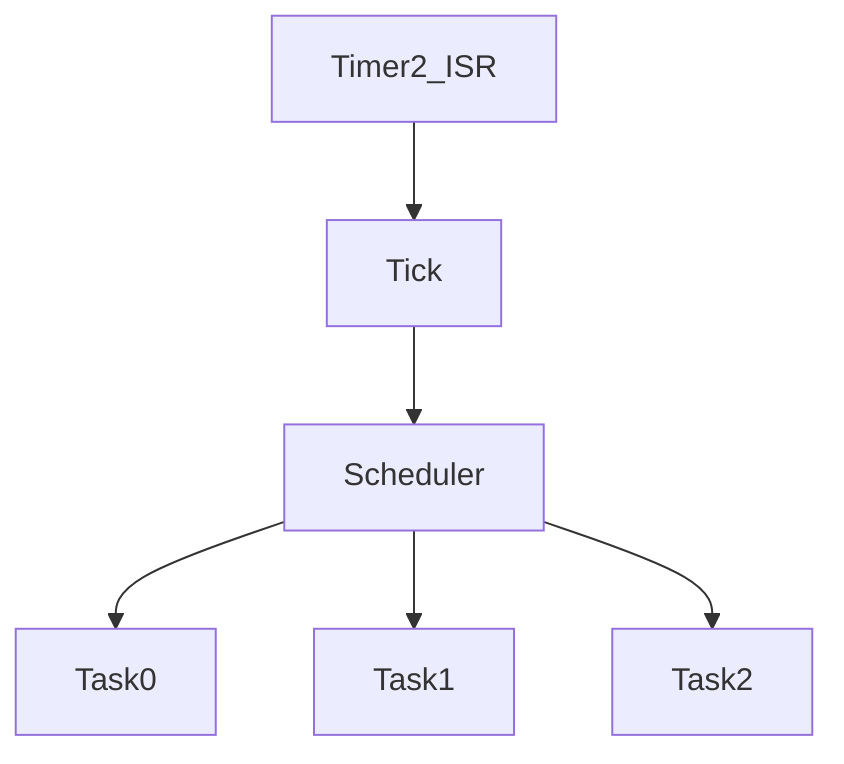

# Scheduler

## Overview

The scheduler is a lightweight cooperative scheduler for the AVR firmware. It uses Timer2 to generate a 1 ms tick and runs tasks in a fixed priority order.

## Architecture

## Timing Model

- Tick source: Timer2 compare match
- Tick period: 1 ms
- Task execution is cooperative and non-blocking
- The scheduler uses a fixed task table with a maximum of 16 entries

## Task Registration

Tasks are registered with a period in milliseconds and a callback. The scheduler checks each enabled task and executes it when its next run time has arrived.
