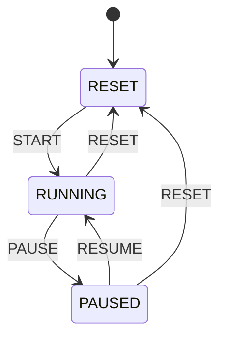
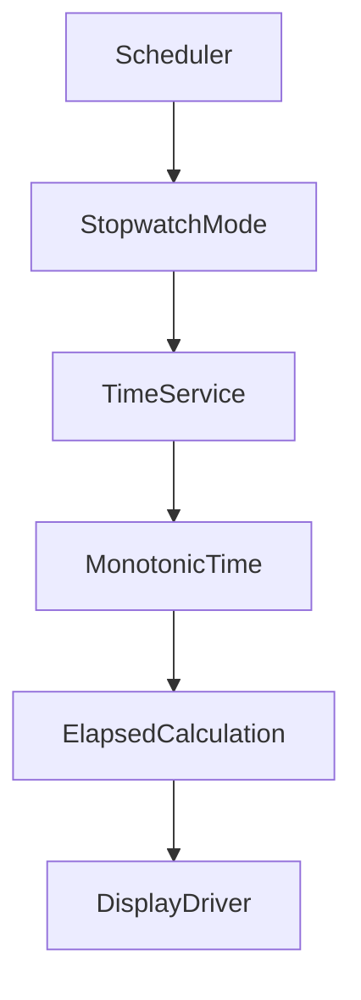

# Stopwatch Mode

## Overview

Stopwatch Mode measures elapsed time using a monotonic time source instead of relying on `update()` call counts. The timing model is based on a `TimeService` monotonic timestamp, so it remains deterministic even when the scheduler tick rate changes.

## State machine

## Timing architecture

## Core rule

The stopwatch computes elapsed time from timestamp differences rather than incrementing a counter on every `update()` call. This keeps the measurement independent from the scheduler frequency and avoids time drift.

## Range and limits

- Minimum: `00:00:00`
- Maximum: `99:59:59`
- Overflow is clamped at the maximum value
- No reset of RTC or wall clock occurs on stopwatch operations

## Display

The stopwatch renders time in `HH:MM:SS` format and writes the logical frame to the display driver without touching hardware directly.
