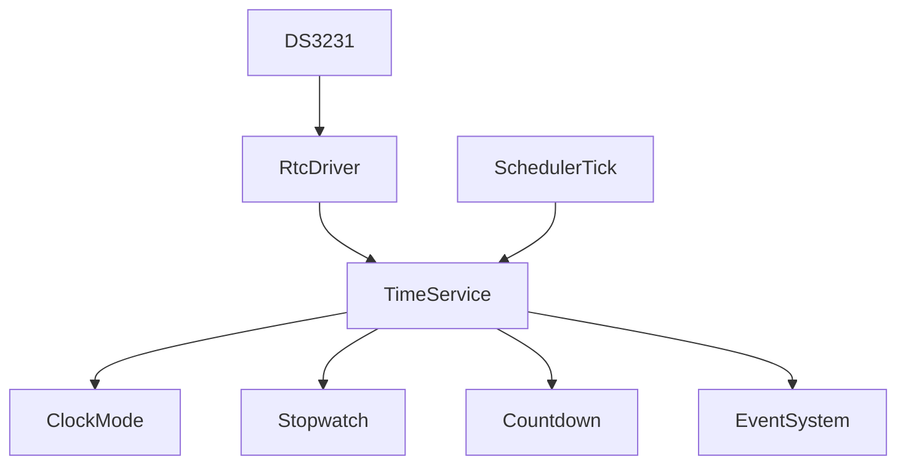

# Time Service

## Overview

The firmware time domain is split into two layers:

- wall clock from the DS3231 RTC
- monotonic elapsed time from the scheduler system tick

This separation keeps stopwatch and countdown timing stable even when the RTC time is changed or the RTC temporarily loses power.

## Architecture

## Wall clock

The wall clock is cached inside Time Service after a successful RTC read. Reads from the RTC should happen at most once per second from the scheduler task, not from ISR or UI code.

## Monotonic time

Stopwatch and countdown use `Scheduler::tick()` as their source of truth. This is a monotonic millisecond counter, so it cannot regress during RTC adjustments.

## Event generation

Time Service publishes:

- `SECOND_TICK`
- `TIMER_STOP`

through the Event System. It never directly drives display, LED, buzzer, or mode logic.

## Stopwatch behavior

- timer starts from zero
- pause keeps accumulated elapsed time
- resume continues from the paused value
- completion clamps at `99:59:59`
- no RTC dependency

## Countdown behavior

- countdown is set by `TimeValue`
- time decreases using scheduler tick delta
- completion emits `TIMER_STOP`
- remaining time never underflows below zero

## Timing rules

- no `millis()` usage in the time service
- no `delay()` usage
- no heap allocation
- fixed-size structures only
- update() is scheduler-driven and non-blocking

## API summary

- `begin()`
- `update()`
- `setDateTime()`
- `getDateTime()`
- `stopwatchStart()` / `stopwatchPause()` / `stopwatchStop()` / `stopwatchReset()`
- `countdownSet()` / `countdownStart()` / `countdownPause()` / `countdownStop()` / `countdownReset()`
- `nowMs()`
- `isRtcValid()`
