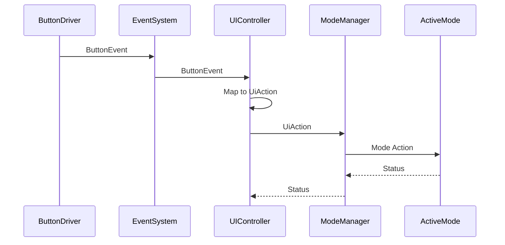
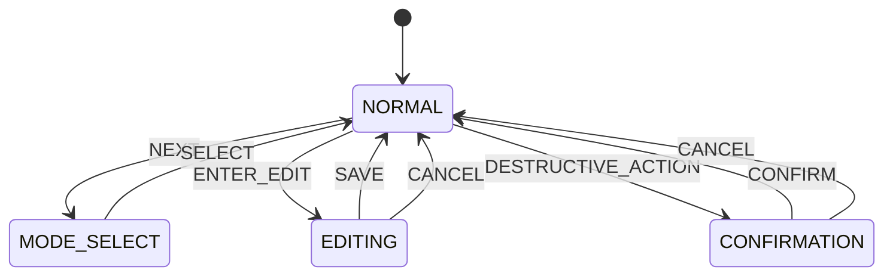

# UI Controller

## Overview

UI Controller is the translation layer between physical button events and the application-level action model. Its job is to interpret inputs in the current mode and context, then dispatch a semantic action through `ModeManager` without touching hardware or business logic directly.

## Event Flow

## State Model

## Responsibilities

- accept events from `EventSystem`
- map button events to semantic `UiAction`
- route global actions through `ModeManager`
- preserve the current UI context
- keep app logic separated from input hardware
- avoid direct GPIO, debounce, and display access

## Action Mapping

- `POWER` -> `POWER_TOGGLE`
- `NEXT` -> `NEXT_MODE` in normal context, `NEXT_FIELD` in editing context
- `SELECT` -> `SELECT`
- `UP` -> `UP`
- `DOWN` -> `DOWN`
- repeat events -> `UP_REPEAT` / `DOWN_REPEAT`

## Boundary Rules

- `ButtonDriver` owns debounce and raw input handling.
- `EventSystem` owns queueing and event delivery.
- `UIController` owns translation and dispatch.
- `ModeManager` owns mode transitions.
- mode implementations own business logic and arithmetic.
