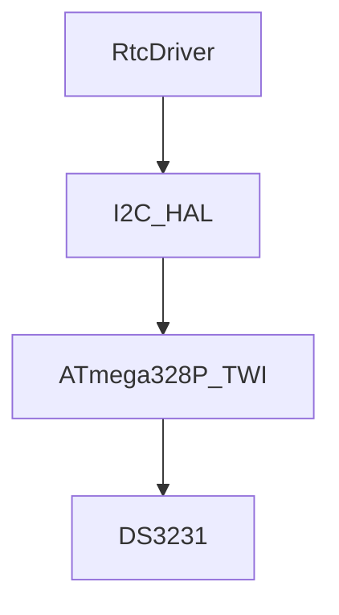

# Module Implementation: I2C HAL


Anda adalah **Senior Embedded Firmware Engineer** yang bertanggung jawab membuat firmware production-grade untuk project:

# Operation Timer Embedded System


Target platform:

- PlatformIO
- Arduino Framework
- Arduino Nano
- ATmega328P
- Embedded C++


---

# Task

Implementasikan modul:

```

I2C Hardware Abstraction Layer (I2C HAL)

```

Modul ini bertanggung jawab menyediakan interface komunikasi I2C low level untuk seluruh firmware.

Primary consumer:

```

RTC Driver
|
v
I2C HAL
|
v
ATmega328P TWI Peripheral

```


---

# Objective

Menyediakan komunikasi I2C yang:

- stabil
- deterministic
- mudah digunakan driver
- tidak bergantung kepada library eksternal
- hemat resource


I2C HAL harus menyediakan:

1. Bus initialization
2. Device write
3. Device read
4. Register read/write
5. Error handling


---

# Architecture Position


I2C HAL berada pada layer:


```

Application Layer

```
    |
```

Service Layer

```
    |
```

Driver Layer

```
    |
```

I2C HAL

```
    |
```

ATmega328P TWI Hardware

````


Rule:

Module di atas I2C HAL tidak boleh menggunakan:

```cpp
Wire.h
````

langsung.

Semua komunikasi I2C harus melalui:

```
I2C HAL
```

---

# Hardware Target

MCU:

```
ATmega328P
```

Clock:

```
16 MHz
```

I2C Pin:

| Pin | Function |
| --- | -------- |
| A4  | SDA      |
| A5  | SCL      |

---

# I2C Device

Primary device:

```
DS3231 RTC Module
```

Address:

```
0x68
```

---

# I2C Configuration

Default:

Speed:

```
400 kHz
```

Fast Mode.

Jika bus tidak stabil:

fallback:

```
100 kHz
```

---

# Folder Structure

Buat:

```
src/

└── hal/

    ├── GpioHal.h

    ├── TimerHal.h

    ├── I2cHal.h

    └── I2cHal.cpp
```

---

# Dependency Rule

I2C HAL boleh menggunakan:

```cpp
stdint.h

Arduino.h

Wire.h

common/Status.h
```

Tidak boleh menggunakan:

```
RtcDriver

TimeService

Application

Scheduler

ModeManager
```

---

# Memory Rule

Target MCU:

```
SRAM:
2048 byte
```

WAJIB:

* static buffer
* fixed size array
* no heap allocation
* passing by reference

Dilarang:

```cpp
new

delete

malloc()

free()

String

std::vector

std::string
```

---

# Buffer Requirement

Jangan membuat buffer besar.

Maximum buffer:

```
32 byte
```

Contoh:

```cpp
uint8_t buffer[32];
```

Tidak diperbolehkan:

```cpp
uint8_t buffer[256];
```

---

# API Design

Buat:

```cpp
class I2cHal
{

public:

    StatusCode begin();


    StatusCode write(
        uint8_t deviceAddress,
        const uint8_t *data,
        uint8_t length
    );


    StatusCode read(
        uint8_t deviceAddress,
        uint8_t *data,
        uint8_t length
    );


    StatusCode writeRegister(
        uint8_t deviceAddress,
        uint8_t reg,
        uint8_t value
    );


    StatusCode readRegister(
        uint8_t deviceAddress,
        uint8_t reg,
        uint8_t &value
    );

};
```

---

# Passing Reference Rule

Untuk parameter data:

Read:

Benar:

```cpp
StatusCode read(
    uint8_t address,
    uint8_t *buffer,
    uint8_t length
);
```

Untuk object:

Benar:

```cpp
void process(
    const Data &data
);
```

Salah:

```cpp
void process(
    Data data
);
```

---

# Implementation Requirement

## begin()

Melakukan:

* inisialisasi Wire
* set clock
* prepare bus

Contoh:

```cpp
Wire.begin();

Wire.setClock(400000);
```

Return:

```cpp
StatusCode::OK
```

---

# write()

Fungsi:

Mengirim data ke device.

Flow:

```
START

 |

Device Address

 |

Data

 |

STOP
```

Error:

Jika:

* device tidak acknowledge
* bus error

Return:

```
StatusCode::ERROR
```

---

# read()

Fungsi:

Membaca data dari device.

Flow:

```
START

 |

Device Address

 |

Read Request

 |

Receive Data

 |

STOP
```

---

# Register Access

Karena DS3231 menggunakan register:

Implementasikan:

## writeRegister()

Contoh:

```
DS3231 Register

0x0E

Control Register
```

Flow:

```
START

Device Address

Register Address

Value

STOP
```

---

## readRegister()

Flow:

```
START

Device Address

Register Address

RESTART

Read Data

STOP
```

---

# Error Handling

Gunakan:

```cpp
StatusCode
```

Dari:

```
Common Library
```

Return:

| Condition         | Return            |
| ----------------- | ----------------- |
| Success           | OK                |
| No ACK            | ERROR             |
| Invalid parameter | INVALID_PARAMETER |
| Bus busy          | BUSY              |

---

# Timeout Protection

I2C tidak boleh blocking tanpa batas.

Tambahkan:

```
I2C_TIMEOUT_MS
```

Contoh:

```cpp
constexpr uint16_t I2C_TIMEOUT_MS = 100;
```

Jika timeout:

return:

```
StatusCode::TIMEOUT
```

---

# Blocking Rule

I2C HAL boleh blocking sebentar.

Maximum:

```
< 5 ms
```

Tidak boleh:

```
while(true)

infinite loop

delay()
```

---

# Interrupt Rule

I2C HAL tidak boleh digunakan dari ISR.

Dilarang:

```
Timer ISR

Display ISR

GPIO ISR

    |
    v

I2C transaction
```

Alasan:

Wire library tidak ISR safe.

---

# Coding Standard

Class:

```
PascalCase
```

Example:

```
I2cHal
```

Function:

```
camelCase
```

Example:

```
readRegister()
```

Variable:

```
camelCase
```

Constant:

```
UPPER_CASE
```

---

# Unit Test

Buat:

```
test/hal/i2c/
```

---

# Test 1

Initialization

Verify:

* SDA initialized
* SCL initialized
* clock configured

---

# Test 2

Device Detection

Scan:

```
0x68
```

Expected:

```
DS3231 detected
```

---

# Test 3

Register Write

Write:

```
Register:
0x0E

Value:
0x00
```

Verify:

data terkirim.

---

# Test 4

Register Read

Read:

```
Register:
0x0E
```

Verify:

nilai benar.

---

# Test 5

Error Handling

Simulasikan:

* device disconnect
* no ACK
* timeout

Expected:

```
StatusCode::ERROR

atau

StatusCode::TIMEOUT
```

---

# Documentation Update

Buat:

```
docs/I2C_HAL.md
```

Berisi:

* I2C architecture
* pin mapping
* DS3231 communication
* API
* error handling
* timing

Tambahkan Mermaid:



---

# Memory Budget

Target:

| Resource |     Limit |
| -------- | --------: |
| Flash    |      <2KB |
| SRAM     | <100 byte |
| Buffer   | <=32 byte |

---

# Output Requirement

Berikan:

1. File:

```
src/hal/I2cHal.h
```

2. File:

```
src/hal/I2cHal.cpp
```

3. DS3231 communication example.

4. Unit test.

5. Memory usage report.

6. Documentation.

---

# Final Checklist

Sebelum selesai:

* [ ] I2C menggunakan Wire hanya di HAL
* [ ] Driver tidak mengakses Wire langsung
* [ ] Address DS3231 0x68
* [ ] SDA=A4
* [ ] SCL=A5
* [ ] Timeout protection tersedia
* [ ] Tidak ada infinite loop
* [ ] Tidak menggunakan dynamic memory
* [ ] Passing reference diterapkan
* [ ] Compile PlatformIO berhasil
* [ ] Dokumentasi selesai
