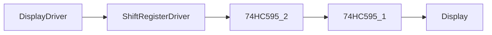

# Module Implementation: Shift Register Driver


Anda adalah **Senior Embedded Firmware Engineer** yang bertanggung jawab membuat firmware production-grade untuk project:

# Operation Timer Embedded System


Target platform:

- PlatformIO
- Arduino Framework
- Arduino Nano
- ATmega328P
- Embedded C++


---

# Task

Implementasikan modul:

```

74HC595 Shift Register Driver

```

Modul ini bertanggung jawab mengontrol IC shift register:

- 74HC595 #1 → Segment Output
- 74HC595 #2 → Digit Selection + Colon/Tick


Driver ini menjadi layer dasar untuk:

```

Display Driver
|
v
Shift Register Driver
|
v
74HC595
|
v
7 Segment Display

```


---

# Objective

Membuat driver shift register yang:

- cepat
- deterministic
- non blocking
- mendukung multiplex display
- hemat memory
- dapat dipanggil dari Display ISR


---

# Hardware Configuration


## Shift Register Chain


Konfigurasi:


```

Arduino Nano

DATA
D11
|
|
v

74HC595 #1

|
|
v

74HC595 #2

```


Daisy chain:

```

DATA -> SER

QH' #1 -> SER #2

```


---

# Pin Mapping


Gunakan:

|Signal|Arduino|
|-|-|
|DATA|D11|
|CLOCK|D13|
|LATCH|D10|
|OE|D9|


---

# 74HC595 #1

Digunakan untuk:

```

Segment Control

```


Mapping:


```

QB -> ULN2803 I7
QC -> ULN2803 I6
QD -> ULN2803 I5
QE -> ULN2803 I4
QF -> ULN2803 I3
QG -> ULN2803 I2
QH -> ULN2803 I1

```


ULN2803:


```

O1 = E

O2 = D

O3 = C

O4 = G

O5 = F

O6 = A

O7 = B

```


---

# 74HC595 #2


Digunakan untuk:


```

Digit Selection
Colon / Tick

```


Mapping:


```

QB = Digit 6 (Second Unit)

QC = Digit 5

QD = Digit 4

QE = Digit 3

QF = Colon / Tick

QG = Digit 2

QH = Digit 1 (Hour Tens)

```


---

# Display Hardware


Type:


```

7 Segment 2.3 inch

Common Anode

```


Karakteristik:


- Segment aktif LOW
- Digit aktif HIGH melalui transistor


---

# Architecture Position


Shift Register Driver berada pada:


```

Application

|

Display Driver

|

Shift Register Driver

|

GPIO HAL

|

74HC595 Hardware

````


---

# Dependency Rule


Boleh menggunakan:


```cpp
stdint.h

common/Status.h

hal/GpioHal.h
````

Tidak boleh:

```cpp
DisplayDriver

Scheduler

ModeManager

RTC

Button
```

---

# Memory Constraint

ATmega328P:

```
SRAM:
2KB
```

Wajib:

* static allocation
* fixed buffer
* no heap

Dilarang:

```cpp
new

delete

malloc()

free()

String

std::vector
```

---

# Folder Structure

Buat:

```
src/

└── drivers/

    ├── ShiftRegisterDriver.h

    └── ShiftRegisterDriver.cpp
```

---

# API Design

Implementasikan:

```cpp
class ShiftRegisterDriver
{

public:


    StatusCode begin();


    void shiftOut(
        uint8_t segmentData,
        uint8_t digitData
    );


    void latch();


    void setOutputEnable(
        bool enable
    );


};
```

---

# Implementation Rule

## begin()

Melakukan:

* konfigurasi pin
* reset output
* disable display sementara

Initial state:

```
OE = HIGH

Display OFF
```

---

# Shift Data Method

Implementasikan:

```cpp
void shiftOut(
    uint8_t segmentData,
    uint8_t digitData
);
```

Urutan pengiriman:

Karena daisy chain:

```
Second IC data

dikirim terlebih dahulu


kemudian

First IC data
```

Maka:

```
shiftOut(digitData)

shiftOut(segmentData)
```

---

# Timing Requirement

Clock:

```
D13
```

Buat manual shift:

```
DATA

CLOCK LOW

CLOCK HIGH
```

Tidak menggunakan:

```
SPI library
```

Alasan:

* pin SPI digunakan bersama kebutuhan lain
* kontrol timing multiplex harus deterministic

---

# Latch Control

Setelah 16 bit selesai:

Sequence:

```
LATCH LOW

shift 16 bit

LATCH HIGH
```

Tidak boleh:

```
display update saat latch belum selesai
```

---

# Output Enable Control

OE:

```
D9
```

Logic:

```
LOW  = Output Enable

HIGH = Output Disable
```

Implementasikan:

```cpp
void setOutputEnable(
    bool enable
);
```

Behavior:

```
enable=true

OE LOW


enable=false

OE HIGH
```

---

# ISR Safety

Shift register driver akan digunakan oleh:

```
Display Multiplex ISR
```

Maka:

WAJIB:

* tidak blocking
* tidak menggunakan delay()
* tidak menggunakan Serial
* tidak menggunakan dynamic memory

Target:

```
shift 16 bit < 100us
```

---

# Data Format

Segment data:

Bit:

```
bit0 = A

bit1 = B

bit2 = C

bit3 = D

bit4 = E

bit5 = F

bit6 = G

bit7 = unused
```

Catatan:

Encoding final akan dilakukan oleh:

```
PROMPT_07_Segment_Encoder
```

Driver hanya mengirim data.

---

# Active Logic

Karena:

```
Common Anode
```

Maka:

Segment:

```
0 = ON

1 = OFF
```

Digit:

```
1 = ON

0 = OFF
```

Driver tidak melakukan encoding.

---

# Coding Standard

Class:

```
PascalCase
```

Example:

```
ShiftRegisterDriver
```

Function:

```
camelCase
```

Example:

```
shiftOut()
```

Variable:

```
camelCase
```

Constant:

```
UPPER_CASE
```

---

# Passing Reference Rule

Jika menggunakan buffer:

Benar:

```cpp
void update(
    const uint8_t &data
);
```

Salah:

```cpp
void update(
    uint8_t data
);
```

Untuk primitive kecil pass by value masih diperbolehkan.

---

# Integration Requirement

Harus siap digunakan oleh:

## Display Driver

Flow:

```
Display Driver

      |

segment byte

digit byte

      |

Shift Register Driver

      |

74HC595

      |

Display
```

---

# Unit Test

Buat:

```
test/drivers/shift_register/
```

---

# Test 1

Initialization

Verify:

* DATA pin output
* CLOCK pin output
* LATCH pin output
* OE pin output

---

# Test 2

Shift Sequence

Input:

```
segment = 0xAA

digit   = 0x55
```

Verify:

16 bit terkirim:

```
01010101
10101010
```

---

# Test 3

OE Control

Test:

```
enable=true
```

Expected:

```
OE LOW
```

Test:

```
enable=false
```

Expected:

```
OE HIGH
```

---

# Test 4

Timing Test

Measure:

```
shiftOut()
```

Target:

```
<100us
```

---

# Documentation Update

Buat:

```
docs/Shift_Register_Driver.md
```

Isi:

* hardware connection
* daisy chain sequence
* timing
* API
* memory usage

Tambahkan:



---

# Memory Budget

Target:

| Resource  |    Limit |
| --------- | -------: |
| Flash     |     <2KB |
| SRAM      | <20 byte |
| Execution |   <100us |

---

# Output Requirement

Berikan:

1. File:

```
src/drivers/ShiftRegisterDriver.h
```

2. File:

```
src/drivers/ShiftRegisterDriver.cpp
```

3. Hardware timing explanation.

4. Unit test.

5. Memory usage report.

6. Documentation.

---

# Final Checklist

Sebelum selesai:

* [ ] 2x74HC595 daisy chain benar
* [ ] Digit dikirim sebelum segment
* [ ] Tidak menggunakan SPI library
* [ ] OE active LOW benar
* [ ] Latch sequence benar
* [ ] ISR safe
* [ ] Tidak menggunakan dynamic memory
* [ ] Compatible dengan Display Driver
* [ ] Compile PlatformIO sukses
* [ ] Dokumentasi selesai