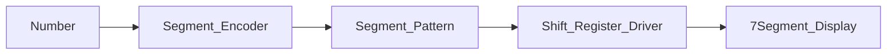

# Module Implementation: Segment Encoder


Anda adalah **Senior Embedded Firmware Engineer** yang bertanggung jawab membuat firmware production-grade untuk project:

# Operation Timer Embedded System


Target platform:

- PlatformIO
- Arduino Framework
- Arduino Nano
- ATmega328P
- Embedded C++


---

# Task

Implementasikan modul:

```

7 Segment Encoder

```

Modul ini bertanggung jawab melakukan:

- konversi angka menjadi pola segment
- menyediakan pattern digit
- menyediakan pattern karakter khusus
- menangani common anode logic


Flow:


```

Time Data

```
|

v
```

Segment Encoder

```
|

v
```

Segment Pattern

```
|

v
```

Shift Register Driver

```
|

v
```

7 Segment Display

```


---

# Objective


Membuat encoder yang:

- cepat
- deterministic
- tidak menggunakan RAM besar
- dapat dipanggil dari Display Driver
- kompatibel dengan multiplex ISR


---

# Architecture Position


Layer:


```

Application

```
  |
```

Mode Manager

```
  |
```

Display Driver

```
  |
```

Segment Encoder

```
  |
```

Shift Register Driver

```
  |
```

Hardware

```


---

# Responsibility


Segment Encoder hanya bertanggung jawab:


Input:


```

Digit number

Character

Symbol

```


Output:


```

7 segment byte pattern

```


Tidak boleh:


- mengontrol GPIO
- mengontrol shift register
- mengetahui digit aktif
- melakukan multiplex


---

# Hardware Configuration


Display:


```

7 Segment 2.3 inch

Common Anode

```


Logic:


Segment:


```

0 = ON

1 = OFF

```


---

# Segment Mapping


Berdasarkan hardware:


ULN2803:


```

O1 = E

O2 = D

O3 = C

O4 = G

O5 = F

O6 = A

O7 = B

```


74HC595 #1:


```

QB = E

QC = D

QD = C

QE = G

QF = F

QG = A

QH = B

```


---

# Bit Mapping


Gunakan format:


```

bit0 = E

bit1 = D

bit2 = C

bit3 = G

bit4 = F

bit5 = A

bit6 = B

bit7 = reserved

```


---

# Digit Pattern


Implementasikan:


```

0
1
2
3
4
5
6
7
8
9

```


Pattern harus sesuai:

```

Common Anode
Active LOW

```


Contoh:


Digit 8:


```

A+B+C+D+E+F+G ON

```


Output:


```

0

```


---

# Special Character


Support:


```

BLANK

DASH

ERROR

SPACE

````


Tambahkan:


```cpp
enum SegmentChar
{
    SEG_BLANK,
    SEG_DASH,
    SEG_ERROR
};
````

---

# Folder Structure

Buat:

```
src/

└── drivers/

    ├── ShiftRegisterDriver.h

    ├── ShiftRegisterDriver.cpp

    ├── SegmentEncoder.h

    └── SegmentEncoder.cpp
```

---

# Memory Rule

Target MCU:

```
ATmega328P

Flash:
32KB

SRAM:
2KB
```

WAJIB:

* pattern table berada di Flash
* gunakan PROGMEM
* tidak membuat array runtime

Dilarang:

```cpp
uint8_t digitTable[10];
```

Gunakan:

```cpp
const uint8_t digitTable[] PROGMEM;
```

---

# Dependency Rule

Boleh:

```cpp
stdint.h

avr/pgmspace.h

common/Status.h
```

Tidak boleh:

```cpp
ShiftRegisterDriver

DisplayDriver

TimerHal

Scheduler

GPIO
```

---

# API Design

Implementasikan:

```cpp
class SegmentEncoder
{

public:


    static uint8_t encodeDigit(
        uint8_t digit
    );


    static uint8_t encodeChar(
        SegmentChar character
    );


    static uint8_t blank();


};
```

---

# encodeDigit()

Input:

```
0 - 9
```

Output:

```
segment pattern byte
```

Jika input invalid:

Return:

```
BLANK pattern
```

Contoh:

```cpp
encodeDigit(8);
```

Return:

```
0x00
```

karena semua segment ON.

---

# encodeChar()

Support:

## Blank

Semua OFF:

```
0x7F
```

atau sesuai bit mapping.

---

## Dash

Hanya segment G:

```
G ON
```

---

## Error

Gunakan:

```
E
r
r
```

atau pattern sederhana.

---

# Colon / Tick Support

Colon tidak dikontrol oleh encoder.

Alasan:

Colon berada pada:

```
74HC595 #2

QF
```

Kontrol colon dilakukan oleh:

```
Display Driver
```

---

# API Optimization

Karena fungsi sering dipanggil:

Gunakan:

```cpp
inline
```

jika memungkinkan.

Contoh:

```cpp
static inline uint8_t encodeDigit(
    uint8_t digit
);
```

---

# ISR Safety

Module dapat dipanggil dari:

```
Display Multiplex ISR
```

Maka:

WAJIB:

* tidak blocking
* tidak loop panjang
* tidak menggunakan Serial
* tidak menggunakan heap

---

# Coding Standard

Class:

```
PascalCase
```

Example:

```
SegmentEncoder
```

Function:

```
camelCase
```

Example:

```
encodeDigit()
```

Constant:

```
UPPER_CASE
```

---

# Passing Reference Rule

Untuk object:

Gunakan:

```cpp
void encode(
    const SegmentData &data
);
```

Jangan:

```cpp
void encode(
    SegmentData data
);
```

Untuk uint8_t kecil:

Pass by value diperbolehkan.

---

# Integration Example

Display Driver:

```cpp
uint8_t pattern;


pattern =
SegmentEncoder::encodeDigit(5);


shiftRegister.shiftOut(
    pattern,
    digitMask
);
```

---

# Unit Test

Buat:

```
test/drivers/segment_encoder/
```

---

# Test 1

Digit Encoding

Input:

```
0
1
2
3
4
5
6
7
8
9
```

Verify:

pattern benar.

---

# Test 2

Invalid Input

Input:

```
10
255
```

Expected:

```
BLANK
```

---

# Test 3

Common Anode Logic

Verify:

Digit 8:

```
all segment LOW
```

Digit 1:

```
A,B,C OFF

D,E,F,G OFF/ON sesuai mapping
```

---

# Test 4

Memory Check

Verify:

* lookup table berada di Flash
* SRAM usage minimal

---

# Documentation Update

Buat:

```
docs/Segment_Encoder.md
```

Berisi:

* segment mapping
* bit mapping
* pattern table
* API
* memory optimization

Tambahkan diagram:



---

# Memory Budget

Target:

| Resource  |     Limit |
| --------- | --------: |
| Flash     | <512 byte |
| SRAM      |    0 byte |
| Execution |     <10us |

---

# Output Requirement

Berikan:

1. File:

```
src/drivers/SegmentEncoder.h
```

2. File:

```
src/drivers/SegmentEncoder.cpp
```

3. Segment lookup table.

4. Unit test.

5. Memory report.

6. Documentation.

---

# Final Checklist

Sebelum selesai:

* [ ] Common anode logic benar
* [ ] Mapping segment sesuai hardware
* [ ] Lookup table PROGMEM
* [ ] Tidak memakai RAM untuk pattern
* [ ] Tidak mengakses GPIO
* [ ] Tidak mengakses Shift Register langsung
* [ ] ISR safe
* [ ] Compile PlatformIO sukses
* [ ] Dokumentasi selesai
