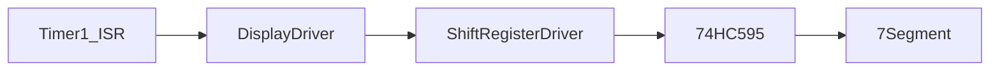

# Module Implementation: Display Driver


Anda adalah **Senior Embedded Firmware Engineer** yang bertanggung jawab membuat firmware production-grade untuk project:

# Operation Timer Embedded System


Target platform:

- PlatformIO
- Arduino Framework
- Arduino Nano
- ATmega328P
- Embedded C++


---

# Task

Implementasikan modul:

```

6 Digit 7 Segment Multiplex Display Driver

```


Modul ini bertanggung jawab mengontrol:

- 6 digit 7 segment
- multiplex refresh
- digit scanning
- colon/tick indicator
- display buffer
- brightness control preparation


---

# Objective


Membuat display driver yang:

- bebas flicker
- stabil
- deterministic
- ISR friendly
- hemat RAM
- kompatibel dengan stopwatch dan countdown


---

# Hardware Configuration


Display:


```

7 Segment 2.3 inch

Common Anode

6 Digit

```


Driver hardware:


```

Arduino Nano

```
    |

    v
```

74HC595 #2

```
    |
```

Digit Driver Transistor

```
    +
```

74HC595 #1

```
    |
```

ULN2803

```
    |
```

Segment Driver

```


---

# Architecture Position


```

Application

```
  |
```

Mode Manager

```
  |
```

UI Controller

```
  |
```

Display Driver

```
  |
```

+----------------+

| Segment Encoder|

| Shift Register |

+----------------+

```
  |
```

Hardware

```


---

# Display Multiplex Concept


Metode:


```

Digit 1 ON

wait

Digit 2 ON

wait

Digit 3 ON

wait

Digit 4 ON

wait

Digit 5 ON

wait

Digit 6 ON

```


Karena persistence of vision:

mata melihat:

```

6 digit menyala bersamaan

```


---

# Digit Mapping


74HC595 #2:


```

QB = Digit 6 (Second Unit)

QC = Digit 5

QD = Digit 4

QE = Digit 3

QF = Colon/Tick

QG = Digit 2

QH = Digit 1 (Hour Tens)

```


---

# Segment Mapping


Melalui:

```

Segment Encoder

```
    |

    v
```

Shift Register Driver

```
    |

    v
```

74HC595 #1

```


Mapping:


```

bit0 = E

bit1 = D

bit2 = C

bit3 = G

bit4 = F

bit5 = A

bit6 = B

```


---

# Timer Requirement


Display refresh HARUS menggunakan:


```

Timer1 Interrupt

```


Tidak boleh menggunakan:


```

millis()

delay()

loop polling

```


---

# Refresh Requirement


Target:


Refresh rate:

```

> =100Hz

```


Recommended:


```

digit refresh:

500Hz - 1000Hz

```


Contoh:


Jika:

```

6 digit

600Hz scan

```


Maka:

```

100Hz per digit

````


---

# ISR Architecture


Flow:


```mermaid
flowchart TD

Timer1_ISR

-->

Display_ISR

-->

Disable_All_Digit

-->

Load_Segment_Data

-->

Enable_Current_Digit

-->

Next_Digit
````

---

# ISR Rule

Display ISR harus:

WAJIB:

* cepat
* deterministic
* tidak blocking
* tidak menggunakan heap

Dilarang:

```
Serial.print()

delay()

I2C

RTC access

Button processing
```

---

# Folder Structure

Buat:

```
src/

└── drivers/

    ├── DisplayDriver.h

    └── DisplayDriver.cpp
```

---

# Dependency Rule

Display Driver boleh menggunakan:

```
SegmentEncoder

ShiftRegisterDriver

TimerHal

common/Status.h
```

Tidak boleh menggunakan:

```
RTC Driver

Mode Manager

Button Driver

Application
```

---

# Memory Rule

ATmega328P:

```
SRAM:
2KB
```

Display buffer harus kecil.

Gunakan:

```cpp
uint8_t displayBuffer[6];
```

Maximum:

```
<16 byte RAM
```

---

# API Design

Implementasikan:

```cpp
class DisplayDriver
{

public:


    StatusCode begin();


    void setDigit(
        uint8_t index,
        uint8_t value
    );


    void setTime(
        uint8_t hour,
        uint8_t minute,
        uint8_t second
    );


    void setColon(
        bool state
    );


    void clear();


    void refreshISR();


};
```

---

# Buffer Architecture

Gunakan:

```
Application Data

        |

        v

Display Buffer

        |

        v

Multiplex ISR
```

ISR hanya membaca:

```
displayBuffer[]
```

---

# Double Buffer Rule

Untuk mencegah glitch:

Implementasikan:

```
Front Buffer

Back Buffer
```

Flow:

```
Application

write back buffer


        |

swap()


        |

ISR membaca front buffer
```

---

# Swap Function

Tambahkan:

```cpp
void swapBuffer();
```

Swap harus atomic.

Gunakan:

```cpp
ATOMIC_BLOCK()
```

---

# Digit Enable Control

Sebelum pindah digit:

WAJIB:

```
Disable OE

Disable digit

Update segment

Enable digit
```

Sequence:

```
OE HIGH

 |

Shift data

 |

Latch

 |

Digit ON

 |

OE LOW
```

Tujuan:

mencegah ghosting.

---

# Colon / Tick

Colon berada di:

```
74HC595 #2

QF
```

Support:

```
Colon ON

Colon OFF

Tick blink
```

API:

```cpp
setColon(bool state)
```

---

# Blink Tick

Untuk clock:

```
tick 1Hz
```

Implementasi:

```
Toggle colon setiap 500ms
```

Timer berasal dari:

```
Time Service
```

atau:

```
Scheduler
```

Display Driver hanya menerima state.

---

# Brightness Preparation

Tambahkan interface:

```cpp
void setBrightness(
    uint8_t level
);
```

Range:

```
0 - 100
```

Implementasi awal:

```
100% fixed
```

Future:

PWM OE pin.

---

# ISR Optimization

refreshISR():

Target:

```
<500us
```

Tidak boleh:

```
function call panjang

loop

division

floating point
```

---

# Coding Standard

Class:

```
PascalCase
```

Example:

```
DisplayDriver
```

Function:

```
camelCase
```

Example:

```
refreshISR()
```

Variable:

```
camelCase
```

Constant:

```
UPPER_CASE
```

---

# Passing Reference Rule

Untuk struktur:

Gunakan:

```cpp
void update(
    const DisplayData &data
);
```

Jangan:

```cpp
void update(
    DisplayData data
);
```

---

# Unit Test

Buat:

```
test/drivers/display/
```

---

# Test 1

Initialization

Verify:

* buffer clear
* digit disabled
* OE state benar

---

# Test 2

Digit Display

Input:

```
123456
```

Expected:

Display buffer:

```
1 2 3 4 5 6
```

---

# Test 3

Colon

Test:

```
ON

OFF
```

Verify:

QF berubah.

---

# Test 4

Multiplex Timing

Measure:

```
refreshISR()
```

Target:

```
<500us
```

---

# Test 5

Ghosting Test

Verify:

Saat perpindahan digit:

```
all digit OFF
```

sebelum update segment.

---

# Documentation Update

Buat:

```
docs/Display_Driver.md
```

Berisi:

* multiplex architecture
* timing
* ISR flow
* buffer system
* digit mapping
* colon handling

Tambahkan Mermaid:



---

# Memory Budget

Target:

| Resource |     Limit |
| -------- | --------: |
| Flash    |      <4KB |
| SRAM     | <100 byte |
| ISR      |    <500us |

---

# Output Requirement

Berikan:

1. File:

```
src/drivers/DisplayDriver.h
```

2. File:

```
src/drivers/DisplayDriver.cpp
```

3. Timer1 ISR integration.

4. Multiplex implementation.

5. Unit test.

6. Memory report.

7. Documentation.

---

# Final Checklist

Sebelum selesai:

* [ ] Multiplex 6 digit berjalan
* [ ] Timer1 ISR digunakan
* [ ] Tidak memakai delay()
* [ ] Tidak memakai millis()
* [ ] Tidak flicker
* [ ] Tidak ghosting
* [ ] Buffer atomic
* [ ] Common anode logic benar
* [ ] Colon QF benar
* [ ] ISR execution <500us
* [ ] Compile PlatformIO sukses
* [ ] Dokumentasi selesai
