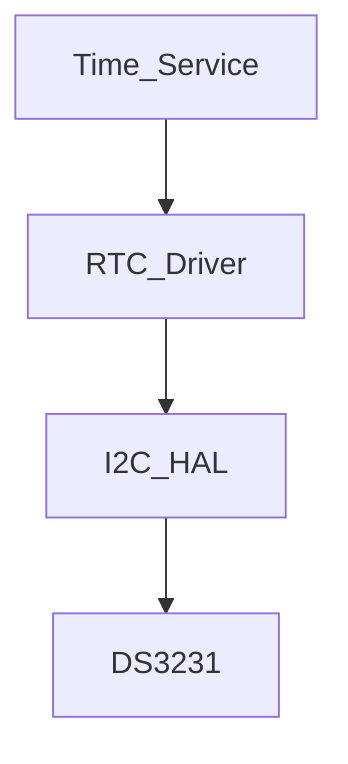

# Module Implementation: RTC Driver


Anda adalah **Senior Embedded Firmware Engineer** yang bertanggung jawab membuat firmware production-grade untuk project:

# Operation Timer Embedded System


Target platform:

- PlatformIO
- Arduino Framework
- Arduino Nano
- ATmega328P
- Embedded C++


---

# Task


Implementasikan modul:


```

DS3231 RTC Driver

```


Modul ini bertanggung jawab mengelola komunikasi dan data waktu dari RTC:


```

Time Service

```
  |

  v
```

RTC Driver

```
  |

  v
```

I2C HAL

```
  |

  v
```

DS3231 RTC

```


---

# Objective


Membuat RTC Driver yang:


- stabil
- akurat
- hemat resource
- tidak blocking lama
- mudah digunakan Time Service
- memiliki validasi data
- mendukung manufacturing test


---

# Hardware Configuration


RTC Module:


```

DS3231

```


Interface:


```

I2C

```


Address:


```

0x68

```


Connection:


|RTC|Arduino Nano|
|-|-|
|SDA|A4|
|SCL|A5|
|VCC|5V|
|GND|GND|


---

# Architecture Position


```

Application

```
  |
```

Time Service

```
  |
```

RTC Driver

```
  |
```

I2C HAL

```
  |
```

DS3231 Hardware

````


---

# Responsibility


RTC Driver bertanggung jawab:


- membaca waktu
- menulis waktu
- konversi BCD
- validasi waktu
- membaca status RTC
- membaca oscillator status


RTC Driver TIDAK bertanggung jawab:


- display
- stopwatch
- countdown
- button
- mode management


---

# Dependency Rule


RTC Driver boleh menggunakan:


```cpp
stdint.h

I2cHal

common/Status.h
````

Tidak boleh:

```cpp
Wire.h

DisplayDriver

TimeService

ModeManager

Scheduler
```

---

# Folder Structure

Buat:

```
src/

└── drivers/

    ├── RtcDriver.h

    └── RtcDriver.cpp
```

---

# DS3231 Register Map

Gunakan:

## Time Register

| Address | Function |
| ------- | -------- |
| 0x00    | Seconds  |
| 0x01    | Minutes  |
| 0x02    | Hours    |
| 0x03    | Day      |
| 0x04    | Date     |
| 0x05    | Month    |
| 0x06    | Year     |

---

## Control Register

Address:

```
0x0E
```

---

## Status Register

Address:

```
0x0F
```

---

# Time Format

Firmware menggunakan:

```
24 Hour Format
```

Range:

```
00:00:00

hingga

23:59:59
```

Tidak menggunakan:

```
12 hour mode
```

---

# Data Structure

Buat:

```cpp
struct DateTime
{

    uint8_t second;

    uint8_t minute;

    uint8_t hour;

    uint8_t day;

    uint8_t date;

    uint8_t month;

    uint16_t year;

};
```

---

# Memory Rule

ATmega328P:

```
Flash:
32KB

SRAM:
2KB
```

WAJIB:

* static allocation
* no heap
* fixed structure

Dilarang:

```cpp
new

delete

malloc()

free()

String

std::vector
```

---

# API Design

Implementasikan:

```cpp
class RtcDriver
{

public:


    StatusCode begin();


    StatusCode read(
        DateTime &time
    );


    StatusCode set(
        const DateTime &time
    );


    bool isValid();


};
```

---

# Passing Reference Rule

WAJIB:

Gunakan reference:

```cpp
StatusCode read(
    DateTime &time
);
```

Bukan:

```cpp
StatusCode read(
    DateTime time
);
```

Untuk menghemat SRAM.

---

# begin()

Melakukan:

* cek komunikasi DS3231
* membaca status register
* memastikan oscillator aktif

Flow:

```
START

 |

I2C Device Check

 |

Read Status

 |

RTC Ready
```

---

# Read Time

Fungsi:

```cpp
StatusCode read(
    DateTime &time
);
```

Flow:

```
Request Register 0x00

        |

Read 7 byte

        |

BCD Convert

        |

Fill DateTime
```

---

# BCD Conversion

DS3231 menggunakan:

```
BCD Format
```

Implementasikan:

```cpp
uint8_t bcdToDecimal(
    uint8_t value
);
```

dan:

```cpp
uint8_t decimalToBcd(
    uint8_t value
);
```

---

# Write Time

Fungsi:

```cpp
StatusCode set(
    const DateTime &time
);
```

Flow:

```
DateTime

 |

Decimal

 |

BCD

 |

Write Register 0x00

 |

RTC
```

---

# Validation Rule

Sebelum set:

Validasi:

## Hour

```
0-23
```

## Minute

```
0-59
```

## Second

```
0-59
```

## Date

```
1-31
```

Jika invalid:

Return:

```
StatusCode::INVALID_PARAMETER
```

---

# RTC Status Check

Baca:

```
Register 0x0F
```

Check:

## Oscillator Stop Flag

Bit:

```
OSF
```

Jika aktif:

RTC dianggap:

```
invalid
```

---

# Error Handling

Gunakan:

```
StatusCode
```

Return:

| Condition      | Status            |
| -------------- | ----------------- |
| RTC OK         | OK                |
| I2C error      | ERROR             |
| Invalid time   | INVALID_PARAMETER |
| RTC lost power | NOT_READY         |

---

# I2C Rule

RTC Driver:

TIDAK BOLEH:

```cpp
Wire.begin()

Wire.read()

Wire.write()
```

Semua melalui:

```
I2C HAL
```

---

# Update Rate

RTC tidak boleh dibaca setiap loop.

Rule:

```
RTC read:

1x / second
```

Time Service bertanggung jawab melakukan scheduling.

---

# Blocking Rule

RTC operation:

Maximum:

```
<10ms
```

Dilarang:

```
while(wait)

delay()

infinite loop
```

---

# Diagnostic Support

Tambahkan:

```cpp
uint8_t getStatus();
```

Untuk:

* factory mode
* diagnostic mode

Output:

```
RTC OK

RTC ERROR

RTC LOST POWER
```

---

# Coding Standard

Class:

```
PascalCase
```

Example:

```
RtcDriver
```

Function:

```
camelCase
```

Example:

```
read()
```

Constant:

```
UPPER_CASE
```

---

# ISR Rule

RTC Driver:

TIDAK BOLEH dipanggil dari:

```
Timer ISR

Display ISR

GPIO ISR
```

Alasan:

I2C transaction membutuhkan waktu lama.

---

# Unit Test

Buat:

```
test/drivers/rtc/
```

---

# Test 1

Device Detection

Expected:

```
DS3231 Found
```

---

# Test 2

Read Time

Set RTC:

```
12:30:45
```

Expected:

```
hour=12

minute=30

second=45
```

---

# Test 3

Write Time

Input:

```
23:59:50
```

Read kembali.

Expected:

```
23:59:50
```

---

# Test 4

Invalid Time

Input:

```
25:70:90
```

Expected:

```
INVALID_PARAMETER
```

---

# Test 5

Lost Power

Simulate:

OSF bit active.

Expected:

```
RTC NOT READY
```

---

# Documentation Update

Buat:

```
docs/RTC_Driver.md
```

Isi:

* DS3231 register map
* I2C communication
* data format
* API
* validation
* error handling

Tambahkan Mermaid:



---

# Memory Budget

Target:

| Resource |    Limit |
| -------- | -------: |
| Flash    |     <3KB |
| SRAM     | <50 byte |
| Stack    |  minimal |

---

# Output Requirement

Berikan:

1. File:

```
src/drivers/RtcDriver.h
```

2. File:

```
src/drivers/RtcDriver.cpp
```

3. DS3231 register implementation.

4. Unit test.

5. Memory report.

6. Documentation.

---

# Final Checklist

Sebelum selesai:

* [ ] DS3231 address 0x68 benar
* [ ] Menggunakan I2C HAL
* [ ] Tidak memakai Wire langsung
* [ ] Support 24 hour format
* [ ] BCD conversion benar
* [ ] Validasi waktu tersedia
* [ ] Lost power detection tersedia
* [ ] Tidak menggunakan dynamic memory
* [ ] Passing reference diterapkan
* [ ] Compile PlatformIO sukses
* [ ] Dokumentasi selesai
