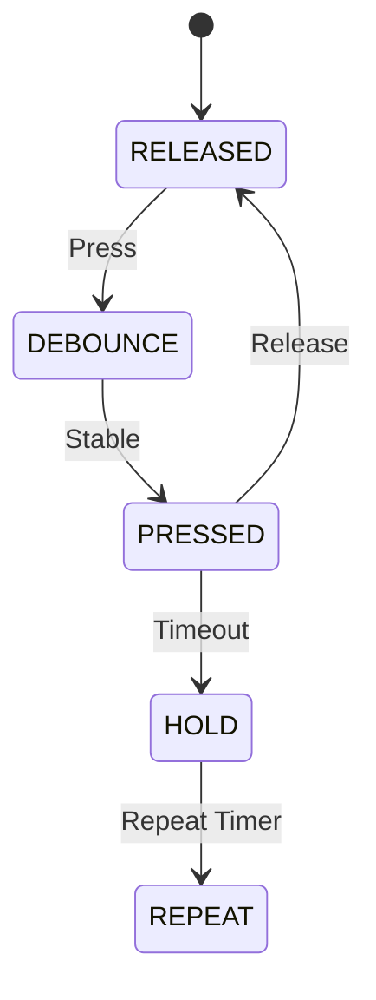

# Module Implementation: Button Driver


Anda adalah **Senior Embedded Firmware Engineer** yang bertanggung jawab membuat firmware production-grade untuk project:

# Operation Timer Embedded System


Target platform:

- PlatformIO
- Arduino Framework
- Arduino Nano
- ATmega328P
- Embedded C++


---

# Task


Implementasikan modul:


```

5 Button Input Driver

```


Modul ini bertanggung jawab mengelola:


- pembacaan tactile button
- debounce
- press detection
- release detection
- short press event
- hold press event
- repeat press event


---

# Hardware Configuration


Button:


```

5x Tactile Push Button

```


Konfigurasi:


```

INPUT_PULLUP

```


Logic:


```

HIGH = Released

LOW = Pressed

```


---

# Pin Mapping


|Button|Arduino Nano|
|-|-|
|POWER|D4|
|SELECT|D5|
|NEXT|D6|
|UP|D7|
|DOWN|D8|


---

# Architecture Position


```

GPIO Hardware

```
  |
```

Button Driver

```
  |
```

Event System

```
  |
```

UI Controller

```
  |
```

Mode Manager

```


---

# Responsibility


Button Driver bertanggung jawab:


- membaca input GPIO
- debounce
- state machine button
- generate event


Button Driver TIDAK bertanggung jawab:


- mengganti mode
- menjalankan timer
- menyimpan setting
- mengontrol display


---

# Design Philosophy


Gunakan:


```

State Machine Based Button Handling

```


Jangan:


```

if(buttonPressed)
{
doSomething();
}

```


Alasan:


- scalable
- support hold
- support repeat
- mudah maintenance


---

# Folder Structure


Buat:


```

src/

└── drivers/

```
├── ButtonDriver.h

└── ButtonDriver.cpp
```

````


---

# Dependency Rule


Boleh menggunakan:


```cpp
stdint.h

common/Status.h

hal/GpioHal.h

EventSystem.h
````

Tidak boleh:

```cpp
DisplayDriver

ModeManager

RTC

TimeService

Scheduler
```

---

# Memory Rule

Target MCU:

```
ATmega328P

SRAM:
2KB
```

WAJIB:

* fixed array
* static allocation
* no heap

Dilarang:

```cpp
new

delete

malloc()

free()

String

std::vector
```

---

# Button Enumeration

Implementasikan:

```cpp
enum ButtonId
{

    BUTTON_POWER,

    BUTTON_SELECT,

    BUTTON_NEXT,

    BUTTON_UP,

    BUTTON_DOWN

};
```

---

# Button Event

Implementasikan:

```cpp
enum ButtonEventType
{

    BUTTON_NONE,

    BUTTON_SHORT_PRESS,

    BUTTON_HOLD,

    BUTTON_REPEAT

};
```

---

# Button Event Data

Buat:

```cpp
struct ButtonEvent
{

    ButtonId id;

    ButtonEventType type;

};
```

---

# API Design

Implementasikan:

```cpp
class ButtonDriver
{

public:


    StatusCode begin();


    void update();


    bool getEvent(
        ButtonEvent &event
    );


};
```

---

# Passing Reference Rule

WAJIB:

Gunakan:

```cpp
bool getEvent(
    ButtonEvent &event
);
```

Bukan:

```cpp
bool getEvent(
    ButtonEvent event
);
```

Tujuan:

menghemat copy SRAM.

---

# Button State Machine

Implementasikan:

```
RELEASED

    |

Button Press

    |

DEBOUNCE

    |

PRESSED

    |

+----------------+

|                |

Short Release    Hold Time

|                |

SHORT EVENT      HOLD EVENT

                 |

                 |

              REPEAT EVENT
```

---

# Timing Configuration

Gunakan constant:

```cpp
BUTTON_DEBOUNCE_MS

BUTTON_HOLD_MS

BUTTON_REPEAT_MS
```

Default:

```cpp
BUTTON_DEBOUNCE_MS = 30ms

BUTTON_HOLD_MS = 800ms

BUTTON_REPEAT_MS = 150ms
```

---

# Behavior Specification

## Short Press

Jika:

```
Press

Release

< HOLD_TIME
```

Generate:

```
BUTTON_SHORT_PRESS
```

---

# Hold Press

Jika:

```
Button pressed

>=800ms
```

Generate:

```
BUTTON_HOLD
```

Hanya satu kali.

---

# Repeat Press

Setelah hold:

```
Every 150ms
```

Generate:

```
BUTTON_REPEAT
```

Contoh:

UP / DOWN adjustment.

---

# Update Frequency

Button driver dipanggil:

```
Scheduler
```

Recommended:

```
10ms
```

Contoh:

```
100Hz button scan
```

---

# Debounce Algorithm

Gunakan:

```
time stable state
```

Jangan:

```
delay()
```

Contoh:

```
Read

 |

Different state

 |

Start debounce timer

 |

Stable 30ms

 |

Accept change
```

---

# GPIO Rule

Button Driver tidak boleh:

```cpp
digitalRead()
```

langsung.

Gunakan:

```
GPIO HAL
```

Contoh:

```cpp
gpio.read(pin);
```

---

# Button Pin Configuration

Pada begin:

Set:

```
INPUT_PULLUP
```

Pin:

```
D4-D8
```

---

# Event Queue

Tambahkan buffer kecil:

```cpp
ButtonEvent eventQueue[5];
```

Maximum:

```
5 event
```

Tidak boleh:

```
dynamic queue
```

---

# Multi Button Handling

Support:

```
multiple button pressed
```

Namun event diproses:

```
one event per update
```

---

# Power Button Special Rule

POWER button:

Short:

```
toggle system mode
```

Hold:

```
factory/service menu
```

Catatan:

Implementasi aksi dilakukan oleh:

```
UI Controller
```

Button Driver hanya mengirim event.

---

# ISR Rule

Button Driver:

Tidak boleh berjalan di ISR.

Alasan:

* debounce membutuhkan waktu
* state machine

Jalankan melalui:

```
Scheduler Task
```

---

# Coding Standard

Class:

```
PascalCase
```

Example:

```
ButtonDriver
```

Function:

```
camelCase
```

Example:

```
getEvent()
```

Variable:

```
camelCase
```

Constant:

```
UPPER_CASE
```

---

# Unit Test

Buat:

```
test/drivers/button/
```

---

# Test 1

Initialization

Verify:

* pin configuration
* pull-up active

---

# Test 2

Short Press

Sequence:

```
LOW

30ms

HIGH
```

Expected:

```
BUTTON_SHORT_PRESS
```

---

# Test 3

Hold

Sequence:

```
LOW

800ms
```

Expected:

```
BUTTON_HOLD
```

---

# Test 4

Repeat

Sequence:

```
LOW

1000ms
```

Expected:

```
HOLD

+

multiple REPEAT
```

---

# Test 5

Bounce

Input:

```
LOW

HIGH

LOW

HIGH
```

Expected:

No false event.

---

# Documentation Update

Buat:

```
docs/Button_Driver.md
```

Isi:

* pin mapping
* state machine
* timing
* event system
* API

Tambahkan:



---

# Memory Budget

Target:

| Resource |     Limit |
| -------- | --------: |
| Flash    |      <3KB |
| SRAM     | <100 byte |
| Queue    |   5 event |

---

# Output Requirement

Berikan:

1. File:

```
src/drivers/ButtonDriver.h
```

2. File:

```
src/drivers/ButtonDriver.cpp
```

3. Button state machine.

4. Event queue.

5. Unit test.

6. Memory report.

7. Documentation.

---

# Final Checklist

Sebelum selesai:

* [ ] 5 button terimplementasi
* [ ] INPUT_PULLUP aktif
* [ ] Active LOW benar
* [ ] Debounce tanpa delay
* [ ] Short press bekerja
* [ ] Hold bekerja
* [ ] Repeat bekerja
* [ ] Event based
* [ ] Tidak memakai heap
* [ ] Passing reference diterapkan
* [ ] Tidak blocking
* [ ] Compile PlatformIO sukses
* [ ] Dokumentasi selesai
