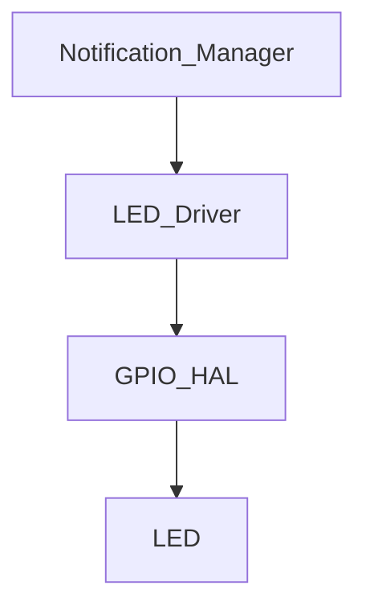

# Module Implementation: LED Driver


Anda adalah **Senior Embedded Firmware Engineer** yang bertanggung jawab membuat firmware production-grade untuk project:

# Operation Timer Embedded System


Target platform:

- PlatformIO
- Arduino Framework
- Arduino Nano
- ATmega328P
- Embedded C++


---

# Task


Implementasikan modul:


```

LED Driver

```


Modul ini bertanggung jawab mengontrol:


- Power Indicator LED
- Tick Indicator LED
- Status LED pattern
- Blink timing


---

# Objective


Membuat LED Driver yang:


- sederhana
- deterministic
- non blocking
- hemat resource
- mudah digunakan modul lain
- tidak menggunakan delay()


---

# Hardware Configuration


Project memiliki:


## Power LED


Fungsi:


```

Indikator power system

```


Pin:


```

Arduino Nano D12

```


Logic:


```

LOW  = LED ON

HIGH = LED OFF

```


Karena:


```

Active LOW

```


---

## Tick LED


Fungsi:


```

Indikator detik / system tick

```


Lokasi:


```

Display Board

```


Control:


```

Display Controller

```


Jika menggunakan jalur board:


LED tick dikontrol melalui:


```

74HC595 #2 QF

```


Namun LED Driver harus menyediakan abstraction.


---

# Architecture Position


```

Application

```
  |
```

Notification Manager

```
  |
```

LED Driver

```
  |
```

GPIO HAL

```
  |
```

LED Hardware

```


---

# Responsibility


LED Driver bertanggung jawab:


- ON/OFF LED
- blink pattern
- status indication


LED Driver TIDAK bertanggung jawab:


- menentukan kapan LED harus menyala
- mengetahui mode clock
- mengetahui stopwatch
- mengetahui countdown


Keputusan berada di:


```

Notification Manager

```


---

# Folder Structure


Buat:


```

src/

└── drivers/

```
├── LedDriver.h

└── LedDriver.cpp
```

````


---

# Dependency Rule


Boleh menggunakan:


```cpp
stdint.h

common/Status.h

hal/GpioHal.h
````

Tidak boleh:

```cpp
DisplayDriver

ModeManager

ButtonDriver

RtcDriver

TimeService
```

---

# Memory Rule

ATmega328P:

```
SRAM:
2KB
```

WAJIB:

* static allocation
* no heap
* fixed state

Dilarang:

```cpp
new

delete

malloc()

free()

String
```

---

# LED Enumeration

Implementasikan:

```cpp
enum LedId
{

    LED_POWER,

    LED_TICK

};
```

---

# LED State

Implementasikan:

```cpp
enum LedState
{

    LED_OFF,

    LED_ON

};
```

---

# Blink Pattern

Implementasikan:

```cpp
enum LedPattern
{

    LED_STEADY_OFF,

    LED_STEADY_ON,

    LED_BLINK_SLOW,

    LED_BLINK_FAST,

    LED_HEARTBEAT

};
```

---

# API Design

Implementasikan:

```cpp
class LedDriver
{

public:


    StatusCode begin();


    void set(
        LedId led,
        LedState state
    );


    void setPattern(
        LedId led,
        LedPattern pattern
    );


    void update();


};
```

---

# Passing Reference Rule

Untuk object:

Gunakan:

```cpp
void process(
    const LedStatus &status
);
```

Bukan:

```cpp
void process(
    LedStatus status
);
```

Tujuan:

mengurangi copy memory.

---

# GPIO Rule

LED Driver tidak boleh:

```cpp
digitalWrite()
```

langsung.

Gunakan:

```
GPIO HAL
```

Contoh:

```cpp
gpio.write(
    pin,
    state
);
```

---

# Active LOW Logic

Implementasikan abstraction:

API:

```cpp
set(
LED_POWER,
LED_ON
);
```

Hardware:

```
LED_ON

=

GPIO LOW
```

Driver yang melakukan invert logic.

---

# Blink Engine

Tidak menggunakan:

```cpp
delay()
```

Tidak menggunakan:

```cpp
while()
```

Gunakan:

```
time based state machine
```

---

# Blink Timing

Default:

## Slow Blink

```
500ms ON

500ms OFF
```

---

## Fast Blink

```
100ms ON

100ms OFF
```

---

## Heartbeat

Pattern:

```
100ms ON

900ms OFF
```

---

# Update Method

Fungsi:

```cpp
update()
```

dipanggil oleh:

```
Scheduler
```

Frequency:

```
10ms
```

---

# Internal State

Gunakan:

```cpp
struct LedContext
{

    LedPattern pattern;

    bool currentState;

    uint32_t lastToggle;

};
```

Jumlah:

```
2 LED maximum
```

---

# Tick LED Behavior

Tick LED digunakan untuk:

```
indikator detik berjalan
```

Contoh:

```
Clock Mode

1Hz pulse
```

Namun:

LED Driver hanya menerima:

```
ON/OFF command
```

dari:

```
Notification Manager
```

---

# ISR Rule

LED Driver:

Tidak boleh berjalan dari:

```
Display ISR

Timer ISR
```

Alasan:

blink tidak membutuhkan timing mikro.

---

# Coding Standard

Class:

```
PascalCase
```

Example:

```
LedDriver
```

Function:

```
camelCase
```

Example:

```
setPattern()
```

Constant:

```
UPPER_CASE
```

---

# Unit Test

Buat:

```
test/drivers/led/
```

---

# Test 1

Initialization

Verify:

* pin configured
* default LED OFF

---

# Test 2

Power LED

Command:

```
LED_POWER ON
```

Expected:

GPIO:

```
LOW
```

---

# Test 3

Blink Slow

Set:

```
LED_BLINK_SLOW
```

Verify:

```
toggle every 500ms
```

---

# Test 4

Heartbeat

Verify:

```
100ms ON

900ms OFF
```

---

# Test 5

Non Blocking

Verify:

update():

```
tidak memakai delay()
```

---

# Documentation Update

Buat:

```
docs/LED_Driver.md
```

Isi:

* LED mapping
* active low logic
* blink pattern
* API
* timing

Tambahkan:



---

# Memory Budget

Target:

| Resource    |      Limit |
| ----------- | ---------: |
| Flash       |       <2KB |
| SRAM        |   <50 byte |
| LED Context | 2 instance |

---

# Output Requirement

Berikan:

1. File:

```
src/drivers/LedDriver.h
```

2. File:

```
src/drivers/LedDriver.cpp
```

3. Blink state machine.

4. Unit test.

5. Memory report.

6. Documentation.

---

# Final Checklist

Sebelum selesai:

* [ ] Power LED active LOW benar
* [ ] LED abstraction tersedia
* [ ] Blink tanpa delay()
* [ ] Scheduler compatible
* [ ] Tidak menggunakan heap
* [ ] Passing reference diterapkan
* [ ] Non blocking
* [ ] Compile PlatformIO sukses
* [ ] Dokumentasi selesai
