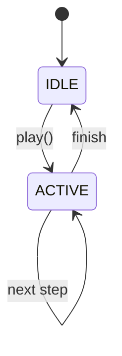
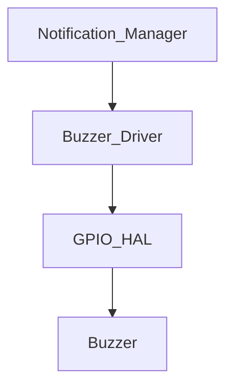

# Module Implementation: Buzzer Driver


Anda adalah **Senior Embedded Firmware Engineer** yang bertanggung jawab membuat firmware production-grade untuk project:

# Operation Timer Embedded System


Target platform:

- PlatformIO
- Arduino Framework
- Arduino Nano
- ATmega328P
- Embedded C++


---

# Task


Implementasikan modul:


```

Buzzer Driver

```id="0xw8kq"


Modul ini bertanggung jawab mengontrol:


- button feedback beep
- save confirmation beep
- reset notification beep
- mode change indication
- error notification beep


---

# Objective


Membuat Buzzer Driver yang:


- non blocking
- deterministic
- hemat resource
- mudah digunakan Notification Manager
- tidak mengganggu timer system


---

# Hardware Configuration


Buzzer:


```

Active Buzzer

```id="s8f2pf"


Pin:


```

Arduino Nano D3

```id="j1c8qy"


Logic:


```

LOW  = Buzzer ON

HIGH = Buzzer OFF

```id="a7v3pe"


Karena:


```

Active LOW

```id="p5tm8r"


---

# Architecture Position


```

Application

```
  |
```

Notification Manager

```
  |
```

Buzzer Driver

```
  |
```

GPIO HAL

```
  |
```

Buzzer Hardware

```id="e9n3vl"


---

# Responsibility


Buzzer Driver bertanggung jawab:


- generate beep pattern
- timing beep
- output control


Buzzer Driver TIDAK bertanggung jawab:


- menentukan event
- mengetahui button
- mengetahui mode


Keputusan dilakukan oleh:


```

Notification Manager

```id="3a2d7m"


---

# Folder Structure


Buat:


```

src/

└── drivers/

```
├── BuzzerDriver.h

└── BuzzerDriver.cpp
```

````id="d9bq2y"


---

# Dependency Rule


Boleh menggunakan:


```cpp
stdint.h

common/Status.h

hal/GpioHal.h
````

Tidak boleh:

```cpp
ButtonDriver

ModeManager

DisplayDriver

RTC

TimeService
```

---

# Memory Rule

Target MCU:

```
ATmega328P

SRAM:
2KB
```

WAJIB:

* static allocation
* fixed structure
* no heap

Dilarang:

```cpp
new

delete

malloc()

free()

String
```

---

# Buzzer Enumeration

Implementasikan:

```cpp
enum BuzzerPattern
{

    BUZZER_OFF,

    BUZZER_SHORT,

    BUZZER_DOUBLE,

    BUZZER_LONG,

    BUZZER_ERROR

};
```

---

# Pattern Specification

## SHORT

Untuk:

```
Button feedback
```

Timing:

```
50ms ON

50ms OFF
```

---

## DOUBLE

Untuk:

```
Save confirmation
```

Timing:

```
100ms ON

100ms OFF

100ms ON
```

---

## LONG

Untuk:

```
Mode change

Reset confirmation
```

Timing:

```
500ms ON
```

---

## ERROR

Untuk:

```
Diagnostic error
```

Timing:

```
200ms ON

200ms OFF

repeat 3x
```

---

# API Design

Implementasikan:

```cpp
class BuzzerDriver
{

public:


    StatusCode begin();


    void play(
        BuzzerPattern pattern
    );


    void update();


    bool isBusy();


};
```

---

# Non Blocking Rule

Fungsi:

```cpp
play()
```

Tidak boleh:

```cpp
delay()
```

Tidak boleh:

```cpp
while()
```

Contoh:

Salah:

```cpp
beep();

delay(100);

off();
```

Benar:

```
State Machine

ON

|

timer expire

|

OFF
```

---

# Internal State

Gunakan:

```cpp
struct BuzzerContext
{

    BuzzerPattern pattern;

    uint8_t step;

    bool active;

    uint32_t timestamp;

};
```

---

# Timing Engine

Update:

```cpp
update()
```

dipanggil oleh:

```
Scheduler
```

Frequency:

```
10ms
```

---

# State Machine

Implementasikan:



---

# GPIO Rule

Buzzer Driver tidak boleh:

```cpp
digitalWrite()
```

langsung.

Gunakan:

```
GPIO HAL
```

Contoh:

```cpp
gpio.write(
BUZZER_PIN,
state
);
```

---

# Active LOW Logic

Application:

```cpp
play(
BUZZER_SHORT
);
```

Hardware:

```
GPIO LOW

=

BUZZER ON
```

Driver melakukan:

```
logic inversion
```

---

# Priority Rule

Jika ada pattern baru ketika buzzer sedang aktif:

Gunakan:

```
New event replaces old event
```

Priority:

```
ERROR

 >

LONG

 >

DOUBLE

 >

SHORT
```

---

# Button Feedback Integration

Contoh:

Button Driver menghasilkan:

```
BUTTON_SHORT_PRESS
```

Notification Manager:

```
play(BUZZER_SHORT)
```

Buzzer Driver:

```
execute pattern
```

---

# ISR Rule

Buzzer Driver:

Tidak boleh dipanggil dari:

```
Display ISR

Timer ISR

GPIO ISR
```

Alasan:

Timing audio tidak membutuhkan interrupt.

---

# Coding Standard

Class:

```
PascalCase
```

Example:

```
BuzzerDriver
```

Function:

```
camelCase
```

Example:

```
play()
```

Constant:

```
UPPER_CASE
```

---

# Passing Reference Rule

Untuk object:

Gunakan:

```cpp
void process(
    const BuzzerData &data
);
```

Bukan:

```cpp
void process(
    BuzzerData data
);
```

---

# Unit Test

Buat:

```
test/drivers/buzzer/
```

---

# Test 1

Initialization

Verify:

* pin configured
* buzzer OFF

---

# Test 2

Short Beep

Command:

```
play(BUZZER_SHORT)
```

Expected:

```
50ms ON

50ms OFF
```

---

# Test 3

Double Beep

Expected:

```
ON

OFF

ON
```

---

# Test 4

Priority Test

Sequence:

```
SHORT

then ERROR
```

Expected:

```
ERROR replaces SHORT
```

---

# Test 5

Non Blocking

Verify:

```
update()

tidak menggunakan delay()
```

---

# Documentation Update

Buat:

```
docs/Buzzer_Driver.md
```

Isi:

* hardware mapping
* active low logic
* pattern table
* timing
* API

Tambahkan:



---

# Memory Budget

Target:

| Resource      |      Limit |
| ------------- | ---------: |
| Flash         |       <2KB |
| SRAM          |   <50 byte |
| Pattern State | 1 instance |

---

# Output Requirement

Berikan:

1. File:

```
src/drivers/BuzzerDriver.h
```

2. File:

```
src/drivers/BuzzerDriver.cpp
```

3. Pattern state machine.

4. Unit test.

5. Memory report.

6. Documentation.

---

# Final Checklist

Sebelum selesai:

* [ ] Buzzer active LOW benar
* [ ] Pattern beep tersedia
* [ ] Tidak memakai delay()
* [ ] Tidak blocking
* [ ] Notification Manager compatible
* [ ] Tidak memakai heap
* [ ] Passing reference diterapkan
* [ ] Compile PlatformIO sukses
* [ ] Dokumentasi selesai
