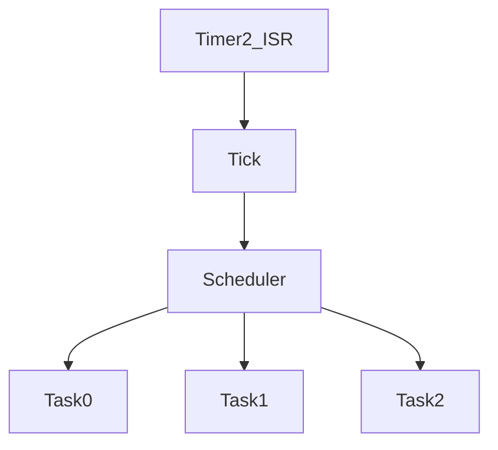

# Module Implementation : Scheduler


Anda adalah Senior Embedded Firmware Engineer yang bertanggung jawab membuat firmware production-grade untuk project:

# Operation Timer Embedded System

Target Platform

- PlatformIO
- Arduino Framework
- Arduino Nano
- ATmega328P

---

# Task

Implementasikan modul

```
Scheduler
```

Scheduler merupakan pusat eksekusi seluruh firmware.

Semua modul selain Display Multiplex berjalan melalui Scheduler.

---

# Objective

Scheduler harus:

- deterministic
- non blocking
- lightweight
- mudah di-scale
- tidak menggunakan RTOS
- cocok untuk AVR 8-bit

---

# Architecture

```
             Timer2 ISR
                  │
                  ▼
            System Tick 1ms
                  │
                  ▼
             Scheduler
                  │
      ┌───────────┼───────────┐
      ▼           ▼           ▼

 Button      Notification   TimeService

      ▼           ▼           ▼

 UI Controller   RTC Driver
```

Display Multiplex tetap berjalan di Timer1 ISR.

---

# Folder

```
src/

scheduler/

    Scheduler.h

    Scheduler.cpp
```

---

# Dependency

Scheduler boleh menggunakan

- Timer HAL
- Common Library

Tidak boleh menggunakan

- Display Driver
- RTC Driver
- Button Driver
- UI Controller

Scheduler harus independen.

---

# Timer Source

Gunakan

```
Timer2 Compare Match
```

Interrupt menghasilkan

```
1 ms Tick
```

---

# Tick Counter

Gunakan

```cpp
volatile uint32_t systemTick;
```

Semua timing berasal dari tick ini.

Tidak boleh memakai

```
millis()
micros()
delay()
```

---

# Scheduler Model

Gunakan Cooperative Scheduler.

Task berjalan sampai selesai.

Task tidak boleh blocking.

---

# Task Table

Implementasikan

```cpp
struct Task
{
    TaskCallback callback;

    uint16_t periodMs;

    uint32_t nextRun;

    bool enabled;
};
```

Gunakan array statis.

Tidak menggunakan linked list.

---

# Maximum Task

Maksimum

```
16 Task
```

Tidak menggunakan dynamic allocation.

---

# API

Implementasikan

```cpp
class Scheduler
{

public:

    StatusCode begin();

    StatusCode addTask(
        Task &task
    );

    void run();

    uint32_t tick() const;

};
```

---

# Passing Reference Rule

Gunakan

```cpp
StatusCode addTask(
    Task &task
);
```

Jangan

```cpp
StatusCode addTask(
    Task task
);
```

---

# Scheduler Flow

```mermaid
flowchart TD

Timer2_ISR

-->

systemTick++

-->

Scheduler.run()

-->

Check Task

-->

Run Ready Task

-->

Return
```

---

# Task Priority

Gunakan urutan eksekusi tetap.

Semakin kecil index semakin tinggi prioritas.

Contoh

|Index|Task|
|------|----|
|0|Button|
|1|Notification|
|2|Time Service|
|3|RTC|
|4|UI|
|5|Diagnostic|

---

# Suggested Task Period

|Task|Period|
|----|------|
|Button|10 ms|
|Notification|10 ms|
|UI|20 ms|
|Time Service|100 ms|
|RTC Sync|1000 ms|
|Diagnostic|1000 ms|

---

# Scheduler Rule

Task tidak boleh

```
delay()

while()

blocking I2C lama

Serial.print()
```

Task harus selesai secepat mungkin.

Target

```
<500 us
```

per task.

---

# Timer Rule

Display

```
Timer1
```

Scheduler

```
Timer2
```

Arduino Core

```
Timer0
```

Tidak boleh mengubah Timer0.

---

# Idle Loop

main()

cukup

```cpp
while(true)
{
    scheduler.run();
}
```

Semua logic ada di task.

---

# Memory Rule

Target

Flash

```
<2 KB
```

SRAM

```
<200 Byte
```

---

# Error Handling

Jika task table penuh

return

```
StatusCode::NO_RESOURCE
```

---

# Unit Test

Buat

```
test/scheduler/
```

---

# Test 1

Tambah Task

Expected

```
Task Registered
```

---

# Test 2

10ms Task

Verify

dipanggil setiap

```
10ms
```

---

# Test 3

100ms Task

Verify

tepat

```
100ms
```

---

# Test 4

Disabled Task

Task tidak pernah dijalankan.

---

# Test 5

Multiple Task

Verify

prioritas tetap.

---

# Documentation

Buat

```
docs/Scheduler.md
```

Berisi

- Scheduler Architecture
- Tick System
- Task Registration
- Priority
- Timing

Tambahkan Mermaid



---

# Output

Berikan

- Scheduler.h
- Scheduler.cpp
- Timer2 Integration
- Unit Test
- Memory Report
- Documentation

---

# Final Checklist

- [ ] Timer2 digunakan
- [ ] Tick 1ms
- [ ] Cooperative Scheduler
- [ ] Maksimum 16 task
- [ ] Tidak memakai delay()
- [ ] Tidak memakai millis()
- [ ] Tidak memakai heap
- [ ] Passing by reference diterapkan
- [ ] Compile PlatformIO sukses
- [ ] Dokumentasi selesai
