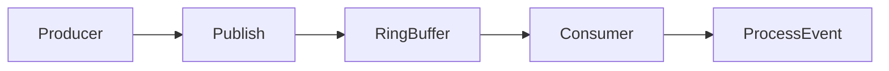
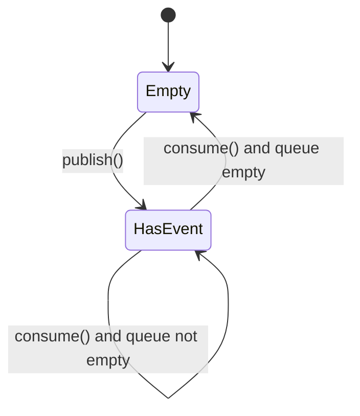
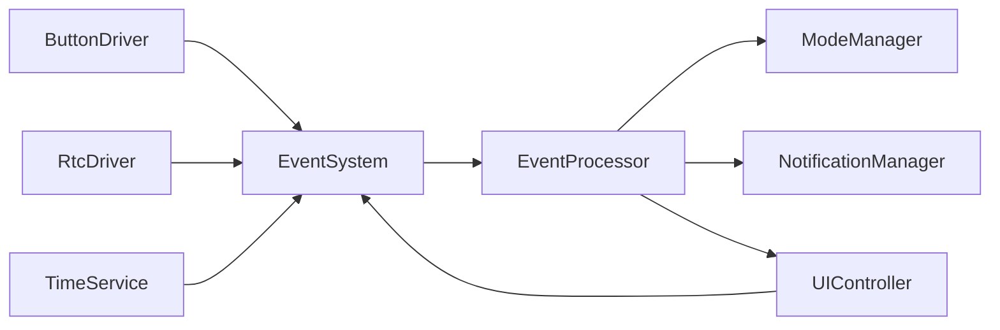

# Module Implementation: Event System


Anda adalah **Senior Embedded Firmware Engineer** yang bertanggung jawab membuat firmware production-grade untuk project:

# Operation Timer Embedded System


Target platform:

- PlatformIO
- Arduino Framework
- Arduino Nano
- ATmega328P
- Embedded C++


---

# Task


Implementasikan modul:


```

Event System

````


Event System menjadi mekanisme komunikasi antar modul firmware tanpa membuat modul saling bergantung secara langsung.


---

# Objective


Event System harus:


- lightweight
- deterministic
- non-blocking
- fixed memory
- no dynamic allocation
- mudah dikembangkan
- memisahkan hardware driver dari application logic


---

# Architecture


Gunakan arsitektur:


```text
Hardware Driver
      |
      v
Event Producer
      |
      v
Event System
      |
      v
Event Consumer
      |
      v
Application
````

Contoh:

```text
Button Driver
      |
      | BUTTON_SHORT
      v
Event System
      |
      v
UI Controller
```

Contoh lainnya:

```text
Time Service
      |
      | SECOND_TICK
      v
Event System
      |
      +---- Clock Mode
      |
      +---- UI Controller
      |
      +---- Notification Manager
```

---

# Important Architecture Rule

Event System TIDAK boleh mengetahui:

* Button Driver
* Display Driver
* RTC Driver
* Mode Manager
* UI Controller
* Buzzer Driver
* LED Driver

Event System hanya mengetahui:

```text
Event Type
Event Data
Event Queue
```

---

# Folder Structure

Buat:

```text
src/

└── core/

    ├── EventSystem.h
    └── EventSystem.cpp
```

Jika struktur project sebelumnya menggunakan:

```text
src/common/
```

gunakan lokasi yang konsisten dengan `PROMPT_01_Common_Library.md`.

Jangan membuat duplicate Event System.

---

# Event Architecture

Gunakan:

```text
Producer

   |

publish()

   |

Event Queue

   |

consume()

   |

Consumer
```

Event Queue bersifat FIFO.

---

# Event Definition

Implementasikan:

```cpp
enum class EventType : uint8_t
{
    NONE,

    BUTTON_SHORT,
    BUTTON_HOLD,
    BUTTON_REPEAT,

    POWER_ON,
    POWER_OFF,

    MODE_NEXT,
    MODE_SELECT,

    TIME_TICK,
    SECOND_TICK,

    TIMER_START,
    TIMER_STOP,
    TIMER_RESET,

    VALUE_UP,
    VALUE_DOWN,

    SAVE,
    RESET,

    NOTIFICATION,

    ERROR,

    SYSTEM_READY,

    SYSTEM_ERROR
};
```

Event list boleh diperluas pada modul berikutnya, tetapi jangan membuat event yang tidak diperlukan.

---

# Event Data

Gunakan struktur kecil:

```cpp
struct Event
{
    EventType type;

    uint8_t source;

    int16_t value;
};
```

Tujuan:

* fixed size
* mudah diproses
* hemat SRAM

Jangan menggunakan:

```cpp
String
char*
dynamic object
std::variant
std::any
```

---

# Event Source

Implementasikan:

```cpp
enum class EventSource : uint8_t
{
    SYSTEM,
    BUTTON,
    RTC,
    TIMER,
    UI,
    MODE,
    DIAGNOSTIC
};
```

Jika `source` menggunakan `uint8_t`, pastikan enum dapat dikonversi secara aman.

---

# Event Queue

Gunakan fixed-size ring buffer.

Contoh:

```cpp
static constexpr uint8_t EVENT_QUEUE_SIZE = 8;
```

Implementasikan:

```text
head
tail
count
```

Tidak menggunakan:

```text
malloc()
new
std::queue
linked list
```

---

# Ring Buffer

Architecture:



Queue harus FIFO.

---

# Queue Overflow

Jika queue penuh:

```cpp
publish()
```

harus mengembalikan:

```cpp
StatusCode::NO_RESOURCE
```

Jangan:

* overwrite event lama
* block producer
* menunggu queue kosong
* menggunakan dynamic allocation

---

# Critical Event Rule

Event tertentu lebih penting daripada event biasa.

Critical event:

```text
ERROR
SYSTEM_ERROR
POWER_OFF
RESET
```

Jika queue penuh, implementasikan mekanisme yang aman untuk critical event tanpa merusak FIFO event normal.

Prioritas tidak boleh menyebabkan queue menjadi tidak deterministic.

Jika mekanisme prioritas menambah kompleksitas berlebihan, gunakan:

```text
reserved critical event slot
```

Contoh:

```text
8 total slots

6 normal slots

2 critical slots
```

Pilih desain yang paling ringan untuk ATmega328P.

---

# API

Implementasikan:

```cpp
class EventSystem
{
public:

    StatusCode begin();

    StatusCode publish(
        const Event &event
    );

    bool consume(
        Event &event
    );

    uint8_t pending() const;

    void clear();

};
```

---

# Passing By Reference Rule

WAJIB menggunakan reference untuk object.

Gunakan:

```cpp
StatusCode publish(
    const Event &event
);
```

dan:

```cpp
bool consume(
    Event &event
);
```

Jangan:

```cpp
StatusCode publish(
    Event event
);
```

atau:

```cpp
Event consume();
```

Tujuan:

* mengurangi copy
* menghemat SRAM
* mengurangi stack usage

---

# Atomicity

ATmega328P adalah MCU 8-bit.

Operasi terhadap:

```cpp
uint16_t
uint32_t
```

tidak selalu atomic.

Jika Event System diakses oleh ISR:

WAJIB melindungi operasi queue menggunakan mekanisme atomic yang sesuai.

Gunakan:

```cpp
ATOMIC_BLOCK
```

atau mekanisme atomic dari HAL/core yang sudah digunakan project.

Jangan mematikan interrupt lebih lama dari yang diperlukan.

---

# ISR Rule

Event System boleh digunakan oleh ISR hanya untuk operasi yang sangat singkat.

ISR tidak boleh:

```text
memproses event
menjalankan callback
melakukan I2C
melakukan Serial
mengakses Display Driver
```

ISR hanya boleh:

```text
publish event
```

jika memang diperlukan.

---

# Important Scheduler Rule

Event processing dilakukan oleh Scheduler task.

Contoh:

```text
Timer2
   |
   v
Scheduler
   |
   v
Event Task
   |
   v
consume()
   |
   v
UI / Mode / Notification
```

Event System tidak menjalankan callback secara otomatis dari `publish()`.

---

# Event Processing

Jangan menggunakan:

```cpp
while (eventSystem.consume(event))
{
    process(event);
}
```

tanpa batas.

Alasannya:

Jika queue penuh, task dapat berjalan terlalu lama.

Gunakan budget:

```text
MAX_EVENTS_PER_CYCLE
```

Default:

```cpp
static constexpr uint8_t MAX_EVENTS_PER_CYCLE = 4;
```

Dengan demikian Scheduler tetap deterministic.

---

# Event Task

Implementasikan konsep:

```cpp
void processEvents()
{
    Event event;

    for (
        uint8_t i = 0;
        i < MAX_EVENTS_PER_CYCLE;
        ++i
    )
    {
        if (!eventSystem.consume(event))
        {
            break;
        }

        dispatchEvent(event);
    }
}
```

`dispatchEvent()` bukan tanggung jawab Event System jika arsitektur project memisahkan dispatcher.

Lebih baik Event System hanya menyediakan queue.

---

# Event System Responsibility

Event System hanya:

```text
Store
Publish
Consume
Count
Clear
```

Event System tidak melakukan:

```text
Business Logic
Mode Transition
Display Update
Buzzer Control
LED Control
RTC Access
```

---

# Event Naming

Gunakan:

```text
UPPER_CASE
```

Contoh:

```cpp
EventType::BUTTON_SHORT
EventType::SECOND_TICK
EventType::TIMER_START
```

---

# Event Source Naming

Gunakan:

```cpp
EventSource::BUTTON
EventSource::RTC
EventSource::SYSTEM
```

---

# Example: Button Event

Button Driver:

```cpp
Event event;

event.type = EventType::BUTTON_SHORT;
event.source = static_cast<uint8_t>(
    EventSource::BUTTON
);
event.value = buttonId;

eventSystem.publish(event);
```

Event System tidak mengetahui arti `buttonId`.

---

# Example: Time Tick

Time Service:

```cpp
Event event;

event.type = EventType::SECOND_TICK;
event.source = static_cast<uint8_t>(
    EventSource::RTC
);
event.value = 0;

eventSystem.publish(event);
```

---

# Example: UI Event

UI Controller dapat menghasilkan:

```text
TIMER_START
TIMER_STOP
TIMER_RESET
SAVE
```

Event berikut dipublish ke Event System jika memang diperlukan oleh modul lain.

---

# Event Ownership

Event menggunakan value semantics sederhana.

Setelah:

```cpp
publish()
```

Event harus sudah disalin ke queue internal.

Producer boleh menggunakan kembali object Event setelah `publish()` selesai.

Consumer menerima hasil copy melalui:

```cpp
consume(
    Event &event
);
```

Tidak boleh menyimpan pointer/reference ke object producer.

---

# Memory Requirement

Target MCU:

```text
ATmega328P
SRAM = 2KB
```

Target Event System:

```text
<150 byte SRAM
```

Dengan:

```text
8 event queue
```

Pastikan ukuran:

```cpp
sizeof(Event)
```

tetap kecil.

---

# No Dynamic Memory

DILARANG:

```cpp
new
delete
malloc
free
String
std::vector
std::queue
std::function
```

Gunakan:

```text
static array
fixed-size struct
enum class
```

---

# Thread Safety

Firmware bukan RTOS.

Thread safety yang dibutuhkan hanya:

```text
Main Context
+
ISR Context
```

Jika queue hanya digunakan main context:

tidak perlu critical section berlebihan.

Jika ISR dapat publish:

gunakan critical section minimum.

---

# Error Handling

Gunakan:

```cpp
StatusCode
```

Minimal:

```text
OK
NO_RESOURCE
INVALID_PARAMETER
```

---

# API Error Rules

`publish()`:

```text
OK
NO_RESOURCE
INVALID_PARAMETER
```

`consume()`:

```text
true
false
```

Jika queue kosong:

```cpp
false
```

---

# Queue Metrics

Tambahkan:

```cpp
uint8_t pending() const;
```

Untuk:

* diagnostic
* factory test
* debugging

Jika diperlukan, tambahkan counter:

```cpp
uint8_t overflowCount;
```

Counter harus memiliki ukuran minimum yang sesuai.

---

# Diagnostic Support

Sediakan:

```cpp
uint8_t pending() const;
```

Dan:

```cpp
uint8_t overflowCount() const;
```

Tujuan:

factory diagnostic dapat mendeteksi:

```text
Event Queue Overflow
```

---

# Clear Rule

Implementasikan:

```cpp
void clear();
```

Digunakan ketika:

* system reset
* factory reset
* mode initialization tertentu

Jangan menggunakan `clear()` secara sembarangan karena dapat membuang event penting.

---

# Scheduler Integration

Event System harus dapat diintegrasikan dengan:

```text
PROMPT_13_Scheduler
```

Buat task:

```text
Event Processing Task
```

Recommended:

```text
Period = 10ms
```

Maksimum:

```text
4 event per execution
```

---

# Event Latency

Target normal:

```text
<20ms
```

Dengan scheduler 10ms.

Event kritis:

```text
<10ms
```

jika memungkinkan.

---

# Event Ordering

Event normal harus diproses:

```text
FIFO
```

Contoh:

```text
BUTTON_SHORT
BUTTON_SHORT
VALUE_UP
SAVE
```

harus diproses sesuai urutan tersebut.

---

# Duplicate Event

Jangan melakukan automatic duplicate filtering di Event System.

Contoh:

```text
VALUE_UP
VALUE_UP
VALUE_UP
```

semuanya valid.

Keputusan filtering dilakukan consumer.

---

# Event Coalescing

Jangan implementasikan coalescing pada versi awal.

Contoh:

```text
UP
UP
UP
UP
```

tetap menjadi empat event.

Jika diperlukan optimasi repeat button:

lakukan pada Button Driver atau UI Controller.

---

# Button Integration

Button Driver menghasilkan:

```text
BUTTON_SHORT
BUTTON_HOLD
BUTTON_REPEAT
```

Event System meneruskan event tersebut.

Event System tidak mengetahui:

```text
POWER
SELECT
NEXT
UP
DOWN
```

detail semantic button.

---

# Notification Integration

Notification Manager dapat menerima:

```text
SAVE
RESET
ERROR
MODE_NEXT
```

kemudian menjalankan:

```text
LED
BUZZER
```

Event System tidak mengontrol hardware.

---

# Mode Manager Integration

Mode Manager dapat menerima:

```text
MODE_NEXT
MODE_SELECT
TIMER_START
TIMER_STOP
TIMER_RESET
```

Event System hanya menyampaikan event.

---

# State Machine

Gunakan konsep:



---

# Unit Test

Buat:

```text
test/core/event/
```

---

# Test 1

Initialization

Expected:

```text
pending() == 0
```

---

# Test 2

Publish

Publish:

```text
BUTTON_SHORT
```

Expected:

```text
pending() == 1
```

---

# Test 3

Consume

Publish:

```text
BUTTON_SHORT
```

Consume.

Expected:

```text
same EventType
same source
same value
```

---

# Test 4

FIFO

Publish:

```text
BUTTON_SHORT
BUTTON_HOLD
BUTTON_REPEAT
```

Expected consume:

```text
BUTTON_SHORT
BUTTON_HOLD
BUTTON_REPEAT
```

---

# Test 5

Queue Full

Publish lebih dari kapasitas queue.

Expected:

```text
StatusCode::NO_RESOURCE
```

---

# Test 6

Clear

Publish beberapa event.

Call:

```cpp
clear();
```

Expected:

```text
pending() == 0
```

---

# Test 7

Event Budget

Masukkan:

```text
8 event
```

Process satu scheduler cycle.

Expected:

maksimum:

```text
4 event
```

yang diproses.

---

# Test 8

Duplicate Event

Publish:

```text
VALUE_UP
VALUE_UP
VALUE_UP
```

Expected:

semua tiga event tetap tersedia.

---

# Test 9

Overflow Diagnostic

Penuhi queue.

Attempt publish tambahan.

Expected:

```text
NO_RESOURCE
```

dan:

```text
overflowCount()
```

bertambah.

---

# Documentation

Buat:

```text
docs/Event_System.md
```

Dokumentasi minimal berisi:

* Event architecture
* Event lifecycle
* Event type
* Event source
* Queue architecture
* FIFO behavior
* Queue overflow
* ISR rules
* Scheduler integration
* API

---

# Mermaid Architecture

Tambahkan:



---

# Mermaid Queue

Tambahkan:


---

# Performance Requirement

`publish()` harus:

```text
O(1)
```

`consume()` harus:

```text
O(1)
```

Jangan melakukan:

```text
queue scanning
sorting
searching
dynamic allocation
```

---

# Critical Section Requirement

Critical section harus:

```text
sesingkat mungkin
```

Jangan melakukan:

```text
callback
I2C
display operation
business logic
```

di dalam critical section.

---

# Coding Standard

Class:

```text
PascalCase
```

Example:

```cpp
EventSystem
```

Function:

```text
camelCase
```

Example:

```cpp
publish()
consume()
pending()
```

Variable:

```text
camelCase
```

Constant:

```text
UPPER_CASE
```

Enum:

```text
PascalCase type
UPPER_CASE members
```

---

# Output Requirement

Berikan:

1. File:

```text
src/core/EventSystem.h
```

2. File:

```text
src/core/EventSystem.cpp
```

3. Ring buffer implementation.

4. ISR-safe protection jika diperlukan.

5. Unit test.

6. Memory report.

7. Documentation.

8. Scheduler integration example.

---

# Final Checklist

Sebelum selesai:

* [ ] Fixed-size event queue
* [ ] FIFO
* [ ] O(1) publish
* [ ] O(1) consume
* [ ] Tidak menggunakan heap
* [ ] Tidak menggunakan String
* [ ] Tidak menggunakan STL container
* [ ] Passing by reference diterapkan
* [ ] ISR-safe jika digunakan dari ISR
* [ ] Critical section minimum
* [ ] Queue overflow terdeteksi
* [ ] Overflow counter tersedia
* [ ] Event processing dibatasi per scheduler cycle
* [ ] Tidak ada business logic di Event System
* [ ] Compile PlatformIO sukses
* [ ] Unit test tersedia
* [ ] Dokumentasi tersedia
