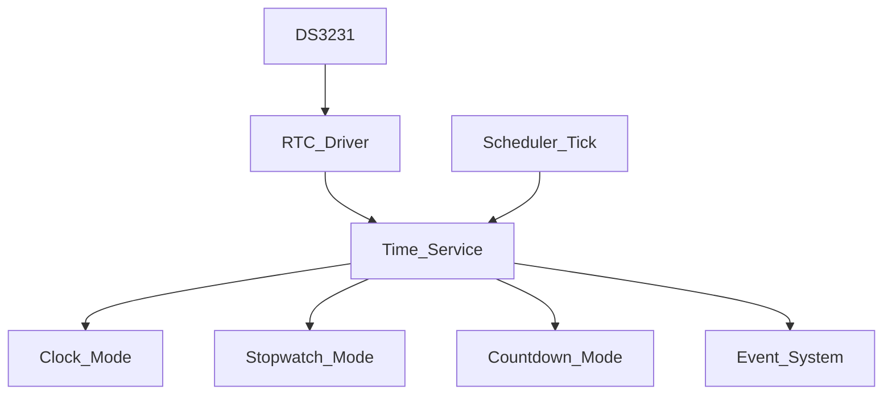
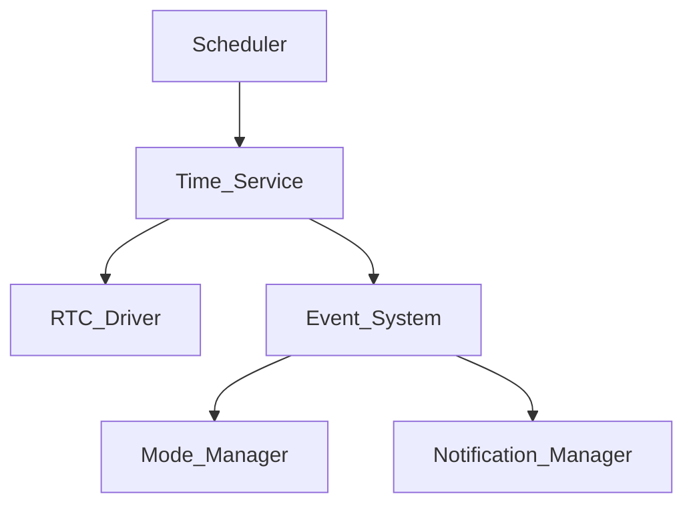
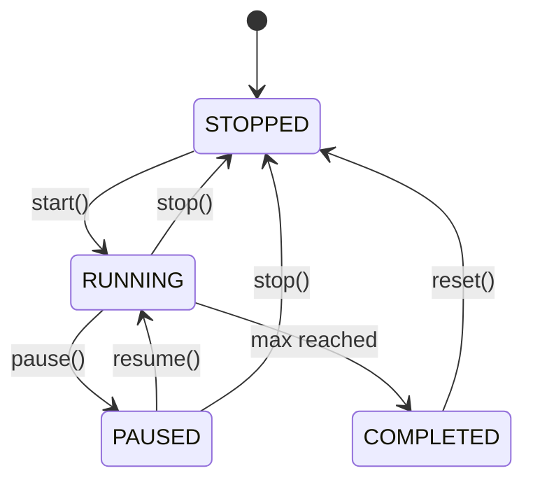
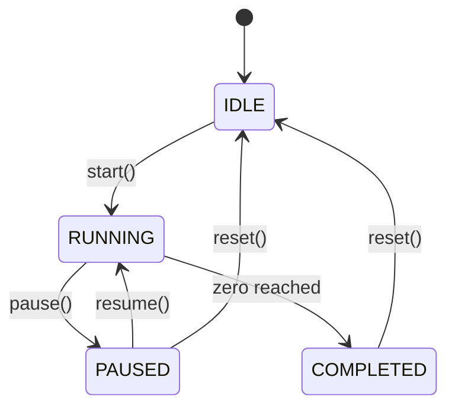
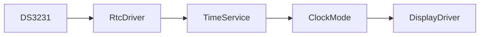
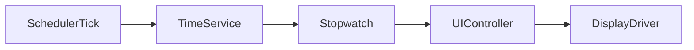
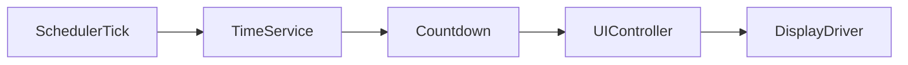

Berikut **`PROMPT_15_Time_Service.md`**. Modul ini saya buat sebagai **abstraksi waktu utama firmware**: `RTC Driver` hanya membaca DS3231, sedangkan `Time Service` menjadi sumber waktu aplikasi untuk Clock, Stopwatch, Countdown, tick 1 detik, dan sinkronisasi waktu.

Peningkatan penting: **Stopwatch dan Countdown tidak boleh bergantung pada pembacaan RTC setiap tick**. Keduanya menggunakan monotonic system tick dari Scheduler agar timing tetap stabil.

````md
# PROMPT_15_Time_Service.md

# Vibe Coding Prompt
# Module Implementation: Time Service


Anda adalah **Senior Embedded Firmware Engineer** yang bertanggung jawab membuat firmware production-grade untuk project:

# Operation Timer Embedded System


Target platform:

- PlatformIO
- Arduino Framework
- Arduino Nano
- ATmega328P
- Embedded C++


---

# Task


Implementasikan modul:


```text
Time Service
````

Time Service merupakan abstraksi waktu utama firmware.

Modul ini menjadi penghubung antara:

```text
RTC Driver
     |
     v
Time Service
     |
     +---- Clock Mode
     +---- Stopwatch Mode
     +---- Countdown Mode
     +---- UI Controller
     +---- Notification Manager
```

---

# Objective

Time Service harus:

* deterministic
* non-blocking
* hemat SRAM
* tidak bergantung langsung pada display
* memisahkan wall clock dari elapsed time
* menyediakan system time
* menyediakan 1-second tick
* menyediakan stopwatch timing
* menyediakan countdown timing
* menangani RTC synchronization
* mendeteksi RTC invalid

---

# IMPORTANT ARCHITECTURE RULE

Bedakan:

```text
WALL CLOCK TIME
```

dengan:

```text
MONOTONIC ELAPSED TIME
```

Wall clock berasal dari:

```text
DS3231
```

Monotonic elapsed time berasal dari:

```text
Scheduler System Tick
```

Jangan menggunakan RTC untuk menghitung elapsed time stopwatch/countdown.

---

# Time Domains

Implementasikan tiga domain waktu:

## 1. Wall Clock

Format:

```text
HH:MM:SS
```

Range:

```text
00:00:00
-
23:59:59
```

Source:

```text
DS3231
```

Digunakan oleh:

```text
Clock Mode
```

---

## 2. Monotonic Time

Source:

```text
Scheduler 1ms Tick
```

Digunakan untuk:

* stopwatch
* countdown
* timeout
* hold duration
* notification timing

Monotonic time tidak boleh mundur ketika RTC diubah.

---

## 3. Application Tick

Time Service menghasilkan:

```text
SECOND_TICK
```

setiap pergantian detik.

Event dipublish ke:

```text
Event System
```

---

# Architecture



---

# Responsibility

Time Service bertanggung jawab:

* menyimpan current wall clock
* sinkronisasi RTC
* menghasilkan monotonic elapsed time
* menyediakan system timestamp
* menghasilkan second tick
* stopwatch timing primitive
* countdown timing primitive
* time validation
* RTC health status

Time Service TIDAK bertanggung jawab:

* display rendering
* button processing
* mode selection
* buzzer
* LED
* UI

---

# Folder Structure

Buat:

```text
src/

└── services/

    ├── TimeService.h
    └── TimeService.cpp
```

---

# Dependency

Time Service boleh menggunakan:

```text
RtcDriver
Scheduler
EventSystem
common/
```

Tidak boleh menggunakan:

```text
DisplayDriver
ButtonDriver
LedDriver
BuzzerDriver
ModeManager
UIController
```

---

# Memory Rule

Target:

```text
ATmega328P
SRAM = 2KB
```

WAJIB:

* static allocation
* fixed-size structures
* no heap

Dilarang:

```cpp
new
delete
malloc
free
String
std::vector
std::map
std::chrono
```

---

# DateTime

Gunakan struktur waktu yang sudah didefinisikan oleh:

```text
PROMPT_09_RTC_Driver.md
```

Jangan membuat DateTime duplicate.

Gunakan:

```cpp
DateTime
```

secara konsisten di seluruh firmware.

---

# Duration Representation

Untuk elapsed time gunakan:

```cpp
uint32_t
```

dalam satuan:

```text
milliseconds
```

Range:

```text
0 - 4,294,967,295 ms
```

Setara sekitar:

```text
49.7 hari
```

Ini cukup untuk operation timer karena display maksimum:

```text
99:99:99
```

---

# Display Time Representation

Operation Timer menggunakan:

```text
HH:MM:SS
```

Untuk stopwatch/countdown.

Jangan menyimpan string:

```text
"12:34:56"
```

Simpan nilai numerik.

Contoh:

```cpp
struct TimeValue
{
    uint8_t hour;
    uint8_t minute;
    uint8_t second;
};
```

---

# Stopwatch Requirement

Stopwatch range:

```text
00:00:00
-
99:59:59
```

Catatan:

Display specification:

```text
00:00:00 hingga 99:99:99
```

Namun nilai waktu yang valid harus menggunakan:

```text
minute = 00-59
second = 00-59
```

Jika desain aplikasi membutuhkan format 99:99:99 sebagai counter bebas, itu harus ditangani oleh Countdown/Timer application layer, bukan RTC.

---

# Stopwatch State

Implementasikan:

```cpp
enum class StopwatchState : uint8_t
{
    STOPPED,
    RUNNING,
    PAUSED,
    COMPLETED
};
```

---

# Stopwatch API

Sediakan:

```cpp
StatusCode stopwatchStart();

StatusCode stopwatchStop();

StatusCode stopwatchPause();

StatusCode stopwatchReset();

StatusCode getStopwatch(
    TimeValue &value
) const;

StopwatchState stopwatchState() const;
```

---

# Stopwatch Timing

Ketika start:

```text
startTimestamp = monotonicTime()
```

Ketika running:

```text
elapsed =
monotonicTime()
-
startTimestamp
+
accumulatedTime
```

Jangan:

```text
elapsed = RTC current time - start RTC time
```

---

# Stopwatch Precision

Target:

```text
1ms internal precision
```

Display resolution:

```text
1 second
```

Stopwatch display hanya berubah setiap detik.

---

# Stopwatch Overflow

Maximum application display:

```text
99:59:59
```

Jika maximum tercapai:

```text
COMPLETED
```

Stopwatch tidak boleh overflow kembali ke:

```text
00:00:00
```

kecuali:

```text
reset()
```

---

# Countdown Requirement

Countdown menggunakan:

```text
HH:MM:SS
```

Range:

```text
00:00:00
-
99:59:59
```

---

# Countdown State

Implementasikan:

```cpp
enum class CountdownState : uint8_t
{
    IDLE,
    RUNNING,
    PAUSED,
    COMPLETED
};
```

---

# Countdown API

Sediakan:

```cpp
StatusCode countdownSet(
    const TimeValue &value
);

StatusCode countdownStart();

StatusCode countdownStop();

StatusCode countdownPause();

StatusCode countdownReset();

StatusCode getCountdown(
    TimeValue &value
) const;

CountdownState countdownState() const;
```

---

# Countdown Timing

Ketika running:

```text
remaining =
initialDuration
-
elapsed
```

Jika:

```text
remaining <= 0
```

maka:

```text
remaining = 00:00:00

state = COMPLETED
```

Jangan melakukan unsigned underflow.

---

# Countdown Completion Event

Ketika countdown mencapai:

```text
00:00:00
```

publish:

```cpp
EventType::TIMER_STOP
```

dan/atau event completion khusus jika event type tersebut sudah tersedia.

Jika membutuhkan event baru:

tambahkan secara terkontrol ke:

```text
EventSystem
```

Jangan menggunakan event string.

---

# Time Conversion

Implementasikan helper:

```cpp
uint32_t timeValueToSeconds(
    const TimeValue &value
);
```

dan:

```cpp
void secondsToTimeValue(
    uint32_t seconds,
    TimeValue &value
);
```

Passing reference wajib.

---

# Conversion Rule

Contoh:

```text
01:02:03
```

menjadi:

```text
3723 seconds
```

Formula:

```text
hours * 3600
+
minutes * 60
+
seconds
```

---

# Validation

Validasi:

## Hour

```text
0-99
```

## Minute

```text
0-59
```

## Second

```text
0-59
```

Invalid:

```cpp
StatusCode::INVALID_PARAMETER
```

---

# Wall Clock

Sediakan:

```cpp
StatusCode getDateTime(
    DateTime &time
) const;
```

Data berasal dari cache Time Service.

Jangan melakukan I2C di:

```text
getDateTime()
```

---

# RTC Synchronization

RTC dibaca:

```text
1x per second
```

oleh Scheduler task.

Flow:

```text
Scheduler

-->

TimeService::update()

-->

RTC Driver::read()

-->

Time Cache
```

---

# RTC Read Rule

Time Service boleh membaca RTC hanya pada task context.

Tidak boleh dari:

```text
Display ISR
Timer ISR
Button ISR
```

---

# RTC Invalid

Jika RTC Driver melaporkan:

```text
RTC_LOST_POWER
```

atau status invalid:

Time Service harus menyimpan:

```cpp
bool rtcValid;
```

dengan nilai:

```text
false
```

Clock Mode harus dapat mengetahui kondisi tersebut.

---

# RTC Recovery

Jika RTC kembali valid:

```text
rtcValid = true
```

Time Service melakukan resynchronization wall clock.

Stopwatch dan countdown TIDAK boleh di-reset hanya karena RTC resync.

---

# RTC Synchronization Independence

PENTING:

Perubahan waktu RTC:

```text
12:00:00
-
13:00:00
```

tidak boleh mengubah:

```text
stopwatch elapsed time
countdown elapsed time
```

Karena keduanya menggunakan monotonic tick.

---

# Monotonic Time

Gunakan:

```cpp
uint32_t nowMs() const;
```

Source:

```text
Scheduler Tick
```

Contoh:

```cpp
uint32_t currentTime = scheduler.tick();
```

Jika Scheduler API berbeda, gunakan abstraction yang tersedia.

Jangan menggunakan:

```cpp
millis()
```

---

# Tick Wraparound

ATmega328P menggunakan:

```text
uint32_t
```

Implementasikan perbandingan waktu dengan teknik unsigned subtraction.

Contoh:

```cpp
if ((uint32_t)(now - previous) >= interval)
{
    ...
}
```

Jangan menggunakan perbandingan absolut yang gagal saat rollover.

---

# One Second Tick

Time Service harus mendeteksi:

```text
1000ms
```

dan menghasilkan:

```text
EventType::SECOND_TICK
```

Event source:

```text
EventSource::RTC
```

atau source system/time yang sudah ditetapkan project.

Gunakan satu convention secara konsisten.

---

# Second Tick Accuracy

Target:

```text
±1ms
```

terhadap system tick.

Jangan menggunakan:

```text
delay(1000)
```

---

# Time Update Architecture

Gunakan:

```text
Scheduler 10ms
       |
       v
TimeService::update()
       |
       +---- monotonic time
       |
       +---- RTC sync
       |
       +---- second tick
       |
       +---- stopwatch
       |
       +---- countdown
```

---

# Scheduler Period

Recommended:

```text
10ms
```

Time Service update dijalankan:

```text
100Hz
```

Namun RTC hanya dibaca:

```text
1Hz
```

---

# Avoid Excessive RTC Access

Jangan melakukan:

```text
RTC read
setiap 10ms
```

Yang benar:

```text
TimeService update 10ms

        |

internal elapsed counter

        |

RTC read setiap 1000ms
```

---

# Clock Drift

Clock display menggunakan RTC sebagai authority.

Stopwatch/countdown menggunakan system monotonic timing.

Dengan demikian:

```text
RTC correction
```

tidak menyebabkan:

```text
Stopwatch jump
Countdown jump
```

---

# Clock Set API

Sediakan:

```cpp
StatusCode setDateTime(
    const DateTime &time
);
```

Flow:

```text
UI

-->

TimeService

-->

RTC Driver

-->

DS3231
```

Validasi harus dilakukan sebelum menulis RTC.

---

# Save Rule

Time Service tidak mengetahui tombol SAVE.

UI Controller menentukan kapan:

```text
setDateTime()
```

dipanggil.

---

# Time Service State

Gunakan struktur:

```cpp
struct TimeServiceState
{
    DateTime currentTime;

    bool rtcValid;

    uint32_t monotonicMs;

    uint32_t lastRtcSyncMs;

    uint32_t lastSecondTickMs;
};
```

Hindari state yang tidak diperlukan.

---

# Passing By Reference

WAJIB:

```cpp
StatusCode getDateTime(
    DateTime &time
) const;
```

dan:

```cpp
StatusCode getCountdown(
    TimeValue &value
) const;
```

Jangan mengembalikan struct besar by value.

---

# ISR Rule

Time Service tidak boleh dipanggil dari ISR.

ISR hanya boleh mengubah:

```text
system tick
```

Jika diperlukan.

---

# Event Integration

Time Service menggunakan:

```text
Event System
```

untuk:

```text
SECOND_TICK
TIMER_STOP
ERROR
```

Event System tetap menjadi transport layer.

Time Service tidak boleh langsung memanggil:

```text
Notification Manager
Mode Manager
Display Driver
```

---

# Event Flow



---

# Stopwatch Flow



---

# Countdown Flow



---

# Wall Clock Flow



---

# Stopwatch Flow



---

# Countdown Flow



---

# Concurrency Rule

Time Service dapat diakses oleh beberapa application module.

Namun hanya:

```text
TimeService::update()
```

yang mengubah internal timing state.

Getter:

```text
const
```

sebisa mungkin.

---

# Getter Rule

Gunakan:

```cpp
bool isRtcValid() const;

uint32_t nowMs() const;

StopwatchState stopwatchState() const;

CountdownState countdownState() const;
```

Getter tidak boleh mengubah state.

---

# Error Handling

Gunakan:

```cpp
StatusCode
```

Minimal:

```text
OK
INVALID_PARAMETER
NOT_READY
ERROR
```

---

# Unit Test

Buat:

```text
test/services/time/
```

---

# Test 1

Wall Clock Read

Mock RTC:

```text
12:34:56
```

Expected:

```text
12:34:56
```

---

# Test 2

RTC Invalid

Mock:

```text
RTC_LOST_POWER
```

Expected:

```text
rtcValid == false
```

---

# Test 3

RTC Recovery

RTC kembali valid.

Expected:

```text
rtcValid == true
```

dan current time diperbarui.

---

# Test 4

Second Tick

Simulasikan:

```text
1000ms
```

Expected:

```text
SECOND_TICK
```

---

# Test 5

No Early Tick

Simulasikan:

```text
999ms
```

Expected:

```text
no SECOND_TICK
```

---

# Test 6

Stopwatch Start

Start stopwatch.

Simulasikan:

```text
5000ms
```

Expected:

```text
00:00:05
```

---

# Test 7

Stopwatch Pause

Start:

```text
00:00:00
```

Run:

```text
5000ms
```

Pause.

Advance:

```text
5000ms
```

Expected tetap:

```text
00:00:05
```

---

# Test 8

Stopwatch Resume

Resume dari:

```text
00:00:05
```

Advance:

```text
3000ms
```

Expected:

```text
00:00:08
```

---

# Test 9

Stopwatch Maximum

Set elapsed mendekati:

```text
99:59:59
```

Advance melewati maximum.

Expected:

```text
99:59:59
COMPLETED
```

Tidak boleh rollover.

---

# Test 10

Countdown

Set:

```text
00:00:10
```

Start.

Advance:

```text
3000ms
```

Expected:

```text
00:00:07
```

---

# Test 11

Countdown Completion

Set:

```text
00:00:03
```

Start.

Advance:

```text
3000ms
```

Expected:

```text
00:00:00
COMPLETED
```

---

# Test 12

Countdown No Underflow

Advance lebih dari duration.

Expected:

```text
00:00:00
```

Tidak boleh:

```text
99:59:59
```

---

# Test 13

RTC Correction

RTC berubah:

```text
10:00:00

to

12:00:00
```

Stopwatch harus tetap menghitung berdasarkan monotonic time.

---

# Test 14

Set DateTime

Input valid:

```text
23:59:59
```

Expected:

```text
StatusCode::OK
```

---

# Test 15

Invalid DateTime

Input:

```text
25:70:90
```

Expected:

```text
StatusCode::INVALID_PARAMETER
```

---

# Test 16

Tick Rollover

Simulasikan:

```text
uint32_t rollover
```

Pastikan interval calculation tetap benar.

---

# Documentation

Buat:

```text
docs/Time_Service.md
```

Dokumentasi minimal:

* architecture
* wall clock
* monotonic clock
* RTC synchronization
* stopwatch
* countdown
* second tick
* state machine
* API
* timing rules

---

# Memory Budget

Target:

| Resource           |     Limit |
| ------------------ | --------: |
| Flash              |      <4KB |
| SRAM               | <150 byte |
| Heap               |    0 byte |
| Dynamic allocation | Forbidden |

---

# Performance

`TimeService::update()` target:

```text
<500us
```

RTC I2C transaction boleh membutuhkan waktu lebih lama daripada operasi normal, tetapi tidak boleh dilakukan lebih sering dari:

```text
1x / second
```

---

# Coding Standard

Class:

```text
PascalCase
```

Example:

```cpp
TimeService
```

Function:

```text
camelCase
```

Example:

```cpp
getDateTime()
stopwatchStart()
countdownStart()
```

Variable:

```text
camelCase
```

Constant:

```text
UPPER_CASE
```

Enum:

```text
PascalCase type
UPPER_CASE members
```

---

# Important Implementation Rules

WAJIB:

* menggunakan RTC Driver
* menggunakan Scheduler tick
* menggunakan Event System
* wall clock terpisah dari monotonic time
* stopwatch tidak bergantung RTC
* countdown tidak bergantung RTC
* RTC dibaca maksimum 1x per detik
* tidak menggunakan millis()
* tidak menggunakan delay()
* tidak menggunakan heap
* passing by reference
* tidak mengakses display
* tidak mengakses button
* tidak mengontrol buzzer
* tidak mengontrol LED

---

# Output Requirement

Berikan:

1. File:

```text
src/services/TimeService.h
```

2. File:

```text
src/services/TimeService.cpp
```

3. Stopwatch implementation.

4. Countdown implementation.

5. RTC synchronization.

6. Second tick event.

7. Unit test.

8. Memory report.

9. Documentation.

10. Scheduler integration example.

---

# Final Checklist

* [ ] Wall clock menggunakan DS3231
* [ ] Monotonic time menggunakan Scheduler tick
* [ ] Stopwatch independent dari RTC
* [ ] Countdown independent dari RTC
* [ ] RTC read maksimum 1Hz
* [ ] SECOND_TICK tersedia
* [ ] RTC validity tersedia
* [ ] RTC recovery tersedia
* [ ] Stopwatch pause/resume bekerja
* [ ] Countdown pause/resume bekerja
* [ ] Countdown tidak underflow
* [ ] Stopwatch tidak overflow
* [ ] Tick rollover aman
* [ ] Tidak memakai millis()
* [ ] Tidak memakai delay()
* [ ] Tidak menggunakan heap
* [ ] Passing by reference diterapkan
* [ ] Event System digunakan
* [ ] Compile PlatformIO sukses
* [ ] Unit test tersedia
* [ ] Dokumentasi tersedia
