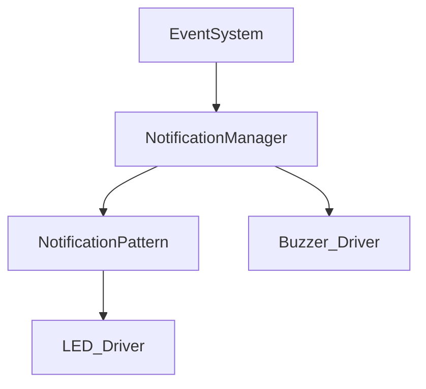
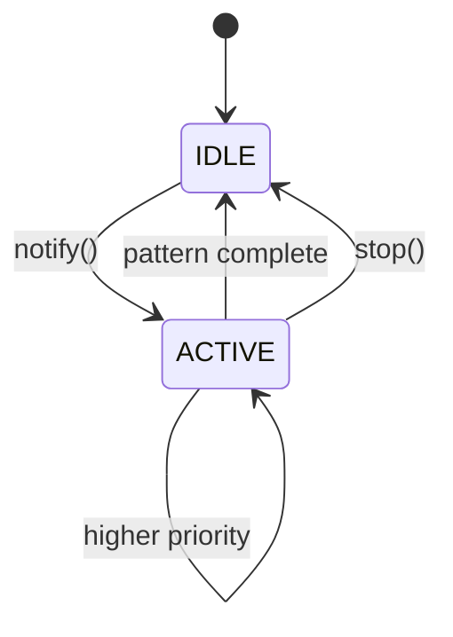
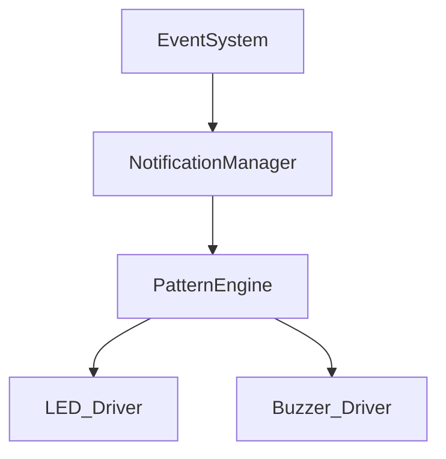
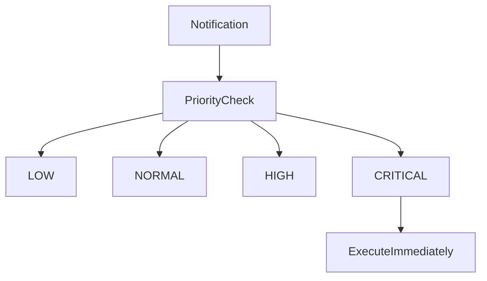
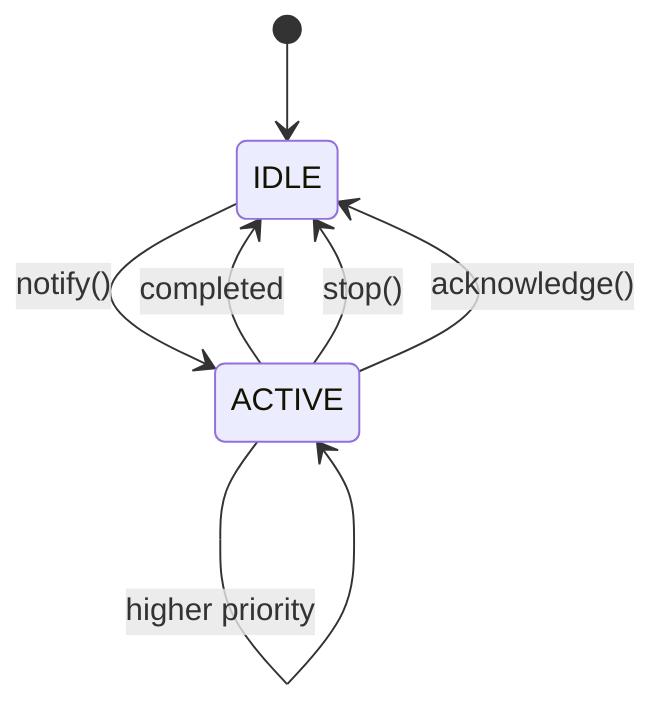

Berikut **`PROMPT_16_Notification_Manager.md`**. Saya implementasikan sebagai lapisan abstraksi untuk **LED + buzzer**, sehingga Mode Manager/UI tidak perlu mengontrol hardware secara langsung. Saya juga menambahkan **priority, pattern, non-blocking timing, dan arbitration** agar notifikasi tidak saling bertabrakan.

````md
# PROMPT_16_Notification_Manager.md

# Vibe Coding Prompt
# Module Implementation: Notification Manager


Anda adalah **Senior Embedded Firmware Engineer** yang bertanggung jawab membuat firmware production-grade untuk project:

# Operation Timer Embedded System


Target platform:

- PlatformIO
- Arduino Framework
- Arduino Nano
- ATmega328P
- Embedded C++


---

# Task

Implementasikan modul:

```text
Notification Manager
```

Notification Manager bertanggung jawab mengelola seluruh feedback pengguna melalui:

- Buzzer
- LED indikator

Notification Manager menjadi abstraction layer antara application logic dan hardware driver.


---

# Architecture

Gunakan arsitektur:

```text
Application
    |
    +-- Button Event
    +-- Mode Event
    +-- Save Event
    +-- Reset Event
    +-- Error Event
    +-- Timer Event
    |
    v
Notification Manager
    |
    +---- LED Driver
    |
    +---- Buzzer Driver
```

Application layer TIDAK boleh mengakses:

```text
LED Driver
Buzzer Driver
```

secara langsung.


---

# Objective

Notification Manager harus:

- non-blocking
- deterministic
- priority based
- pattern based
- fixed memory
- no dynamic allocation
- tidak menggunakan delay()
- tidak menggunakan millis()
- mudah dikembangkan
- aman terhadap konflik notification
- kompatibel dengan Scheduler
- kompatibel dengan Event System


---

# Folder Structure

Buat:

```text
src/

└── services/

    ├── NotificationManager.h
    └── NotificationManager.cpp
```

Jika struktur project sebelumnya berbeda, ikuti struktur yang sudah digunakan project.

Jangan membuat duplicate driver.


---

# Dependencies

Notification Manager boleh menggunakan:

```text
Scheduler
EventSystem
LedDriver
BuzzerDriver
Common Library
```

Tidak boleh menggunakan:

```text
DisplayDriver
RtcDriver
TimeService
ModeManager
ButtonDriver
UIController
```

Notification Manager hanya menerima event dan mengontrol output notification.


---

# Hardware Abstraction

Notification Manager tidak boleh mengetahui:

```text
Arduino pin number
active-low detail
PWM register
GPIO register
```

Semua hardware detail harus berada pada:

```text
LED Driver
Buzzer Driver
```

---

# Important Rule

Buzzer pada hardware project adalah:

```text
Active LOW
```

LED juga harus dikontrol melalui LED Driver.

Notification Manager tidak boleh melakukan:

```cpp
digitalWrite()
```

langsung.


---

# Notification Architecture




---

# Notification Type

Implementasikan:

```cpp
enum class NotificationType : uint8_t
{
    NONE,

    BUTTON_SHORT,
    BUTTON_HOLD,
    BUTTON_REPEAT,

    SAVE,
    RESET,

    MODE_CHANGE,

    TIMER_START,
    TIMER_STOP,
    TIMER_COMPLETE,

    POWER_ON,

    ERROR,

    SYSTEM_READY,

    SYSTEM_ERROR
};
```


Jika event type yang dibutuhkan belum tersedia pada Event System, lakukan integrasi secara konsisten.

Jangan menggunakan string untuk notification type.


---

# Notification Priority

Implementasikan:

```cpp
enum class NotificationPriority : uint8_t
{
    LOW = 0,
    NORMAL,
    HIGH,
    CRITICAL
};
```


Priority:

|Priority|Purpose|
|-|-|
|LOW|informational|
|NORMAL|normal user feedback|
|HIGH|important event|
|CRITICAL|error/safety related|


---

# Default Priority

Gunakan mapping:

|Notification|Priority|
|-|-|
|BUTTON_SHORT|LOW|
|BUTTON_REPEAT|LOW|
|BUTTON_HOLD|NORMAL|
|SAVE|NORMAL|
|MODE_CHANGE|NORMAL|
|TIMER_START|NORMAL|
|TIMER_STOP|NORMAL|
|TIMER_COMPLETE|HIGH|
|RESET|HIGH|
|ERROR|HIGH|
|SYSTEM_ERROR|CRITICAL|


Mapping harus berada di Notification Manager.

---

# Notification Pattern

Notification harus direpresentasikan sebagai pattern.

Contoh:

```text
SHORT_BEEP
DOUBLE_BEEP
LONG_BEEP
ERROR_BEEP
SUCCESS_BEEP
```

LED:

```text
OFF
ON
SHORT_FLASH
DOUBLE_FLASH
BLINK
FAST_BLINK
ERROR_BLINK
```

---

# Pattern Definition

Gunakan fixed-size structure:

```cpp
struct NotificationStep
{
    uint16_t durationMs;

    bool ledOn;

    bool buzzerOn;
};
```

Jangan menggunakan dynamic array.


---

# Pattern Container

Gunakan:

```cpp
static constexpr uint8_t MAX_PATTERN_STEPS = 8;
```

Contoh:

```cpp
struct NotificationPattern
{
    NotificationPriority priority;

    uint8_t stepCount;

    NotificationStep steps[MAX_PATTERN_STEPS];
};
```

Jika memory analysis menunjukkan struktur terlalu besar, optimalkan menggunakan enum/index pattern table.


---

# Recommended Optimization

Karena ATmega328P hanya memiliki 2KB SRAM, pattern constant sebaiknya disimpan di Flash/PROGMEM jika tidak perlu dimodifikasi runtime.

Contoh:

```cpp
const NotificationStep pattern[] PROGMEM =
{
    ...
};
```

Jangan menyalin seluruh pattern table ke SRAM.


---

# Pattern Library

Minimal implementasikan:

```text
BUTTON_SHORT
BUTTON_HOLD
BUTTON_REPEAT

SAVE
RESET

MODE_CHANGE

TIMER_START
TIMER_STOP
TIMER_COMPLETE

POWER_ON

ERROR
SYSTEM_READY
SYSTEM_ERROR
```

---

# Recommended Default Patterns

## BUTTON_SHORT

```text
LED:    OFF
BUZZER: short beep
```

Duration:

```text
50ms
```

---

## BUTTON_HOLD

```text
LED:    OFF
BUZZER: medium beep
```

Duration:

```text
100ms
```

---

## BUTTON_REPEAT

```text
LED:    OFF
BUZZER: short beep
```

Duration:

```text
30ms
```

---

## SAVE

```text
LED:    short flash
BUZZER: double short beep
```

---

## RESET

```text
LED:    double flash
BUZZER: long beep
```

---

## MODE_CHANGE

```text
LED:    short flash
BUZZER: short beep
```

---

## TIMER_START

```text
LED:    short flash
BUZZER: short beep
```

---

## TIMER_STOP

```text
LED:    short flash
BUZZER: double beep
```

---

## TIMER_COMPLETE

```text
LED:    repeating flash
BUZZER: repeating notification
```

Notification harus berhenti ketika application mengirim event acknowledge/stop.

---

## ERROR

```text
LED:    double flash
BUZZER: double beep
```

---

## SYSTEM_ERROR

```text
LED:    fast blink
BUZZER: repeated error pattern
```

---

# Safety Rule

Notification Manager tidak boleh membuat buzzer berbunyi terus menerus tanpa batas kecuali:

```text
CRITICAL
```

notification memang membutuhkan persistent indication.

Persistent notification harus dapat dihentikan melalui API.

---

# API

Implementasikan:

```cpp
class NotificationManager
{
public:

    StatusCode begin();

    StatusCode notify(
        NotificationType type
    );

    StatusCode notify(
        NotificationType type,
        NotificationPriority priority
    );

    void update();

    void stop();

    bool isActive() const;

    NotificationPriority activePriority() const;

};
```

---

# Passing By Reference Rule

Jika API menerima object, gunakan reference.

Contoh:

```cpp
StatusCode notify(
    const Notification &notification
);
```

Jangan:

```cpp
StatusCode notify(
    Notification notification
);
```

Jika enum digunakan langsung, passing by value diperbolehkan karena ukuran hanya 1 byte.

---

# Notification Object

Jika diperlukan implementasikan:

```cpp
struct Notification
{
    NotificationType type;

    NotificationPriority priority;
};
```

Gunakan reference:

```cpp
StatusCode notify(
    const Notification &notification
);
```

---

# Notification Queue

Notification Manager boleh memiliki queue kecil untuk pending notification.

Gunakan:

```text
MAX_PENDING_NOTIFICATIONS = 4
```

Fixed-size ring buffer.

Tidak menggunakan:

```text
malloc
new
std::queue
std::vector
```

---

# Queue Policy

Notification Queue tidak boleh mengalahkan critical notification.

Jika queue penuh:

- LOW boleh ditolak
- NORMAL boleh ditolak
- HIGH harus dipertimbangkan
- CRITICAL harus selalu mendapatkan jalur notification

Gunakan desain yang deterministic.

Recommended:

```text
4 total slots

3 normal slots
1 reserved critical slot
```

---

# Priority Arbitration

Jika notification sedang aktif:

```text
LOW
```

kemudian datang:

```text
HIGH
```

HIGH harus dapat mengambil alih setelah current step aman untuk dihentikan.

Jika:

```text
CRITICAL
```

datang:

CRITICAL harus mengambil prioritas.


---

# Preemption Rule

Jangan melakukan preemption pada tengah operasi hardware yang kritis.

Notification pattern dapat dihentikan pada boundary step.

Contoh:

```text
Step 1
   |
   v
Step 2
   |
   +---- HIGH arrives
   |
   v
Stop pattern
   |
   v
HIGH pattern
```

---

# Notification Lifecycle



---

# Pattern Timing

Notification Manager menggunakan:

```text
Scheduler tick
```

Jangan menggunakan:

```cpp
delay()
millis()
```

Timing harus menggunakan monotonic system tick dari Scheduler.


---

# Non Blocking Rule

DILARANG:

```cpp
delay(100);
```

DILARANG:

```cpp
while(...)
{
    ...
}
```

Notification harus diproses sedikit demi sedikit pada:

```text
NotificationManager::update()
```


---

# Update Flow

Contoh:

```cpp
void update()
{
    uint32_t now = scheduler.tick();

    if (!patternActive)
    {
        return;
    }

    if ((uint32_t)(now - stepStartMs) >= currentStepDuration)
    {
        nextStep();
    }
}
```

Gunakan unsigned subtraction untuk rollover-safe timing.


---

# LED Control

Notification Manager hanya memanggil:

```cpp
ledDriver.on();
ledDriver.off();
```

atau API setara yang sudah didefinisikan oleh:

```text
PROMPT_11_LED_Driver.md
```

Tidak boleh mengakses GPIO langsung.


---

# Buzzer Control

Notification Manager hanya memanggil:

```cpp
buzzerDriver.on();
buzzerDriver.off();
```

atau API setara yang sudah didefinisikan oleh:

```text
PROMPT_12_Buzzer_Driver.md
```

Tidak boleh mengetahui bahwa buzzer aktif LOW.


---

# Output Synchronization

LED dan buzzer harus berubah berdasarkan step pattern yang sama.

Contoh:

```text
Time

0ms       50ms      100ms

LED
OFF       ON        OFF

Buzzer
OFF       ON        OFF
```

---

# Independent Output

Pattern harus dapat mendukung:

```text
LED ON
Buzzer OFF
```

dan:

```text
LED OFF
Buzzer ON
```

Contoh:

```cpp
NotificationStep
{
    .durationMs = 100,
    .ledOn = true,
    .buzzerOn = false
};
```

---

# Button Feedback

Button feedback berasal dari:

```text
PROMPT_10_Button_Driver
```

Event:

```text
BUTTON_SHORT
BUTTON_HOLD
BUTTON_REPEAT
```

Notification Manager mengubahnya menjadi feedback.

---

# Event Integration

Notification Manager menerima event dari:

```text
EventSystem
```

Contoh:

```text
BUTTON_SHORT
      |
      v
EventSystem
      |
      v
NotificationManager
      |
      +---- short beep
```

---

# Event Processing

Notification Manager tidak boleh mengambil seluruh Event Queue.

Event dispatch dilakukan oleh application/event processing layer.

Contoh:

```cpp
switch (event.type)
{
    case EventType::BUTTON_SHORT:
        notificationManager.notify(
            NotificationType::BUTTON_SHORT
        );
        break;

    ...
}
```

Jika architecture Event Dispatcher belum dibuat, Notification Manager tetap menyediakan API `notify()`.


---

# Important Separation

Jangan membuat:

```cpp
NotificationManager
{
    processButton();
    processRTC();
    processMode();
}
```

Notification Manager hanya:

```text
Notification Input
        |
        v
Pattern Selection
        |
        v
Pattern Execution
        |
        v
LED/Buzzer
```

---

# Timer Completion

Ketika countdown selesai:

```text
Countdown
    |
    v
EventSystem
    |
    v
NotificationManager
    |
    v
TIMER_COMPLETE
```

Notification Manager memainkan completion pattern.

Jangan melakukan pengecekan countdown langsung dari Notification Manager.


---

# Persistent Notification

Untuk:

```text
TIMER_COMPLETE
ERROR
SYSTEM_ERROR
```

boleh menggunakan persistent/repeating pattern.

Implementasikan:

```cpp
StatusCode acknowledge();
```

Acknowledge menghentikan notification persistent.


---

# Acknowledge Rule

Acknowledge tidak boleh melakukan:

```text
reset timer
change mode
modify RTC
```

Acknowledge hanya menghentikan notification.


---

# API Addition

Jika persistent notification dibutuhkan:

```cpp
StatusCode acknowledge();
```

---

# Power-On Notification

Ketika system boot:

```text
SYSTEM_READY
```

dapat dimainkan setelah semua critical hardware initialization berhasil.

Flow:

```text
Boot
 |
 +-- GPIO OK
 +-- RTC OK
 +-- Display OK
 +-- Drivers OK
 |
 v
SYSTEM_READY
```

Jika initialization gagal:

```text
SYSTEM_ERROR
```

---

# Initialization Rule

Jangan memainkan notification sebelum:

```text
NotificationManager::begin()
```

selesai.

`begin()` harus memastikan:

```text
LED OFF
BUZZER OFF
pattern inactive
queue empty
```

---

# Safe State

Jika terjadi error internal:

```text
LED = OFF
BUZZER = OFF
```

kecuali error notification memang harus menunjukkan error.


---

# Watchdog Compatibility

Notification Manager tidak boleh menyebabkan watchdog timeout.

Semua operasi harus bounded.


---

# Memory Budget

Target:

|Resource|Limit|
|-|-:|
|SRAM|<150 byte|
|Heap|0 byte|
|Dynamic allocation|Forbidden|

Pattern table yang konstan sebaiknya berada di Flash.


---

# Performance

Target:

```text
NotificationManager::update()
<100us
```

Tidak termasuk overhead driver yang memang diperlukan.

Tidak boleh melakukan:

```text
I2C
Serial logging
Display refresh
```

di dalam update.


---

# Scheduler Integration

Notification Manager dijalankan oleh Scheduler.

Recommended:

```text
Period = 10ms
```

Flow:

```text
Timer2
   |
   v
Scheduler
   |
   v
NotificationManager::update()
   |
   +---- LED
   |
   +---- Buzzer
```

---

# Event Latency

Target notification response:

```text
<20ms
```

untuk normal event.

Critical notification:

```text
<10ms
```

jika scheduler configuration memungkinkan.


---

# Rollover Safety

Semua timing menggunakan:

```cpp
(uint32_t)(now - previous)
```

Jangan:

```cpp
if (now >= targetTime)
```

jika target timestamp dapat melewati uint32_t rollover.


---

# Default Pattern Table

Buat pattern table minimal:

```text
PATTERN_BUTTON_SHORT
PATTERN_BUTTON_HOLD
PATTERN_BUTTON_REPEAT

PATTERN_SAVE
PATTERN_RESET

PATTERN_MODE_CHANGE

PATTERN_TIMER_START
PATTERN_TIMER_STOP
PATTERN_TIMER_COMPLETE

PATTERN_POWER_ON

PATTERN_ERROR
PATTERN_SYSTEM_READY
PATTERN_SYSTEM_ERROR
```

Gunakan ID/index kecil daripada menyimpan object besar di SRAM.


---

# Pattern Storage

Prioritaskan:

```text
PROGMEM
```

untuk pattern constant.

Pattern runtime hanya menyimpan:

```text
patternId
currentStep
stepStartMs
priority
active
persistent
```

---

# Recommended Runtime State

Gunakan struktur kecil:

```cpp
struct NotificationRuntime
{
    uint8_t patternId;

    uint8_t currentStep;

    NotificationPriority priority;

    uint32_t stepStartMs;

    bool active;

    bool persistent;
};
```

Jangan menyimpan seluruh pattern di runtime state.


---

# No String

DILARANG:

```cpp
String notificationName;
```

Gunakan:

```cpp
enum class NotificationType
```

---

# Diagnostic Support

Sediakan:

```cpp
uint8_t pending() const;

uint8_t overflowCount() const;
```

Jika tidak diperlukan pada final implementation, jelaskan alasan penghapusannya.


---

# Factory Mode Compatibility

Notification Manager harus dapat digunakan oleh:

```text
Factory Mode
Diagnostic System
```

untuk menguji:

```text
LED
Buzzer
```

Contoh:

```text
Factory Test
    |
    +-- LED ON/OFF
    |
    +-- Buzzer ON/OFF
```

Factory Mode tidak boleh mengakses GPIO langsung jika LED/Buzzer Driver sudah menyediakan test API.


---

# Unit Test

Buat:

```text
test/services/notification/
```

---

# Test 1

Initialization.

Expected:

```text
LED OFF
BUZZER OFF
active == false
```

---

# Test 2

BUTTON_SHORT.

Expected:

```text
short beep pattern
```

---

# Test 3

SAVE.

Expected:

```text
save pattern
```

---

# Test 4

RESET.

Expected:

```text
reset pattern
```

---

# Test 5

MODE_CHANGE.

Expected:

```text
mode pattern
```

---

# Test 6

TIMER_START.

Expected:

```text
start pattern
```

---

# Test 7

TIMER_COMPLETE.

Expected:

```text
completion pattern
```

---

# Test 8

ERROR.

Expected:

```text
error pattern
```

---

# Test 9

Pattern Timing.

Simulasikan:

```text
0ms
50ms
100ms
```

Pastikan step berpindah sesuai pattern.


---

# Test 10

Non Blocking.

Pastikan:

```text
update()
```

tidak melakukan delay.


---

# Test 11

Priority.

Aktifkan:

```text
LOW
```

kemudian kirim:

```text
HIGH
```

Expected:

```text
HIGH
```

mendapatkan prioritas.


---

# Test 12

Critical Priority.

Aktifkan:

```text
NORMAL
```

kemudian kirim:

```text
CRITICAL
```

Expected:

```text
CRITICAL
```

dijalankan.


---

# Test 13

Queue Full.

Penuhi queue.

Expected:

```text
LOW
```

dapat ditolak tanpa blocking.


---

# Test 14

Critical Reservation.

Queue normal penuh.

Kirim:

```text
CRITICAL
```

Expected:

```text
CRITICAL
```

tetap dapat diterima.


---

# Test 15

Stop.

Aktifkan notification.

Call:

```cpp
stop();
```

Expected:

```text
LED OFF
BUZZER OFF
active == false
```

---

# Test 16

Acknowledge.

Aktifkan persistent notification.

Call:

```cpp
acknowledge();
```

Expected:

```text
notification stopped
LED OFF
BUZZER OFF
```

---

# Test 17

Rollover.

Simulasikan:

```text
uint32_t tick rollover
```

Pastikan pattern timing tetap benar.


---

# Test 18

Pattern Completion.

Biarkan seluruh pattern selesai.

Expected:

```text
active == false
LED OFF
BUZZER OFF
```

---

# Documentation

Buat:

```text
docs/Notification_Manager.md
```

Dokumentasi minimal:

- Notification architecture
- Notification type
- Priority
- Pattern
- Pattern timing
- Queue
- Preemption
- Persistent notification
- LED integration
- Buzzer integration
- Scheduler integration
- Event integration
- Factory mode integration


---

# Mermaid Architecture

Tambahkan:




---

# Mermaid Priority

Tambahkan:




---

# Mermaid Notification Lifecycle

Tambahkan:




---

# Coding Standard

Class:

```text
PascalCase
```

Example:

```cpp
NotificationManager
```

Function:

```text
camelCase
```

Example:

```cpp
notify()
update()
acknowledge()
```

Variable:

```text
camelCase
```

Constant:

```text
UPPER_CASE
```

Enum:

```text
PascalCase type
UPPER_CASE members
```


---

# Important Implementation Rules

WAJIB:

- menggunakan Scheduler tick
- non-blocking
- tidak menggunakan delay()
- tidak menggunakan millis()
- tidak menggunakan heap
- menggunakan fixed-size data
- pattern constant diutamakan PROGMEM
- passing by reference untuk object
- priority arbitration
- critical notification reservation
- LED melalui LED Driver
- buzzer melalui Buzzer Driver
- tidak mengakses GPIO langsung
- tidak melakukan I2C
- tidak melakukan Serial logging
- tidak melakukan display operation
- tidak mengetahui button hardware
- tidak mengetahui RTC hardware
- compile PlatformIO sukses


---

# Output Requirement

Berikan:

1. File:

```text
src/services/NotificationManager.h
```

2. File:

```text
src/services/NotificationManager.cpp
```

3. Pattern library.

4. Priority handling.

5. Notification queue.

6. Scheduler integration.

7. Event integration example.

8. Unit test.

9. Memory report.

10. Documentation.


---

# Final Checklist

- [ ] Notification Manager tersedia
- [ ] LED abstraction tersedia
- [ ] Buzzer abstraction tersedia
- [ ] Tidak ada direct GPIO access
- [ ] Notification type tersedia
- [ ] Priority tersedia
- [ ] Pattern engine tersedia
- [ ] Pattern timing non-blocking
- [ ] Queue fixed-size
- [ ] Critical notification memiliki jalur prioritas
- [ ] Persistent notification tersedia
- [ ] Acknowledge tersedia
- [ ] Stop tersedia
- [ ] Scheduler integration
- [ ] Event System integration
- [ ] PROGMEM digunakan untuk constant pattern jika memungkinkan
- [ ] Passing by reference diterapkan
- [ ] Tidak menggunakan heap
- [ ] Tidak menggunakan String
- [ ] Tidak menggunakan delay()
- [ ] Tidak menggunakan millis()
- [ ] Rollover-safe timing
- [ ] Unit test tersedia
- [ ] Memory report tersedia
- [ ] Documentation tersedia
- [ ] PlatformIO compile sukses
