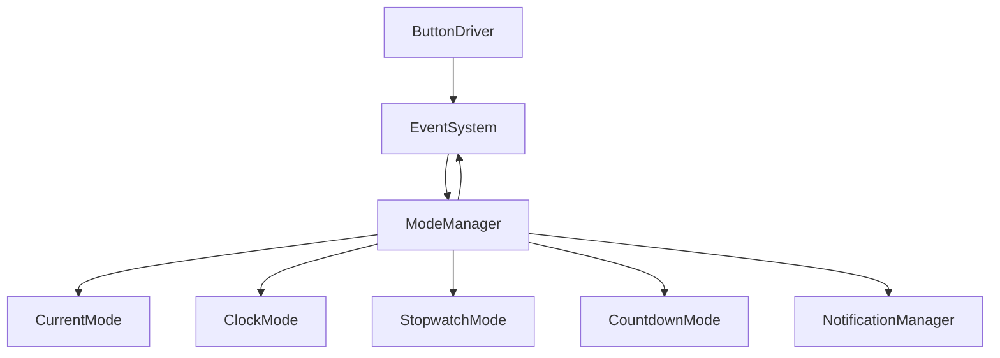
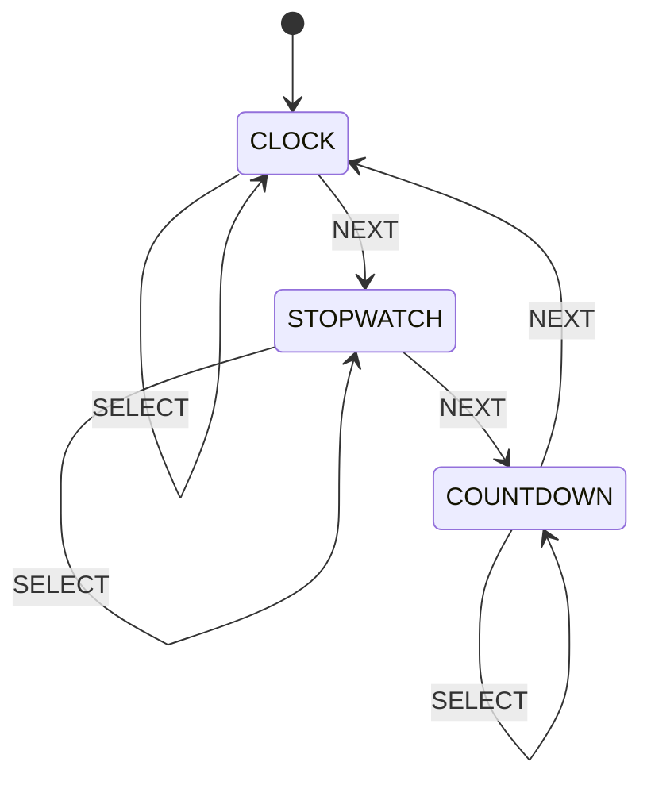
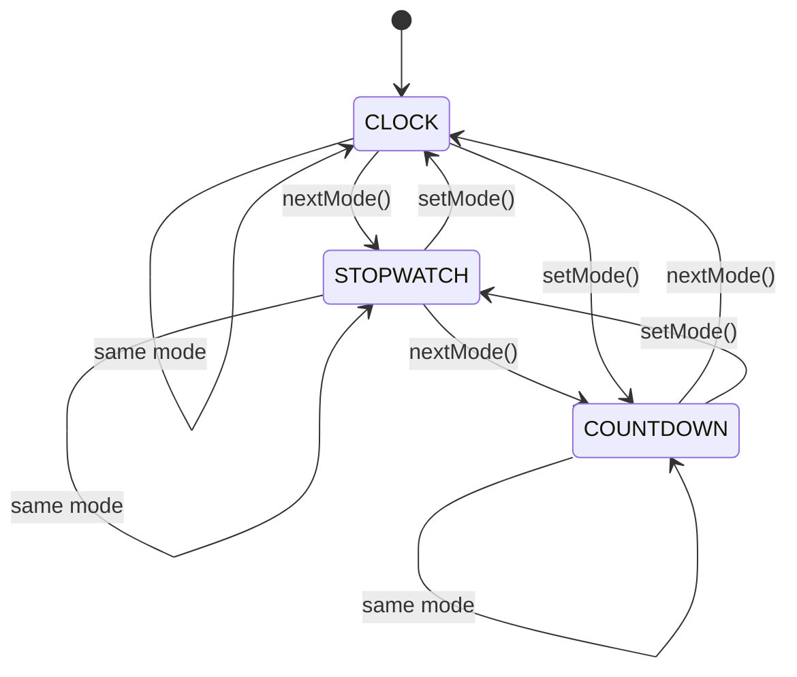
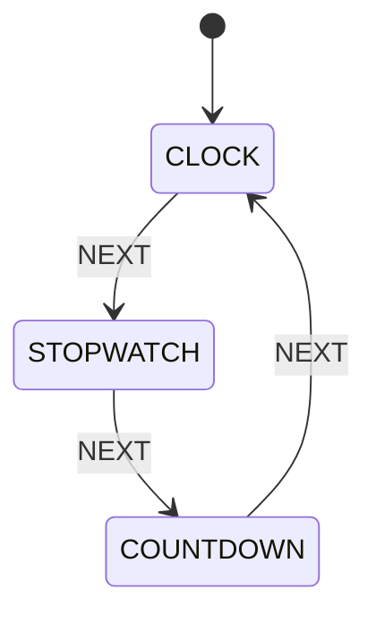
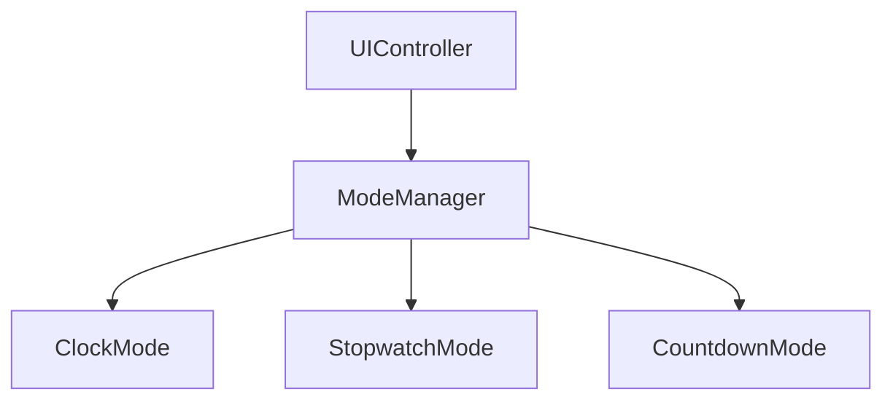

Berikut **`PROMPT_17_Mode_Manager.md`**. Pada modul ini saya pertahankan prinsip bahwa **Mode Manager hanya mengatur state/mode**, bukan mengurus display, button hardware, RTC, buzzer, atau LED secara langsung. Saya juga menambahkan **mode transition validation, event-driven transition, entry/exit action, dan state persistence yang minimal** agar cocok dengan arsitektur modul sebelumnya.

````md
# PROMPT_17_Mode_Manager.md

# Vibe Coding Prompt
# Module Implementation: Mode Manager


Anda adalah **Senior Embedded Firmware Engineer** yang bertanggung jawab membuat firmware production-grade untuk project:

# Operation Timer Embedded System


Target platform:

- PlatformIO
- Arduino Framework
- Arduino Nano
- ATmega328P
- Embedded C++


---

# Task

Implementasikan modul:

```text
Mode Manager
```

Mode Manager bertanggung jawab mengelola mode operasi utama Operation Timer.

Mode Manager hanya bertanggung jawab terhadap:

- current mode
- mode transition
- mode lifecycle
- mode entry
- mode exit
- mode transition validation
- mode change event
- mode state tracking


Mode Manager TIDAK bertanggung jawab langsung terhadap:

- GPIO
- button hardware
- display hardware
- buzzer
- LED
- RTC
- stopwatch timing
- countdown timing


---

# System Modes

Operation Timer memiliki tiga mode utama:

```text
CLOCK
STOPWATCH
COUNTDOWN
```

Tambahkan mode system-level jika architecture membutuhkan:

```text
FACTORY
DIAGNOSTIC
```

Namun mode tersebut harus diperlakukan sebagai special/system mode dan tidak boleh mengganggu normal operation.


---

# Primary Mode Enum

Implementasikan:

```cpp
enum class AppMode : uint8_t
{
    CLOCK = 0,
    STOPWATCH,
    COUNTDOWN,
    FACTORY,
    DIAGNOSTIC
};
```

Jika Factory/Diagnostic belum diaktifkan pada build production, gunakan compile-time configuration.


---

# Default Mode

Saat normal boot:

```text
CLOCK
```

harus menjadi default mode.


Flow:

```text
BOOT
 |
 v
SYSTEM_READY
 |
 v
CLOCK
```


---

# Architecture

Gunakan:




Mode Manager tidak boleh membaca button GPIO secara langsung.


---

# Event Driven Rule

Perubahan mode harus dipicu oleh event.

Contoh:

```text
NEXT button
      |
      v
Button Driver
      |
      v
Event System
      |
      v
Mode Manager
      |
      v
Next Mode
```


Jangan membuat:

```cpp
ModeManager::readButton();
```

atau:

```cpp
ModeManager::digitalRead(...);
```


---

# Mode Transition

Normal mode sequence:

```text
CLOCK
  |
  | NEXT
  v
STOPWATCH
  |
  | NEXT
  v
COUNTDOWN
  |
  | NEXT
  v
CLOCK
```


Visual:




---

# Mode Transition API

Implementasikan:

```cpp
class ModeManager
{
public:

    StatusCode begin();

    void update();

    StatusCode setMode(
        AppMode mode
    );

    StatusCode nextMode();

    AppMode currentMode() const;

    AppMode previousMode() const;

    bool isMode(
        AppMode mode
    ) const;
};
```


---

# Passing By Reference Rule

Jika function menerima object:

```cpp
StatusCode setMode(
    const ModeChangeRequest &request
);
```

gunakan:

```text
const reference
```

Jangan pass object besar by value.

Enum sederhana boleh by value karena hanya 1 byte.


---

# Mode Change Request

Jika diperlukan:

```cpp
struct ModeChangeRequest
{
    AppMode targetMode;
    EventSource source;
};
```

Gunakan:

```cpp
StatusCode setMode(
    const ModeChangeRequest &request
);
```


---

# Current Mode

Mode Manager hanya memiliki satu source of truth:

```cpp
AppMode currentMode_;
```

Jangan menyimpan duplicate current mode pada banyak module.


---

# Previous Mode

Simpan:

```cpp
AppMode previousMode_;
```

Tujuan:

- diagnostic
- transition validation
- UI feedback
- future back navigation


---

# Mode Lifecycle

Setiap mode memiliki lifecycle:

```text
EXIT
  |
  v
TRANSITION
  |
  v
ENTRY
  |
  v
ACTIVE
```

Gunakan interface mode abstraction jika diperlukan.


---

# Mode Interface

Buat abstraction:

```cpp
class IMode
{
public:

    virtual void onEnter() = 0;

    virtual void onExit() = 0;

    virtual void update() = 0;
};
```

Namun:

## IMPORTANT

Jangan memaksakan virtual interface jika hasil memory/flash lebih besar dan tidak diperlukan.

ATmega328P memiliki resource terbatas.

Jika architecture project lebih efisien menggunakan function-based dispatch, gunakan function table.


---

# Recommended Production Architecture

Untuk ATmega328P, prioritaskan static function table dibanding dynamic polymorphism.

Contoh:

```cpp
struct ModeHandler
{
    void (*onEnter)();
    void (*onExit)();
    void (*update)();
};
```

Gunakan table:

```cpp
static const ModeHandler modeHandlers[];
```

Jika function pointer table disimpan di Flash, gunakan PROGMEM bila diperlukan.


---

# Mode Manager Responsibility

Mode Manager boleh:

- menentukan current mode
- menentukan next mode
- memanggil mode lifecycle
- menerbitkan MODE_CHANGE event
- meminta notification
- melakukan transition validation


Mode Manager tidak boleh:

- membaca button
- menulis display
- membaca RTC
- menghitung stopwatch
- menghitung countdown
- mengontrol buzzer
- mengontrol LED


---

# Mode Update

Mode Manager menjalankan update mode aktif.

Flow:

```text
Scheduler
    |
    v
ModeManager::update()
    |
    v
Current Mode Handler
```

Mode Manager hanya meneruskan update kepada mode aktif.


---

# Scheduler Integration

Recommended:

```text
ModeManager::update()
```

dipanggil setiap:

```text
10ms
```

atau sesuai scheduler architecture.


---

# Timing Rule

Mode Manager tidak boleh menggunakan:

```cpp
delay()
millis()
```

Semua timing harus menggunakan service yang sudah tersedia:

```text
Scheduler
TimeService
```

Mode Manager sendiri tidak menghitung waktu elapsed.


---

# Transition Validation

Sebelum mode berubah:

```text
requested mode
      |
      v
validation
      |
      +---- invalid -> reject
      |
      v
exit current
      |
      v
enter target
```

---

# Valid Transition Matrix

Normal operation:

|Current|Target|Allowed|
|-|-|:-:|
|CLOCK|STOPWATCH|YES|
|STOPWATCH|COUNTDOWN|YES|
|COUNTDOWN|CLOCK|YES|
|CLOCK|COUNTDOWN|YES|
|STOPWATCH|CLOCK|YES|
|COUNTDOWN|STOPWATCH|YES|
|same|same|NO-OP|


Semua normal mode dapat berpindah langsung jika diperlukan.

---

# Same Mode

Jika:

```cpp
setMode(CLOCK);
```

sementara current mode sudah:

```text
CLOCK
```

jangan melakukan:

```text
exit
entry
notification
```

cukup:

```text
StatusCode::NO_CHANGE
```

Jika `NO_CHANGE` belum tersedia, tambahkan secara konsisten ke `StatusCode`.


---

# Transition Error

Jika target mode invalid:

```cpp
StatusCode::INVALID_PARAMETER
```

Jangan mengubah current mode.


---

# Factory Mode

Factory Mode hanya boleh masuk jika:

```text
Factory enable condition
```

terpenuhi.

Jangan memungkinkan user normal masuk Factory Mode hanya dengan:

```text
NEXT
```

kecuali memang ditentukan oleh UI specification.


---

# Diagnostic Mode

Diagnostic Mode memiliki rule yang sama.

Production firmware harus dapat membatasi akses ke:

```text
FACTORY
DIAGNOSTIC
```

melalui build configuration atau protected sequence.


---

# Mode Change Event

Ketika mode berhasil berubah, publish:

```text
EventType::MODE_CHANGE
```

Event payload minimal:

```cpp
struct ModeChangeEvent
{
    AppMode previous;
    AppMode current;
};
```

Gunakan reference jika object diteruskan ke function.


---

# Event Source

Event harus memiliki source yang jelas.

Contoh:

```text
BUTTON
SYSTEM
FACTORY
DIAGNOSTIC
```

Gunakan:

```cpp
EventSource
```

dari Event System yang sudah tersedia.


---

# Mode Change Notification

Mode Manager tidak boleh mengontrol buzzer secara langsung.

Setelah transition berhasil:

```text
ModeManager
     |
     v
EventSystem
     |
     v
NotificationManager
     |
     v
MODE_CHANGE notification
```

Alternatif:

Mode Manager dapat memanggil Notification Manager abstraction jika architecture existing memang menggunakan direct service call.

Namun event-driven flow lebih disarankan.


---

# Transition Sequence

Gunakan sequence:

```text
1. Validate target
2. If same mode -> NO_CHANGE
3. Exit current mode
4. Save previous mode
5. Change current mode
6. Enter target mode
7. Publish MODE_CHANGE
8. Request notification
```

Jangan mengubah current mode sebelum current mode berhasil exit jika mode memiliki exit operation yang dapat gagal.


---

# Exit Failure

Jika mode exit memiliki kemungkinan failure:

```text
exit current
      |
      +---- FAILED
      |
      v
keep current mode
```

Jangan masuk target mode jika exit gagal.


---

# Recommended Rule

Untuk mode utama:

```text
onExit()
```

sebaiknya deterministic dan tidak gagal.

Dengan demikian transition lebih sederhana:

```text
exit
change
enter
```

Jika future requirement membutuhkan failure, gunakan `StatusCode`.


---

# Mode Entry

Mode entry digunakan untuk:

- reset UI state
- reset cursor
- load mode-specific state
- initialize display representation
- start mode-specific service


Mode entry TIDAK boleh mengontrol physical GPIO langsung.


---

# Clock Mode Entry

Ketika masuk:

```text
CLOCK
```

Clock Mode harus:

```text
display current RTC time
```

Time source berasal dari:

```text
TimeService
```

Bukan langsung dari DS3231.


---

# Stopwatch Mode Entry

Ketika masuk:

```text
STOPWATCH
```

Jangan otomatis:

```text
reset stopwatch
```

kecuali UI specification memang menetapkannya.

Current stopwatch state harus dipertahankan.


---

# Countdown Mode Entry

Ketika masuk:

```text
COUNTDOWN
```

Jangan otomatis reset countdown.

Current countdown value harus dipertahankan.


---

# Mode Exit Rule

Mode Manager tidak boleh mengubah application data saat exit kecuali mode lifecycle memang memerlukannya.


Contoh:

```text
STOPWATCH -> CLOCK
```

Stopwatch tidak otomatis reset.


---

# Mode Persistence

Jangan menyimpan mode ke EEPROM setiap mode change.

Alasan:

- EEPROM wear
- unnecessary write
- mode dapat berubah sering
- default mode adalah CLOCK


Jika persistence diperlukan di masa depan, buat service terpisah.


---

# Boot Mode

Saat boot:

```text
AppMode::CLOCK
```

Flow:

```mermaid
flowchart TD

BOOT
-->
Initialization

Initialization
-->
ModeManager::begin()

ModeManager::begin()
-->
CLOCK

CLOCK
-->
SYSTEM_READY
```


---

# Startup Safety

Sebelum `ModeManager::begin()`:

```text
LED = OFF
BUZZER = OFF
Display = safe state
```

Mode Manager tidak mengontrol output tersebut.

Initialization sequence harus ditangani oleh main integration/BSP.


---

# Mode Update Architecture

```mermaid
flowchart TD

Scheduler

-->

ModeManager::update()

-->

CurrentMode

-->

ClockMode

CurrentMode

-->

StopwatchMode

CurrentMode

-->

CountdownMode
```


Hanya satu mode aktif pada satu waktu.


---

# Active Mode Rule

Jangan melakukan:

```text
ClockMode.update()
StopwatchMode.update()
CountdownMode.update()
```

secara bersamaan.

Yang benar:

```text
Current Mode
     |
     +---- update only active mode
```


---

# Mode Dispatch

Recommended:

```cpp
switch (currentMode_)
{
    case AppMode::CLOCK:
        clockMode.update();
        break;

    case AppMode::STOPWATCH:
        stopwatchMode.update();
        break;

    case AppMode::COUNTDOWN:
        countdownMode.update();
        break;

    ...
}
```

Jika function table lebih efisien, gunakan function table.


---

# No Dynamic Allocation

DILARANG:

```cpp
new
delete
malloc
free
```

DILARANG:

```cpp
std::vector
std::map
std::function
String
```

Gunakan:

```text
static object
fixed array
enum
function pointer
```

---

# Memory Optimization

ATmega328P:

```text
Flash = 32KB
SRAM = 2KB
EEPROM = 1KB
```

Prioritas:

```text
1. SRAM
2. deterministic execution
3. flash
```

Mode Manager harus memiliki runtime state sekecil mungkin.


---

# Recommended Runtime State

```cpp
struct ModeManagerState
{
    AppMode currentMode;
    AppMode previousMode;
    bool initialized;
    bool transitionActive;
};
```

Jika `transitionActive` tidak diperlukan karena transition synchronous, hapus field tersebut.


---

# No String Mode Name

DILARANG menyimpan:

```cpp
String modeName;
```

Gunakan enum.

Untuk diagnostic display, gunakan lookup table constant.


---

# Mode Name Helper

Jika dibutuhkan:

```cpp
const char* modeName(
    AppMode mode
);
```

String literal harus disimpan di Flash jika diperlukan.

Untuk ATmega328P, gunakan:

```cpp
PROGMEM
```

bila lookup table cukup besar.


---

# Next Mode

Implementasikan:

```cpp
AppMode getNextMode(
    AppMode current
);
```

Flow:

```text
CLOCK
  ↓
STOPWATCH
  ↓
COUNTDOWN
  ↓
CLOCK
```


---

# Previous Mode

Jika diperlukan:

```cpp
AppMode getPreviousMode(
    AppMode current
);
```

Flow:

```text
CLOCK
  ↑
STOPWATCH
  ↑
COUNTDOWN
```

Namun jangan menambahkan fitur PREVIOUS button karena hardware hanya memiliki:

```text
POWER
NEXT
SELECT
UP
DOWN
```


---

# Button Integration

Mode Manager tidak membaca button langsung.

Mapping button akan ditangani oleh:

```text
UI Controller
```

Contoh:

```text
NEXT short
   |
   v
EventSystem
   |
   v
UIController
   |
   v
ModeManager::nextMode()
```


---

# SELECT Rule

`SELECT` tidak otomatis mengubah mode.

SELECT behavior akan ditentukan oleh:

```text
UI Controller
Clock Mode
Stopwatch Mode
Countdown Mode
```

Mode Manager hanya menyediakan transition API.


---

# UP/DOWN Rule

UP/DOWN tidak ditangani Mode Manager.

UP/DOWN digunakan oleh active mode/UI untuk:

- set time
- set countdown
- cursor selection
- adjustment


---

# POWER Button

POWER tidak boleh ditangani Mode Manager secara langsung.

Power behavior ditentukan oleh system/application layer.


---

# Event Processing

Jika menggunakan Event System:

```cpp
void handleEvent(
    const Event &event
);
```

gunakan:

```cpp
const Event &
```

Jangan copy object event jika ukurannya lebih besar dari primitive type.


---

# Recommended Event Handling

Minimal event yang dapat ditangani:

```text
MODE_NEXT
MODE_SELECT
FACTORY_ENTER
DIAGNOSTIC_ENTER
```

Namun button event sebaiknya diterjemahkan oleh UI Controller sebelum masuk ke Mode Manager.


---

# Mode Manager vs UI Controller

PENTING.

Jangan mencampur:

```text
Mode Manager
```

dengan:

```text
UI Controller
```

Mode Manager:

```text
"Mode apa yang aktif?"
```

UI Controller:

```text
"Button apa yang ditekan dan apa artinya?"
```

Contoh:

```text
NEXT SHORT
    |
    v
UI Controller
    |
    v
ModeManager.nextMode()
```


---

# Mode Manager vs Mode Implementation

Mode Manager:

```text
mengatur mode
```

Clock Mode:

```text
mengatur perilaku clock
```

Stopwatch Mode:

```text
mengatur perilaku stopwatch
```

Countdown Mode:

```text
mengatur perilaku countdown
```


---

# Architecture Boundary

```text
                   Mode Manager
                        |
          +-------------+-------------+
          |             |             |
          v             v             v
      Clock Mode   Stopwatch Mode  Countdown Mode
          |             |             |
          v             v             v
     TimeService    TimeService    TimeService
          |             |             |
          +-------------+-------------+
                        |
                        v
                  Event System
```


---

# Mode Transition Diagram

Tambahkan:




---

# System Mode Protection

Tambahkan compile-time configuration jika diperlukan:

```cpp
#define ENABLE_FACTORY_MODE 0
#define ENABLE_DIAGNOSTIC_MODE 0
```

Namun jangan menggunakan macro berlebihan.

Lebih baik gunakan configuration header jika project architecture sudah menyediakannya.


---

# Production Rule

Production build harus:

```text
FACTORY = disabled
DIAGNOSTIC = disabled
```

kecuali memang diperlukan untuk manufacturing/service.


---

# Factory Build

Factory build dapat:

```text
FACTORY = enabled
DIAGNOSTIC = enabled
```

Factory mode harus tetap menggunakan:

```text
LED Driver
Buzzer Driver
Display Driver
```

melalui service/module masing-masing.


---

# Diagnostic Compatibility

Diagnostic system dapat meminta:

```cpp
setMode(AppMode::DIAGNOSTIC);
```

tetapi harus melewati validation.


---

# Mode Change Logging

Serial logging tidak boleh menjadi requirement.

Jika debug logging tersedia:

```text
DEBUG_MODE
```

gunakan compile-time disable pada production.


---

# Unit Test

Buat:

```text
test/services/mode/
```

atau sesuai struktur testing project.


---

# Test 1

Initialization.

Expected:

```text
currentMode == CLOCK
```

---

# Test 2

Next Mode.

Start:

```text
CLOCK
```

Call:

```cpp
nextMode();
```

Expected:

```text
STOPWATCH
```

---

# Test 3

Next Mode.

Start:

```text
STOPWATCH
```

Call:

```cpp
nextMode();
```

Expected:

```text
COUNTDOWN
```

---

# Test 4

Wrap Around.

Start:

```text
COUNTDOWN
```

Call:

```cpp
nextMode();
```

Expected:

```text
CLOCK
```

---

# Test 5

Direct Transition.

```cpp
setMode(AppMode::COUNTDOWN);
```

Expected:

```text
COUNTDOWN
```

---

# Test 6

Same Mode.

Current:

```text
CLOCK
```

Call:

```cpp
setMode(AppMode::CLOCK);
```

Expected:

```text
NO_CHANGE
```

Current mode tetap:

```text
CLOCK
```


---

# Test 7

Previous Mode.

Jika API tersedia:

```text
CLOCK
```

previous:

```text
COUNTDOWN
```

---

# Test 8

Previous Mode.

```text
COUNTDOWN
```

previous:

```text
STOPWATCH
```


---

# Test 9

Invalid Mode.

Masukkan nilai enum yang tidak valid.

Expected:

```text
INVALID_PARAMETER
```

Current mode tidak berubah.


---

# Test 10

Mode Entry.

Pastikan ketika transition:

```text
oldMode.onExit()
newMode.onEnter()
```

dipanggil dalam urutan benar.


---

# Test 11

Mode Exit.

Pastikan current mode tidak menerima update setelah exit.


---

# Test 12

Active Mode Update.

Jika current mode:

```text
STOPWATCH
```

hanya:

```text
StopwatchMode::update()
```

yang dipanggil.


---

# Test 13

Event.

Mode transition menghasilkan:

```text
MODE_CHANGE
```

---

# Test 14

Event Payload.

Pastikan:

```text
previous = old mode
current = new mode
```

---

# Test 15

Factory Protection.

Production build:

```text
FACTORY disabled
```

Expected:

```text
setMode(FACTORY)
```

ditolak.


---

# Test 16

Diagnostic Protection.

Production build:

```text
DIAGNOSTIC disabled
```

Expected:

```text
setMode(DIAGNOSTIC)
```

ditolak.


---

# Test 17

Mode Persistence.

Pindah:

```text
CLOCK
→ STOPWATCH
→ COUNTDOWN
→ CLOCK
```

Pastikan tidak ada EEPROM write.


---

# Test 18

No Direct Hardware Access.

Review source code.

Mode Manager tidak boleh mengandung:

```cpp
digitalRead()
digitalWrite()
analogRead()
analogWrite()
```

---

# Test 19

No Blocking.

Pastikan tidak ada:

```cpp
delay()
while(true)
```

dalam transition.


---

# Test 20

Memory.

Pastikan:

```text
heap allocation = 0
```

dan runtime state minimal.


---

# Documentation

Buat:

```text
docs/Mode_Manager.md
```

Dokumentasi minimal:

- Mode architecture
- AppMode enum
- current mode
- previous mode
- transition rules
- mode lifecycle
- mode dispatch
- event integration
- UI Controller boundary
- Factory Mode protection
- Diagnostic Mode protection
- memory considerations


---

# Mermaid Documentation

Dokumentasi wajib memiliki:

## Mode State Machine




## Architecture




---

# Coding Standard

Class:

```text
PascalCase
```

Example:

```cpp
ModeManager
```

Function:

```text
camelCase
```

Example:

```cpp
setMode()
nextMode()
currentMode()
```

Variable:

```text
camelCase
```

Private member:

```text
camelCase_
```

Example:

```cpp
AppMode currentMode_;
```

Constant:

```text
UPPER_CASE
```

Enum:

```text
PascalCase type
UPPER_CASE members
```


---

# Important Implementation Rules

WAJIB:

- Mode Manager hanya mengatur mode
- mode transition event-driven
- tidak membaca GPIO
- tidak menggunakan digitalRead()
- tidak menggunakan digitalWrite()
- tidak menggunakan delay()
- tidak menggunakan millis()
- tidak menggunakan heap
- tidak menggunakan String
- static allocation
- fixed-size state
- passing by reference untuk object
- current mode hanya memiliki satu source of truth
- previous mode tersedia
- same mode menghasilkan NO_CHANGE
- transition harus tervalidasi
- active mode hanya satu
- hanya active mode yang di-update
- MODE_CHANGE event diterbitkan setelah transition berhasil
- Factory/Diagnostic harus protected
- tidak menulis EEPROM untuk setiap mode change
- compatible dengan Scheduler
- compatible dengan Event System
- compile PlatformIO sukses


---

# Output Requirement

Berikan:

1. File:

```text
src/services/ModeManager.h
```

2. File:

```text
src/services/ModeManager.cpp
```

3. AppMode enum.

4. Mode transition implementation.

5. Mode lifecycle implementation.

6. Event integration.

7. Factory/Diagnostic protection.

8. Unit test.

9. Memory report.

10. Documentation.


---

# Final Checklist

- [ ] AppMode tersedia
- [ ] CLOCK tersedia
- [ ] STOPWATCH tersedia
- [ ] COUNTDOWN tersedia
- [ ] FACTORY tersedia/protected
- [ ] DIAGNOSTIC tersedia/protected
- [ ] CLOCK adalah default mode
- [ ] currentMode tersedia
- [ ] previousMode tersedia
- [ ] setMode tersedia
- [ ] nextMode tersedia
- [ ] transition validation tersedia
- [ ] same mode menghasilkan NO_CHANGE
- [ ] mode entry tersedia
- [ ] mode exit tersedia
- [ ] active mode update tersedia
- [ ] MODE_CHANGE event tersedia
- [ ] UI Controller terpisah
- [ ] Button Driver terpisah
- [ ] Display Driver terpisah
- [ ] Notification Manager terpisah
- [ ] Time Service terpisah
- [ ] tidak menggunakan heap
- [ ] tidak menggunakan String
- [ ] tidak menggunakan delay()
- [ ] tidak menggunakan millis()
- [ ] tidak melakukan direct GPIO
- [ ] passing by reference diterapkan
- [ ] EEPROM tidak ditulis pada setiap mode change
- [ ] Unit test tersedia
- [ ] Documentation tersedia
- [ ] PlatformIO compile sukses
