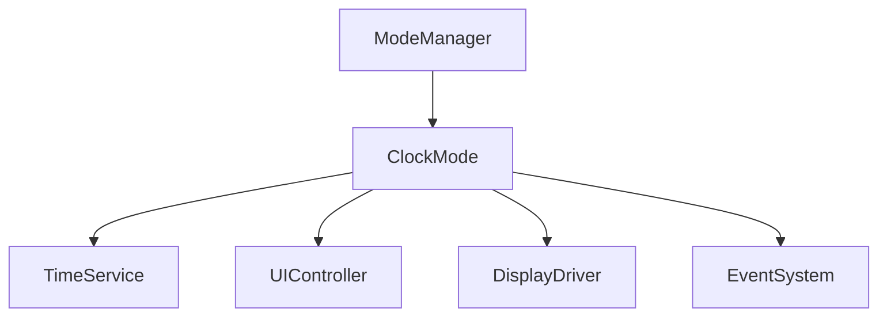
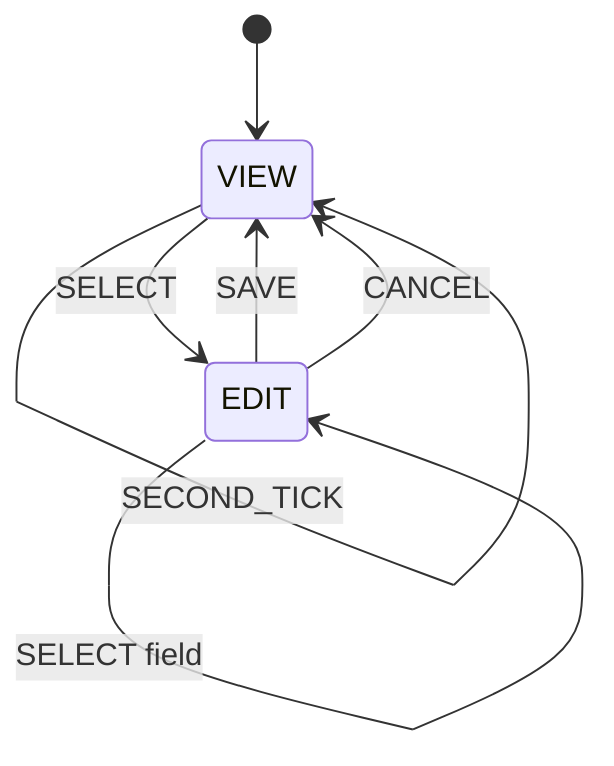
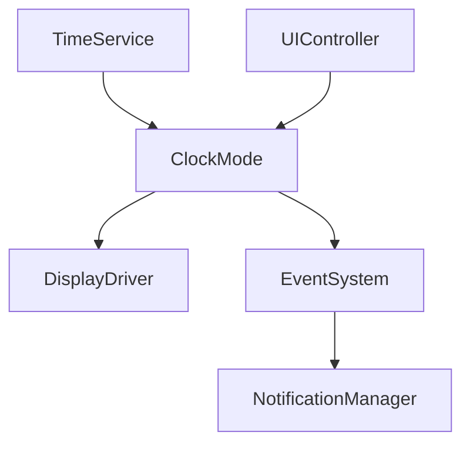
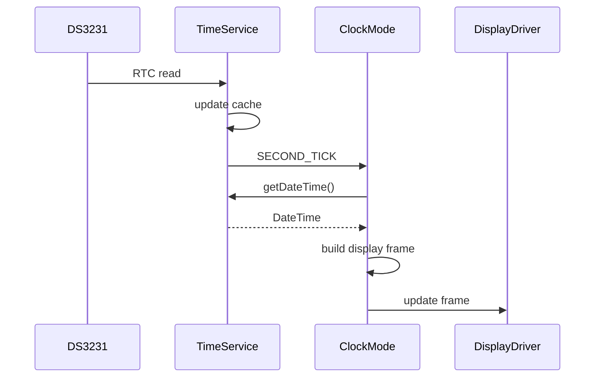
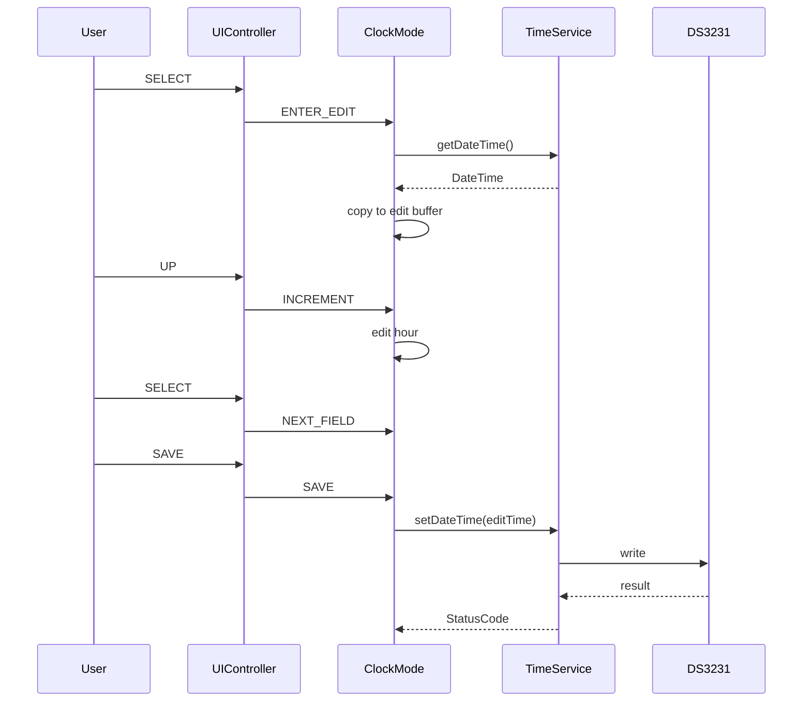
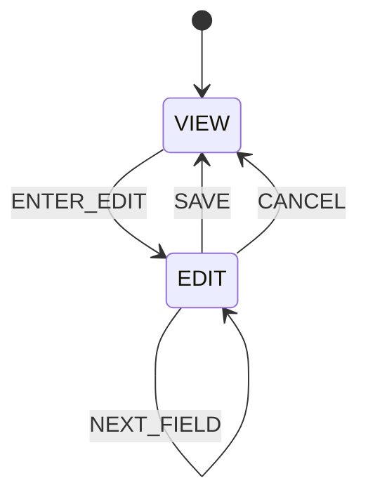

Berikut **`PROMPT_18_Clock_Mode.md`**. Saya mempertahankan boundary dari modul sebelumnya: `ClockMode` tidak membaca DS3231 secara langsung, tetapi melalui `TimeService`; tidak mengakses display/button/buzzer/LED secara langsung; dan seluruh perubahan UI dibuat event-driven.

````md
# PROMPT_18_Clock_Mode.md

# Vibe Coding Prompt
# Module Implementation: Clock Mode


Anda adalah **Senior Embedded Firmware Engineer** yang bertanggung jawab membuat firmware production-grade untuk project:

# Operation Timer Embedded System


Target platform:

- PlatformIO
- Arduino Framework
- Arduino Nano
- ATmega328P
- Embedded C++


---

# Task


Implementasikan modul:


```text
Clock Mode
````

Clock Mode adalah mode utama untuk menampilkan waktu real-time dari DS3231 melalui Time Service.

Clock Mode bertanggung jawab terhadap:

* menampilkan HH:MM:SS
* membaca waktu dari Time Service
* mendeteksi perubahan detik
* UI setting waktu
* UI setting tanggal jika diperlukan
* cursor/edit field
* save
* cancel
* reset/edit handling
* mode-specific event handling

Clock Mode TIDAK bertanggung jawab langsung terhadap:

* DS3231 hardware
* I2C
* 7-segment GPIO
* 74HC595
* buzzer
* LED
* button GPIO
* multiplexing display

---

# Architecture

Gunakan:



Namun physical hardware tetap harus berada di driver masing-masing.

---

# Dependency

Clock Mode boleh menggunakan:

```text
ModeManager
TimeService
DisplayDriver
EventSystem
NotificationManager
Common Library
Scheduler
```

Clock Mode TIDAK boleh menggunakan langsung:

```text
DS3231
Wire
RtcDriver
ButtonDriver
LedDriver
BuzzerDriver
ShiftRegister
ULN2803
Arduino GPIO
```

RTC harus melalui:

```text
TimeService
```

---

# Primary Function

Clock Mode harus menampilkan:

```text
HH:MM:SS
```

Format:

```text
00:00:00
-
23:59:59
```

24-hour format.

---

# Display Mapping

6 digit 7-segment:

```text
Digit 1 = Hour Tens
Digit 2 = Hour Units
Digit 3 = Minute Tens
Digit 4 = Minute Units
Digit 5 = Second Tens
Digit 6 = Second Units
```

Representasi:

```text
HH:MM:SS
```

---

# Colon

Colon berada pada:

```text
74HC595 #2
QF
```

Clock Mode harus meminta display representation:

```text
colon ON
```

atau sesuai display specification.

Physical colon control tetap dilakukan oleh:

```text
Display Driver
```

Clock Mode tidak boleh mengakses QF secara langsung.

---

# Clock Data Source

Clock Mode mengambil data:

```cpp
DateTime
```

dari:

```text
TimeService
```

Contoh:

```cpp
DateTime time;

timeService.getDateTime(time);
```

Gunakan:

```cpp
DateTime &
```

bukan return object besar by value.

---

# RTC Authority

Clock Mode tidak boleh memanggil:

```cpp
rtcDriver.read();
```

atau:

```cpp
Wire.requestFrom();
```

Semua data clock berasal dari:

```text
TimeService
```

---

# Clock State

Implementasikan state:

```cpp
enum class ClockState : uint8_t
{
    VIEW,
    EDIT
};
```

Default:

```text
VIEW
```

---

# Clock View

Pada state:

```text
VIEW
```

display:

```text
HH:MM:SS
```

dan user dapat:

* melihat waktu
* masuk stopwatch
* masuk countdown
* masuk edit mode sesuai UI specification

---

# Clock Edit

Pada state:

```text
EDIT
```

user dapat mengubah waktu.

Minimal field:

```text
HOUR
MINUTE
SECOND
```

Jika UI specification mengharuskan tanggal dapat diubah, implementasikan field:

```text
YEAR
MONTH
DAY
```

Namun date editing harus tetap dipisahkan dari time display.

---

# Button Mapping

Hardware button:

```text
POWER
NEXT
SELECT
UP
DOWN
```

Button Driver menghasilkan event.

Clock Mode tidak membaca GPIO.

---

# Recommended Clock UI

Gunakan:

```text
SELECT
```

untuk masuk/berpindah field.

Gunakan:

```text
UP
DOWN
```

untuk mengubah nilai.

Gunakan:

```text
NEXT
```

untuk keluar/confirm sesuai UI Controller.

Namun mapping final harus mengikuti:

```text
docs/13_UI_UX_Specification.md
```

Jika dokumen UI UX memiliki mapping berbeda, ikuti dokumentasi tersebut.

---

# UI Responsibility

PENTING:

Clock Mode mengelola state clock-specific.

UI Controller tetap bertanggung jawab menerjemahkan raw button event menjadi action.

Flow:

```text
Button Driver
      |
      v
Event System
      |
      v
UI Controller
      |
      v
Clock Mode
```

Jangan:

```text
Clock Mode
    |
    +--> ButtonDriver
```

---

# Clock Edit Architecture

Gunakan:

```text
VIEW
 |
 | SELECT
 v
EDIT_HOUR
 |
 | SELECT
 v
EDIT_MINUTE
 |
 | SELECT
 v
EDIT_SECOND
 |
 | SAVE
 v
VIEW
```

Jika UI Controller menggunakan action abstraction, Clock Mode menerima action tersebut.

---

# Edit Field

Implementasikan:

```cpp
enum class ClockEditField : uint8_t
{
    NONE,
    HOUR,
    MINUTE,
    SECOND
};
```

Default:

```text
NONE
```

---

# Edit Buffer

PENTING:

Jangan langsung mengubah RTC ketika user menekan UP/DOWN.

Gunakan temporary edit buffer.

Contoh:

```cpp
DateTime editTime_;
```

Flow:

```text
RTC time
   |
   v
editTime_
   |
   +-- UP/DOWN
   |
   v
User confirms
   |
   v
TimeService::setDateTime()
   |
   v
DS3231
```

---

# Why Edit Buffer

User harus dapat:

```text
ubah hour
ubah minute
ubah second
```

tanpa menyebabkan RTC berubah setiap kali tombol ditekan.

Ini mengurangi I2C traffic dan mencegah RTC berubah akibat accidental input.

---

# Enter Edit

Ketika masuk edit:

```text
currentTime
    |
    v
editTime_
```

Contoh:

```text
12:34:56
```

menjadi:

```text
editTime_ = 12:34:56
```

---

# Edit Hour

UP:

```text
12 -> 13
```

DOWN:

```text
12 -> 11
```

Range:

```text
00-23
```

Wrap-around diperbolehkan:

```text
23 + UP = 00
00 + DOWN = 23
```

---

# Edit Minute

Range:

```text
00-59
```

UP:

```text
59 -> 00
```

DOWN:

```text
00 -> 59
```

---

# Edit Second

Range:

```text
00-59
```

UP:

```text
59 -> 00
```

DOWN:

```text
00 -> 59
```

---

# Save

Ketika user melakukan SAVE:

```text
editTime_
    |
    v
TimeService::setDateTime()
```

Jika berhasil:

```text
EDIT
 |
 v
VIEW
```

Kemudian:

```text
SAVE notification
```

melalui:

```text
EventSystem
```

atau:

```text
NotificationManager
```

sesuai architecture project.

---

# Save Failure

Jika:

```cpp
timeService.setDateTime(editTime_)
```

gagal:

* jangan keluar dari edit mode
* jangan mengganti displayed time menjadi invalid value
* publish error event
* notification error

---

# Cancel

Jika user membatalkan edit:

```text
editTime_
```

dibuang.

RTC tidak berubah.

Kembali:

```text
EDIT
 |
 v
VIEW
```

---

# RTC Invalid

Jika:

```cpp
timeService.isRtcValid()
```

menghasilkan:

```text
false
```

Clock Mode harus menampilkan kondisi RTC invalid.

Jangan menampilkan waktu seolah-olah valid tanpa indication.

---

# RTC Invalid Display

Default recommendation:

```text
--:--:--
```

Jika display architecture tidak mendukung dash character, gunakan:

```text
00:00:00
```

dengan error indication melalui LED/buzzer.

Namun implementasi harus mengikuti capability:

```text
Segment Encoder
```

dan:

```text
UI/UX Specification
```

---

# RTC Recovery

Jika RTC kembali valid:

```text
rtcValid
false -> true
```

Clock Mode harus kembali menampilkan:

```text
HH:MM:SS
```

tanpa membutuhkan reboot.

---

# Second Update

Clock Mode tidak boleh melakukan:

```text
RTC read setiap update
```

Gunakan:

```text
TimeService
```

yang sudah melakukan RTC synchronization.

Clock Mode cukup mengambil cached time ketika:

```text
SECOND_TICK
```

terjadi.

---

# Event Driven Refresh

Recommended flow:

```text
DS3231
   |
   v
TimeService
   |
   v
SECOND_TICK
   |
   v
ClockMode
   |
   v
Display Representation
```

---

# Display Update

Clock Mode harus membentuk display data.

Contoh abstraction:

```cpp
DisplayFrame frame;
```

Kemudian:

```cpp
displayDriver.setFrame(frame);
```

Jika API Display Driver berbeda, ikuti:

```text
PROMPT_08_Display_Driver.md
```

---

# No Direct Display Hardware

DILARANG:

```cpp
digitalWrite()
shiftOut()
SPI.transfer()
```

di Clock Mode.

Clock Mode hanya mengirim logical display representation ke Display Driver.

---

# Display Frame

Jika belum tersedia, buat abstraction yang kompatibel dengan Display Driver.

Contoh:

```cpp
struct ClockDisplay
{
    uint8_t hourTens;
    uint8_t hourUnits;

    uint8_t minuteTens;
    uint8_t minuteUnits;

    uint8_t secondTens;
    uint8_t secondUnits;

    bool colon;
};
```

Namun prioritaskan menggunakan display frame existing daripada membuat duplicate structure.

---

# Passing By Reference

WAJIB:

```cpp
void buildDisplayFrame(
    const DateTime &time,
    DisplayFrame &frame
);
```

Jangan:

```cpp
DisplayFrame buildDisplayFrame(
    DateTime time
);
```

Jika struct kecil dan compiler optimization lebih efisien, tetap prioritaskan architecture consistency dengan passing reference.

---

# Display Encoding

Clock Mode tidak boleh mengetahui mapping:

```text
A
B
C
D
E
F
G
```

atau:

```text
74HC595
ULN2803
BC547C
S8550
```

Mapping tersebut adalah responsibility:

```text
Segment Encoder
Display Driver
```

---

# Blink / Edit Indication

Ketika edit mode aktif, field yang sedang diedit dapat dibuat:

```text
blink
```

Contoh:

```text
12:34:56
^^
```

hour blinking.

Namun blink timing harus berasal dari:

```text
Scheduler
```

atau:

```text
UI Controller
```

bukan:

```cpp
delay()
```

---

# Recommended Blink

Recommended:

```text
500ms ON
500ms OFF
```

Clock Mode hanya menyediakan state:

```cpp
bool editFieldVisible;
```

atau display attribute.

Display Driver tidak boleh mengetahui semantik "hour editing".

---

# Edit Display

Contoh:

```text
12:34:56
^^
```

Saat blink OFF:

```text
--:34:56
```

Jika dash tidak tersedia:

```text
  :34:56
```

Gunakan capability yang tersedia pada Segment Encoder.

---

# SELECT Behavior

Recommended:

```text
VIEW
 |
 SELECT
 v
EDIT_HOUR
 |
 SELECT
 v
EDIT_MINUTE
 |
 SELECT
 v
EDIT_SECOND
 |
 SELECT
 v
SAVE/CONFIRM
```

Namun final behavior harus mengikuti:

```text
13_UI_UX_Specification.md
```

---

# NEXT Behavior

NEXT tidak boleh langsung diproses oleh Clock Mode sebagai raw button.

UI Controller menentukan action.

Contoh:

```text
NEXT_SHORT
```

diterjemahkan menjadi:

```text
MODE_NEXT
```

atau:

```text
CLOCK_CANCEL
```

berdasarkan UI state.

---

# UP/DOWN Repeat

Clock Mode harus mendukung:

```text
UP
DOWN
```

dengan:

```text
SHORT
HOLD
REPEAT
```

Button Driver menghasilkan event repeat.

Clock Mode hanya menerima action.

---

# Repeat Rule

Saat editing:

```text
UP_REPEAT
```

harus mengubah field satu step per event.

Jangan membuat timer repeat sendiri di Clock Mode.

Repeat timing adalah responsibility:

```text
Button Driver
```

---

# Power Button

Clock Mode tidak menangani physical POWER button.

Power behavior ditangani oleh system/UI layer.

---

# Clock State Machine

Tambahkan:



Jika UI specification memiliki state lebih detail, gunakan state tersebut.

---

# Architecture Diagram

Tambahkan:



---

# Clock Update Flow



---

# Edit Flow



---

# Date Handling

Clock Mode wajib menggunakan valid DateTime dari RTC Driver/Time Service.

Jika edit time hanya mengubah:

```text
hour
minute
second
```

tanggal harus dipertahankan dari:

```text
editTime_
```

Jangan membuat tanggal baru secara default.

---

# Date Rollover

Clock Mode tidak perlu melakukan calendar calculation ketika hanya mengedit time.

Jika second berubah:

```text
59 -> 00
```

jangan mengubah date di Clock Mode.

RTC/Time Service menjadi authority terhadap calendar rollover.

---

# RTC Set Safety

Ketika user save:

```text
editTime_
```

harus divalidasi oleh TimeService/RTC Driver.

Clock Mode tidak boleh menganggap save berhasil sebelum:

```text
StatusCode::OK
```

---

# Clock Mode API

Implementasikan minimal:

```cpp
class ClockMode
{
public:

    StatusCode begin();

    void onEnter();

    void onExit();

    void update();

    StatusCode handleAction(
        const UiAction &action
    );

    ClockState state() const;

    ClockEditField editField() const;

    bool isEditing() const;
};
```

Jika `UiAction` belum tersedia, gunakan abstraction yang sudah ditetapkan oleh Event System/UI Controller.

---

# Action Handling

Minimal action:

```cpp
enum class ClockAction : uint8_t
{
    NONE,

    ENTER_EDIT,
    NEXT_FIELD,

    INCREMENT,
    DECREMENT,

    SAVE,
    CANCEL
};
```

Jangan membuat raw button enum jika UI Controller sudah menyediakan `UiAction`.

---

# Action Validation

Jika action tidak relevan terhadap state:

```text
VIEW + INCREMENT
```

harus:

```text
NO_CHANGE
```

atau:

```text
INVALID_STATE
```

Jangan mengubah data.

---

# View State

Pada VIEW:

```text
UP
DOWN
```

tidak boleh mengubah RTC.

---

# Edit State

Pada EDIT:

```text
UP
DOWN
```

hanya mengubah:

```text
editTime_
```

RTC tetap tidak berubah sampai SAVE.

---

# Notification Integration

Clock Mode dapat menghasilkan event:

```text
CLOCK_EDIT_ENTER
CLOCK_SAVE
CLOCK_CANCEL
CLOCK_SAVE_ERROR
```

jika Event System membutuhkan event tersebut.

Notification Manager kemudian menentukan feedback.

Clock Mode tidak boleh mengontrol buzzer secara langsung.

---

# RTC Error Notification

Jika save gagal:

```text
ClockMode
    |
    v
EventSystem
    |
    v
NotificationManager
    |
    v
ERROR
```

---

# Memory Optimization

ATmega328P:

```text
SRAM = 2KB
```

Clock Mode harus menyimpan state minimum.

Recommended:

```cpp
struct ClockModeState
{
    ClockState state;
    ClockEditField editField;

    DateTime editTime;

    bool editVisible;
    bool rtcValid;
};
```

Jika `rtcValid` dapat diperoleh langsung dari TimeService, jangan duplicate state.

---

# No Dynamic Allocation

DILARANG:

```cpp
new
delete
malloc
free
```

DILARANG:

```cpp
String
std::vector
std::map
std::function
```

Gunakan static allocation.

---

# Passing By Reference

WAJIB menggunakan reference untuk object:

```cpp
StatusCode getDisplayData(
    DisplayFrame &frame
) const;
```

```cpp
void buildDisplayFrame(
    const DateTime &time,
    DisplayFrame &frame
) const;
```

```cpp
StatusCode saveTime(
    const DateTime &time
);
```

---

# No Duplicate RTC Cache

Jangan menyimpan:

```text
current RTC time
```

secara permanen di Clock Mode jika TimeService sudah memiliki cache.

Clock Mode hanya memiliki:

```text
editTime_
```

ketika editing.

---

# Time Update Efficiency

Jangan memanggil:

```cpp
timeService.getDateTime()
```

setiap 10ms.

Recommended:

```text
SECOND_TICK
    |
    v
getDateTime()
    |
    v
update display
```

---

# Display Update Efficiency

Jika waktu belum berubah:

```text
jangan rebuild display frame
```

Gunakan dirty flag jika diperlukan.

Contoh:

```cpp
bool displayDirty_;
```

Set:

```text
true
```

ketika:

* second berubah
* edit field berubah
* enter edit
* exit edit
* RTC validity berubah

---

# Dirty Flag

Recommended flow:

```text
Event
 |
 v
markDirty()
 |
 v
update()
 |
 v
buildFrame()
 |
 v
DisplayDriver
 |
 v
clearDirty()
```

Jangan melakukan display update jika tidak diperlukan.

---

# RTC Validity Change

Jika:

```text
valid -> invalid
```

set:

```text
displayDirty = true
```

Jika:

```text
invalid -> valid
```

set:

```text
displayDirty = true
```

---

# Update Responsibility

`ClockMode::update()` hanya melakukan:

```text
1. process time/event state
2. update edit blink state
3. rebuild display if dirty
```

Tidak boleh:

```text
I2C read
button polling
GPIO
delay
```

---

# Unit Test

Buat:

```text
test/modes/clock/
```

---

# Test 1

Default state.

Expected:

```text
VIEW
```

---

# Test 2

Display 00:00:00.

Input:

```text
00:00:00
```

Expected display:

```text
00:00:00
```

---

# Test 3

Display 23:59:59.

Expected:

```text
23:59:59
```

---

# Test 4

Second update.

Current:

```text
12:34:56
```

Next:

```text
12:34:57
```

Expected display updated once.

---

# Test 5

RTC Invalid.

Expected:

```text
invalid indication
```

---

# Test 6

Enter Edit.

Current:

```text
12:34:56
```

Expected:

```text
state = EDIT
editTime = 12:34:56
```

---

# Test 7

Edit Hour Increment.

```text
12 -> 13
```

RTC harus tetap:

```text
12:34:56
```

---

# Test 8

Edit Hour Wrap.

```text
23 + UP
```

Expected:

```text
00
```

---

# Test 9

Edit Minute Wrap.

```text
59 + UP
```

Expected:

```text
00
```

---

# Test 10

Edit Second Wrap.

```text
00 + DOWN
```

Expected:

```text
59
```

---

# Test 11

Save.

Edit:

```text
13:45:20
```

Save.

Expected:

```text
TimeService::setDateTime()
```

dipanggil satu kali.

---

# Test 12

Save Failure.

Simulasikan RTC failure.

Expected:

```text
state tetap EDIT
```

dan error event diterbitkan.

---

# Test 13

Cancel.

Edit time berubah:

```text
12:34:56
-->
15:20:30
```

Cancel.

Expected RTC tetap:

```text
12:34:56
```

---

# Test 14

Active Mode Update.

Pastikan Clock Mode hanya di-update ketika:

```text
ModeManager.currentMode() == CLOCK
```

---

# Test 15

No RTC Direct Access.

Review source code.

Tidak boleh ada:

```cpp
Wire
rtcDriver
digitalRead
digitalWrite
```

---

# Test 16

No Blocking.

Tidak boleh ada:

```cpp
delay()
while(true)
```

---

# Test 17

Dirty Flag.

Jika tidak ada perubahan data:

```text
display update = 0
```

Jika second berubah:

```text
display update = 1
```

---

# Test 18

Edit Field.

Pastikan field sequence:

```text
HOUR
MINUTE
SECOND
```

berjalan sesuai UI specification.

---

# Test 19

RTC Recovery.

RTC:

```text
invalid
```

kemudian:

```text
valid
```

Expected display kembali ke:

```text
HH:MM:SS
```

---

# Test 20

Memory.

Pastikan:

```text
heap allocation = 0
```

dan tidak ada dynamic string.

---

# Documentation

Buat:

```text
docs/Clock_Mode.md
```

Dokumentasi minimal:

* Clock Mode responsibility
* architecture
* clock display
* RTC source
* TimeService dependency
* edit mode
* edit field
* save
* cancel
* RTC invalid
* RTC recovery
* display update
* event integration
* state machine

---

# Mermaid Documentation

Dokumentasi wajib memiliki:

## State Machine



## Architecture


---

# Coding Standard

Class:

```text
PascalCase
```

Example:

```cpp
ClockMode
```

Function:

```text
camelCase
```

Example:

```cpp
onEnter()
onExit()
handleAction()
buildDisplayFrame()
```

Private member:

```text
camelCase_
```

Example:

```cpp
ClockState state_;
DateTime editTime_;
```

Constant:

```text
UPPER_CASE
```

Enum:

```text
PascalCase type
UPPER_CASE members
```

---

# Important Implementation Rules

WAJIB:

* Clock Mode menggunakan TimeService
* tidak membaca RTC Driver secara langsung
* tidak menggunakan Wire
* tidak mengakses GPIO
* tidak membaca Button Driver langsung
* tidak mengontrol buzzer langsung
* tidak mengontrol LED langsung
* tidak mengakses 74HC595 langsung
* tidak mengetahui ULN2803
* tidak mengetahui transistor digit
* menggunakan 24-hour format
* display HH:MM:SS
* edit menggunakan temporary buffer
* RTC hanya berubah ketika SAVE
* CANCEL tidak mengubah RTC
* save failure tetap berada di EDIT
* RTC invalid harus dapat diindikasikan
* RTC recovery harus ditangani
* menggunakan event-driven update
* tidak menggunakan delay()
* tidak menggunakan millis()
* tidak menggunakan heap
* tidak menggunakan String
* passing by reference
* gunakan dirty flag jika menghemat display update
* compile PlatformIO sukses

---

# Output Requirement

Berikan:

1. File:

```text
src/modes/ClockMode.h
```

2. File:

```text
src/modes/ClockMode.cpp
```

3. Clock state machine.

4. Edit buffer.

5. Display frame generation.

6. TimeService integration.

7. Event integration.

8. Notification integration.

9. Unit test.

10. Memory report.

11. Documentation.

---

# Final Checklist

* [ ] ClockMode tersedia
* [ ] VIEW state tersedia
* [ ] EDIT state tersedia
* [ ] ClockEditField tersedia
* [ ] HH:MM:SS tersedia
* [ ] 24-hour format
* [ ] TimeService digunakan
* [ ] RTC Driver tidak diakses langsung
* [ ] I2C tidak diakses langsung
* [ ] Display Driver digunakan sebagai abstraction
* [ ] Button Driver tidak diakses langsung
* [ ] Edit buffer tersedia
* [ ] Hour edit tersedia
* [ ] Minute edit tersedia
* [ ] Second edit tersedia
* [ ] UP tersedia
* [ ] DOWN tersedia
* [ ] SELECT tersedia
* [ ] SAVE tersedia
* [ ] CANCEL tersedia
* [ ] Save hanya sekali saat confirm
* [ ] Cancel tidak mengubah RTC
* [ ] RTC invalid ditangani
* [ ] RTC recovery ditangani
* [ ] Dirty flag tersedia bila diperlukan
* [ ] Tidak menggunakan delay()
* [ ] Tidak menggunakan millis()
* [ ] Tidak menggunakan heap
* [ ] Tidak menggunakan String
* [ ] Passing by reference diterapkan
* [ ] Unit test tersedia
* [ ] Documentation tersedia
* [ ] PlatformIO compile sukses

# End Of Prompt

````

### Peningkatan arsitektur yang sudah diimplementasikan

Ada beberapa keputusan yang saya kunci di modul ini agar implementasi berikutnya tidak membuat arsitektur berantakan.

**1. Clock Mode tidak membaca DS3231 langsung**

Sekarang alurnya wajib:

```text
DS3231
   ↓
RTC Driver
   ↓
Time Service
   ↓
Clock Mode
   ↓
Display Driver
```

Dengan demikian kalau nanti DS3231 diganti atau driver-nya berubah, `ClockMode` tidak perlu diubah.

**2. Editing menggunakan `editTime_`**

Ini penting untuk operasi ruang operasi. Ketika operator menekan `UP` berkali-kali:

```text
12:34:56
12:35:56
12:36:56
...
```

RTC **tidak ditulis setiap kali tombol ditekan**.

Yang berubah hanya:

```cpp
editTime_
```

Kemudian satu kali `SAVE`:

```text
editTime_
    ↓
TimeService::setDateTime()
    ↓
DS3231
```

**3. Clock Mode tidak melakukan polling RTC setiap 10 ms**

`TimeService` yang membaca RTC dan menghasilkan `SECOND_TICK`. Clock Mode hanya memperbarui tampilan ketika memang ada perubahan.

**4. Display hardware tetap terisolasi**

Clock Mode tidak akan tahu bahwa sistem menggunakan:

```text
74HC595
ULN2803
BC547C
S8550
6 digit multiplex
```

Clock Mode hanya menghasilkan representasi:

```text
HH:MM:SS
```

lalu menyerahkannya kepada `DisplayDriver`.

**5. Saya tambahkan dirty flag**

Ini menghindari pekerjaan berulang:

```text
Scheduler 10ms
    ↓
ClockMode
    ↓
Tidak ada perubahan
    ↓
Tidak update display
```

Display hanya diperbarui ketika:

- detik berubah
- masuk edit
- keluar edit
- field berubah
- RTC validity berubah

Dengan demikian arsitektur mode sekarang menjadi:

```text
                    ModeManager
                         │
                         ▼
                    ClockMode
                   /    |    \
                  /     |     \
                 ▼      ▼      ▼
          TimeService  Event   Display
                       System   Driver
                          │
                          ▼
                  Notification
                    Manager
```

Selanjutnya **`PROMPT_19_Stopwatch_Mode.md`** dapat dibuat jauh lebih sederhana karena timing stopwatch sudah ditangani oleh `TimeService`; mode tersebut cukup fokus pada **UI stopwatch, start/pause/reset, display, dan state transition**.
````
