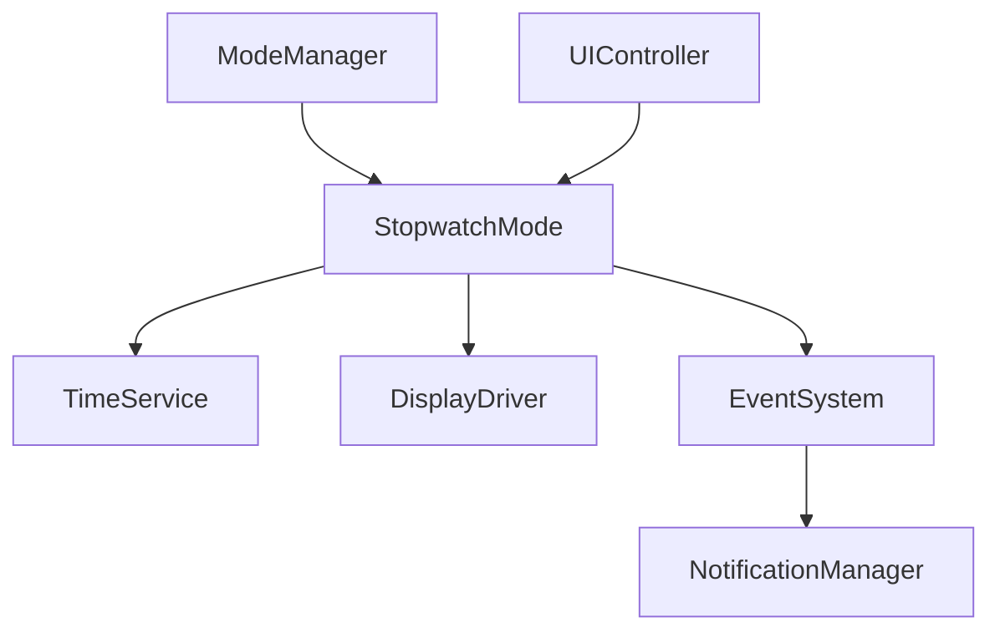
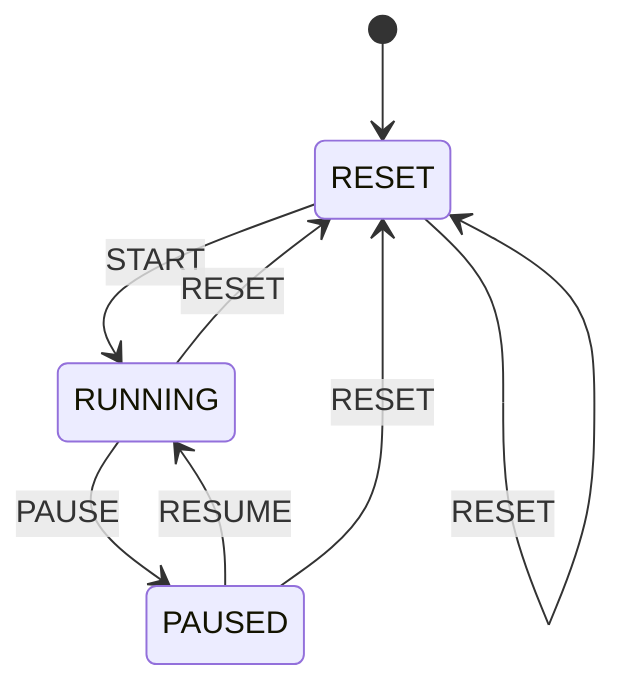
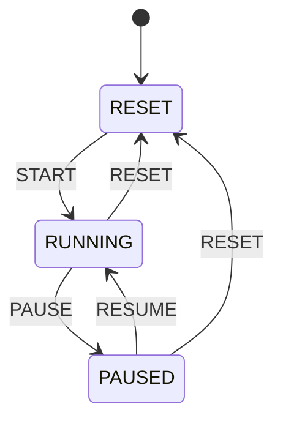
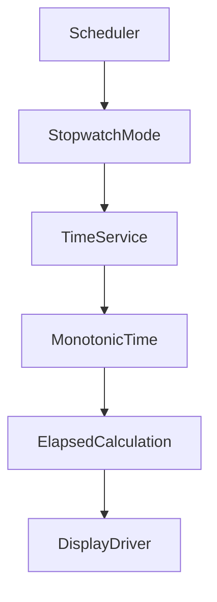

Berikut **`PROMPT_19_Stopwatch_Mode.md`**. Saya mengikuti arsitektur `ModeManager → StopwatchMode → TimeService → DisplayDriver`, dengan stopwatch berbasis elapsed time, bukan counter yang bergantung pada frekuensi `update()`.

````md
# PROMPT_19_Stopwatch_Mode.md

# Vibe Coding Prompt
# Module Implementation: Stopwatch Mode


Anda adalah **Senior Embedded Firmware Engineer** yang bertanggung jawab membuat firmware production-grade untuk project:

# Operation Timer Embedded System


Target platform:

- PlatformIO
- Arduino Framework
- Arduino Nano
- ATmega328P
- Embedded C++


---

# Task

Implementasikan modul:

```text
Stopwatch Mode
```

Stopwatch Mode adalah mode untuk mengukur waktu elapsed dengan resolusi:

```text
HH:MM:SS
```

Range:

```text
00:00:00
hingga
99:59:59
```

Requirement display utama:

```text
HH:MM:SS
```

Tick display:

```text
1 second
```

Stopwatch harus bersifat deterministic dan tidak boleh bergantung pada frekuensi pemanggilan `update()`.


---

# Core Principle

Stopwatch TIDAK boleh menghitung waktu seperti:

```cpp
seconds++;
```

berdasarkan jumlah pemanggilan:

```cpp
update()
```

Karena scheduler dapat berubah.

Contoh yang DILARANG:

```cpp
if (tick)
{
    elapsedSeconds++;
}
```

jika `tick` tersebut bukan berasal dari time base yang valid.


Gunakan elapsed time dari:

```text
TimeService
```

atau monotonic time service yang tersedia.


---

# Architecture

Gunakan:




Stopwatch Mode tidak boleh mengakses hardware secara langsung.


---

# Responsibility

Stopwatch Mode bertanggung jawab terhadap:

- stopwatch state
- start
- pause
- reset
- elapsed time
- maximum range
- display representation
- UI action
- stopwatch-specific event
- stopwatch-specific notification


Stopwatch Mode TIDAK bertanggung jawab terhadap:

- button GPIO
- display multiplexing
- 74HC595
- ULN2803
- transistor digit
- DS3231 I2C
- buzzer GPIO
- LED GPIO
- scheduler implementation


---

# Stopwatch State

Implementasikan:

```cpp
enum class StopwatchState : uint8_t
{
    RESET,
    RUNNING,
    PAUSED
};
```


Default:

```text
RESET
```


---

# Stopwatch State Machine

Gunakan:




Jika UI specification menggunakan action berbeda, sesuaikan action tetapi jangan mengubah semantic state.


---

# Stopwatch Behavior

## RESET

Display:

```text
00:00:00
```

Elapsed:

```text
0
```

---

## RUNNING

Elapsed time bertambah berdasarkan monotonic time.

Contoh:

```text
00:00:00
00:00:01
00:00:02
...
```

---

## PAUSED

Elapsed time berhenti.

Contoh:

```text
00:05:37
```

akan tetap:

```text
00:05:37
```

selama paused.


---

# Start

Saat:

```text
RESET
```

menerima:

```text
START
```

stopwatch menjadi:

```text
RUNNING
```

dan stopwatch mulai menghitung.


---

# Pause

Saat:

```text
RUNNING
```

menerima:

```text
PAUSE
```

stopwatch menyimpan elapsed value terakhir.


State:

```text
PAUSED
```


---

# Resume

Saat:

```text
PAUSED
```

menerima:

```text
RESUME
```

stopwatch melanjutkan dari nilai terakhir.


Contoh:

```text
00:10:20
```

pause.

Resume setelah 10 menit.

Display harus menjadi:

```text
00:10:21
```

bukan:

```text
00:20:21
```


---

# Reset

Saat:

```text
RUNNING
```

atau:

```text
PAUSED
```

menerima:

```text
RESET
```

hasil:

```text
state = RESET
elapsed = 0
display = 00:00:00
```


---

# Important Reset Rule

Reset tidak boleh menyebabkan:

```text
RTC reset
```

dan tidak boleh mengubah:

```text
DS3231
```


Stopwatch sepenuhnya independent dari wall clock.


---

# Time Source

Stopwatch harus menggunakan monotonic elapsed time.


Priority:

```text
1. TimeService monotonic time API
2. Timer HAL / scheduler timebase
3. platform time abstraction
```

Jangan menggunakan RTC wall-clock untuk menghitung elapsed stopwatch.


---

# RTC Rule

DS3231 digunakan sebagai:

```text
wall clock
```

bukan:

```text
stopwatch timer
```


DILARANG:

```cpp
rtc.now();
```

setiap update stopwatch.


Stopwatch tidak boleh tergantung pada RTC calendar time.


---

# Monotonic Time

Jika TimeService menyediakan:

```cpp
uint32_t millis();
```

atau:

```cpp
uint32_t monotonicMs();
```

gunakan abstraction tersebut.


Stopwatch Mode tidak boleh memanggil:

```cpp
::millis()
```

langsung jika project sudah memiliki Timer HAL / TimeService.


---

# Recommended Timing Model

Gunakan:

```text
startTimestamp
+
accumulatedElapsed
```

Contoh:

```cpp
uint32_t startTimestampMs_;
uint32_t accumulatedMs_;
```


Ketika RUNNING:

```text
elapsed =
accumulatedMs_
+
(now - startTimestampMs_)
```


Ketika PAUSED:

```text
accumulatedMs_
=
accumulatedMs_
+
(now - startTimestampMs_)
```


Kemudian:

```text
startTimestampMs_
=
0
```


---

# Why This Architecture

Jangan menggunakan:

```cpp
elapsedSeconds++;
```

karena:

- scheduler jitter
- interrupt latency
- display multiplexing
- future feature expansion
- execution time variation


Elapsed timestamp memberikan hasil yang lebih akurat.


---

# 32-bit Millisecond Rollover

Jika menggunakan:

```cpp
uint32_t
```

untuk milliseconds, gunakan unsigned subtraction:

```cpp
uint32_t elapsed =
    now - startTimestampMs_;
```

Jangan membandingkan timestamp secara naive:

```cpp
if (now > timeout)
```

Gunakan unsigned arithmetic agar rollover aman.


---

# Range

Requirement awal:

```text
00:00:00
hingga
99:59:59
```


Maximum:

```text
99 hours
59 minutes
59 seconds
```


Total maksimum:

```text
359999 seconds
```


Setelah mencapai:

```text
99:59:59
```

stopwatch tidak boleh overflow menjadi:

```text
100:00:00
```


---

# Maximum Behavior

Recommended behavior:

```text
99:59:59
     |
     v
STOP
```

State:

```text
PAUSED
```

atau state khusus:

```text
MAX_REACHED
```

Jika UI specification tidak menentukan state khusus, gunakan:

```text
PAUSED
```

dengan notification.


---

# Recommended Extended State

Jika diperlukan:

```cpp
enum class StopwatchState : uint8_t
{
    RESET,
    RUNNING,
    PAUSED,
    MAX_REACHED
};
```

Gunakan `MAX_REACHED` hanya jika memang memberikan manfaat pada UI/diagnostic.


Jika tidak diperlukan, tetap gunakan tiga state utama.


---

# Display Format

Format:

```text
HH:MM:SS
```


Digit mapping:

```text
Digit 1 = Hour Tens
Digit 2 = Hour Units
Digit 3 = Minute Tens
Digit 4 = Minute Units
Digit 5 = Second Tens
Digit 6 = Second Units
```


Contoh:

```text
01:23:45
```


---

# Colon

Stopwatch menggunakan:

```text
HH:MM:SS
```


Colon:

```text
ON
```


Jika system display specification menentukan blinking colon:

```text
RUNNING -> blink
PAUSED  -> solid
RESET   -> solid
```

ikuti:

```text
docs/13_UI_UX_Specification.md
```


Jika tidak ditentukan, default:

```text
colon = ON
```


---

# Display Driver Boundary

Stopwatch Mode tidak boleh mengetahui:

```text
74HC595
ULN2803
BC547C
S8550
multiplex
digit enable
segment mapping
```

Stopwatch Mode hanya menghasilkan logical display frame.


---

# Display Frame

Gunakan display abstraction yang sudah tersedia.


Contoh:

```cpp
DisplayFrame frame;
```

Kemudian:

```cpp
displayDriver.setFrame(frame);
```


Jangan membuat duplicate hardware mapping.


---

# Segment Encoder Boundary

Stopwatch Mode tidak boleh mengetahui:

```text
segment A
segment B
segment C
...
```

Segment encoding dilakukan oleh:

```text
SegmentEncoder
```


---

# Button Boundary

Stopwatch Mode tidak membaca:

```cpp
digitalRead()
```


dan tidak mengakses:

```text
PB_PWR
PB_SLC
PB_NXT
PB_UP
PB_DWN
```


Semua button diproses melalui:

```text
Button Driver
    ↓
Event System
    ↓
UI Controller
    ↓
Stopwatch Mode
```


---

# Button Actions

Gunakan semantic action.


Minimal:

```cpp
enum class StopwatchAction : uint8_t
{
    NONE,
    START,
    PAUSE,
    RESUME,
    RESET
};
```


Jika `UiAction` sudah tersedia secara global, gunakan `UiAction` daripada membuat enum duplicate.


---

# Recommended UI Mapping

Mapping button harus mengikuti:

```text
docs/13_UI_UX_Specification.md
```


Recommended:

```text
SELECT
```

untuk:

```text
START
PAUSE
RESUME
```


dan:

```text
NEXT / DOWN / long press
```

untuk reset sesuai UI design.


Jangan mengunci raw button mapping di Stopwatch Mode.


---

# UI Controller Responsibility

Contoh:

```text
SELECT SHORT
      |
      v
UI Controller
      |
      +---- RESET -> START
      |
      +---- RUNNING -> PAUSE
      |
      +---- PAUSED -> RESUME
```

Stopwatch Mode hanya menerima action semantic.


---

# Hold and Repeat

Stopwatch Mode tidak membuat timer button sendiri.


Event:

```text
SHORT
HOLD
REPEAT
```

ditentukan oleh:

```text
Button Driver
```


Stopwatch Mode menerima action yang sudah diproses.


---

# Stopwatch API

Implementasikan minimal:

```cpp
class StopwatchMode
{
public:

    StatusCode begin();

    void onEnter();

    void onExit();

    void update();

    StatusCode handleAction(
        const StopwatchAction action
    );

    StopwatchState state() const;

    uint32_t elapsedSeconds() const;

    bool isRunning() const;
};
```


Jika action object lebih besar:

```cpp
StatusCode handleAction(
    const StopwatchAction &action
);
```

Namun enum kecil boleh by value.


---

# Reference Rule

WAJIB menggunakan reference untuk object atau struct.


Contoh:

```cpp
void buildDisplayFrame(
    const StopwatchTime &time,
    DisplayFrame &frame
);
```


Jangan:

```cpp
DisplayFrame buildDisplayFrame(
    StopwatchTime time
);
```


Untuk primitive kecil:

```cpp
uint32_t
uint8_t
bool
enum
```

pass-by-value diperbolehkan.


---

# Stopwatch Time Structure

Jika diperlukan:

```cpp
struct StopwatchTime
{
    uint8_t hours;
    uint8_t minutes;
    uint8_t seconds;
};
```


Semua field:

```text
0-99 hours
0-59 minutes
0-59 seconds
```


Gunakan:

```cpp
void splitElapsedSeconds(
    uint32_t totalSeconds,
    StopwatchTime &time
);
```


---

# Conversion

Konversi:

```text
total seconds
```

menjadi:

```text
HH
MM
SS
```


Formula:

```text
hours = totalSeconds / 3600

minutes =
(totalSeconds % 3600) / 60

seconds =
totalSeconds % 60
```


---

# Maximum

Maximum total seconds:

```text
99 * 3600
+
59 * 60
+
59
```


Gunakan constant:

```cpp
constexpr uint32_t STOPWATCH_MAX_SECONDS = 359999UL;
```


Jangan menggunakan magic number:


```cpp
359999
```


di banyak tempat.


---

# Millisecond Precision

Internal stopwatch boleh menggunakan millisecond:

```text
uint32_t
```


Display hanya menunjukkan:

```text
seconds
```


Contoh:

```text
00:00:00.500
```

display tetap:

```text
00:00:00
```


dan setelah:

```text
00:00:01.000
```

menjadi:

```text
00:00:01
```


---

# Display Tick

Display tick:

```text
1 second
```


Namun internal elapsed calculation boleh memiliki resolusi lebih tinggi.


Ini penting agar scheduler jitter tidak menyebabkan stopwatch kehilangan waktu.


---

# Update Frequency

`StopwatchMode::update()` boleh dipanggil:

```text
10ms
```

atau:

```text
20ms
```

atau:

```text
100ms
```


tetapi hasil elapsed harus tetap sama secara waktu.


---

# Dirty Flag

Gunakan:

```cpp
bool displayDirty_;
```


Display dirty ketika:

- start
- pause
- resume
- reset
- second berubah
- maximum reached
- mode enter
- mode exit
- display state berubah


Jika tidak dirty:

```text
jangan rebuild frame
```


---

# Display Update Flow

```text
Scheduler
    |
    v
StopwatchMode::update()
    |
    v
calculate elapsed
    |
    +---- same second
    |       |
    |       v
    |     no display update
    |
    +---- new second
            |
            v
       build frame
            |
            v
       DisplayDriver
```


---

# Start Algorithm

Saat START:

```text
1. accumulatedMs_ = 0
2. startTimestampMs_ = monotonicNow()
3. state = RUNNING
4. displayDirty = true
5. publish START event
```


Jika start dari RESET.


---

# Resume Algorithm

Saat RESUME:

```text
1. startTimestampMs_ = monotonicNow()
2. state = RUNNING
3. displayDirty = true
```


`accumulatedMs_` harus tetap.


---

# Pause Algorithm

Saat PAUSE:

```text
1. now = monotonicNow()
2. accumulatedMs_ += now - startTimestampMs_
3. clamp maximum
4. state = PAUSED
5. displayDirty = true
```

Setelah pause:

```text
startTimestampMs_ = 0
```


---

# Reset Algorithm

Saat RESET:

```text
1. accumulatedMs_ = 0
2. startTimestampMs_ = 0
3. state = RESET
4. displayDirty = true
```


---

# Running Calculation

Saat RUNNING:

```text
now = monotonicNow()

currentElapsedMs =
    accumulatedMs_
    +
    (now - startTimestampMs_)
```


Convert:

```text
currentElapsedMs / 1000
```

untuk display.


---

# Maximum Clamp

Jika:

```text
currentElapsedSeconds > STOPWATCH_MAX_SECONDS
```

maka:

```text
currentElapsedSeconds =
STOPWATCH_MAX_SECONDS
```


Jangan overflow.


---

# Maximum Transition

Ketika mencapai:

```text
99:59:59
```

stopwatch harus berhenti.


Flow:

```text
RUNNING
   |
   v
99:59:59
   |
   v
PAUSED / MAX_REACHED
```


Tidak boleh:

```text
100:00:00
```


---

# Timestamp Accuracy

Jangan menggunakan:

```cpp
startTimestampMs_ += 1000;
```

untuk menjaga waktu.


Gunakan:

```cpp
startTimestampMs_ = monotonicNow();
```


dan elapsed subtraction.


---

# Rollover Safety

Gunakan:

```cpp
uint32_t delta =
    now - startTimestampMs_;
```


Unsigned subtraction harus digunakan untuk menangani rollover timer.


Jangan mengubah menjadi signed integer.


---

# Mode Entry

Saat:

```text
ModeManager
    |
    v
StopwatchMode::onEnter()
```


Stopwatch state harus dipertahankan.


Contoh:

```text
STOPWATCH
00:10:25 RUNNING

pindah CLOCK

kembali STOPWATCH

00:10:25
```


Namun jika system specification menentukan mode exit otomatis pause, implementasikan rule tersebut.


---

# Recommended Mode Exit

Untuk safety dan deterministic behavior:

Saat keluar dari Stopwatch Mode ketika:

```text
RUNNING
```

recommended:

```text
PAUSE
```

sebelum meninggalkan mode.


Alasan:

- mencegah stopwatch terus berjalan ketika tidak terlihat
- deterministic
- mencegah hidden state


Implementasikan hanya jika sesuai:

```text
docs/13_UI_UX_Specification.md
```


Jika tidak ada rule, default production recommendation:

```text
Mode Exit -> PAUSE
```


---

# No Automatic Reset on Entry

Masuk Stopwatch Mode tidak boleh:

```text
reset stopwatch
```


Contoh:

```text
STOPWATCH
00:05:12

CLOCK

STOPWATCH
```

harus tetap:

```text
00:05:12
```


---

# Mode Exit / Resume

Jika exit otomatis pause:

```text
RUNNING
   |
   v
CLOCK
   |
   v
STOPWATCH
```

state:

```text
PAUSED
```


Operator kemudian melakukan:

```text
RESUME
```


---

# Event Integration

Publish events:

```text
STOPWATCH_START
STOPWATCH_PAUSE
STOPWATCH_RESUME
STOPWATCH_RESET
STOPWATCH_MAX_REACHED
```


Gunakan Event System existing.


Jangan membuat duplicate event bus.


---

# Notification Integration

Stopwatch Mode tidak boleh:

```cpp
buzzer.on();
```

atau:

```cpp
digitalWrite();
```


Gunakan:

```text
EventSystem
    |
    v
NotificationManager
```

untuk:

- start confirmation
- pause confirmation
- reset confirmation
- max reached


---

# Reset Confirmation

Jika UI specification membutuhkan confirmation:

```text
RESET_REQUEST
```

harus menjadi:

```text
RESET_CONFIRM
```

sebelum stopwatch benar-benar reset.


Stopwatch Mode harus mengikuti UI Controller state.


Jangan membuat modal UI kompleks di Stopwatch Mode jika UI Controller sudah menangani confirmation.


---

# Stopwatch Data Persistence

Jangan menyimpan stopwatch state ke EEPROM setiap perubahan.


DILARANG:

```text
EEPROM.write()
```

setiap:

```text
second
```


Stopwatch runtime state hanya berada di RAM.


---

# Power Cycle

Default recommendation:

```text
power cycle
    |
    v
stopwatch reset
```

karena stopwatch runtime state tidak persistent.


Jika future requirement membutuhkan persistence, buat service khusus.


---

# Power Button

Stopwatch Mode tidak menangani physical POWER button.


Power management adalah system-level responsibility.


---

# RTC Independence

Stopwatch harus tetap bekerja jika:

```text
RTC wall-clock berubah
```

Contoh:

```text
Clock:
12:00:00
```

diubah menjadi:

```text
13:00:00
```

stopwatch yang sedang running tidak boleh berubah elapsed satu jam.


---

# Important RTC Test

Test:

```text
Stopwatch = 00:10:00
```

RTC diubah:

```text
12:00:00
-->
15:00:00
```

Stopwatch harus tetap menghitung:

```text
00:10:01
...
```

berdasarkan monotonic time.


---

# Time Service Boundary

Jika `TimeService` belum memiliki monotonic API, tambahkan API abstraction seperti:

```cpp
uint32_t monotonicMs() const;
```

atau service yang setara.


Jangan membuat stopwatch memanggil Arduino `millis()` langsung jika Timer HAL/TimeService sudah tersedia.


---

# Scheduler Boundary

Scheduler hanya menentukan kapan:

```cpp
StopwatchMode::update()
```

dipanggil.


Scheduler tidak menyimpan stopwatch state.


Stopwatch tidak mengontrol scheduler.


---

# Architecture Separation

```text
Scheduler
   |
   v
StopwatchMode::update()
   |
   v
TimeService.monotonicMs()
   |
   v
elapsed calculation
   |
   v
DisplayDriver
```


---

# State Transition Validation

Valid:

|Current|Action|Result|
|-|-|-|
|RESET|START|RUNNING|
|RUNNING|PAUSE|PAUSED|
|PAUSED|RESUME|RUNNING|
|RUNNING|RESET|RESET|
|PAUSED|RESET|RESET|
|RESET|RESET|RESET|


Invalid/no-op:

|Current|Action|Result|
|-|-|-|
|RESET|PAUSE|NO_CHANGE|
|RESET|RESUME|NO_CHANGE|
|RUNNING|START|NO_CHANGE|
|PAUSED|PAUSE|NO_CHANGE|


---

# StatusCode

Gunakan:

```text
OK
NO_CHANGE
INVALID_STATE
INVALID_PARAMETER
ERROR
```

sesuai `Common Library` yang sudah tersedia.


Jangan membuat status code duplicate jika project sudah memilikinya.


---

# API Query

Implementasikan:

```cpp
bool isRunning() const;
bool isPaused() const;
bool isReset() const;
```

jika diperlukan.


Jangan membuat API yang tidak digunakan.


---

# Elapsed Query

Implementasikan:

```cpp
uint32_t elapsedSeconds() const;
```

Return hanya nilai yang ditampilkan:


```text
0
hingga
359999
```


Jika RUNNING, hitung current elapsed.


Jika PAUSED/RESET, gunakan accumulated value.


---

# Avoid Duplicate Calculation

Jangan menghitung elapsed secara berbeda di:

```text
update()
elapsedSeconds()
buildDisplayFrame()
```


Buat satu helper:

```cpp
uint32_t calculateElapsedSeconds() const;
```


Jika function hanya membaca state, gunakan:

```cpp
uint32_t calculateElapsedSeconds() const;
```


dan jangan melakukan side effect.


---

# Display Conversion

Gunakan helper:

```cpp
void splitElapsedSeconds(
    uint32_t totalSeconds,
    StopwatchTime &time
) const;
```


Example:


```text
3661 seconds
```

menjadi:


```text
01:01:01
```


---

# Memory Optimization

ATmega328P:

```text
SRAM = 2KB
```


Recommended state:


```cpp
struct StopwatchStateData
{
    StopwatchState state;

    uint32_t accumulatedMs;
    uint32_t startTimestampMs;

    uint32_t lastDisplayedSecond;

    bool displayDirty;
};
```


Jangan menyimpan:


```text
hour
minute
second
```

secara permanen jika semuanya dapat dihitung dari total elapsed seconds.


---

# Why Total Seconds

Lebih aman menyimpan:

```text
total elapsed
```

daripada:

```text
hour
minute
second
```


Karena menghindari state synchronization problem.


Gunakan satu source of truth:


```text
accumulated elapsed
```


---

# No Dynamic Allocation

DILARANG:


```cpp
new
delete
malloc
free
```


DILARANG:


```cpp
String
std::vector
std::map
std::function
```


Gunakan static allocation.


---

# No Blocking

DILARANG:


```cpp
delay()
```


DILARANG:


```cpp
while(...)
```

untuk menunggu waktu.


Semua timing harus non-blocking.


---

# No Direct GPIO

DILARANG:


```cpp
digitalRead()
digitalWrite()
pinMode()
shiftOut()
SPI.transfer()
```


Stopwatch Mode adalah application logic.


---

# Unit Test

Buat:


```text
test/modes/stopwatch/
```


---

# Test 1

Initial state.


Expected:


```text
RESET
elapsed = 0
```


---

# Test 2

Start.


```text
RESET
+
START
```

Expected:


```text
RUNNING
```


---

# Test 3

Pause.


```text
RUNNING
+
PAUSE
```

Expected:


```text
PAUSED
```


Elapsed tidak berubah setelah pause.


---

# Test 4

Resume.


```text
PAUSED
+
RESUME
```

Expected:


```text
RUNNING
```


Elapsed melanjutkan nilai sebelumnya.


---

# Test 5

Reset.


```text
RUNNING
+
RESET
```

Expected:


```text
RESET
00:00:00
```


---

# Test 6

Reset while paused.


Expected:


```text
RESET
00:00:00
```


---

# Test 7

Invalid pause.


```text
RESET
+
PAUSE
```


Expected:


```text
NO_CHANGE
```


---

# Test 8

Invalid start.


```text
RUNNING
+
START
```


Expected:


```text
NO_CHANGE
```


---

# Test 9

Time calculation.


Simulasikan:


```text
start = 100000ms
now = 101000ms
```


Expected:


```text
00:00:01
```


---

# Test 10

Time calculation.


```text
start = 100000ms
now = 125000ms
```


Expected:


```text
00:00:25
```


---

# Test 11

Pause accumulation.


Start:


```text
00:00:00
```


Run:


```text
25 seconds
```


Pause.


Expected:


```text
00:00:25
```


---

# Test 12

Resume.


Resume for:


```text
10 seconds
```


Expected:


```text
00:00:35
```


---

# Test 13

Hour conversion.


Input:


```text
3600 seconds
```


Expected:


```text
01:00:00
```


---

# Test 14

Minute conversion.


Input:


```text
3661 seconds
```


Expected:


```text
01:01:01
```


---

# Test 15

Maximum.


Input:


```text
359999 seconds
```


Expected:


```text
99:59:59
```


---

# Test 16

Maximum overflow.


Input elapsed beyond:


```text
359999 seconds
```


Expected:


```text
99:59:59
```

Never:


```text
100:00:00
```


---

# Test 17

Maximum auto stop.


Saat mencapai:


```text
99:59:59
```

Expected:


```text
RUNNING -> PAUSED
```

atau `MAX_REACHED` jika state tersebut digunakan.


---

# Test 18

RTC independence.


Ubah RTC wall clock secara artificial.


Expected stopwatch elapsed tidak berubah.


---

# Test 19

Timer rollover.


Simulasikan uint32 timestamp rollover.


Pastikan:

```cpp
now - start
```

tetap menghasilkan elapsed yang benar.


---

# Test 20

Mode exit.


Jika production rule menggunakan auto-pause:


```text
RUNNING
-->
onExit()
-->
PAUSED
```


Pastikan stopwatch tidak terus berjalan saat berada di CLOCK mode.


---

# Test 21

Mode re-entry.


```text
STOPWATCH
00:05:00
PAUSED

CLOCK

STOPWATCH
```

Expected:


```text
00:05:00
```


---

# Test 22

Dirty flag.


Tanpa perubahan second:


```text
display update = 0
```


Saat second berubah:


```text
display update = 1
```


---

# Test 23

No hardware access.


Source review harus memastikan tidak ada:


```cpp
digitalRead()
digitalWrite()
Wire
SPI
shiftOut()
```


---

# Test 24

No heap.


Pastikan:


```text
heap allocation = 0
```


---

# Test 25

Memory usage.


Build PlatformIO dan catat:


```text
Flash usage
RAM usage
```


Pastikan tidak menyebabkan resource budget terlampaui.


---

# Documentation

Buat:


```text
docs/Stopwatch_Mode.md
```


Dokumentasi minimal:


- Stopwatch responsibility
- state machine
- timing architecture
- TimeService dependency
- monotonic time
- start
- pause
- resume
- reset
- maximum value
- display format
- mode entry
- mode exit
- RTC independence
- event integration
- notification integration
- memory considerations


---

# Mermaid Documentation


Wajib memiliki:


## State Machine





## Timing Architecture





## Mode Architecture


---

# Coding Standard


Class:


```text
PascalCase
```


Example:


```cpp
StopwatchMode
```


Function:


```text
camelCase
```


Example:


```cpp
start()
pause()
resume()
reset()
calculateElapsedSeconds()
```


Private member:


```text
camelCase_
```


Example:


```cpp
uint32_t accumulatedMs_;
uint32_t startTimestampMs_;
```


Constant:


```text
UPPER_CASE
```


Enum:


```text
PascalCase type
UPPER_CASE members
```


---

# Important Implementation Rules


WAJIB:


- Stopwatch menggunakan monotonic time
- Stopwatch tidak menggunakan RTC sebagai elapsed timer
- Stopwatch tidak membaca DS3231 langsung
- Stopwatch menggunakan TimeService/Timer HAL abstraction
- elapsed dihitung berdasarkan timestamp
- bukan berdasarkan jumlah update()
- support RESET
- support RUNNING
- support PAUSED
- support START
- support PAUSE
- support RESUME
- support RESET
- range 00:00:00 sampai 99:59:59
- tidak boleh overflow ke 100:00:00
- maximum harus ditangani
- edit tidak diperlukan
- display HH:MM:SS
- display update hanya jika diperlukan
- gunakan dirty flag
- tidak menggunakan delay()
- tidak menggunakan direct millis()
- tidak menggunakan direct GPIO
- tidak menggunakan Wire
- tidak menggunakan SPI
- tidak menggunakan heap
- tidak menggunakan String
- passing by reference untuk object
- gunakan uint32_t untuk monotonic milliseconds
- gunakan unsigned subtraction untuk rollover safety
- tidak menulis EEPROM setiap second
- event-driven
- notification melalui NotificationManager
- PlatformIO compile sukses
- unit test tersedia
- documentation tersedia


---

# Output Requirement


Berikan:


1. File:


```text
src/modes/StopwatchMode.h
```


2. File:


```text
src/modes/StopwatchMode.cpp
```


3. Stopwatch state machine.


4. Monotonic elapsed-time implementation.


5. Start/pause/resume/reset.


6. Maximum handling.


7. Display frame generation.


8. Event integration.


9. Notification integration.


10. Unit test.


11. Memory report.


12. Documentation.


---

# Final Checklist


- [ ] StopwatchMode tersedia
- [ ] RESET state tersedia
- [ ] RUNNING state tersedia
- [ ] PAUSED state tersedia
- [ ] START tersedia
- [ ] PAUSE tersedia
- [ ] RESUME tersedia
- [ ] RESET tersedia
- [ ] monotonic time digunakan
- [ ] TimeService digunakan
- [ ] RTC tidak digunakan untuk elapsed timing
- [ ] 32-bit rollover aman
- [ ] range 00:00:00
- [ ] range maksimum 99:59:59
- [ ] overflow dicegah
- [ ] maximum stop tersedia
- [ ] HH:MM:SS tersedia
- [ ] display dirty flag tersedia
- [ ] display driver digunakan
- [ ] button driver tidak diakses langsung
- [ ] UI Controller boundary terjaga
- [ ] Event System digunakan
- [ ] Notification Manager digunakan
- [ ] tidak menggunakan delay()
- [ ] tidak menggunakan direct millis()
- [ ] tidak menggunakan GPIO
- [ ] tidak menggunakan Wire
- [ ] tidak menggunakan SPI
- [ ] tidak menggunakan heap
- [ ] tidak menggunakan String
- [ ] passing by reference diterapkan
- [ ] EEPROM tidak digunakan untuk runtime tick
- [ ] unit test tersedia
- [ ] documentation tersedia
- [ ] PlatformIO compile sukses


# End Of Prompt
````

### Peningkatan arsitektur yang saya implementasikan

Ada satu keputusan penting di modul ini: **stopwatch tidak menggunakan RTC DS3231 sebagai sumber elapsed time**.

Arsitekturnya menjadi:

```text
                 DS3231
                    │
                    ▼
              RTC / TimeService
                    │
                    │ wall clock
                    │
                    └──────────────► ClockMode


              Monotonic Time
                    │
                    ▼
               TimeService
                    │
                    ▼
             StopwatchMode
                    │
                    ▼
              DisplayDriver
```

Jadi jika operator mengubah jam dari:

```text
12:00:00
```

menjadi:

```text
15:00:00
```

stopwatch yang sedang berjalan **tidak akan meloncat tiga jam**.

Selain itu, stopwatch menggunakan konsep:

```text
accumulatedMs_
+
(now - startTimestampMs_)
```

bukan:

```text
elapsedSeconds++
```

berdasarkan pemanggilan `update()`. Ini jauh lebih aman terhadap jitter scheduler dan beban multiplexing display.

Saya juga menetapkan **default saat keluar dari Stopwatch ketika sedang RUNNING adalah PAUSE** sebagai rekomendasi production safety, tetapi prompt tetap menginstruksikan developer untuk mengikuti `13_UI_UX_Specification.md` jika dokumentasi tersebut memiliki aturan berbeda.
