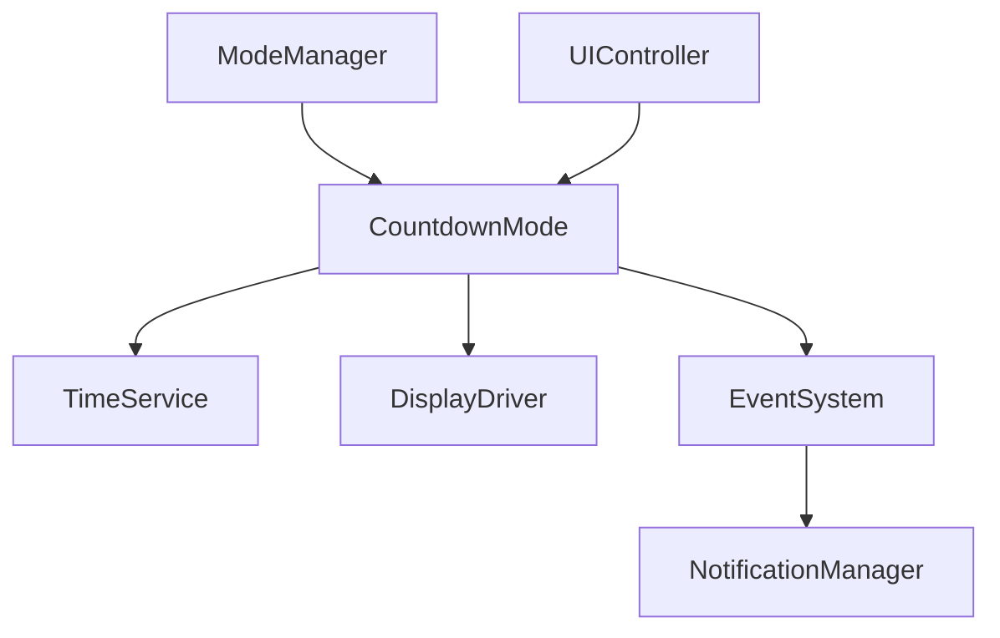
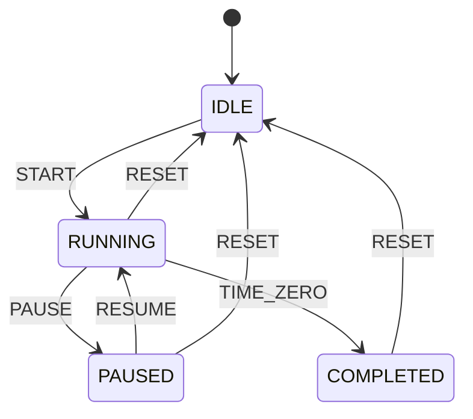
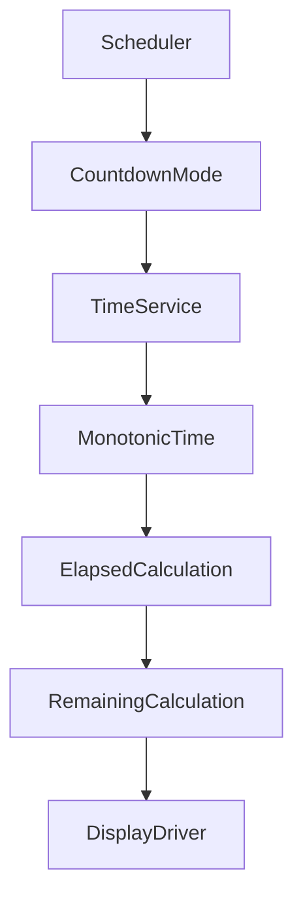
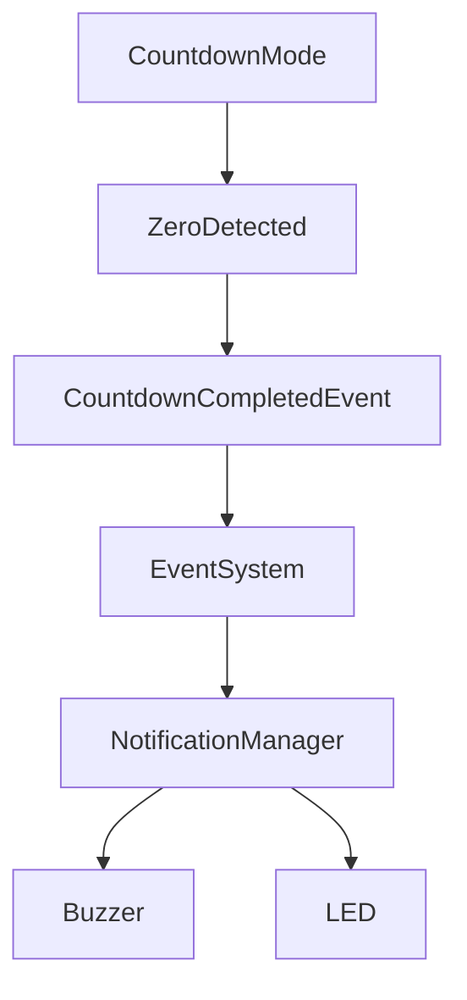
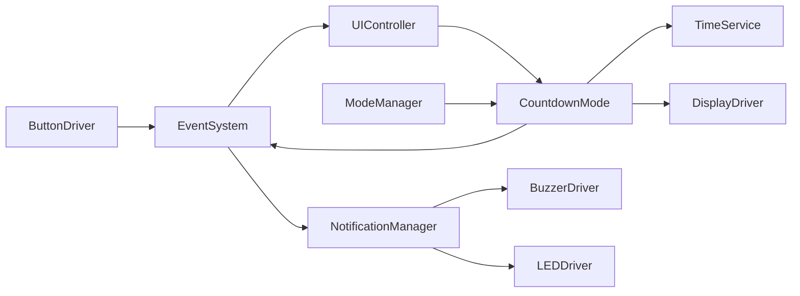

Berikut isi **`PROMPT_20_Countdown_Mode.md`**, mengikuti struktur prompt sebelumnya dan arsitektur project yang sudah kita tetapkan. Saya juga menerapkan prinsip bahwa countdown menggunakan **monotonic elapsed time**, bukan menghitung `--second` berdasarkan jumlah `update()`.

````md
# PROMPT_20_Countdown_Mode.md

# Vibe Coding Prompt
# Module Implementation: Countdown Mode


Anda adalah **Senior Embedded Firmware Engineer** yang bertanggung jawab membuat firmware production-grade untuk project:

# Operation Timer Embedded System


Target platform:

- PlatformIO
- Arduino Framework
- Arduino Nano
- ATmega328P
- Embedded C++


---

# Task

Implementasikan modul:

```text
Countdown Mode
```

Countdown Mode digunakan untuk menghitung waktu mundur dari nilai yang ditentukan operator sampai:

```text
00:00:00
```

Format display:

```text
HH:MM:SS
```

Range:

```text
00:00:00
hingga
99:59:59
```

Tick display:

```text
1 second
```

Countdown harus menggunakan **monotonic elapsed time** dan tidak boleh bergantung pada jumlah pemanggilan:

```cpp
update()
```


---

# Core Principle

JANGAN membuat countdown seperti:

```cpp
if (tick)
{
    seconds--;
}
```

jika `tick` hanya berasal dari jumlah pemanggilan scheduler.


Countdown harus dihitung berdasarkan:

```text
Target Time
-
Elapsed Monotonic Time
```


atau equivalent architecture yang menggunakan timestamp.


Tujuan:

- scheduler jitter tidak menyebabkan waktu meleset
- display multiplex tidak memengaruhi countdown
- processing load tidak memengaruhi countdown
- timing tetap deterministic


---

# Architecture

Gunakan:




Countdown Mode tidak boleh mengakses hardware secara langsung.


---

# Responsibility

Countdown Mode bertanggung jawab terhadap:

- countdown state
- countdown target
- start
- pause
- resume
- reset
- remaining time
- maximum input range
- zero detection
- display representation
- countdown-specific event
- countdown-specific notification


Countdown Mode TIDAK bertanggung jawab terhadap:

- button GPIO
- display multiplexing
- 74HC595
- ULN2803
- BC547C
- S8550
- DS3231 I2C
- buzzer GPIO
- LED GPIO
- scheduler implementation


---

# Countdown State

Implementasikan:

```cpp
enum class CountdownState : uint8_t
{
    IDLE,
    RUNNING,
    PAUSED,
    COMPLETED
};
```


Default:

```text
IDLE
```


---

# State Meaning

## IDLE

Countdown belum berjalan.

Nilai remaining time berasal dari configured countdown value.


---

## RUNNING

Countdown sedang berjalan.


---

## PAUSED

Countdown dihentikan sementara.


Remaining time harus dipertahankan.


---

## COMPLETED

Countdown telah mencapai:

```text
00:00:00
```


State ini digunakan untuk memastikan countdown tidak underflow.


---

# State Machine

Gunakan:




Jika UI specification memiliki state berbeda, sesuaikan implementasi dengan:

```text
docs/13_UI_UX_Specification.md
```


---

# Countdown Data Model

Gunakan satu source of truth untuk waktu.


Recommended:

```cpp
struct CountdownData
{
    CountdownState state;

    uint32_t configuredSeconds;

    uint32_t accumulatedElapsedMs;

    uint32_t startTimestampMs;

    uint32_t lastDisplayedRemainingSeconds;

    bool displayDirty;
};
```


Jika struktur ini menjadi terlalu besar, optimalkan sesuai kebutuhan SRAM.


---

# Maximum Value

Maximum:

```text
99:59:59
```


Maximum seconds:

```text
359999
```


Gunakan:

```cpp
constexpr uint32_t COUNTDOWN_MAX_SECONDS = 359999UL;
```


Jangan menggunakan magic number di implementation.


---

# Minimum Value

Minimum:

```text
00:00:00
```


Countdown tidak boleh menjadi:

```text
-1
```

atau:

```text
99:59:60
```

atau nilai unsigned overflow.


---

# Configuration

Countdown membutuhkan nilai target sebelum START.


Contoh:

```text
05:30:00
```

berarti:

```text
configuredSeconds = 19800
```


Jika configured value:

```text
00:00:00
```

maka START harus ditolak atau menghasilkan:

```text
COMPLETED
```

sesuai UI specification.


Recommended:

```text
00:00:00 + START
-->
NO_CHANGE
```

atau:

```text
COMPLETED
```

tanpa menjalankan timer.


---

# Countdown Editing

Countdown value harus dapat diatur melalui UI.


Namun Countdown Mode tidak boleh membaca physical button langsung.


Flow:

```text
ButtonDriver
    |
    v
EventSystem
    |
    v
UIController
    |
    v
CountdownMode
```


UI Controller bertanggung jawab menerjemahkan:

```text
UP
DOWN
NEXT
SELECT
HOLD
REPEAT
```

menjadi semantic countdown action.


---

# Countdown Action

Gunakan semantic action.


Contoh:

```cpp
enum class CountdownAction : uint8_t
{
    NONE,
    START,
    PAUSE,
    RESUME,
    RESET,
    INCREMENT,
    DECREMENT,
    NEXT_FIELD
};
```


Jika project sudah memiliki:

```cpp
UiAction
```

gunakan enum tersebut daripada membuat duplicate action system.


---

# Time Editing

Countdown terdiri dari:

```text
HH
MM
SS
```


Range field:

```text
HH = 00..99
MM = 00..59
SS = 00..59
```


Editing tidak boleh menghasilkan:

```text
00:60:00
```

atau:

```text
00:00:60
```


---

# Recommended Editing Model

Gunakan:

```text
selected field
```

dengan:

```text
HOUR
MINUTE
SECOND
```


Contoh:

```text
05:30:00
^^
```

hour selected.


NEXT:

```text
05:30:00
   ^^
```

minute selected.


NEXT:

```text
05:30:00
      ^^
```

second selected.


Jangan implementasikan field cursor langsung di display driver.


---

# Editing State

Editing countdown hanya boleh dilakukan ketika:

```text
IDLE
```

atau:

```text
PAUSED
```

jika UI specification mengizinkannya.


DILARANG mengubah configured countdown saat:

```text
RUNNING
```


kecuali requirement UI secara eksplisit mengizinkannya.


---

# Recommended Production Rule

Saat:

```text
RUNNING
```

configuration dikunci.


Saat:

```text
PAUSED
```

configuration tidak langsung diubah.


Untuk mengubah target:

```text
RESET
-->
edit
-->
START
```


Alasan:

- deterministic
- mencegah operator tidak sengaja mengubah waktu
- lebih aman untuk operating room environment


Jika `13_UI_UX_Specification.md` menetapkan behavior lain, ikuti dokumen tersebut.


---

# Start Algorithm

Saat:

```text
IDLE
+
START
```


Validasi:

```text
configuredSeconds > 0
```


Kemudian:

```text
accumulatedElapsedMs_ = 0;
startTimestampMs_ = monotonicNow();
state_ = RUNNING;
displayDirty_ = true;
```


---

# Pause Algorithm

Saat:

```text
RUNNING
+
PAUSE
```


Hitung:

```text
elapsed =
now - startTimestampMs_
```


Kemudian:

```text
accumulatedElapsedMs_
+= elapsed;
```


Clamp terhadap configured value.


Set:

```text
startTimestampMs_ = 0;
state_ = PAUSED;
displayDirty_ = true;
```


---

# Resume Algorithm

Saat:

```text
PAUSED
+
RESUME
```


Set:

```text
startTimestampMs_ = monotonicNow();
state_ = RUNNING;
displayDirty_ = true;
```


`accumulatedElapsedMs_` tidak boleh di-reset.


---

# Reset Algorithm

Saat:

```text
RUNNING
+
RESET
```


atau:

```text
PAUSED
+
RESET
```

hasil:

```text
state = IDLE
remaining = configuredSeconds
```

Countdown kembali ke nilai awal.


Contoh:

```text
Configured:
10:00:00

Running:
07:35:12

RESET

Display:
10:00:00
```


---

# Important Reset Rule

Reset countdown tidak boleh:

```text
reset RTC
```

dan tidak boleh mengubah:

```text
DS3231
```


Countdown sepenuhnya independent dari wall clock.


---

# Remaining Time Calculation

Saat RUNNING:

```text
elapsedMs =
accumulatedElapsedMs
+
(now - startTimestampMs)
```


Kemudian:

```text
remainingMs =
configuredMs
-
elapsedMs
```


Tetapi sebelum subtraction pastikan:

```text
elapsedMs < configuredMs
```


Jika:

```text
elapsedMs >= configuredMs
```

maka:

```text
remaining = 0
```


Ini wajib untuk mencegah unsigned underflow.


---

# Safe Unsigned Arithmetic

DILARANG:

```cpp
uint32_t remaining =
    configuredMs - elapsedMs;
```

tanpa validasi.


Gunakan:

```cpp
if (elapsedMs >= configuredMs)
{
    remainingMs = 0;
}
else
{
    remainingMs = configuredMs - elapsedMs;
}
```


---

# Countdown Formula

Secara konseptual:

```text
Remaining
=
Configured
-
Elapsed
```


Contoh:

```text
Configured = 01:00:00
Elapsed    = 00:12:35

Remaining  = 00:47:25
```


---

# Time Conversion

Gunakan total seconds sebagai source of truth.


```text
hours =
totalSeconds / 3600

minutes =
(totalSeconds % 3600) / 60

seconds =
totalSeconds % 60
```


---

# Countdown Time Structure

Jika diperlukan:

```cpp
struct CountdownTime
{
    uint8_t hours;
    uint8_t minutes;
    uint8_t seconds;
};
```


Gunakan helper:

```cpp
void splitSeconds(
    uint32_t totalSeconds,
    CountdownTime &time
);
```


---

# Reference Rule

WAJIB memprioritaskan passing by reference untuk object dan struct.


Contoh:

```cpp
void buildDisplayFrame(
    const CountdownTime &time,
    DisplayFrame &frame
);
```


Jangan:

```cpp
DisplayFrame buildDisplayFrame(
    CountdownTime time
);
```


Primitive kecil seperti:

```cpp
uint8_t
uint32_t
bool
enum
```

boleh pass-by-value.


---

# API

Implementasikan minimal:

```cpp
class CountdownMode
{
public:

    StatusCode begin();

    void onEnter();

    void onExit();

    void update();

    StatusCode handleAction(
        const CountdownAction action
    );

    StatusCode setConfiguredSeconds(
        uint32_t seconds
    );

    uint32_t configuredSeconds() const;

    uint32_t remainingSeconds() const;

    CountdownState state() const;

    bool isRunning() const;

    bool isPaused() const;

    bool isCompleted() const;
};
```


Jika `CountdownAction` berupa object/struct besar, gunakan:

```cpp
const CountdownAction &action
```


---

# Configuration Validation

`setConfiguredSeconds()` harus memvalidasi:

```text
0 <= seconds <= 359999
```


Jika:

```text
seconds > 359999
```

return:

```text
INVALID_PARAMETER
```


dan jangan mengubah configuration sebelumnya.


---

# Configuration While Running

Jika:

```text
state == RUNNING
```

maka:

```cpp
setConfiguredSeconds()
```

harus ditolak.


Return:

```text
INVALID_STATE
```


---

# Configuration While Completed

Recommended:

```text
COMPLETED
+
setConfiguredSeconds()
```

tidak boleh langsung membuat countdown RUNNING.


Configuration boleh diubah, tetapi state tetap:

```text
IDLE
```

atau transition melalui reset.


Ikuti UI specification.


---

# Zero Handling

Saat:

```text
remainingSeconds == 0
```

transition:

```text
RUNNING
-->
COMPLETED
```


Kemudian:

```text
startTimestampMs_ = 0;
```


Countdown berhenti.


---

# Zero Display

Display:

```text
00:00:00
```


Tidak boleh:

```text
00:00:-1
```

atau unsigned overflow.


---

# Completion Event

Saat pertama kali mencapai zero, publish:

```text
COUNTDOWN_COMPLETED
```


Event hanya boleh dipublish:

```text
ONE TIME
```


Jangan publish event setiap scheduler update setelah zero.


---

# Completion Notification

Notification Manager dapat menerima:

```text
COUNTDOWN_COMPLETED
```


dan menghasilkan:

```text
buzzer
LED
notification pattern
```


Countdown Mode tidak boleh mengakses:

```cpp
digitalWrite()
```

atau buzzer secara langsung.


---

# Completion Sequence

Recommended:

```text
RUNNING
   |
   v
remaining = 00:00:00
   |
   v
COMPLETED
   |
   +---- COUNTDOWN_COMPLETED
   |
   +---- NotificationManager
```


---

# Buzzer Rule

DILARANG:

```cpp
digitalWrite(BUZZER, LOW);
delay(...);
digitalWrite(BUZZER, HIGH);
```


Gunakan:

```text
EventSystem
+
NotificationManager
```


Pattern buzzer harus didefinisikan di Notification Manager.


---

# LED Rule

Countdown Mode tidak mengontrol LED secara langsung.


Gunakan notification/event abstraction jika diperlukan.


---

# Display Format

Format:

```text
HH:MM:SS
```


Digit mapping:

```text
Digit 1 = Hour Tens
Digit 2 = Hour Units
Digit 3 = Minute Tens
Digit 4 = Minute Units
Digit 5 = Second Tens
Digit 6 = Second Units
```


Contoh:

```text
01:23:45
```


---

# Colon

Default:

```text
colon = ON
```


Jika UI specification menentukan blinking colon:

```text
RUNNING -> blink
PAUSED -> solid
IDLE -> solid
COMPLETED -> solid
```


ikuti:

```text
docs/13_UI_UX_Specification.md
```


---

# Display Driver Boundary

Countdown Mode tidak boleh mengetahui:

```text
74HC595
ULN2803
BC547C
S8550
digit enable
segment mapping
multiplex timing
```

Countdown hanya menghasilkan logical display frame.


---

# Segment Encoder Boundary

Countdown Mode tidak boleh mengetahui:

```text
A
B
C
D
E
F
G
```

Segment encoding dilakukan oleh:

```text
SegmentEncoder
```


---

# Button Boundary

Countdown Mode tidak boleh membaca:

```cpp
digitalRead()
```


dan tidak boleh mengetahui:

```text
PB_PWR
PB_SLC
PB_NXT
PB_UP
PB_DWN
```


Semua input berasal dari:

```text
ButtonDriver
    |
    v
EventSystem
    |
    v
UIController
    |
    v
CountdownMode
```


---

# Hold / Repeat

Countdown Mode tidak mengimplementasikan debounce atau repeat timer.


Button Driver bertanggung jawab terhadap:

```text
SHORT
HOLD
REPEAT
RELEASE
```


Countdown hanya menerima semantic action.


---

# Editing with Repeat

Untuk field adjustment:

```text
UP HOLD
UP REPEAT
```

atau:

```text
DOWN HOLD
DOWN REPEAT
```

dapat digunakan untuk mempercepat editing.


Repeat rate harus ditentukan oleh:

```text
ButtonDriver
```

bukan Countdown Mode.


---

# Increment Rules

Hour:

```text
00 -> 01 -> ... -> 99 -> 00
```

Minute:

```text
00 -> 01 -> ... -> 59 -> 00
```

Second:

```text
00 -> 01 -> ... -> 59 -> 00
```


Wrap-around boleh digunakan hanya saat editing jika sesuai UI specification.


---

# Editing Safety

Jangan melakukan increment seperti:

```cpp
seconds++;
```

tanpa boundary.


Gunakan helper:

```cpp
uint8_t incrementField(
    uint8_t value,
    uint8_t maximum
);
```


atau implementation equivalent.


---

# Recommended Internal Representation

Countdown configuration sebaiknya disimpan sebagai:

```text
total seconds
```


bukan:

```text
hours
minutes
seconds
```


secara terpisah.


Alasan:

- satu source of truth
- mengurangi synchronization bug
- lebih mudah arithmetic
- lebih kecil
- lebih mudah validasi


---

# Example

Operator mengatur:

```text
01:30:45
```


Internal:

```text
5445 seconds
```


Display:

```text
01:30:45
```


Saat running 45 seconds:

```text
Remaining = 5400 seconds
```


Display:

```text
01:30:00
```


---

# Dirty Flag

Gunakan:

```cpp
bool displayDirty_;
```


Set dirty saat:

- mode enter
- start
- pause
- resume
- reset
- configured value berubah
- remaining second berubah
- countdown completed
- UI field berubah
- colon state berubah


Jika tidak berubah:

```text
jangan rebuild display frame
```


---

# Display Update Flow

```text
Scheduler
    |
    v
CountdownMode::update()
    |
    v
calculateRemaining()
    |
    +---- same second
    |       |
    |       v
    |    no update
    |
    +---- second changed
            |
            v
      build display frame
            |
            v
       DisplayDriver
```


---

# Update Frequency

`CountdownMode::update()` boleh dipanggil:

```text
10ms
20ms
50ms
100ms
```

tanpa mengubah akurasi countdown.


Timing harus berasal dari:

```text
TimeService
```


bukan dari:

```text
update() count
```


---

# Monotonic Time

Gunakan:

```cpp
uint32_t now =
    timeService.monotonicMs();
```


atau API abstraction yang sudah tersedia.


DILARANG langsung:

```cpp
millis()
```


jika project sudah memiliki:

```text
Timer HAL
```

atau:

```text
TimeService
```


---

# Rollover Safety

Gunakan:

```cpp
uint32_t delta =
    now - startTimestampMs_;
```


Jangan menggunakan:

```cpp
if (now > startTimestampMs_)
```


untuk menentukan elapsed.


Unsigned subtraction harus digunakan agar rollover aman.


---

# RTC Independence

DS3231 hanya digunakan untuk:

```text
wall clock
```


Countdown tidak menggunakan:

```cpp
rtc.now()
```


untuk menghitung remaining time.


---

# RTC Change Test

Contoh:

```text
Countdown:
00:30:00
```

RTC:

```text
12:00:00
```

ubah RTC menjadi:

```text
15:00:00
```


Countdown harus tetap berjalan:

```text
00:29:59
```

dan seterusnya.


---

# Mode Entry

Saat masuk Countdown Mode:

```text
ModeManager
    |
    v
CountdownMode::onEnter()
```


Countdown tidak boleh otomatis reset kecuali UI specification menentukan demikian.


---

# Mode Exit

Recommended production behavior:


Jika:

```text
RUNNING
```

kemudian keluar mode:

```text
RUNNING
-->
PAUSED
```


Alasan:

- operator selalu mengetahui timer berhenti
- tidak ada hidden countdown
- mencegah timer selesai ketika tidak sedang dilihat


Jika UI specification menentukan countdown tetap berjalan di background, ikuti specification tersebut.


---

# Re-entry

Jika:

```text
COUNTDOWN
00:20:00 RUNNING

CLOCK

COUNTDOWN
```

dan production rule adalah auto-pause:

```text
00:20:00 PAUSED
```


Jika countdown background operation memang diizinkan oleh UI specification:

```text
00:19:xx RUNNING
```


jangan membuat behavior baru tanpa dokumentasi.


---

# No Automatic Reset

Masuk kembali ke Countdown Mode tidak boleh otomatis menghapus configured value.


Contoh:

```text
Configured:
30:00
```

tetap:

```text
30:00
```


---

# Event Integration

Gunakan Event System existing.


Publish:

```text
COUNTDOWN_START
COUNTDOWN_PAUSE
COUNTDOWN_RESUME
COUNTDOWN_RESET
COUNTDOWN_COMPLETED
```


Optional:

```text
COUNTDOWN_CONFIGURATION_CHANGED
```


Jangan membuat duplicate event bus.


---

# Notification Integration

Countdown Mode hanya publish event.


Notification Manager menangani:

```text
buzzer
LED
notification sequence
```


Contoh:

```text
COUNTDOWN_COMPLETED
        |
        v
NotificationManager
        |
        +---- buzzer pattern
        |
        +---- LED pattern
```


---

# Persistence

Countdown configuration tidak perlu ditulis EEPROM setiap perubahan.


DILARANG:

```text
EEPROM.write()
```

setiap:

```text
UP
DOWN
second
```


Runtime state berada di RAM.


---

# Power Cycle

Default:

```text
power cycle
-->
COUNTDOWN IDLE
```

Configured value dapat kembali ke default jika persistence belum ditentukan.


Jika future requirement membutuhkan preset persistence, gunakan dedicated configuration/persistence service.


---

# No Dynamic Allocation

DILARANG:

```cpp
new
delete
malloc
free
```


DILARANG:

```cpp
String
std::vector
std::map
std::function
```


Gunakan static allocation.


---

# No Blocking

DILARANG:

```cpp
delay()
```


DILARANG blocking loop untuk menunggu timer.


Semua timing harus non-blocking.


---

# No Direct Hardware

DILARANG:

```cpp
digitalRead()
digitalWrite()
pinMode()
shiftOut()
SPI.transfer()
Wire.begin()
Wire.requestFrom()
```


Countdown Mode hanya application logic.


---

# API Example

Recommended:

```cpp
class CountdownMode
{
public:

    StatusCode begin();

    void onEnter();

    void onExit();

    void update();

    StatusCode handleAction(
        const CountdownAction action
    );

    StatusCode setConfiguredSeconds(
        uint32_t seconds
    );

    uint32_t configuredSeconds() const;

    uint32_t remainingSeconds() const;

    CountdownState state() const;

    bool isRunning() const;

    bool isPaused() const;

    bool isCompleted() const;
};
```


Jika dependency injection digunakan oleh project, constructor harus menggunakan reference.


Contoh:

```cpp
CountdownMode(
    TimeService &timeService,
    DisplayDriver &displayDriver,
    EventSystem &eventSystem
);
```


Jangan copy object service.


---

# Dependency Injection

Service object harus di-pass sebagai reference.


Contoh:

```cpp
CountdownMode(
    TimeService &timeService,
    DisplayDriver &displayDriver,
    EventSystem &eventSystem
);
```


Private member:

```cpp
TimeService &timeService_;
DisplayDriver &displayDriver_;
EventSystem &eventSystem_;
```


Jangan:

```cpp
TimeService timeService_;
DisplayDriver displayDriver_;
EventSystem eventSystem_;
```


karena akan membuat duplicate object dan meningkatkan penggunaan SRAM.


---

# Dependency Ownership

CountdownMode:

```text
DOES NOT OWN
```

service dependency.


Lifetime dependency dikontrol oleh application layer.


---

# StatusCode

Gunakan `StatusCode` dari Common Library.


Jangan membuat:

```cpp
enum class CountdownStatus
```

jika status abstraction sudah tersedia.


Minimal result:

```text
OK
NO_CHANGE
INVALID_STATE
INVALID_PARAMETER
ERROR
```


---

# Unit Test

Buat:

```text
test/modes/countdown/
```


---

# Test 1 - Initial State

Expected:

```text
state = IDLE
configured = default
remaining = configured
```


---

# Test 2 - Configure

Set:

```text
01:30:00
```


Expected:

```text
configured = 5400
remaining = 5400
```


---

# Test 3 - Invalid Configuration

Set:

```text
100:00:00
```


Expected:

```text
INVALID_PARAMETER
```


Configuration sebelumnya tidak berubah.


---

# Test 4 - Start

```text
IDLE
+
START
```


Expected:

```text
RUNNING
```


---

# Test 5 - Pause

```text
RUNNING
+
PAUSE
```


Expected:

```text
PAUSED
```


Remaining tidak berubah setelah pause.


---

# Test 6 - Resume

```text
PAUSED
+
RESUME
```


Expected:

```text
RUNNING
```


Remaining melanjutkan nilai sebelumnya.


---

# Test 7 - Reset

Configured:

```text
10:00:00
```


Elapsed:

```text
03:00:00
```


Reset.


Expected:

```text
IDLE
10:00:00
```


---

# Test 8 - One Minute Countdown

Configured:

```text
00:01:00
```


After:

```text
1 second
```


Expected:

```text
00:00:59
```


---

# Test 9 - One Minute Boundary

Configured:

```text
00:01:00
```


After:

```text
60 seconds
```


Expected:

```text
00:00:00
COMPLETED
```


---

# Test 10 - No Underflow

After more than:

```text
60 seconds
```


Expected:

```text
00:00:00
```


Never:

```text
4294967295
```


---

# Test 11 - Hour Conversion

Input:

```text
3600
```


Expected:

```text
01:00:00
```


---

# Test 12 - Full Conversion

Input:

```text
3661
```


Expected:

```text
01:01:01
```


---

# Test 13 - Maximum Configuration

Input:

```text
359999
```


Expected:

```text
99:59:59
```


---

# Test 14 - Maximum Countdown

Configured:

```text
99:59:59
```


Expected:

```text
99:59:59
```


Then countdown menuju:

```text
00:00:00
```


---

# Test 15 - Completion Event

Saat zero tercapai:


Expected:

```text
COUNTDOWN_COMPLETED
```


Event hanya sekali.


---

# Test 16 - Completion Repeated Update

Setelah:

```text
COMPLETED
```


panggil:

```text
update()
```

berulang kali.


Expected:

```text
COUNTDOWN_COMPLETED
```

tidak dipublish lagi.


---

# Test 17 - RTC Independence

Ubah RTC wall clock.


Expected:

```text
remaining countdown tidak terpengaruh
```


---

# Test 18 - Timer Rollover

Simulasikan:

```text
uint32_t
```

monotonic rollover.


Expected countdown tetap benar.


---

# Test 19 - Pause Accuracy

Configured:

```text
00:10:00
```


Run:

```text
00:02:30
```


Pause.


Expected:

```text
00:07:30
```


Tunggu 5 menit.


Expected tetap:

```text
00:07:30
```


---

# Test 20 - Resume Accuracy

Resume selama:

```text
00:01:15
```


Expected:

```text
00:06:15
```


---

# Test 21 - Reset While Paused

Expected:

```text
remaining = configured
state = IDLE
```


---

# Test 22 - Start Zero

Configured:

```text
00:00:00
```


START.


Expected:

```text
NO_CHANGE
```

atau:

```text
COMPLETED
```

sesuai UI specification.


Tidak boleh:

```text
RUNNING
```


---

# Test 23 - Start While Running

```text
RUNNING
+
START
```


Expected:

```text
NO_CHANGE
```


---

# Test 24 - Pause While Idle

```text
IDLE
+
PAUSE
```


Expected:

```text
NO_CHANGE
```


---

# Test 25 - Resume While Idle

```text
IDLE
+
RESUME
```


Expected:

```text
NO_CHANGE
```


---

# Test 26 - Configuration While Running

```text
RUNNING
+
setConfiguredSeconds()
```


Expected:

```text
INVALID_STATE
```


---

# Test 27 - Display Dirty

Jika remaining second tidak berubah:


```text
displayDirty = false
```


Jika second berubah:


```text
displayDirty = true
```


---

# Test 28 - Display Frame

Configured:

```text
12:34:56
```


Expected display:

```text
12:34:56
```


---

# Test 29 - No Hardware Access

Source code tidak boleh mengandung:

```cpp
digitalRead()
digitalWrite()
pinMode()
Wire
SPI
shiftOut()
```


---

# Test 30 - No Heap

Pastikan tidak terdapat:

```text
new
delete
malloc
free
```


---

# Test 31 - Memory Usage

Build:

```bash
pio run
```


Catat:

```text
Flash usage
RAM usage
```


Pastikan masih dalam resource budget Arduino Nano.


---

# Documentation

Buat:

```text
docs/Countdown_Mode.md
```


Dokumentasi minimal:

- responsibility
- state machine
- countdown configuration
- editing
- start
- pause
- resume
- reset
- completion
- zero handling
- maximum range
- monotonic timing
- RTC independence
- display format
- event integration
- notification integration
- mode entry
- mode exit
- memory considerations


---

# Mermaid Documentation

## State Machine


---

# Timing Architecture




---

# Completion Architecture




---

# Mode Architecture


---

# Coding Standard

Class:

```text
PascalCase
```


Example:

```cpp
CountdownMode
```


Function:

```text
camelCase
```


Example:

```cpp
setConfiguredSeconds()
remainingSeconds()
calculateRemainingSeconds()
```


Private member:

```text
camelCase_
```


Example:

```cpp
uint32_t configuredSeconds_;
uint32_t accumulatedElapsedMs_;
uint32_t startTimestampMs_;
```


Constant:

```text
UPPER_CASE
```


Example:

```cpp
COUNTDOWN_MAX_SECONDS
```


Enum:

```text
PascalCase type
UPPER_CASE members
```


---

# Memory Optimization

ATmega328P hanya memiliki:

```text
2 KB SRAM
```


Karena itu:

- jangan duplicate service object
- gunakan reference
- gunakan static allocation
- gunakan fixed-size data
- jangan gunakan dynamic allocation
- jangan gunakan `String`
- jangan menyimpan hour/minute/second secara redundant
- gunakan total seconds sebagai source of truth


---

# Reference Priority

Aturan project:

> Saat membuat variable, function parameter, atau class dependency, prioritaskan passing by reference untuk menghindari copy object dan menghemat resource Arduino Nano.

Contoh:

```cpp
CountdownMode(
    TimeService &timeService,
    DisplayDriver &displayDriver,
    EventSystem &eventSystem
);
```


Untuk read-only:

```cpp
const CountdownTime &time
```


Untuk output:

```cpp
CountdownTime &time
```


Primitive kecil tetap boleh:

```cpp
uint32_t
uint8_t
bool
enum
```


by value.


---

# No Duplicate Service

Jangan membuat instance baru:

```cpp
TimeService timeService;
```

di dalam CountdownMode jika service sudah dimiliki application layer.


Gunakan reference injection.


---

# No Global State

Hindari global mutable state seperti:

```cpp
uint32_t countdown;
bool running;
```

di luar class.


State harus dimiliki:

```text
CountdownMode
```


---

# Integration Boundary

Final architecture:




Countdown Mode harus tetap berada di layer application.


---

# Implementation Order

Implementasikan dengan urutan:

```text
1. CountdownState
2. CountdownData
3. CountdownMode class
4. TimeService dependency
5. Configuration validation
6. Start
7. Pause
8. Resume
9. Reset
10. Remaining time calculation
11. Zero detection
12. Completion state
13. Display frame generation
14. Event integration
15. Notification event
16. UI action integration
17. Unit test
18. Documentation
```


---

# Important Implementation Rules

WAJIB:

- Countdown menggunakan monotonic time
- Countdown tidak menggunakan RTC sebagai elapsed timer
- Countdown tidak membaca DS3231 langsung
- Countdown menggunakan TimeService/Timer HAL
- countdown tidak bergantung pada jumlah update()
- support IDLE
- support RUNNING
- support PAUSED
- support COMPLETED
- support START
- support PAUSE
- support RESUME
- support RESET
- support configuration
- range 00:00:00 sampai 99:59:59
- zero handling
- underflow protection
- maximum validation
- display HH:MM:SS
- dirty flag
- Event System
- Notification Manager
- no direct GPIO
- no direct RTC access
- no direct I2C
- no direct SPI
- no delay()
- no blocking
- no heap
- no String
- no EEPROM per second
- reference-first design
- dependency injection
- unsigned timestamp subtraction
- rollover safe
- unit test
- documentation
- PlatformIO build sukses


---

# Final Checklist

- [ ] CountdownMode tersedia
- [ ] IDLE state tersedia
- [ ] RUNNING state tersedia
- [ ] PAUSED state tersedia
- [ ] COMPLETED state tersedia
- [ ] START tersedia
- [ ] PAUSE tersedia
- [ ] RESUME tersedia
- [ ] RESET tersedia
- [ ] countdown configuration tersedia
- [ ] maximum 99:59:59
- [ ] minimum 00:00:00
- [ ] invalid configuration ditolak
- [ ] zero detection tersedia
- [ ] underflow dicegah
- [ ] completion event tersedia
- [ ] completion event hanya sekali
- [ ] monotonic time digunakan
- [ ] TimeService digunakan
- [ ] RTC tidak digunakan untuk elapsed timing
- [ ] timer rollover aman
- [ ] pause mempertahankan remaining time
- [ ] resume melanjutkan remaining time
- [ ] reset kembali ke configured value
- [ ] display HH:MM:SS
- [ ] display dirty flag tersedia
- [ ] display driver digunakan
- [ ] segment encoder tidak diakses langsung
- [ ] button driver tidak diakses langsung
- [ ] UI Controller boundary terjaga
- [ ] Event System digunakan
- [ ] Notification Manager digunakan
- [ ] buzzer tidak diakses langsung
- [ ] LED tidak diakses langsung
- [ ] tidak menggunakan delay()
- [ ] tidak menggunakan direct millis()
- [ ] tidak menggunakan direct Wire
- [ ] tidak menggunakan direct SPI
- [ ] tidak menggunakan direct GPIO
- [ ] tidak menggunakan heap
- [ ] tidak menggunakan String
- [ ] tidak menggunakan global mutable state
- [ ] dependency menggunakan reference
- [ ] object/struct menggunakan reference
- [ ] EEPROM tidak digunakan untuk runtime tick
- [ ] unit test tersedia
- [ ] documentation tersedia
- [ ] Mermaid diagram tersedia
- [ ] PlatformIO compile sukses
- [ ] memory usage diperiksa


# End Of Prompt
````

**Peningkatan arsitektur yang diterapkan:** Countdown sekarang diperlakukan sebagai **target duration + elapsed monotonic time**, bukan sebagai counter yang terus dikurangi. Ini membuatnya konsisten dengan `PROMPT_19_Stopwatch_Mode.md` dan menghindari drift akibat scheduler.

Khusus countdown, saya juga menambahkan **`COMPLETED` state + one-shot `COUNTDOWN_COMPLETED` event**. Ini penting karena buzzer/LED tidak boleh dipicu berulang-ulang setiap `update()` setelah timer mencapai `00:00:00`.
