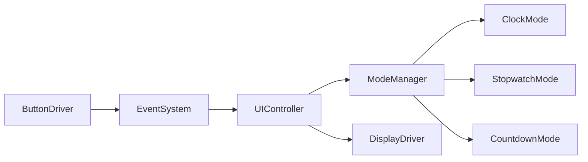
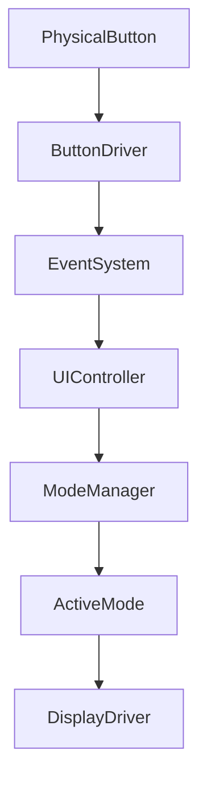
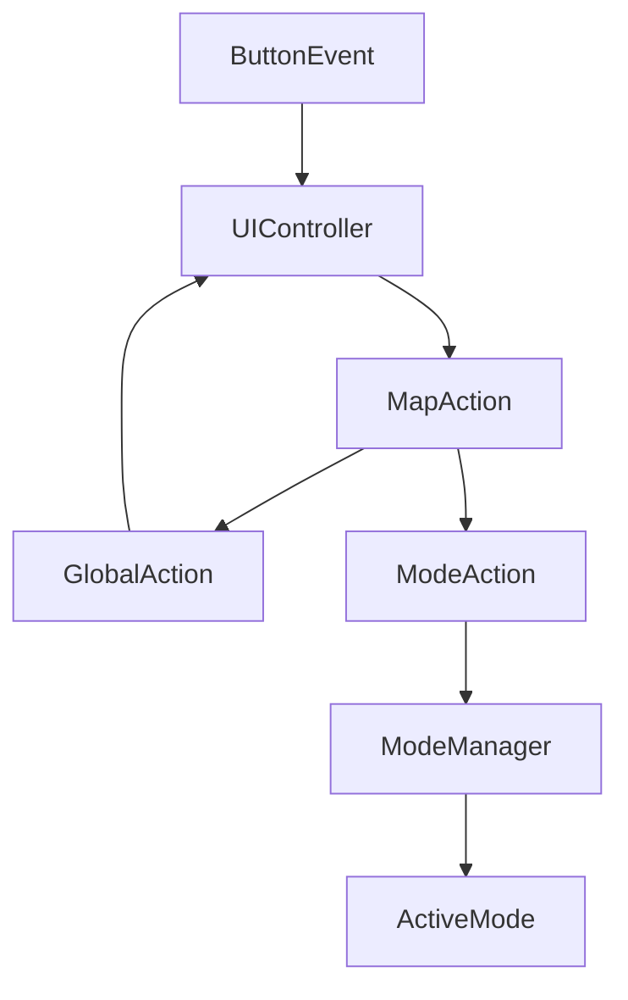
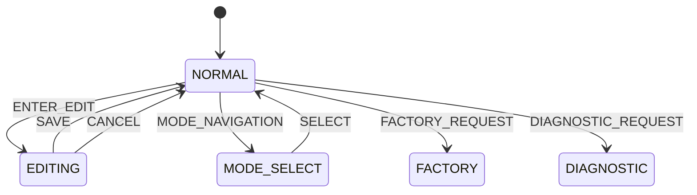
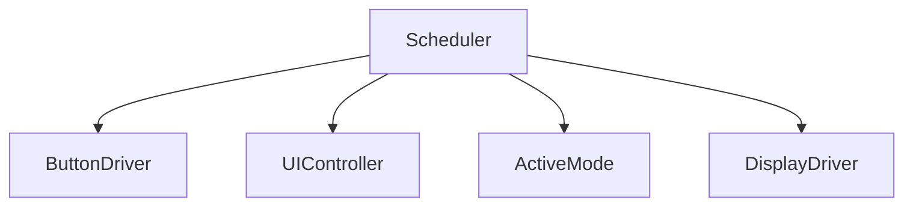
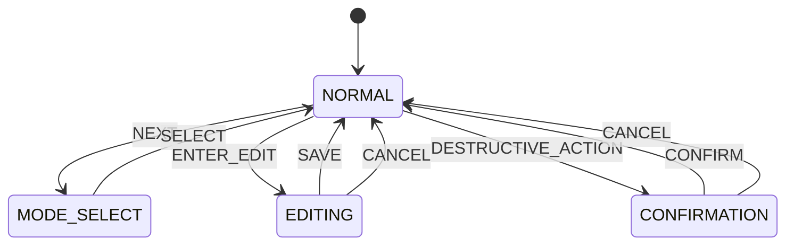
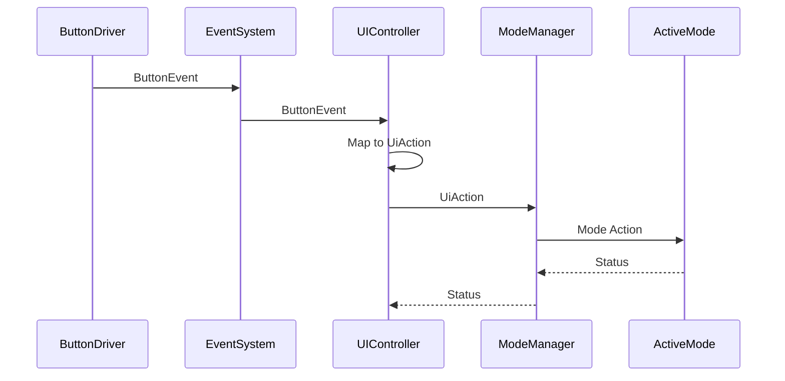
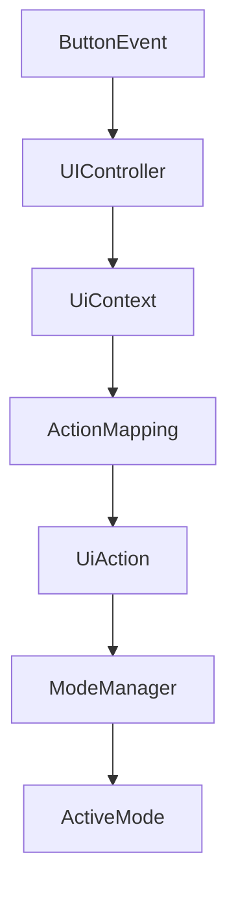
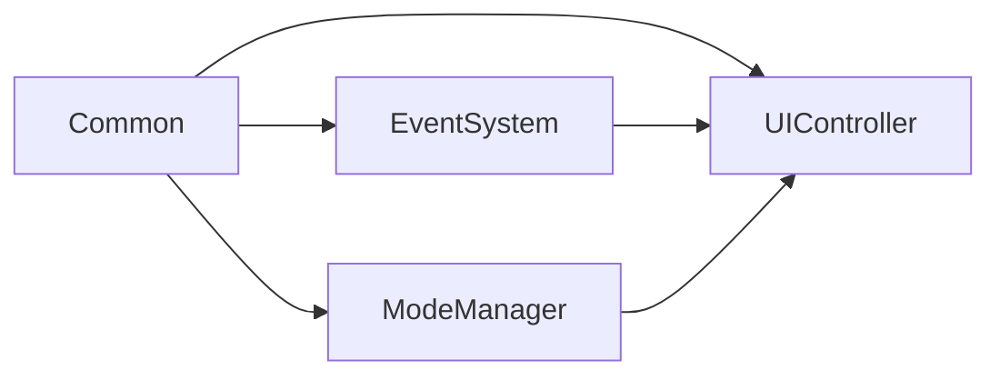

Berikut isi **`PROMPT_21_UI_Controller.md`**. Saya mengikuti arsitektur yang sudah dibangun sampai `PROMPT_20_Countdown_Mode`, termasuk pemisahan `ButtonDriver → EventSystem → UIController → Mode`, semantic action, non-blocking, reference-first, dan tidak ada akses hardware langsung.

````md
# PROMPT_21_UI_Controller.md

# Vibe Coding Prompt
# Module Implementation: UI Controller


Anda adalah **Senior Embedded Firmware Engineer** yang bertanggung jawab membuat firmware production-grade untuk project:

# Operation Timer Embedded System


Target:

- PlatformIO
- Arduino Framework
- Arduino Nano
- ATmega328P
- Embedded C++


---

# Task

Implementasikan modul:

```text
UI Controller
```

UI Controller adalah layer yang menerjemahkan:

```text
Button Event
```

menjadi:

```text
Semantic UI Action
```

dan kemudian mengarahkan action tersebut ke:

```text
ModeManager
```

atau application service yang sesuai.


UI Controller merupakan boundary antara:

```text
Input Hardware
```

dan:

```text
Application Logic
```


---

# Primary Responsibility

UI Controller bertanggung jawab terhadap:

- menerima button event
- memahami context tombol
- membedakan action berdasarkan mode
- mengubah button event menjadi semantic action
- mengatur navigation UI
- mengatur field selection
- meneruskan action ke active mode
- menangani global UI action
- mengatur interaction flow
- menjaga agar mode tidak mengetahui physical button
- menjaga agar ButtonDriver tidak mengetahui business logic


UI Controller TIDAK bertanggung jawab terhadap:

- GPIO
- debounce
- physical button reading
- display multiplex
- segment encoding
- buzzer GPIO
- LED GPIO
- DS3231
- countdown arithmetic
- stopwatch arithmetic
- clock calculation
- mode-specific business logic


---

# Architecture

Gunakan architecture:



Jika arsitektur project sudah memiliki dependency melalui `ModeManager`, UI Controller tidak boleh memanggil mode secara langsung.


Preferred:

```text
UIController
    |
    v
ModeManager
    |
    v
Active Mode
```


---

# Design Principle

UI Controller harus menjadi:

```text
Thin Application Controller
```

bukan:

```text
Business Logic Container
```


Contoh:

UI Controller BOLEH:

```text
UP button
-->
Countdown increment selected field
```

tetapi implementasi arithmetic:

```text
hours/minutes/seconds
```

harus tetap berada di:

```text
CountdownMode
```


---

# Layer Boundary




Setiap layer memiliki responsibility sendiri.


---

# Button Hardware

Hardware memiliki 5 tactile button:

```text
POWER
NEXT
SELECT
UP
DOWN
```


Pin:

```text
D4 = PB_PWR
D5 = PB_SLC
D6 = PB_NXT
D7 = PB_UP
D8 = PB_DWN
```


Button menggunakan:

```text
INPUT_PULLUP
```


Button logic:

```text
HIGH = released
LOW  = pressed
```


Namun UI Controller tidak boleh mengetahui detail ini.


---

# Button Event

UI Controller menerima event yang sudah diproses oleh:

```text
ButtonDriver
```


ButtonDriver bertanggung jawab terhadap:

- debounce
- press
- release
- short
- hold
- repeat
- timing event


UI Controller tidak boleh mengimplementasikan debounce.


---

# Semantic Button Event

Gunakan event abstraction dari:

```text
EventSystem
```


Contoh:

```cpp
enum class ButtonId : uint8_t
{
    POWER,
    NEXT,
    SELECT,
    UP,
    DOWN
};
```


Dan:

```cpp
enum class ButtonEventType : uint8_t
{
    SHORT_PRESS,
    HOLD,
    REPEAT,
    RELEASE
};
```


Jika enum tersebut sudah dibuat pada:

```text
ButtonDriver
```

atau:

```text
Common Library
```

gunakan enum existing.


Jangan membuat duplicate enum.


---

# UI Action

UI Controller harus menerjemahkan button event menjadi semantic action.


Contoh:

```cpp
enum class UiAction : uint8_t
{
    NONE,

    POWER_TOGGLE,

    NEXT,
    SELECT,

    UP,
    DOWN,

    UP_REPEAT,
    DOWN_REPEAT,

    START,
    PAUSE,
    RESUME,
    RESET
};
```


Jika `UiAction` sudah didefinisikan oleh Common/Event System, gunakan definition tersebut.


---

# Important Rule

Jangan membuat:

```text
ButtonId -> business logic
```

secara langsung.


Gunakan:

```text
ButtonEvent
-->
UI Controller
-->
UiAction
-->
ModeManager / ActiveMode
```


---

# UI Context

UI Controller harus mengetahui context saat ini.


Minimal:

```cpp
enum class UiContext : uint8_t
{
    NORMAL,
    MODE_SELECT,
    EDITING,
    CONFIRMATION,
    FACTORY,
    DIAGNOSTIC
};
```


Jika Factory dan Diagnostic memiliki controller khusus, UI Controller hanya melakukan routing.


Jangan menduplikasi business logic.


---

# Current Mode

UI Controller harus mengetahui active mode melalui:

```text
ModeManager
```


Mode minimal:

```cpp
enum class AppMode : uint8_t
{
    CLOCK,
    STOPWATCH,
    COUNTDOWN,
    FACTORY,
    DIAGNOSTIC
};
```


Gunakan enum dari Mode Manager jika sudah tersedia.


---

# Default Context

Saat power-on:

```text
AppMode = CLOCK
UiContext = NORMAL
```


Jika project requirement menentukan mode default berbeda, ikuti specification.


---

# UI Navigation

Primary navigation:

```text
NEXT
```

digunakan untuk berpindah mode atau field sesuai context.


Contoh:

```text
CLOCK
-->
STOPWATCH
-->
COUNTDOWN
-->
CLOCK
```


Namun saat editing:

```text
NEXT
```

berfungsi sebagai:

```text
next field
```


Jangan mencampurkan dua behavior tanpa context.


---

# Context-Based Button Mapping

Mapping tombol harus bergantung pada:

```text
Current Mode
+
Current UI Context
+
Button Event
```


Contoh:

```text
CLOCK + NORMAL + NEXT
-->
STOPWATCH
```


Sedangkan:

```text
COUNTDOWN + EDITING + NEXT
-->
NEXT_FIELD
```


---

# Power Button

POWER adalah global button.


Normal behavior:

```text
POWER SHORT
-->
POWER_TOGGLE
```


Jika project menggunakan hardware power controller, UI Controller hanya menghasilkan semantic action.


UI Controller tidak boleh mengontrol power rail secara langsung.


---

# Power Hold

Jika specification membutuhkan:

```text
POWER HOLD
```

gunakan sebagai:

```text
POWER_OFF_REQUEST
```

atau semantic action yang sudah ditentukan.


Jangan mematikan hardware langsung dari UI Controller.


---

# SELECT Button

SELECT digunakan untuk:

```text
enter
confirm
toggle state
```


Behavior bergantung context.


Contoh:

```text
COUNTDOWN + NORMAL
+
SELECT
-->
EDITING
```


Kemudian:

```text
COUNTDOWN + EDITING
+
SELECT
-->
SAVE / EXIT
```


Exact behavior harus mengikuti:

```text
docs/13_UI_UX_Specification.md
```


---

# NEXT Button

NEXT digunakan untuk:

```text
navigation
next field
next option
```


Context-dependent.


Contoh:

```text
NORMAL:
NEXT = next mode
```

```text
EDITING:
NEXT = next field
```


---

# UP Button

UP digunakan untuk:

```text
increment
selection up
option next
```


UI Controller tidak melakukan arithmetic.


Contoh:

```text
UP
-->
UiAction::UP
```


Kemudian:

```text
CountdownMode
```

melakukan increment.


---

# DOWN Button

DOWN digunakan untuk:

```text
decrement
selection down
option previous
```


UI Controller hanya meneruskan:

```text
UiAction::DOWN
```


---

# Repeat Handling

ButtonDriver bertanggung jawab terhadap repeat.


UI Controller hanya meneruskan:

```text
UP_REPEAT
DOWN_REPEAT
```


Jika active mode tidak membutuhkan repeat:

```text
ignore
```


Jangan membuat repeat timer di UI Controller.


---

# Hold Handling

UI Controller boleh membedakan:

```text
SHORT_PRESS
HOLD
REPEAT
```

untuk menentukan semantic action.


Contoh:

```text
UP SHORT
-->
UP
```

```text
UP REPEAT
-->
UP_REPEAT
```


Tetapi timing hold/repeat harus tetap berasal dari ButtonDriver.


---

# Event Processing

UI Controller harus event-driven.


Contoh:

```cpp
void update();
```

mengambil event dari:

```text
EventSystem
```


kemudian:

```text
Button Event
-->
mapButtonEvent()
-->
UiAction
-->
dispatchAction()
```


---

# No Polling Hardware

DILARANG:

```cpp
digitalRead(PB_UP);
```

di UI Controller.


DILARANG membaca GPIO.


---

# No Button Debounce

DILARANG membuat:

```cpp
lastButtonTime
```

atau:

```cpp
debounceTimer
```

di UI Controller.


Debounce berada di:

```text
ButtonDriver
```


---

# Action Routing

Recommended:




---

# Global Actions

Global actions dapat berupa:

```text
POWER_TOGGLE
NEXT_MODE
ENTER_MODE
EXIT_MODE
```


Mode-specific actions:

```text
START
PAUSE
RESUME
RESET
UP
DOWN
NEXT_FIELD
```


---

# Action Dispatch

Recommended API:

```cpp
StatusCode dispatchAction(
    const UiAction action
);
```


Jika action object/struct:

```cpp
StatusCode dispatchAction(
    const UiActionEvent &event
);
```


Gunakan reference untuk object.


---

# UI Controller Class

Recommended:

```cpp
class UIController
{
public:

    StatusCode begin();

    void update();

    StatusCode handleEvent(
        const ButtonEvent &event
    );

    StatusCode dispatchAction(
        const UiAction action
    );

    UiContext context() const;

    AppMode mode() const;
};
```


Jika naming convention project menggunakan:

```text
UiController
```

ikuti naming convention existing.


Jangan membuat dua class:

```text
UIController
UiController
```


---

# Dependency Injection

Recommended:

```cpp
UIController(
    EventSystem &eventSystem,
    ModeManager &modeManager
);
```


Jika membutuhkan:

```cpp
DisplayDriver
```

gunakan reference.


Contoh:

```cpp
UIController(
    EventSystem &eventSystem,
    ModeManager &modeManager,
    DisplayDriver &displayDriver
);
```


Tetapi dependency harus seminimal mungkin.


---

# Dependency Rule

UI Controller tidak boleh memiliki:

```cpp
ButtonDriver buttonDriver_;
```

sebagai copy.


Gunakan:

```cpp
ButtonDriver &buttonDriver_;
```

jika memang diperlukan.


Namun preferred architecture:

```text
ButtonDriver
-->
EventSystem
-->
UIController
```

sehingga UI Controller tidak perlu mengetahui ButtonDriver sama sekali.


---

# Reference-First Rule

WAJIB memprioritaskan passing by reference untuk:

- object
- struct
- service dependency
- event payload
- display frame
- configuration object


Contoh:

```cpp
StatusCode handleEvent(
    const ButtonEvent &event
);
```


Bukan:

```cpp
StatusCode handleEvent(
    ButtonEvent event
);
```


Untuk mutable output:

```cpp
void buildAction(
    const ButtonEvent &event,
    UiActionEvent &action
);
```


Primitive kecil seperti:

```cpp
uint8_t
uint16_t
uint32_t
bool
enum
```

boleh pass-by-value.


---

# No Object Copy

DILARANG:

```cpp
ModeManager modeManager_;
EventSystem eventSystem_;
DisplayDriver displayDriver_;
```

jika object tersebut sudah dimiliki application layer.


Gunakan reference injection.


---

# UI State

UI Controller harus menyimpan state minimal.


Contoh:

```cpp
struct UIState
{
    UiContext context;
    AppMode mode;
    uint8_t selectedField;
};
```


Jika ukuran tidak diperlukan, jangan membuat struct tambahan.


---

# Selected Field

Field selection harus bersifat generic.


Contoh:

```cpp
enum class UiField : uint8_t
{
    NONE,
    HOUR,
    MINUTE,
    SECOND
};
```


Tetapi jika field selection merupakan responsibility mode:

```text
CountdownMode
StopwatchMode
ClockMode
```

maka UI Controller hanya mengirim:

```text
NEXT_FIELD
```


Mode menentukan field berikutnya.


Recommended architecture:

```text
UIController
-->
NEXT_FIELD
-->
ActiveMode
```


---

# Avoid Mode-Specific State

DILARANG membuat:

```cpp
uint8_t countdownField_;
uint8_t stopwatchField_;
uint8_t clockField_;
```


di UI Controller.


Field state harus berada di masing-masing mode.


---

# Mode Navigation

Mode navigation harus melalui:

```text
ModeManager
```


UI Controller tidak boleh melakukan:

```cpp
currentMode++;
```


secara langsung jika ModeManager sudah memiliki API.


Gunakan:

```cpp
modeManager.nextMode();
```


atau API equivalent.


---

# Mode Transition

Saat NEXT pada NORMAL context:

```text
UIController
-->
ModeManager::nextMode()
```


ModeManager bertanggung jawab terhadap:

```text
onExit()
onEnter()
```


UI Controller tidak boleh memanggil:

```cpp
CountdownMode::onExit()
ClockMode::onEnter()
```

secara langsung.


---

# Active Mode Action

Saat action adalah:

```text
UP
DOWN
SELECT
NEXT_FIELD
START
PAUSE
RESUME
RESET
```

UI Controller harus meneruskan action ke active mode melalui:

```text
ModeManager
```


Contoh:

```cpp
modeManager.handleAction(action);
```


atau equivalent.


---

# ModeManager Boundary

UI Controller mengetahui:

```text
ModeManager
```

tetapi tidak perlu mengetahui implementasi:

```text
ClockMode
StopwatchMode
CountdownMode
```


Hal ini menjaga coupling rendah.


---

# Action Translation Example

Input:

```text
ButtonId::UP
ButtonEventType::SHORT_PRESS
```

Output:

```text
UiAction::UP
```


Input:

```text
ButtonId::UP
ButtonEventType::REPEAT
```

Output:

```text
UiAction::UP_REPEAT
```


Input:

```text
ButtonId::NEXT
ButtonEventType::SHORT_PRESS
```

Output tergantung context:

```text
NORMAL
-->
NEXT_MODE
```

atau:

```text
EDITING
-->
NEXT_FIELD
```


---

# Action Translation Table

Implementasikan mapping terpusat.


Contoh:

| Context | Button | Event | Action |
|---|---|---|---|
| NORMAL | POWER | SHORT | POWER_TOGGLE |
| NORMAL | NEXT | SHORT | NEXT_MODE |
| NORMAL | SELECT | SHORT | SELECT |
| NORMAL | UP | SHORT | UP |
| NORMAL | DOWN | SHORT | DOWN |
| EDITING | POWER | SHORT | POWER_TOGGLE |
| EDITING | NEXT | SHORT | NEXT_FIELD |
| EDITING | SELECT | SHORT | SELECT |
| EDITING | UP | SHORT | UP |
| EDITING | DOWN | SHORT | DOWN |
| EDITING | UP | REPEAT | UP_REPEAT |
| EDITING | DOWN | REPEAT | DOWN_REPEAT |

Jangan membuat mapping tersebar di banyak function.


---

# Invalid Event

Jika event tidak valid:

```text
return INVALID_PARAMETER
```

atau:

```text
NO_CHANGE
```

sesuai semantics Common Library.


UI Controller tidak boleh crash.


---

# Unsupported Action

Jika active mode tidak mendukung action:

```text
NO_CHANGE
```

atau:

```text
NOT_SUPPORTED
```


Jangan menganggap semua mode harus mendukung semua action.


---

# Example: Clock Mode

```text
CLOCK
+
NORMAL
+
NEXT
```

Expected:

```text
ModeManager.nextMode()
```

Result:

```text
STOPWATCH
```


---

# Example: Stopwatch Mode

```text
STOPWATCH
+
NORMAL
+
SELECT
```

Depending on UI specification:

```text
START
```

atau:

```text
EDIT/CONTROL
```


UI Controller tidak menjalankan stopwatch.


---

# Example: Countdown Mode

```text
COUNTDOWN
+
NORMAL
+
SELECT
```

Expected:

```text
ENTER EDITING
```


Kemudian:

```text
UP
```

diteruskan sebagai:

```text
UiAction::UP
```


CountdownMode menangani perubahan value.


---

# Example: Countdown Field

```text
COUNTDOWN
+
EDITING
+
NEXT
```

Expected:

```text
UiAction::NEXT_FIELD
```


CountdownMode menentukan:

```text
HOUR
-->
MINUTE
-->
SECOND
```


---

# Example: Countdown Start

```text
COUNTDOWN
+
NORMAL
+
SELECT
```

Jika UI specification menetapkan SELECT sebagai START:

```text
UiAction::START
```

Mode kemudian:

```text
IDLE
-->
RUNNING
```


Jika SELECT digunakan untuk enter edit, gunakan flow yang telah ditetapkan di UI specification.


Jangan mengubah semantics tanpa update documentation.


---

# Context Transition

Recommended:




Jika `Factory Mode` dan `Diagnostic System` menggunakan routing khusus, sesuaikan dengan implementation sebelumnya.


---

# Context Ownership

UI Controller memiliki:

```text
UI interaction context
```


Mode memiliki:

```text
business/application state
```


Contoh:

```text
UIController:
    NORMAL
    EDITING
```

Sedangkan:

```text
CountdownMode:
    IDLE
    RUNNING
    PAUSED
    COMPLETED
```


Jangan mencampurkan:

```text
UiContext
```

dengan:

```text
CountdownState
```


---

# Important Separation

Jangan membuat:

```cpp
enum class UIState
{
    CLOCK,
    STOPWATCH_RUNNING,
    COUNTDOWN_PAUSED,
    COUNTDOWN_EDITING
};
```


Ini terlalu coupled.


Gunakan:

```text
AppMode
+
UiContext
+
Mode State
```


---

# Event System Integration

UI Controller menerima event melalui:

```text
EventSystem
```


Recommended:

```cpp
void update()
{
    Event event;

    while (eventSystem_.poll(event))
    {
        handleEvent(event);
    }
}
```


Namun jika EventSystem menggunakan callback/subscriber model, gunakan architecture existing.


Jangan membuat event queue kedua.


---

# No Duplicate Queue

DILARANG membuat:

```cpp
Queue<Event> uiQueue_;
```

jika EventSystem sudah memiliki queue.


Gunakan satu event infrastructure.


---

# Event Ownership

EventSystem memiliki lifecycle event.


UI Controller hanya:

```text
consume
-->
translate
-->
dispatch
```


Jangan menyimpan event object secara permanen kecuali benar-benar diperlukan.


---

# Non-Blocking

UI Controller harus:

```text
non-blocking
```


DILARANG:

```cpp
delay()
```


DILARANG:

```cpp
while (!buttonPressed)
{
}
```


DILARANG menunggu user response secara synchronous.


---

# Scheduler Integration

UI Controller dipanggil oleh:

```text
Scheduler
```


Contoh:




Urutan aktual harus mengikuti:

```text
PROMPT_13_Scheduler.md
```


---

# Recommended Processing Order

Jika scheduler menggunakan cooperative execution:

```text
1. Hardware input
2. Button processing
3. Event processing
4. UI Controller
5. Mode logic
6. Notification
7. Display frame update
8. Display multiplex
```


Display multiplex harus memiliki priority timing yang sesuai agar tidak flicker.


---

# UI Controller and Display

UI Controller boleh meminta display context berubah jika diperlukan.


Tetapi jangan melakukan segment encoding.


Contoh:

```text
UIController
-->
DisplayFrame update request
```


kemudian:

```text
DisplayDriver
-->
SegmentEncoder
-->
ShiftRegisterDriver
```


---

# Display Ownership

Display content utama dimiliki oleh:

```text
Active Mode
```


UI Controller hanya mengatur UI state seperti:

```text
selected field
cursor
edit indication
menu
```


Jika architecture project menggunakan dedicated UI rendering layer, UI Controller harus mengirim state ke layer tersebut.


---

# Save Behavior

Saat editing:

```text
UP/DOWN
```

mengubah runtime configuration.


Namun persistent save tidak boleh dilakukan setiap button press.


Jika user menekan:

```text
SELECT
```

untuk SAVE:

```text
UIController
-->
SAVE action
-->
ActiveMode
```

atau configuration service.


Persistence layer yang menentukan EEPROM behavior.


---

# No EEPROM Direct Access

UI Controller tidak boleh:

```cpp
EEPROM.write()
EEPROM.update()
```


Persistence harus melalui service yang sesuai.


---

# Factory Mode

UI Controller harus dapat merouting request menuju:

```text
FactoryMode
```


Tetapi tidak boleh mengetahui detail factory test.


Contoh:

```text
special key sequence
-->
Factory request
-->
ModeManager
-->
FactoryMode
```


---

# Diagnostic Mode

Sama seperti Factory Mode.


UI Controller hanya:

```text
detect request
-->
request Diagnostic Mode
```


Diagnostic logic tetap berada di:

```text
DiagnosticSystem
```


---

# Long Press Safety

Untuk action yang berpotensi destruktif:

```text
RESET
FACTORY
POWER OFF
```

gunakan explicit semantic action.


Jangan membuat destructive action hanya karena:

```text
button repeat
```


---

# Confirmation

Jika UI specification membutuhkan confirmation:

```text
RESET
-->
CONFIRMATION
```


Contoh:

```text
SELECT = confirm
POWER = cancel
```


UI Controller menangani navigation confirmation.


Business logic tetap berada pada mode/service.


---

# Reset Semantics

UI Controller harus membedakan:

```text
UI reset request
```

dengan:

```text
MCU reset
```


Jangan memanggil:

```cpp
asm volatile(...)
```

atau watchdog reset dari UI Controller kecuali memang diperlukan oleh system-level reset service.


---

# Power-On Initialization

Saat startup:

```text
UIController::begin()
```

harus:

- initialize UI state
- set default context
- clear temporary selection
- tidak mengubah RTC
- tidak mengubah countdown
- tidak mengubah stopwatch
- tidak mengakses GPIO


---

# Begin Contract

Recommended:

```cpp
StatusCode UIController::begin()
{
    context_ = UiContext::NORMAL;
    return StatusCode::OK;
}
```


Gunakan default state yang telah ditentukan project.


---

# Memory Optimization

ATmega328P:

```text
SRAM = 2 KB
```


UI Controller harus sangat ringan.


Hindari:

```text
String
std::vector
std::map
dynamic allocation
large event objects
duplicate service objects
large lookup tables
```


Gunakan:

```text
enum
uint8_t
fixed-size structures
references
static allocation
```


---

# Lookup Table

Jika mapping button/context dibuat dengan table, gunakan:

```cpp
constexpr
```

atau:

```cpp
static const
```


Jangan membuat mutable runtime table jika tidak diperlukan.


---

# PROGMEM

Jika lookup table cukup besar dan benar-benar memakan SRAM, pertimbangkan:

```cpp
PROGMEM
```


Namun jangan menggunakan PROGMEM secara berlebihan untuk table kecil.


Prioritaskan readability.


---

# Reference-First Coding Rule

WAJIB:

```text
const T&
```

untuk object input yang tidak dimodifikasi.


Contoh:

```cpp
StatusCode handleEvent(
    const ButtonEvent &event
);
```


WAJIB:

```text
T&
```

untuk output object yang diisi.


Contoh:

```cpp
void mapEvent(
    const ButtonEvent &event,
    UiActionEvent &action
);
```


Dependency:

```text
Service&
```


Contoh:

```cpp
UIController(
    EventSystem &eventSystem,
    ModeManager &modeManager
);
```


---

# API

Minimal API:

```cpp
class UIController
{
public:

    StatusCode begin();

    void update();

    StatusCode handleEvent(
        const ButtonEvent &event
    );

    StatusCode dispatchAction(
        const UiAction action
    );

    UiContext context() const;

    AppMode mode() const;
};
```


Recommended internal helpers:

```cpp
UiAction mapButtonEvent(
    const ButtonEvent &event
) const;

StatusCode handleGlobalAction(
    const UiAction action
);

StatusCode handleModeAction(
    const UiAction action
);

StatusCode handleNavigation(
    const UiAction action
);

StatusCode enterContext(
    UiContext context
);

StatusCode exitContext();
```


Jika return value tidak diperlukan:

```cpp
void
```

boleh digunakan.


---

# Const Correctness

Gunakan:

```cpp
const
```

sebisa mungkin.


Contoh:

```cpp
UiContext context() const;
AppMode mode() const;
```


Helper mapping:

```cpp
UiAction mapButtonEvent(
    const ButtonEvent &event
) const;
```


Jangan mengubah state saat hanya membaca.


---

# Error Handling

Jika EventSystem error:

```text
return error
```

sesuai `StatusCode`.


UI Controller tidak boleh:

```text
reset MCU
```

karena application event error.


Error handling harus deterministic.


---

# No Exceptions

Jangan menggunakan:

```cpp
throw
try
catch
```

untuk embedded runtime ini.


Gunakan:

```text
StatusCode
```


---

# Testing

Buat unit test:

```text
test/ui/
```


Minimal test berikut.


---

# Test 1 - Initial State

Expected:

```text
context = NORMAL
```


---

# Test 2 - Power Short

Input:

```text
POWER + SHORT
```


Expected:

```text
POWER_TOGGLE
```


---

# Test 3 - Next Normal

Input:

```text
NORMAL
+
NEXT SHORT
```


Expected:

```text
NEXT_MODE
```


---

# Test 4 - Next Editing

Input:

```text
EDITING
+
NEXT SHORT
```


Expected:

```text
NEXT_FIELD
```


---

# Test 5 - Up

Input:

```text
UP + SHORT
```


Expected:

```text
UP
```


---

# Test 6 - Down

Input:

```text
DOWN + SHORT
```


Expected:

```text
DOWN
```


---

# Test 7 - Up Repeat

Input:

```text
UP + REPEAT
```


Expected:

```text
UP_REPEAT
```


---

# Test 8 - Down Repeat

Input:

```text
DOWN + REPEAT
```


Expected:

```text
DOWN_REPEAT
```


---

# Test 9 - Context Transition

```text
NORMAL
-->
EDITING
```


Expected context:

```text
EDITING
```


---

# Test 10 - Exit Editing

```text
EDITING
+
SELECT
```


Expected:

```text
NORMAL
```

jika UI specification menetapkan SELECT sebagai save/exit.


---

# Test 11 - Invalid Event

Event invalid.


Expected:

```text
INVALID_PARAMETER
```

atau equivalent.


Tidak crash.


---

# Test 12 - Unsupported Action

Active mode tidak mendukung action.


Expected:

```text
NO_CHANGE
```

atau:

```text
NOT_SUPPORTED
```


---

# Test 13 - Mode Navigation

```text
CLOCK
+
NEXT
```


Expected:

```text
STOPWATCH
```


dan:

```text
ModeManager
```

yang melakukan transition.


---

# Test 14 - Countdown Action

```text
COUNTDOWN
+
UP
```


Expected:

```text
ModeManager
-->
CountdownMode
```


UI Controller tidak melakukan increment sendiri.


---

# Test 15 - Stopwatch Action

```text
STOPWATCH
+
START
```


Expected:

```text
ModeManager
-->
StopwatchMode
```


---

# Test 16 - Clock Action

Clock-specific action harus diteruskan ke:

```text
ClockMode
```


UI Controller tidak menghitung waktu.


---

# Test 17 - No Hardware Access

Source UI Controller tidak boleh mengandung:

```cpp
digitalRead()
digitalWrite()
pinMode()
Wire
SPI
shiftOut()
```


---

# Test 18 - No Blocking

Source code tidak boleh mengandung:

```cpp
delay()
```

atau blocking loop.


---

# Test 19 - No Heap

Tidak boleh:

```text
new
delete
malloc
free
```


---

# Test 20 - No String

Tidak boleh menggunakan:

```cpp
String
```


---

# Test 21 - No Duplicate Queue

Pastikan UI Controller tidak membuat event queue kedua.


---

# Test 22 - Mode Encapsulation

Pastikan UI Controller tidak mengakses private member:

```text
ClockMode
StopwatchMode
CountdownMode
```


hanya melalui public API / ModeManager.


---

# Test 23 - Reference Dependency

Pastikan service dependency tidak dicopy.


Contoh:

```cpp
EventSystem &eventSystem_;
ModeManager &modeManager_;
```


---

# Test 24 - Event Ordering

Simulasikan:

```text
ButtonEvent
-->
EventSystem
-->
UIController
-->
ModeManager
-->
ActiveMode
```


Pastikan action sampai ke active mode dengan benar.


---

# Test 25 - Repeat Safety

Repeat event tidak boleh menjalankan:

```text
POWER OFF
RESET
FACTORY RESET
```

secara tidak sengaja.


---

# Test 26 - Global Action

Global action harus tetap bekerja walaupun active mode berubah.


Contoh:

```text
POWER
```

harus tetap dikenali pada:

```text
CLOCK
STOPWATCH
COUNTDOWN
```


---

# Test 27 - Mode Independence

UI Controller tidak boleh memiliki:

```text
countdown calculation
stopwatch calculation
RTC calculation
```


---

# Test 28 - Memory Usage

Build:

```bash
pio run
```


Periksa:

```text
Flash usage
RAM usage
```


Pastikan tidak ada peningkatan SRAM yang tidak diperlukan.


---

# Documentation

Buat:

```text
docs/UI_Controller.md
```


Dokumentasi minimal:

- responsibility
- architecture
- event flow
- button mapping
- semantic action
- UI context
- mode navigation
- editing navigation
- global action
- mode action
- confirmation
- factory routing
- diagnostic routing
- memory strategy
- reference strategy
- state machine
- event flow


---

# Mermaid State Machine

Dokumentasikan:




Sesuaikan transition dengan actual UI specification.


---

# Mermaid Event Flow




---

# UI Context Architecture




---

# Coding Standard

Class:

```text
UIController
```


Functions:

```text
camelCase
```


Examples:

```cpp
handleEvent()
dispatchAction()
mapButtonEvent()
handleNavigation()
```


Private members:

```text
camelCase_
```


Examples:

```cpp
EventSystem &eventSystem_;
ModeManager &modeManager_;

UiContext context_;
```


Constants:

```text
UPPER_CASE
```


Enums:

```text
PascalCase type
UPPER_CASE members
```


---

# File Structure

Recommended:

```text
src/
├── ui/
│   ├── UIController.h
│   └── UIController.cpp
```

Jika project structure sebelumnya menggunakan:

```text
application/
ui/
services/
```

ikuti struktur yang sudah ditetapkan di:

```text
docs/11_Project_Structure.md
```


Jangan membuat folder architecture baru tanpa alasan.


---

# Integration Dependencies

UI Controller dapat bergantung pada:

```text
Common Library
Event System
Mode Manager
```


Optional:

```text
Display abstraction
Notification Manager
```

hanya jika diperlukan oleh architecture.


Jangan menambahkan dependency hardware.


---

# Dependency Direction

Gunakan:




Tidak boleh:

```text
UIController
-->
GPIO HAL
```

atau:

```text
UIController
-->
DS3231
```


---

# Important Architecture Rule

UI Controller bukan tempat untuk:

```text
business logic
```

UI Controller adalah:

```text
Input Interpretation
+
Navigation
+
Action Dispatch
```


Business logic tetap di:

```text
ClockMode
StopwatchMode
CountdownMode
ModeManager
TimeService
NotificationManager
```


---

# Production Safety Rule

Untuk project ruang operasi:

- tidak boleh ada action destructive tanpa explicit event
- tidak boleh ada hidden automatic transition
- tidak boleh ada blocking UI
- tidak boleh ada state yang bergantung pada scheduler frequency
- tidak boleh ada duplicate source of truth
- tidak boleh ada direct hardware access dari UI Controller
- semua transition harus deterministic
- semua unsupported action harus aman
- power action harus explicit
- reset action harus explicit
- mode transition harus melalui ModeManager


---

# Implementation Order

Implementasikan dengan urutan:

```text
1. Review existing EventSystem
2. Review ButtonDriver event definitions
3. Review ModeManager API
4. Review UI/UX specification
5. Define UiAction
6. Define UiContext
7. Define UIController
8. Implement event mapping
9. Implement global action routing
10. Implement mode navigation
11. Implement mode action routing
12. Implement context transitions
13. Implement confirmation handling
14. Integrate EventSystem
15. Integrate ModeManager
16. Add unit tests
17. Add documentation
18. Build PlatformIO
19. Check memory usage
```


---

# Existing Documentation Must Be Followed

Sebelum implementation, WAJIB membaca dan mengikuti:

```text
docs/00_Project_Overview.md
docs/01_System_Requirements.md
docs/02_Hardware_Architecture.md
docs/03_Pin_Mapping.md
docs/05_Button_System.md
docs/06_Mode_Manager.md
docs/09_Firmware_Architecture.md
docs/10_Coding_Standard.md
docs/11_Project_Structure.md
docs/13_UI_UX_Specification.md
docs/14_Manufacturing_BOM.md
docs/15_Production_Guide.md
docs/16_Firmware_Versioning.md
```

serta implementation prompt:

```text
PROMPT_01_Common_Library.md
PROMPT_03_GPIO_HAL.md
PROMPT_04_Timer_HAL.md
PROMPT_10_Button_Driver.md
PROMPT_13_Scheduler.md
PROMPT_14_Event_System.md
PROMPT_17_Mode_Manager.md
```


Jika terdapat konflik antara prompt ini dengan dokumentasi project yang lebih baru:

```text
gunakan dokumentasi project terbaru
```

dan laporkan konflik tersebut.


---

# Do Not Reimplement Existing Modules

JANGAN membuat ulang:

```text
ButtonDriver
EventSystem
ModeManager
Scheduler
TimerHAL
GPIOHAL
```


Gunakan API existing.


Jika API belum sesuai kebutuhan UI Controller:

1. identifikasi gap
2. gunakan abstraction existing jika memungkinkan
3. lakukan perubahan minimal
4. jangan membuat duplicate subsystem


---

# Final Deliverables

Implementasi harus menghasilkan:

```text
src/
    ... UIController ...

test/
    ... UI Controller tests ...

docs/
    UI_Controller.md
```


Pastikan:

```bash
pio run
```

berhasil.


Jika unit testing tersedia:

```bash
pio test
```

harus dijalankan.


---

# Final Checklist

- [ ] UIController tersedia
- [ ] event-driven
- [ ] menerima ButtonEvent
- [ ] tidak membaca GPIO
- [ ] tidak melakukan debounce
- [ ] tidak membuat repeat timer
- [ ] semantic UiAction tersedia
- [ ] UiContext tersedia
- [ ] mode navigation melalui ModeManager
- [ ] active mode action melalui ModeManager
- [ ] CountdownMode tidak diakses langsung
- [ ] StopwatchMode tidak diakses langsung
- [ ] ClockMode tidak diakses langsung
- [ ] Factory routing tersedia
- [ ] Diagnostic routing tersedia
- [ ] global action tersedia
- [ ] editing context tersedia
- [ ] next field menggunakan semantic action
- [ ] UP menggunakan semantic action
- [ ] DOWN menggunakan semantic action
- [ ] repeat menggunakan event dari ButtonDriver
- [ ] hold menggunakan event dari ButtonDriver
- [ ] tidak ada debounce di UIController
- [ ] tidak ada direct hardware access
- [ ] tidak ada direct RTC access
- [ ] tidak ada direct display hardware access
- [ ] tidak ada direct buzzer access
- [ ] tidak ada direct LED access
- [ ] tidak menggunakan delay()
- [ ] tidak menggunakan blocking loop
- [ ] tidak menggunakan heap
- [ ] tidak menggunakan String
- [ ] tidak membuat event queue kedua
- [ ] tidak membuat duplicate service
- [ ] dependency menggunakan reference
- [ ] object/struct menggunakan const reference jika read-only
- [ ] state UI dipisahkan dari mode state
- [ ] unsupported action aman
- [ ] destructive action explicit
- [ ] unit test tersedia
- [ ] documentation tersedia
- [ ] Mermaid diagram tersedia
- [ ] PlatformIO build sukses
- [ ] memory usage diperiksa


# End Of Prompt
````

**Peningkatan arsitektur yang saya implementasikan di prompt ini:** UI Controller sekarang secara eksplisit diposisikan sebagai **thin controller**, bukan tempat business logic. Jadi alurnya konsisten:

**ButtonDriver → EventSystem → UIController → ModeManager → Active Mode**

Ini penting agar `CountdownMode`, `StopwatchMode`, dan `ClockMode` tidak perlu mengetahui tombol fisik, sementara `UIController` juga tidak mengambil alih logika timer. Selain itu, `UiContext` dipisahkan dari state masing-masing mode sehingga arsitektur tidak berubah menjadi satu enum besar seperti `COUNTDOWN_RUNNING`, `COUNTDOWN_EDITING`, dan sebagainya.
