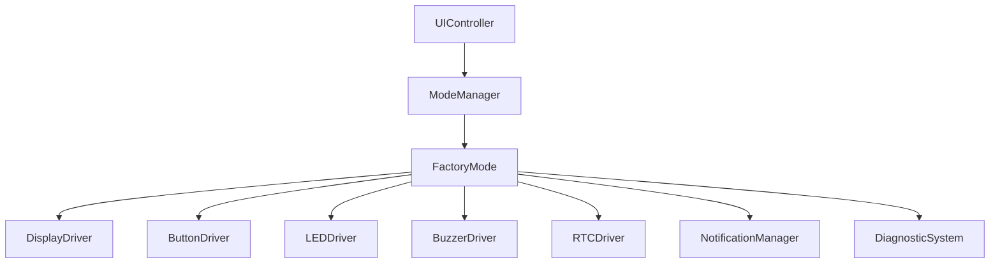
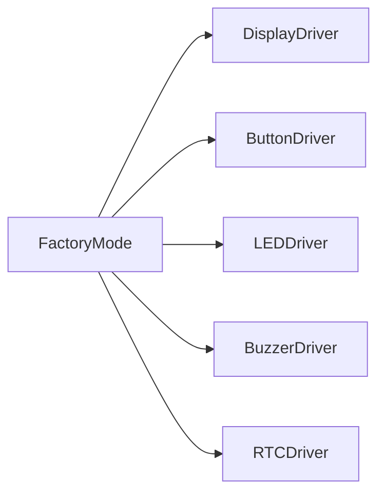
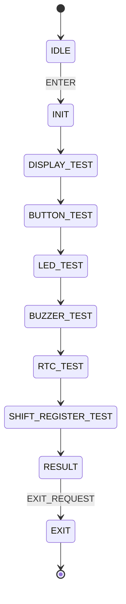
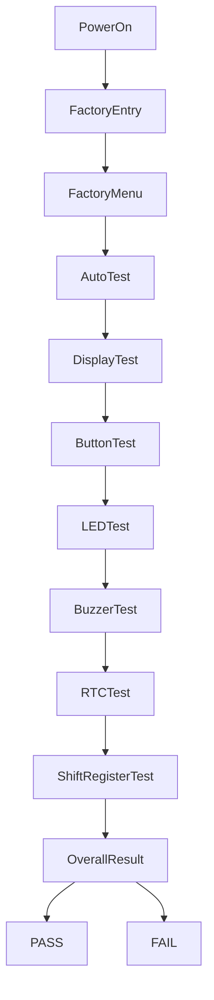
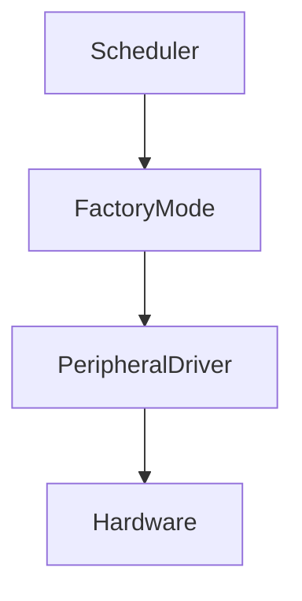
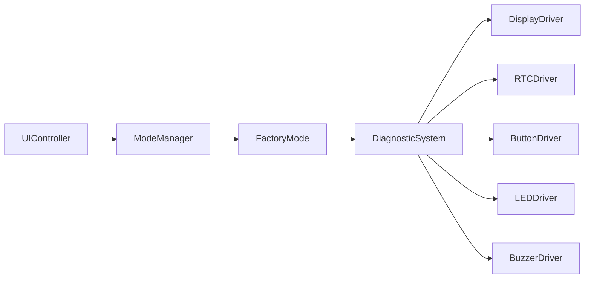
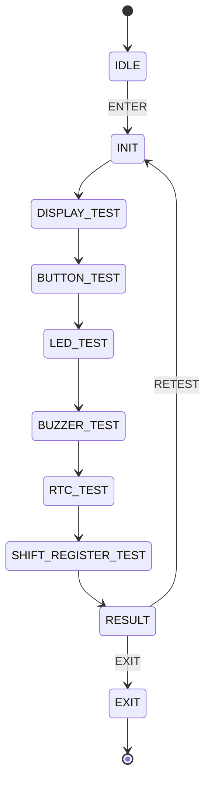
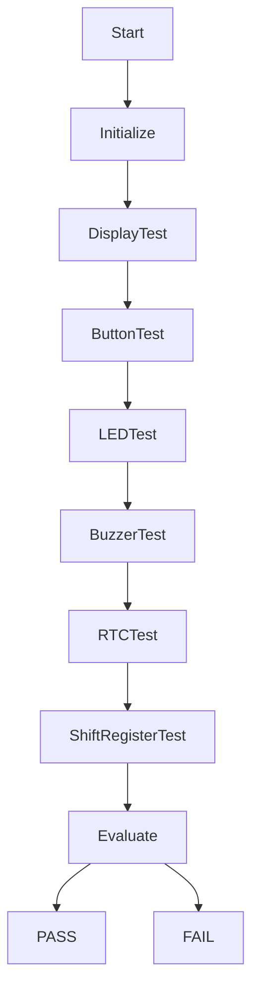

````md
# PROMPT_22_Factory_Mode.md

# Vibe Coding Prompt
# Module Implementation: Factory Mode

Anda adalah **Senior Embedded Firmware Engineer** yang bertanggung jawab membuat firmware production-grade untuk project:

# Operation Timer Embedded System

Target:

- PlatformIO
- Arduino Framework
- Arduino Nano
- ATmega328P
- Embedded C++

---

# Task

Implementasikan modul:

```text
Factory Mode
````

Factory Mode digunakan khusus untuk:

* production testing
* assembly verification
* hardware verification
* display testing
* button testing
* LED testing
* buzzer testing
* RTC communication testing
* shift-register verification
* basic system diagnostics
* final QC sebelum unit dikirim

Factory Mode harus bersifat:

```text
deterministic
non-blocking
safe
repeatable
production-oriented
```

Factory Mode bukan mode operasional normal pengguna.

---

# Primary Responsibility

Factory Mode bertanggung jawab terhadap:

* menjalankan factory test sequence
* menyediakan manual hardware test
* menyediakan automatic test sequence
* menampilkan hasil test
* melaporkan PASS / FAIL
* memberikan status test
* memastikan setiap peripheral dapat diverifikasi
* membantu production technician menemukan hardware failure

Factory Mode TIDAK bertanggung jawab terhadap:

* GPIO direct access
* raw I2C access
* raw shift register access
* segment encoding
* display multiplex timing
* button debounce
* buzzer GPIO
* LED GPIO
* RTC register handling
* firmware version implementation
* production database
* EEPROM manufacturing record kecuali melalui service khusus

Gunakan abstraction layer yang sudah dibuat sebelumnya.

---

# Architecture

Gunakan architecture:



Jika project architecture sebelumnya menggunakan service abstraction berbeda, ikuti API existing.

---

# Important Architecture Rule

Factory Mode tidak boleh mem-bypass abstraction layer.

DILARANG:

```cpp
digitalWrite(...)
digitalRead(...)
Wire.beginTransmission(...)
Wire.requestFrom(...)
shiftOut(...)
delay(...)
```

langsung dari Factory Mode.

Gunakan:

```text
GPIO HAL
Timer HAL
I2C HAL
Shift Register Driver
Display Driver
RTC Driver
Button Driver
LED Driver
Buzzer Driver
```

sesuai layer masing-masing.

---

# Factory Mode Entry

Factory Mode tidak boleh aktif secara normal tanpa intentional request.

Factory Mode harus memiliki mekanisme entry yang jelas.

Contoh:

```text
special button combination
```

atau:

```text
production command
```

atau:

```text
factory flag
```

Gunakan mekanisme yang sudah ditentukan pada:

```text
docs/13_UI_UX_Specification.md
```

dan:

```text
PROMPT_21_UI_Controller.md
```

Jangan menciptakan kombinasi tombol baru jika dokumentasi sudah menentukan mekanisme entry.

---

# Factory Mode Safety

Factory Mode harus:

* tidak aktif secara tidak sengaja
* tidak mengubah konfigurasi operasional tanpa explicit command
* tidak merusak persistent configuration
* tidak melakukan EEPROM erase otomatis
* tidak melakukan factory reset otomatis
* tidak mengubah RTC tanpa explicit test
* tidak melakukan operasi blocking
* tidak mengganggu watchdog / scheduler
* tidak membuat display multiplex berhenti

---

# Factory State Machine

Gunakan state machine eksplisit.

Recommended:

```cpp
enum class FactoryState : uint8_t
{
    IDLE,
    INIT,
    DISPLAY_TEST,
    BUTTON_TEST,
    LED_TEST,
    BUZZER_TEST,
    RTC_TEST,
    SHIFT_REGISTER_TEST,
    AUTO_TEST,
    RESULT,
    EXIT
};
```

Jika `DiagnosticSystem` sudah memiliki enum/state yang overlap, gunakan abstraction existing.

Jangan membuat duplicate diagnostic state machine.

---

# State Ownership

Factory Mode memiliki:

```text
FactoryState
```

Sedangkan:

```text
ModeManager
```

memiliki:

```text
AppMode
```

Dan:

```text
UIController
```

memiliki:

```text
UiContext
```

Jangan mencampurkan ketiganya.

---

# State Relationship

```text
AppMode
    |
    +-- CLOCK
    +-- STOPWATCH
    +-- COUNTDOWN
    +-- FACTORY
    +-- DIAGNOSTIC
```

Saat:

```text
AppMode == FACTORY
```

Factory Mode mengelola:

```text
FactoryState
```

---

# Factory Test Categories

Minimal factory test:

```text
1. Display
2. Button
3. LED
4. Buzzer
5. RTC
6. Shift Register
7. Automatic Test
```

Jika hardware revision menambahkan peripheral:

```text
extend test suite
```

tanpa mengubah architecture utama.

---

# Test Result

Gunakan result abstraction.

Contoh:

```cpp
enum class TestResult : uint8_t
{
    NOT_RUN,
    RUNNING,
    PASS,
    FAIL,
    SKIPPED
};
```

Jika enum sudah tersedia di Diagnostic System/Common Library:

```text
gunakan enum existing
```

Jangan membuat duplicate type.

---

# Test Record

Gunakan struktur kecil.

Contoh:

```cpp
struct FactoryTestResult
{
    TestResult display;
    TestResult button;
    TestResult led;
    TestResult buzzer;
    TestResult rtc;
    TestResult shiftRegister;
};
```

Jangan menggunakan:

```text
String
std::vector
dynamic allocation
```

---

# Memory Optimization

ATmega328P hanya memiliki:

```text
2 KB SRAM
```

Factory Mode harus hemat memory.

Gunakan:

```text
uint8_t
enum class
bit flags
fixed-size structures
references
constexpr
```

Jika result flags dapat direpresentasikan dengan bitmask, pertimbangkan:

```cpp
uint8_t
```

atau:

```cpp
uint16_t
```

daripada struktur besar.

Namun readability tetap diprioritaskan.

---

# Reference-First Rule

WAJIB menggunakan passing by reference untuk object/struct.

Contoh:

```cpp
StatusCode runTest(
    FactoryTestResult &result
);
```

Untuk read-only:

```cpp
StatusCode renderResult(
    const FactoryTestResult &result
);
```

Dependency:

```cpp
DisplayDriver &displayDriver_;
ButtonDriver &buttonDriver_;
RTCDriver &rtcDriver_;
```

Bukan copy object.

---

# Primitive Passing

Primitive kecil boleh by value:

```cpp
uint8_t
uint16_t
uint32_t
bool
enum
```

Contoh:

```cpp
StatusCode selectTest(
    uint8_t testIndex
);
```

Tidak perlu memaksakan reference untuk primitive kecil.

---

# Dependency Injection

Recommended:

```cpp
FactoryMode(
    DisplayDriver &displayDriver,
    ButtonDriver &buttonDriver,
    LEDDriver &ledDriver,
    BuzzerDriver &buzzerDriver,
    RTCDriver &rtcDriver,
    ShiftRegisterDriver &shiftRegisterDriver
);
```

Namun gunakan hanya dependency yang benar-benar diperlukan.

Jika `DisplayDriver` sudah mengabstraksikan shift register:

```text
FactoryMode tidak perlu menerima ShiftRegisterDriver secara langsung.
```

Minimalkan dependency.

---

# Preferred Dependency Architecture



Jika shift-register test membutuhkan akses khusus:

```text
FactoryMode
-->
DiagnosticSystem
-->
ShiftRegisterDriver
```

lebih disukai daripada membuka raw hardware API.

---

# Factory Mode API

Minimal:

```cpp
class FactoryMode
{
public:

    StatusCode begin();

    void update();

    StatusCode enter();

    StatusCode exit();

    FactoryState state() const;

    TestResult overallResult() const;

    bool isRunning() const;
};
```

Tambahkan API hanya jika dibutuhkan.

---

# Lifecycle

Factory Mode harus mengikuti:

```text
begin()
-->
enter()
-->
update()
-->
exit()
```

`begin()` hanya melakukan initialization.

`enter()` memulai factory session.

`update()` menjalankan state machine.

`exit()` menghentikan factory session dengan aman.

---

# begin()

`begin()` harus:

* initialize internal state
* clear test result
* set state ke IDLE
* tidak memulai test
* tidak mengubah hardware secara permanen

Contoh:

```cpp
StatusCode FactoryMode::begin()
{
    state_ = FactoryState::IDLE;
    resetResults();

    return StatusCode::OK;
}
```

---

# enter()

Saat Factory Mode dimasuki:

```text
NORMAL
-->
FACTORY
```

Factory Mode harus:

```text
reset test session
initialize UI
prepare test environment
```

kemudian:

```text
INIT
```

---

# exit()

Saat keluar:

```text
FACTORY
-->
NORMAL
```

Factory Mode harus:

* menghentikan test
* mengembalikan LED ke normal
* menghentikan buzzer
* mengembalikan display ke normal
* clear temporary state

Jangan mengubah persistent configuration kecuali explicit save.

---

# Non-Blocking Requirement

DILARANG:

```cpp
delay(1000);
```

DILARANG:

```cpp
while (!buttonPressed)
{
}
```

DILARANG:

```cpp
while (rtcNotReady)
{
}
```

Semua test harus berjalan melalui state machine.

---

# Timer-Based Test

Gunakan:

```text
Timer HAL
```

atau:

```text
Scheduler
```

untuk timing.

Contoh:

```text
DISPLAY_TEST
-->
wait 500 ms
-->
next pattern
```

Bukan:

```cpp
delay(500);
```

---

# Factory Test Sequence

Automatic test sequence:



Jika salah satu test FAIL:

```text
jangan langsung keluar
```

Lanjutkan test berikutnya kecuali test tersebut menyebabkan kondisi hardware tidak aman.

---

# Automatic Test

Automatic test harus:

```text
repeatable
```

dan:

```text
deterministic
```

Sequence:

```text
Display
-->
Button
-->
LED
-->
Buzzer
-->
RTC
-->
Shift Register
-->
Result
```

Urutan dapat disesuaikan dengan dependency hardware.

---

# Display Test

Display test harus memverifikasi:

* semua digit
* semua segment
* colon/tick
* multiplex
* brightness consistency
* segment mapping

Karena display:

```text
6 digit
7 segment
common anode
```

dan:

```text
74HC595 #1
-->
ULN2803
-->
segment
```

serta:

```text
74HC595 #2
-->
digit
```

Factory Mode harus menggunakan:

```text
DisplayDriver
```

bukan mengontrol register secara langsung.

---

# Display Pattern Test

Minimal pattern:

```text
000000
111111
222222
333333
444444
555555
666666
777777
888888
999999
AAAAAA
```

Jika hanya numeric display:

```text
888888
```

sangat penting untuk memastikan:

```text
A B C D E F G
```

seluruh segment menyala.

---

# Segment Test

Pattern khusus:

```text
A
B
C
D
E
F
G
```

Setiap pattern harus menyalakan segment yang benar.

Contoh:

```text
Segment A test
-->
semua digit menampilkan A segment
```

Tujuan:

```text
verify segment wiring
verify ULN2803 mapping
verify 74HC595 output
```

---

# Digit Test

Test:

```text
digit 1
digit 2
digit 3
digit 4
digit 5
digit 6
```

Satu digit aktif pada satu waktu.

Tujuan:

```text
verify transistor digit
verify common-anode switching
verify 74HC595 #2
verify multiplex chain
```

---

# Colon / Tick Test

Test:

```text
colon ON
colon OFF
```

atau tick indicator sesuai hardware implementation.

Pastikan:

```text
QF
```

digunakan sesuai pin mapping documented.

---

# Display Brightness

Factory Mode tidak boleh mengubah brightness secara permanent.

Jika menggunakan:

```text
OE
```

brightness test dapat menggunakan:

```text
OE enable/disable
```

melalui DisplayDriver.

Jangan mengakses:

```text
D9
```

secara langsung.

---

# Button Test

Button test harus memverifikasi:

```text
POWER
NEXT
SELECT
UP
DOWN
```

Expected technician interaction:

```text
press button
-->
display identifies button
-->
button result PASS
```

---

# Button Test Example

Display:

```text
PWR
```

Technician menekan:

```text
POWER
```

Expected:

```text
PASS
```

Kemudian:

```text
NEXT
SELECT
UP
DOWN
```

dengan cara yang sama.

---

# Button Timeout

Jika button tidak ditekan dalam timeout:

```text
FAIL
```

atau:

```text
WAITING
```

sesuai production requirement.

Gunakan timer non-blocking.

Jangan menunggu selamanya.

---

# Button Repeat

Button test harus dapat membedakan:

```text
SHORT
HOLD
REPEAT
```

jika ButtonDriver menyediakan event tersebut.

Namun factory test utama cukup memastikan:

```text
physical button
-->
valid event
```

---

# LED Test

LED power indicator:

```text
D12
```

Factory Mode harus dapat test:

```text
LED ON
LED OFF
```

melalui:

```text
LEDDriver
```

Bukan:

```cpp
digitalWrite(D12, ...)
```

---

# LED Active Level

LED driver harus mengetahui polarity.

Factory Mode tidak boleh hard-code:

```text
HIGH = ON
```

atau:

```text
LOW = ON
```

Gunakan abstraction:

```cpp
ledDriver_.setPowerIndicator(true);
```

atau API equivalent.

---

# Buzzer Test

Buzzer:

```text
active low
```

Factory Mode harus menggunakan:

```text
BuzzerDriver
```

Contoh:

```text
short beep
-->
long beep
-->
pattern
```

---

# Buzzer Safety

Jangan membuat buzzer berbunyi terus.

Gunakan:

```text
timed notification
```

atau:

```text
BuzzerDriver
```

yang sudah memiliki non-blocking behavior.

---

# RTC Test

RTC:

```text
DS3231
```

Test minimal:

```text
I2C communication
RTC presence
time read
```

Optional:

```text
temperature read
```

jika API dan requirement membutuhkannya.

---

# RTC Test Safety

JANGAN mengubah waktu RTC hanya untuk test komunikasi.

Preferred:

```text
read current time
-->
validate range
-->
PASS
```

Contoh valid:

```text
hour   = 0..23
minute = 0..59
second = 0..59
```

---

# RTC Write Test

Jika production membutuhkan write test:

```text
WAJIB explicit
```

dan:

```text
save original time
-->
write known test time
-->
read back
-->
restore original time
```

Namun default:

```text
RTC read-only test
```

lebih aman.

---

# RTC Failure

Jika RTC tidak merespons:

```text
RTC_TEST = FAIL
```

Factory Mode harus:

```text
continue to next test
```

dan tidak crash.

---

# Shift Register Test

Shift register:

```text
74HC595 #1
74HC595 #2
```

berada dalam daisy chain.

Factory test harus memverifikasi:

```text
DATA
CLOCK
LATCH
OE
```

melalui abstraction yang tersedia.

---

# Shift Register Pattern

Gunakan pattern:

```text
0x00
0xFF
0xAA
0x55
```

atau pattern equivalent.

Tujuan:

```text
detect stuck bit
detect wiring error
detect daisy-chain error
```

---

# Daisy Chain Test

Karena:

```text
74HC595 #1
-->
74HC595 #2
```

test harus memverifikasi kedua register dapat dikontrol sesuai urutan.

Jangan mengasumsikan byte order.

Gunakan:

```text
ShiftRegisterDriver
```

sebagai source of truth.

---

# OE Test

OE:

```text
D9
```

harus diuji melalui:

```text
DisplayDriver / ShiftRegisterDriver
```

sesuai ownership yang sudah ditentukan.

Expected:

```text
OE enabled
-->
display visible

OE disabled
-->
display blank
```

---

# Overall Result

Setelah semua test:

```text
if all PASS
-->
PASS
```

Jika salah satu:

```text
FAIL
```

maka:

```text
overall = FAIL
```

Jika ada:

```text
SKIPPED
```

jangan otomatis dianggap PASS.

---

# Result Display

Display harus dapat menunjukkan:

```text
PASS
FAIL
```

Jika 6-digit display tidak dapat menampilkan kata secara langsung, gunakan compact diagnostic code.

Contoh:

```text
PASS00
FAIL01
```

atau:

```text
F-RTC
F-DSP
F-BTN
```

Ikuti capability DisplayDriver dan UI specification.

---

# Error Code

Gunakan error code kecil.

Contoh:

```cpp
enum class FactoryError : uint8_t
{
    NONE,
    DISPLAY,
    BUTTON,
    LED,
    BUZZER,
    RTC,
    SHIFT_REGISTER,
    TIMEOUT
};
```

Jika `DiagnosticSystem` sudah menyediakan error taxonomy:

```text
gunakan existing error code.
```

---

# Test Index

Gunakan:

```cpp
uint8_t testIndex_;
```

daripada:

```text
large object
```

Contoh:

```text
0 = DISPLAY
1 = BUTTON
2 = LED
3 = BUZZER
4 = RTC
5 = SHIFT_REGISTER
```

---

# Test Dispatcher

Recommended:

```cpp
StatusCode runCurrentTest();
```

dan:

```cpp
StatusCode advanceTest();
```

Jangan membuat satu function raksasa:

```cpp
runAllFactoryTests()
```

yang berisi seluruh logic dan blocking delay.

---

# State Machine Implementation

Gunakan:

```cpp
switch (state_)
{
    case FactoryState::IDLE:
        ...
        break;

    case FactoryState::INIT:
        ...
        break;

    case FactoryState::DISPLAY_TEST:
        ...
        break;

    ...
}
```

State transition harus eksplisit.

---

# State Transition Rule

Jangan melakukan transition tersembunyi dari banyak lokasi.

Preferred:

```text
state handler
-->
request transition
-->
next state
```

Contoh:

```cpp
state_ = FactoryState::LED_TEST;
```

hanya dilakukan setelah:

```text
DISPLAY_TEST
```

selesai.

---

# Factory Input

Factory Mode dapat menerima semantic action dari:

```text
UIController
```

Contoh:

```text
NEXT
-->
next test
```

```text
SELECT
-->
start/confirm test
```

```text
POWER
-->
exit factory
```

Gunakan action abstraction yang sudah ada.

---

# No Physical Button Dependency

Factory Mode tidak boleh memiliki:

```cpp
PB_UP
PB_DOWN
PB_NEXT
```

dan sebagainya.

Gunakan:

```text
UiAction
```

atau:

```text
Event
```

yang sudah disediakan application layer.

---

# Factory UI

Recommended navigation:

```text
FACTORY HOME
    |
    +-- AUTO TEST
    +-- DISPLAY TEST
    +-- BUTTON TEST
    +-- LED TEST
    +-- BUZZER TEST
    +-- RTC TEST
    +-- SHIFT REGISTER TEST
```

Jika UI specification menetapkan menu berbeda, ikuti dokumentasi.

---

# Manual Test

Factory Mode harus mendukung manual test jika production workflow membutuhkannya.

Contoh:

```text
DISPLAY TEST
-->
UP/DOWN = next pattern
SELECT = confirm
POWER = exit
```

---

# Automatic Test

Automatic test:

```text
SELECT AUTO TEST
-->
run all
-->
result
```

Technician tidak perlu menekan tombol setiap test.

---

# Test Repeatability

Setelah test selesai:

```text
RETEST
```

harus dapat dijalankan tanpa reboot.

Reset:

```text
test result
test state
temporary display
temporary notification
```

---

# Production Workflow

Recommended:



---

# PASS Criteria

Unit dianggap PASS jika:

```text
Display = PASS
Button = PASS
LED = PASS
Buzzer = PASS
RTC = PASS
Shift Register = PASS
```

Tidak boleh ada:

```text
FAIL
```

---

# FAIL Criteria

Unit FAIL jika:

* display segment salah
* digit salah
* colon/tick salah
* button tidak terdeteksi
* LED tidak bekerja
* buzzer tidak bekerja
* RTC tidak terdeteksi
* shift register gagal
* test timeout

---

# Production Logging

Jangan menggunakan:

```cpp
String
```

untuk logging runtime.

Jika Serial diagnostic tersedia:

```text
Serial
```

boleh digunakan hanya pada:

```text
DEBUG / FACTORY BUILD
```

dan harus dapat dinonaktifkan pada production build.

---

# Serial Output

Optional format:

```text
FACTORY
TEST=DISPLAY
RESULT=PASS
```

Contoh:

```text
FACTORY TEST=RTC RESULT=PASS
```

Jangan mencetak output terus-menerus pada setiap scheduler tick.

---

# Debug Build

Jika menggunakan compile flag:

```cpp
FACTORY_DEBUG
```

pastikan production build dapat menonaktifkannya.

---

# No Dynamic Allocation

DILARANG:

```cpp
new
delete
malloc
free
```

---

# No String

DILARANG:

```cpp
String
```

Gunakan:

```text
enum
const char[]
PROGMEM
numeric code
```

jika diperlukan.

---

# No STL Containers

Hindari:

```text
std::vector
std::map
std::string
```

untuk runtime AVR.

---

# Display Ownership

Factory Mode tidak boleh mengakses:

```text
74HC595
ULN2803
BC547C
S8550
```

secara langsung.

Gunakan:

```text
DisplayDriver
```

---

# Hardware Independence

Factory Mode harus tetap dapat diuji dengan mock:

```text
MockDisplayDriver
MockRTCDriver
MockBuzzerDriver
MockLEDDriver
```

Jika architecture testing mendukung dependency injection.

---

# Unit Testing

Buat:

```text
test/factory/
```

atau struktur yang ditentukan oleh:

```text
docs/11_Project_Structure.md
```

Minimal test:

```text
1. Initial state
2. Enter factory
3. Exit factory
4. Display test pass
5. Display test fail
6. Button test
7. LED test
8. Buzzer test
9. RTC pass
10. RTC fail
11. Shift register pass
12. Shift register fail
13. Automatic sequence
14. Overall PASS
15. Overall FAIL
16. Timeout
17. Retest
18. Invalid action
19. No blocking
20. No hardware direct access
```

---

# Test: Initial State

Expected:

```text
state = IDLE
overallResult = NOT_RUN
```

---

# Test: Enter

```text
enter()
```

Expected:

```text
state = INIT
```

---

# Test: Exit

```text
exit()
```

Expected:

```text
state = EXIT
```

atau state equivalent sesuai implementation.

---

# Test: Display Pass

Mock:

```text
DisplayDriver = PASS
```

Expected:

```text
displayResult = PASS
```

---

# Test: RTC Failure

Mock:

```text
RTC communication = FAIL
```

Expected:

```text
rtcResult = FAIL
```

dan:

```text
FactoryMode
```

tetap dapat melanjutkan test berikutnya.

---

# Test: Overall Fail

Jika:

```text
RTC = FAIL
```

dan lainnya:

```text
PASS
```

Expected:

```text
overall = FAIL
```

---

# Test: All Pass

Jika semua:

```text
PASS
```

Expected:

```text
overall = PASS
```

---

# Test: Retest

Setelah:

```text
FAIL
```

jalankan:

```text
RETEST
```

Expected:

```text
results cleared
-->
state = INIT
```

---

# Test: Timeout

Jika technician tidak memberikan input:

```text
timeout
```

Expected:

```text
FAIL
```

atau:

```text
WAITING
```

sesuai test definition.

Tidak boleh hang.

---

# Test: No Blocking

Source tidak boleh memiliki:

```cpp
delay()
```

atau blocking loop.

---

# Test: No Direct Hardware

Source Factory Mode tidak boleh memiliki:

```cpp
digitalRead()
digitalWrite()
pinMode()
Wire
shiftOut()
```

---

# Scheduler Integration

Factory Mode harus dipanggil melalui:

```text
Scheduler
```

dan tetap cooperative.

Contoh:



Factory Mode tidak boleh membuat scheduler sendiri.

---

# Scheduler Frequency Independence

Factory Mode tidak boleh mengasumsikan:

```text
update() dipanggil tepat setiap 1 ms
```

Gunakan:

```text
Timer HAL
```

atau timestamp scheduler.

---

# Timing

Semua timing harus menggunakan:

```text
monotonic time
```

atau abstraction yang telah ditentukan.

Jangan menggunakan:

```cpp
delay()
```

---

# Watchdog Compatibility

Factory Mode tidak boleh memblokir CPU terlalu lama sehingga:

```text
watchdog
```

terpicu secara tidak sengaja.

Jika test membutuhkan proses panjang:

```text
split across multiple update cycles
```

---

# Persistent Data

Factory Mode default:

```text
NO EEPROM WRITE
```

kecuali production specification secara eksplisit meminta:

```text
production result
serial number
calibration
factory flag
```

Jika diperlukan:

```text
gunakan Persistence Service
```

Jangan akses EEPROM langsung.

---

# Factory Flag

Jika project menggunakan:

```text
factory flag
```

flag harus:

```text
explicit
validated
safe
```

Jangan membuat:

```text
factory mode = EEPROM random value
```

tanpa validation.

---

# Firmware Version

Factory Mode harus dapat menampilkan firmware version.

Version source:

```text
Version.h
```

Gunakan:

```text
MAJOR
MINOR
PATCH
BUILD
```

Jangan membuat version constant kedua.

---

# Production Identification

Recommended factory screen:

```text
FW 1.2.3
BUILD 0042
```

atau compact equivalent sesuai 6-digit display.

Tujuan:

```text
unit identification
production traceability
```

---

# Version API

Gunakan API dari:

```text
PROMPT_02_Version_System.md
```

Jangan membaca macro secara scattered di Factory Mode jika version service sudah menyediakan API.

---

# Diagnostic Integration

Jika:

```text
DiagnosticSystem
```

sudah tersedia, Factory Mode harus menggunakannya untuk:

```text
hardware health
error reporting
test result
```

Jika Factory Mode adalah orchestrator sedangkan DiagnosticSystem adalah executor:

```text
FactoryMode
-->
DiagnosticSystem
-->
Peripheral
```

---

# Factory vs Diagnostic

Pisahkan:

```text
Factory Mode
```

dan:

```text
Diagnostic System
```

sebagai berikut:

```text
Factory Mode
=
production workflow
```

```text
Diagnostic System
=
technical health information
```

Factory Mode boleh menggunakan DiagnosticSystem tetapi tidak boleh menduplikasi seluruh diagnostic logic.

---

# Recommended Architecture



Jika dependency terlalu kuat, gunakan service abstraction yang lebih kecil.

---

# Code Organization

Recommended:

```text
src/
└── modes/
    └── factory/
        ├── FactoryMode.h
        └── FactoryMode.cpp
```

Jika project structure menggunakan:

```text
application/modes/
```

ikuti:

```text
docs/11_Project_Structure.md
```

---

# Documentation

Buat:

```text
docs/Factory_Mode.md
```

Dokumentasi minimal:

* purpose
* factory workflow
* entry mechanism
* state machine
* test sequence
* display test
* button test
* LED test
* buzzer test
* RTC test
* shift register test
* PASS/FAIL criteria
* timeout
* safety
* production workflow
* memory strategy
* dependency architecture

---

# Mermaid State Machine

Dokumentasikan state machine:



Sesuaikan dengan implementasi aktual.

---

# Mermaid Automatic Test Flow



---

# Coding Standard

Gunakan coding standard dari:

```text
docs/10_Coding_Standard.md
```

Class:

```text
FactoryMode
```

Function:

```text
camelCase
```

Private member:

```text
camelCase_
```

Enum:

```text
PascalCase
```

Enum member:

```text
UPPER_CASE
```

---

# Const Correctness

Gunakan:

```cpp
const
```

untuk object yang tidak dimodifikasi.

Contoh:

```cpp
StatusCode displayResult(
    const FactoryTestResult &result
);
```

---

# Error Handling

Gunakan:

```text
StatusCode
```

yang telah didefinisikan pada Common Library.

Jangan:

```cpp
throw
catch
```

---

# No Exceptions

Arduino Nano / AVR firmware harus menggunakan deterministic error handling.

DILARANG menggunakan exception runtime.

---

# Existing Documentation Must Be Followed

Sebelum implementasi, WAJIB membaca:

```text
docs/00_Project_Overview.md
docs/01_System_Requirements.md
docs/02_Hardware_Architecture.md
docs/03_Pin_Mapping.md
docs/04_Display_Driver.md
docs/05_Button_System.md
docs/06_Mode_Manager.md
docs/08_Buzzer_LED.md
docs/09_Firmware_Architecture.md
docs/10_Coding_Standard.md
docs/11_Project_Structure.md
docs/12_Testing_Checklist.md
docs/13_UI_UX_Specification.md
docs/14_Manufacturing_BOM.md
docs/15_Production_Guide.md
docs/16_Firmware_Versioning.md
```

Implementation prompts:

```text
PROMPT_01_Common_Library.md
PROMPT_02_Version_System.md
PROMPT_03_GPIO_HAL.md
PROMPT_04_Timer_HAL.md
PROMPT_05_I2C_HAL.md
PROMPT_06_Shift_Register_Driver.md
PROMPT_07_Segment_Encoder.md
PROMPT_08_Display_Driver.md
PROMPT_09_RTC_Driver.md
PROMPT_10_Button_Driver.md
PROMPT_11_LED_Driver.md
PROMPT_12_Buzzer_Driver.md
PROMPT_13_Scheduler.md
PROMPT_14_Event_System.md
PROMPT_15_Time_Service.md
PROMPT_16_Notification_Manager.md
PROMPT_17_Mode_Manager.md
PROMPT_21_UI_Controller.md
```

Jika terdapat konflik:

```text
gunakan dokumentasi terbaru
```

dan laporkan konflik tersebut sebelum melakukan perubahan arsitektur besar.

---

# Do Not Reimplement Existing Modules

JANGAN membuat ulang:

```text
GPIO HAL
Timer HAL
I2C HAL
Shift Register Driver
Segment Encoder
Display Driver
RTC Driver
Button Driver
LED Driver
Buzzer Driver
Scheduler
Event System
Notification Manager
Mode Manager
UI Controller
Version System
```

Gunakan API existing.

Jika API belum menyediakan kemampuan yang diperlukan:

1. identifikasi gap
2. gunakan abstraction existing
3. lakukan perubahan minimal
4. jangan membuat duplicate subsystem

---

# Implementation Order

Implementasikan:

```text
1. Review existing architecture
2. Review ModeManager API
3. Review UIController API
4. Review DiagnosticSystem
5. Review peripheral driver API
6. Define FactoryState
7. Define TestResult
8. Define FactoryTestResult
9. Implement FactoryMode
10. Implement enter()
11. Implement exit()
12. Implement factory state machine
13. Implement display test
14. Implement button test
15. Implement LED test
16. Implement buzzer test
17. Implement RTC test
18. Implement shift-register test
19. Implement automatic test
20. Implement result evaluation
21. Implement retest
22. Integrate ModeManager
23. Integrate UIController
24. Add unit tests
25. Add documentation
26. Build PlatformIO
27. Check memory usage
```

---

# Final Deliverables

Implementasi harus menghasilkan:

```text
src/
    FactoryMode.h
    FactoryMode.cpp
```

sesuai project structure.

Testing:

```text
test/
    factory/
```

Documentation:

```text
docs/Factory_Mode.md
```

---

# Build Verification

Jalankan:

```bash
pio run
```

Expected:

```text
SUCCESS
```

Jika unit test tersedia:

```bash
pio test
```

harus dijalankan.

Periksa:

```text
Flash usage
RAM usage
```

---

# Final Checklist

* [ ] FactoryMode tersedia
* [ ] FactoryState tersedia
* [ ] test result tersedia
* [ ] automatic test tersedia
* [ ] manual test tersedia jika diperlukan
* [ ] display test tersedia
* [ ] button test tersedia
* [ ] LED test tersedia
* [ ] buzzer test tersedia
* [ ] RTC test tersedia
* [ ] shift register test tersedia
* [ ] PASS/FAIL tersedia
* [ ] timeout tersedia
* [ ] retest tersedia
* [ ] factory entry aman
* [ ] factory exit aman
* [ ] no direct GPIO
* [ ] no direct I2C
* [ ] no direct shift register access
* [ ] no direct EEPROM
* [ ] no direct RTC register access
* [ ] no direct display multiplex control
* [ ] no delay()
* [ ] no blocking loop
* [ ] no heap allocation
* [ ] no String
* [ ] no STL container
* [ ] dependencies menggunakan reference
* [ ] const reference digunakan untuk read-only object
* [ ] tidak membuat duplicate driver
* [ ] tidak membuat event queue kedua
* [ ] state machine deterministic
* [ ] scheduler compatible
* [ ] watchdog compatible
* [ ] firmware version dapat diidentifikasi
* [ ] production workflow terdokumentasi
* [ ] Mermaid diagram tersedia
* [ ] unit test tersedia
* [ ] PlatformIO build berhasil
* [ ] memory usage diperiksa
