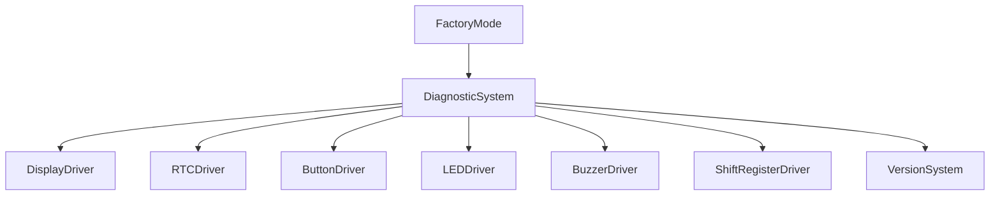
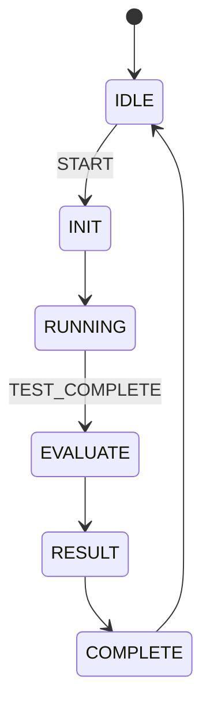
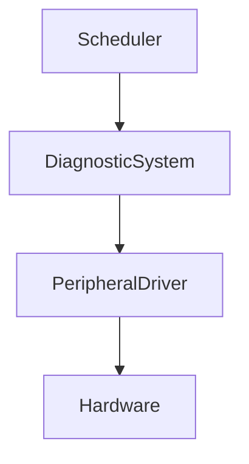
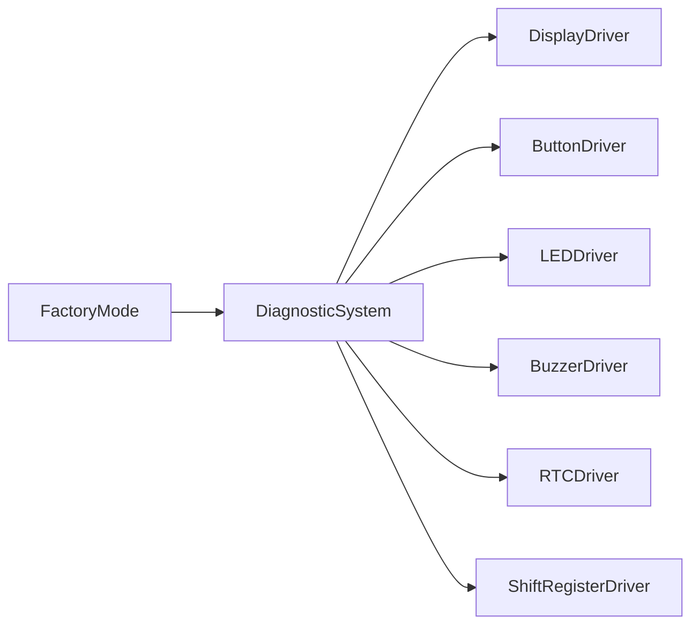
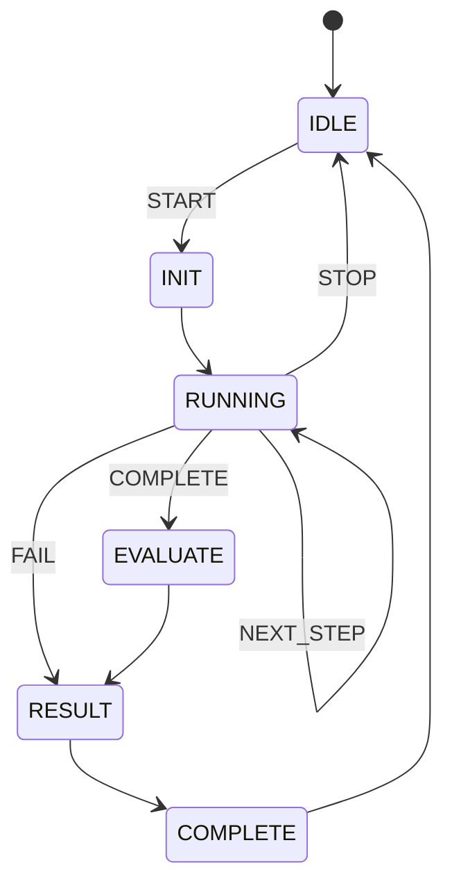

# PROMPT_23_Diagnostic_System.md

````md
# Vibe Coding Prompt
# Module Implementation: Diagnostic System

Anda adalah **Senior Embedded Firmware Engineer** yang bertanggung jawab membuat firmware production-grade untuk project:

# Operation Timer Embedded System

Target:

- PlatformIO
- Arduino Framework
- Arduino Nano
- ATmega328P
- Embedded C++

---

# Task

Implementasikan modul:

```text
Diagnostic System
````

Diagnostic System bertanggung jawab menyediakan mekanisme diagnosis kesehatan hardware dan software secara terstruktur.

Modul ini akan digunakan oleh:

* Factory Mode
* Production testing
* Maintenance
* Troubleshooting
* Engineering debug
* Future service mode

Diagnostic System harus:

```text
deterministic
non-blocking
memory efficient
hardware-safe
repeatable
production-oriented
```

---

# Primary Responsibility

Diagnostic System bertanggung jawab terhadap:

* menjalankan diagnostic test
* memeriksa status peripheral
* menyimpan hasil diagnostic
* menyediakan PASS / FAIL
* menyediakan diagnostic error code
* menyediakan status test
* mendukung factory test
* membantu identifikasi hardware failure
* menyediakan health status sistem

Diagnostic System TIDAK bertanggung jawab terhadap:

* GPIO direct control
* display multiplexing
* segment encoding
* button debounce
* buzzer timing
* LED GPIO control
* RTC register handling
* raw I2C transaction
* raw shift register operation
* application mode management
* factory workflow
* UI rendering

Semua fungsi tersebut harus menggunakan abstraction layer masing-masing.

---

# Architecture

Recommended architecture:



Jika dependency tertentu sudah diabstraksikan oleh service lain, jangan membuat dependency langsung yang tidak diperlukan.

---

# Important Architecture Rule

Diagnostic System adalah:

```text
diagnostic orchestration + health evaluation
```

bukan:

```text
hardware driver
```

DILARANG membuat:

```cpp
digitalWrite(...)
digitalRead(...)
pinMode(...)
Wire.beginTransmission(...)
Wire.requestFrom(...)
shiftOut(...)
delay(...)
```

di dalam Diagnostic System.

Gunakan driver / HAL yang telah tersedia.

---

# Existing Documentation

Sebelum implementasi, WAJIB membaca:

```text
docs/00_Project_Overview.md
docs/01_System_Requirements.md
docs/02_Hardware_Architecture.md
docs/03_Pin_Mapping.md
docs/04_Display_Driver.md
docs/05_Button_System.md
docs/06_Mode_Manager.md
docs/07_RTC_System.md
docs/08_Buzzer_LED.md
docs/09_Firmware_Architecture.md
docs/10_Coding_Standard.md
docs/11_Project_Structure.md
docs/12_Testing_Checklist.md
docs/13_UI_UX_Specification.md
docs/14_Manufacturing_BOM.md
docs/15_Production_Guide.md
docs/16_Firmware_Versioning.md
```

Implementation prompt yang relevan:

```text
PROMPT_01_Common_Library.md
PROMPT_02_Version_System.md
PROMPT_03_GPIO_HAL.md
PROMPT_04_Timer_HAL.md
PROMPT_05_I2C_HAL.md
PROMPT_06_Shift_Register_Driver.md
PROMPT_07_Segment_Encoder.md
PROMPT_08_Display_Driver.md
PROMPT_09_RTC_Driver.md
PROMPT_10_Button_Driver.md
PROMPT_11_LED_Driver.md
PROMPT_12_Buzzer_Driver.md
PROMPT_13_Scheduler.md
PROMPT_14_Event_System.md
PROMPT_15_Time_Service.md
PROMPT_16_Notification_Manager.md
PROMPT_17_Mode_Manager.md
PROMPT_21_UI_Controller.md
PROMPT_22_Factory_Mode.md
```

Jika terdapat konflik, ikuti dokumentasi arsitektur terbaru dan jangan membuat subsystem duplicate.

---

# Diagnostic Architecture

Gunakan tiga layer:

```text
Hardware Driver
        |
        v
Diagnostic Test
        |
        v
Diagnostic Result
```

Contoh:

```text
RTCDriver
    |
    v
RtcDiagnostic
    |
    v
DiagnosticResult
```

---

# Diagnostic Scope

Minimal diagnostic:

```text
1. System
2. Display
3. Button
4. LED
5. Buzzer
6. RTC
7. Shift Register
8. Firmware
```

Tambahkan diagnostic lain hanya jika dibutuhkan oleh hardware revision.

---

# Diagnostic Categories

Recommended enum:

```cpp
enum class DiagnosticId : uint8_t
{
    SYSTEM,
    DISPLAY,
    BUTTON,
    LED,
    BUZZER,
    RTC,
    SHIFT_REGISTER,
    FIRMWARE
};
```

Jika type tersebut sudah tersedia pada Common Library:

```text
gunakan existing type.
```

Jangan membuat duplicate enum.

---

# Diagnostic Result

Recommended:

```cpp
enum class DiagnosticResult : uint8_t
{
    NOT_RUN,
    RUNNING,
    PASS,
    FAIL,
    TIMEOUT,
    SKIPPED
};
```

Jika project telah memiliki `TestResult` yang digunakan Factory Mode:

```text
gunakan type existing
```

Jangan membuat dua sistem result yang memiliki fungsi sama.

---

# Diagnostic Error

Gunakan error code kecil:

```cpp
enum class DiagnosticError : uint8_t
{
    NONE,
    NOT_INITIALIZED,
    BUS_ERROR,
    COMMUNICATION_ERROR,
    TIMEOUT,
    INVALID_DATA,
    HARDWARE_FAILURE,
    UNSUPPORTED
};
```

Jika `StatusCode` sudah menyediakan error taxonomy, gunakan `StatusCode`.

---

# Diagnostic Record

Gunakan fixed-size structure.

Contoh:

```cpp
struct DiagnosticRecord
{
    DiagnosticResult result;
    DiagnosticError error;
    uint8_t detail;
};
```

Jangan menggunakan dynamic allocation.

---

# Memory Optimization

ATmega328P memiliki:

```text
2 KB SRAM
```

Diagnostic System harus sangat hemat memory.

Prioritaskan:

```text
uint8_t
uint16_t
uint32_t
enum class
bitmask
fixed-size arrays
references
constexpr
```

Hindari:

```text
String
std::vector
std::map
dynamic allocation
large buffers
```

---

# Passing By Reference Rule

WAJIB menerapkan rule project:

> Untuk object, struct, atau class, prioritaskan passing by reference untuk menghindari copy dan menghemat SRAM.

Contoh:

```cpp
StatusCode run(
    DiagnosticRecord &record
);
```

Untuk read-only:

```cpp
bool isPassed(
    const DiagnosticRecord &record
);
```

Dependency harus menggunakan reference:

```cpp
DiagnosticSystem(
    RTCDriver &rtcDriver,
    DisplayDriver &displayDriver
);
```

---

# Primitive Passing

Primitive kecil boleh menggunakan pass-by-value:

```text
uint8_t
uint16_t
uint32_t
bool
enum class
```

Tidak perlu memaksakan reference pada primitive kecil.

---

# Dependency Injection

Gunakan dependency injection.

Contoh:

```cpp
DiagnosticSystem(
    DisplayDriver &displayDriver,
    RTCDriver &rtcDriver,
    ButtonDriver &buttonDriver,
    LEDDriver &ledDriver,
    BuzzerDriver &buzzerDriver,
    ShiftRegisterDriver &shiftRegisterDriver
);
```

Tetapi hanya inject dependency yang benar-benar digunakan.

Jika Diagnostic System hanya berkomunikasi dengan `FactoryMode` dan masing-masing driver memiliki diagnostic API sendiri, gunakan abstraction yang lebih kecil.

---

# API Design

Minimal API:

```cpp
class DiagnosticSystem
{
public:

    StatusCode begin();

    StatusCode start(
        DiagnosticId id
    );

    void update();

    StatusCode stop();

    bool isRunning() const;

    DiagnosticResult result(
        DiagnosticId id
    ) const;

    DiagnosticError error(
        DiagnosticId id
    ) const;

    DiagnosticResult overallResult() const;
};
```

Tambahkan API hanya jika benar-benar diperlukan.

---

# Lifecycle

```text
begin()
    |
    v
IDLE
    |
    v
start()
    |
    v
RUNNING
    |
    v
RESULT
    |
    v
IDLE
```

---

# begin()

`begin()` harus:

* reset internal state
* clear diagnostic result
* set state IDLE
* tidak menjalankan test
* tidak mengubah hardware secara permanen

Contoh:

```cpp
StatusCode DiagnosticSystem::begin()
{
    state_ = DiagnosticState::IDLE;
    resetResults();

    return StatusCode::OK;
}
```

---

# Diagnostic State Machine

Gunakan state machine eksplisit.

Recommended:

```cpp
enum class DiagnosticState : uint8_t
{
    IDLE,
    INIT,
    RUNNING,
    EVALUATE,
    RESULT,
    COMPLETE
};
```

---

# State Diagram



Tidak boleh menggunakan blocking loop untuk menunggu diagnostic selesai.

---

# Test Execution

Setiap diagnostic test harus mempunyai lifecycle:

```text
NOT_RUN
    |
    v
RUNNING
    |
    +--> PASS
    |
    +--> FAIL
    |
    +--> TIMEOUT
    |
    +--> SKIPPED
```

---

# Diagnostic Dispatcher

Gunakan dispatcher:

```cpp
StatusCode runCurrentDiagnostic();
```

atau strategy equivalent.

Jangan membuat function monolithic seperti:

```cpp
runEverything()
```

yang berisi seluruh hardware logic.

---

# Display Diagnostic

Display diagnostic harus memverifikasi:

```text
6 digit
7 segment
colon / tick
multiplex
digit selection
segment mapping
```

Gunakan:

```text
DisplayDriver
```

dan:

```text
SegmentEncoder
```

sesuai architecture.

---

# Display Diagnostic Patterns

Minimal:

```text
000000
111111
222222
333333
444444
555555
666666
777777
888888
999999
```

Kemudian segment test:

```text
A
B
C
D
E
F
G
```

Tujuan:

```text
segment wiring
digit wiring
ULN2803 mapping
74HC595 output
transistor digit driver
multiplex operation
```

---

# Display Hardware Mapping

Architecture hardware:

```text
74HC595 #1
    |
    v
ULN2803
    |
    +-- A
    +-- B
    +-- C
    +-- D
    +-- E
    +-- F
    +-- G
```

Digit:

```text
74HC595 #2
    |
    +-- Digit 1
    +-- Digit 2
    +-- Digit 3
    +-- Digit 4
    +-- Digit 5
    +-- Digit 6
    +-- Colon / Tick
```

Diagnostic System tidak boleh hard-code physical pin mapping tersebut.

Mapping adalah responsibility:

```text
DisplayDriver
ShiftRegisterDriver
```

---

# Display Diagnostic Failure

Contoh:

```text
digit 3 tidak menyala
```

Diagnostic harus dapat menghasilkan:

```text
DISPLAY = FAIL
```

dan optional detail:

```text
detail = DIGIT_3
```

Gunakan `uint8_t` untuk detail.

---

# Button Diagnostic

Button:

```text
POWER
NEXT
SELECT
UP
DOWN
```

Input menggunakan pull-up.

Diagnostic harus menggunakan:

```text
ButtonDriver
```

dan event abstraction.

Jangan membaca GPIO secara langsung.

---

# Button Diagnostic

Test:

```text
WAIT POWER
WAIT NEXT
WAIT SELECT
WAIT UP
WAIT DOWN
```

Setiap tombol yang terdeteksi:

```text
PASS
```

Jika timeout:

```text
FAIL
```

---

# Button Event

Jika ButtonDriver menghasilkan:

```text
SHORT
HOLD
REPEAT
```

Diagnostic utama cukup memastikan:

```text
physical button
-->
valid button event
```

Jangan menduplikasi debounce algorithm.

---

# LED Diagnostic

LED power:

```text
ON
OFF
```

Gunakan:

```text
LEDDriver
```

Jangan:

```cpp
digitalWrite(D12, ...)
```

---

# LED Polarity

LED active level tidak boleh di-hard-code pada Diagnostic System.

Gunakan semantic API:

```cpp
ledDriver.setPowerIndicator(true);
```

Driver yang menentukan polarity.

---

# Buzzer Diagnostic

Buzzer active low.

Gunakan:

```text
BuzzerDriver
```

Test:

```text
short beep
long beep
```

Tidak boleh menggunakan:

```cpp
digitalWrite(D3, ...)
```

secara langsung.

---

# Buzzer Safety

Diagnostic harus mencegah:

```text
continuous buzzer
```

Gunakan timer atau non-blocking BuzzerDriver.

---

# RTC Diagnostic

RTC:

```text
DS3231
```

Test minimal:

```text
I2C communication
time read
valid time range
```

Valid range:

```text
hour   = 0..23
minute = 0..59
second = 0..59
```

---

# RTC Diagnostic Safety

Default:

```text
READ ONLY
```

Jangan mengubah waktu RTC hanya untuk diagnostic.

---

# Optional RTC Write Test

Jika production membutuhkan write test:

```text
read original time
-->
write test time
-->
read back
-->
restore original time
```

Test ini hanya boleh dilakukan melalui explicit command.

Tidak boleh dijalankan otomatis saat normal diagnostic.

---

# RTC Failure

Jika RTC tidak merespons:

```text
RTC = FAIL
```

Diagnostic System harus tetap hidup.

Jangan masuk infinite retry.

Gunakan:

```text
retry limit
timeout
```

---

# Shift Register Diagnostic

Shift register terdiri dari:

```text
74HC595 #1
74HC595 #2
```

dalam daisy chain.

Gunakan:

```text
ShiftRegisterDriver
```

---

# Shift Register Patterns

Gunakan pattern:

```text
0x00
0xFF
0xAA
0x55
```

untuk mendeteksi:

```text
stuck bit
wrong bit order
wiring failure
daisy-chain failure
```

---

# Shift Register Ownership

Diagnostic System tidak boleh mengontrol:

```text
DATA
CLOCK
LATCH
OE
```

secara langsung.

Driver bertanggung jawab terhadap hardware timing.

---

# Firmware Diagnostic

Diagnostic System harus dapat memeriksa firmware information.

Gunakan:

```text
Version.h
```

melalui Version System.

Minimal informasi:

```text
MAJOR
MINOR
PATCH
BUILD
```

---

# Firmware Compatibility

Jika project memiliki expected firmware version:

```text
compare
-->
PASS / FAIL
```

Jika tidak ada expected version:

```text
report current version
```

Jangan membuat duplicate version constants.

---

# System Diagnostic

System diagnostic minimal memeriksa:

```text
initialization status
scheduler status
driver initialization
event system
RTC availability
display availability
```

Jangan melakukan deep hardware test pada setiap system tick.

---

# Overall Result

Overall result:

```text
PASS
```

hanya jika semua required diagnostics:

```text
PASS
```

Jika salah satu:

```text
FAIL
```

maka:

```text
overall = FAIL
```

Jika terdapat:

```text
SKIPPED
```

overall tidak boleh otomatis PASS kecuali diagnostic tersebut memang optional.

---

# Diagnostic Priority

Gunakan priority:

```text
SYSTEM
DISPLAY
RTC
SHIFT_REGISTER
BUTTON
LED
BUZZER
FIRMWARE
```

Namun jika Factory Mode memiliki sequence khusus, ikuti Factory Mode.

Diagnostic System tidak menentukan UI sequence.

---

# Diagnostic vs Factory Mode

Pisahkan tanggung jawab:

```text
FactoryMode
=
production workflow
```

```text
DiagnosticSystem
=
test execution + result
```

Contoh:

```text
FactoryMode
    |
    +-- START DISPLAY TEST
    |
    v
DiagnosticSystem
    |
    +-- DisplayDriver
    |
    v
PASS / FAIL
```

---

# Factory Mode Integration

Factory Mode harus dapat melakukan:

```cpp
diagnostic.start(DiagnosticId::DISPLAY);
```

kemudian:

```cpp
diagnostic.update();
```

dan membaca:

```cpp
diagnostic.result(
    DiagnosticId::DISPLAY
);
```

---

# UI Integration

Diagnostic System tidak boleh menentukan bagaimana hasil ditampilkan.

Contoh:

```text
DiagnosticSystem
-->
result = FAIL
```

Kemudian:

```text
UIController
-->
display "FAIL"
```

---

# Notification Integration

Jika diagnostic failure membutuhkan buzzer/LED indication:

```text
DiagnosticSystem
-->
NotificationManager
```

lebih baik daripada direct hardware control.

Namun jangan membuat diagnostic notification loop sendiri.

---

# Event Integration

Jika diagnostic menghasilkan event:

```text
DIAGNOSTIC_STARTED
DIAGNOSTIC_PASS
DIAGNOSTIC_FAIL
DIAGNOSTIC_COMPLETE
```

gunakan:

```text
EventSystem
```

yang sudah tersedia.

Jangan membuat event queue baru.

---

# Event Payload

Payload harus kecil.

Contoh:

```cpp
struct DiagnosticEvent
{
    DiagnosticId id;
    DiagnosticResult result;
};
```

Jika event system sudah mempunyai payload abstraction, gunakan abstraction existing.

---

# Non-Blocking Requirement

DILARANG:

```cpp
delay(...)
```

DILARANG:

```cpp
while (...)
{
}
```

DILARANG:

```cpp
while (!rtcReady)
{
}
```

DILARANG:

```cpp
while (!buttonPressed)
{
}
```

Semua diagnostic harus cooperative.

---

# Timing

Gunakan:

```text
Timer HAL
```

atau:

```text
Scheduler
```

Jangan menggunakan blocking delay.

---

# Retry Strategy

Untuk communication diagnostic:

```text
attempt 1
-->
attempt 2
-->
attempt 3
-->
FAIL
```

Gunakan retry count kecil.

Contoh:

```cpp
constexpr uint8_t MAX_RETRIES = 3;
```

Jangan retry tanpa batas.

---

# Timeout

Setiap diagnostic yang menunggu hardware atau user harus memiliki timeout.

Contoh:

```cpp
constexpr uint32_t RTC_TIMEOUT_MS = 100;
```

Nilai harus disesuaikan dengan actual hardware/API.

---

# Scheduler Integration

Diagnostic System dipanggil melalui Scheduler.

Contoh:



Diagnostic System tidak boleh membuat scheduler sendiri.

---

# Watchdog Compatibility

Diagnostic harus tetap memberi kesempatan scheduler berjalan.

Jika test panjang:

```text
split into multiple update()
```

Jangan menjalankan operasi panjang dalam satu call.

---

# Persistent Storage

Default:

```text
NO EEPROM WRITE
```

Diagnostic result bersifat runtime.

Jika production membutuhkan penyimpanan hasil:

```text
DiagnosticSystem
-->
PersistenceService
```

Jangan mengakses EEPROM langsung.

---

# Diagnostic History

Default tidak perlu menyimpan seluruh history.

Jika dibutuhkan, gunakan compact structure.

Contoh:

```cpp
struct DiagnosticSummary
{
    uint8_t passMask;
    uint8_t failMask;
};
```

Ini lebih hemat SRAM daripada menyimpan object besar.

---

# Bitmask Optimization

Jika sesuai:

```cpp
constexpr uint8_t DIAG_DISPLAY = 1U << 0;
constexpr uint8_t DIAG_BUTTON = 1U << 1;
constexpr uint8_t DIAG_LED = 1U << 2;
constexpr uint8_t DIAG_BUZZER = 1U << 3;
constexpr uint8_t DIAG_RTC = 1U << 4;
constexpr uint8_t DIAG_SHIFT = 1U << 5;
```

Gunakan bitmask jika membantu mengurangi memory.

Namun jangan mengorbankan readability secara berlebihan.

---

# No Dynamic Allocation

DILARANG:

```cpp
new
delete
malloc
free
```

---

# No String

DILARANG menggunakan:

```cpp
String
```

untuk runtime diagnostic.

Gunakan:

```text
enum
const char[]
PROGMEM
numeric code
```

---

# No STL

Hindari:

```text
std::vector
std::map
std::string
```

---

# Const Correctness

Gunakan `const` secara konsisten.

Contoh:

```cpp
DiagnosticResult result(
    DiagnosticId id
) const;
```

Dan:

```cpp
bool evaluate(
    const DiagnosticRecord &record
);
```

---

# Error Handling

Gunakan:

```text
StatusCode
```

yang telah didefinisikan pada Common Library.

Jangan menggunakan:

```cpp
throw
catch
```

---

# Direct Hardware Access Audit

Source Diagnostic System tidak boleh mengandung:

```text
digitalRead
digitalWrite
pinMode
analogRead
Wire
SPI
shiftOut
```

kecuali abstraction layer memang secara eksplisit merupakan bagian dari modul tersebut.

---

# Testability

Diagnostic System harus dapat diuji dengan mock driver.

Contoh:

```text
MockRTCDriver
MockDisplayDriver
MockButtonDriver
MockLEDDriver
MockBuzzerDriver
MockShiftRegisterDriver
```

Tujuan:

```text
simulate PASS
simulate FAIL
simulate TIMEOUT
simulate unavailable hardware
```

---

# Unit Test

Tambahkan test:

```text
test/diagnostic/
```

sesuai:

```text
docs/11_Project_Structure.md
```

Minimal:

```text
1. begin()
2. initial state
3. start diagnostic
4. display PASS
5. display FAIL
6. button PASS
7. button timeout
8. LED PASS
9. buzzer PASS
10. RTC PASS
11. RTC FAIL
12. RTC timeout
13. shift register PASS
14. shift register FAIL
15. firmware version
16. overall PASS
17. overall FAIL
18. retry
19. timeout
20. stop
21. restart
22. no blocking
23. no duplicate event system
```

---

# Test: Initial State

Expected:

```text
state = IDLE
overall = NOT_RUN
```

---

# Test: Start

Call:

```cpp
start(DiagnosticId::RTC);
```

Expected:

```text
state = INIT
result(RTC) = RUNNING
```

---

# Test: PASS

Mock driver:

```text
RTC communication = OK
```

Expected:

```text
RTC = PASS
```

---

# Test: FAIL

Mock driver:

```text
RTC communication = ERROR
```

Expected:

```text
RTC = FAIL
```

---

# Test: Timeout

Mock:

```text
RTC never responds
```

Expected:

```text
RTC = TIMEOUT
```

No infinite loop.

---

# Test: Retry

Expected:

```text
retry <= MAX_RETRIES
```

Setelah retry habis:

```text
FAIL
```

---

# Test: Overall PASS

Semua required diagnostic:

```text
PASS
```

Expected:

```text
overall = PASS
```

---

# Test: Overall FAIL

Satu diagnostic:

```text
FAIL
```

Expected:

```text
overall = FAIL
```

---

# Test: Restart

Setelah diagnostic selesai:

```text
start()
```

harus dapat menjalankan test baru.

Previous result harus di-reset atau ditimpa sesuai API.

---

# Test: Stop

Jika:

```cpp
stop();
```

dipanggil:

```text
running = false
state = IDLE
```

dan hardware berada dalam safe state.

---

# Diagnostic Safe Exit

Saat diagnostic dihentikan:

```text
Buzzer
-->
OFF

LED
-->
normal state

Display
-->
normal ownership
```

Jangan meninggalkan hardware dalam state test.

---

# Factory Mode Ownership

Factory Mode tetap menjadi owner workflow.

Diagnostic System hanya mengerjakan test.

Contoh:

```text
FactoryMode
    |
    +-- start(DISPLAY)
    |
    +-- wait
    |
    +-- read result
    |
    +-- move next test
```

---

# Diagnostic Ownership

Diagnostic System menjadi owner:

```text
test state
test result
test timeout
test retry
error detail
overall evaluation
```

---

# Display Ownership

DisplayDriver tetap owner:

```text
multiplex timing
segment data
digit selection
OE
latch
brightness
```

Diagnostic System hanya meminta:

```text
test pattern
```

---

# RTC Ownership

RTCDriver tetap owner:

```text
I2C
DS3231 registers
SQW
time conversion
RTC initialization
```

Diagnostic System hanya meminta:

```text
readTime()
isAvailable()
```

---

# Button Ownership

ButtonDriver tetap owner:

```text
debounce
pull-up logic
short
hold
repeat
button state
```

Diagnostic System hanya membaca event/state.

---

# LED Ownership

LEDDriver tetap owner:

```text
GPIO
active-low polarity
LED state
```

---

# Buzzer Ownership

BuzzerDriver tetap owner:

```text
active-low polarity
beep timing
pattern
```

---

# Shift Register Ownership

ShiftRegisterDriver tetap owner:

```text
DATA
CLOCK
LATCH
OE
daisy-chain
byte order
```

---

# Version Ownership

Version System tetap owner:

```text
MAJOR
MINOR
PATCH
BUILD
```

Diagnostic System hanya membaca.

---

# Production Use

Factory Mode dapat menggunakan Diagnostic System:

```text
Factory
-->
Automatic Test
-->
DiagnosticSystem
-->
Results
-->
PASS / FAIL
```

Production operator tidak perlu memahami internal driver.

---

# Maintenance Use

Diagnostic System juga harus dapat digunakan oleh future:

```text
Service Mode
```

tanpa mengubah test engine.

---

# Extensibility

Menambahkan diagnostic baru harus semudah:

```text
new DiagnosticId
-->
new test handler
-->
new result
```

Tidak boleh memerlukan perubahan besar pada seluruh architecture.

---

# Recommended Handler Architecture

Jika diperlukan:

```cpp
StatusCode runDisplayDiagnostic();
StatusCode runButtonDiagnostic();
StatusCode runLedDiagnostic();
StatusCode runBuzzerDiagnostic();
StatusCode runRtcDiagnostic();
StatusCode runShiftRegisterDiagnostic();
StatusCode runFirmwareDiagnostic();
```

Semua handler:

```text
non-blocking
```

dan menggunakan state internal jika test memerlukan beberapa tahap.

---

# Do Not Create Duplicate Driver

DILARANG membuat:

```text
DiagnosticRTC
DiagnosticDisplayDriver
DiagnosticButtonDriver
DiagnosticGPIO
```

yang menggantikan driver existing.

Gunakan driver existing.

---

# Project Structure

Recommended:

```text
src/
└── diagnostics/
    ├── DiagnosticSystem.h
    └── DiagnosticSystem.cpp
```

Jika project structure menentukan folder berbeda:

```text
ikuti docs/11_Project_Structure.md
```

---

# Documentation

Buat:

```text
docs/Diagnostic_System.md
```

Dokumentasikan:

* purpose
* architecture
* diagnostic categories
* state machine
* result model
* error model
* timeout
* retry
* factory integration
* UI integration
* safety
* memory strategy
* testing
* extension mechanism

---

# Mermaid Diagnostic Architecture

Dokumentasikan:



---

# Mermaid Diagnostic State Machine



Sesuaikan dengan implementation aktual.

---

# Coding Standard

Ikuti:

```text
docs/10_Coding_Standard.md
```

Class:

```text
DiagnosticSystem
```

Private member:

```text
state_
results_
currentId_
```

Function:

```text
camelCase()
```

Enum:

```text
PascalCase
```

Enum member:

```text
UPPER_CASE
```

---

# Resource Optimization Rules

WAJIB:

```text
1. no dynamic allocation
2. no String
3. no STL containers
4. fixed-size data
5. uint8_t untuk counter kecil
6. enum class untuk state
7. bitmask jika sesuai
8. pass object by reference
9. const reference untuk read-only
10. static constexpr untuk constant
```

---

# AVR Compatibility

Code harus kompatibel dengan:

```text
ATmega328P
```

Perhatikan:

```text
2 KB SRAM
32 KB Flash
1 KB EEPROM
```

Jangan membuat architecture yang membutuhkan resource besar.

---

# SRAM Priority

Prioritas penggunaan memory:

```text
1. runtime state
2. scheduler
3. display buffer
4. event system
5. application state
6. diagnostic state
```

Diagnostic System tidak boleh mengambil SRAM berlebihan.

---

# PROGMEM

Jika diagnostic message membutuhkan string:

```cpp
PROGMEM
```

boleh digunakan.

Namun lebih baik gunakan enum/code jika UI dapat memetakan code menjadi display pattern.

---

# Debug Logging

Jika Serial debug tersedia:

```text
DIAG START RTC
DIAG RTC PASS
DIAG RTC FAIL
```

Logging harus:

```text
optional
compile-time controllable
```

Jangan logging setiap scheduler tick.

---

# Production Build

Pada production build:

```text
debug logging OFF
```

Diagnostic functionality tetap tersedia jika dibutuhkan Factory Mode.

---

# Build Verification

Jalankan:

```bash
pio run
```

Expected:

```text
SUCCESS
```

Jika test tersedia:

```bash
pio test
```

Periksa:

```text
Flash usage
RAM usage
```

---

# Implementation Order

Implementasikan secara berurutan:

```text
1. Review existing Common Library
2. Review driver interfaces
3. Review Event System
4. Review Scheduler
5. Review Factory Mode
6. Define DiagnosticId
7. Reuse existing TestResult if available
8. Define DiagnosticError if required
9. Define DiagnosticRecord
10. Define DiagnosticState
11. Implement begin()
12. Implement start()
13. Implement update()
14. Implement stop()
15. Implement display diagnostic
16. Implement button diagnostic
17. Implement LED diagnostic
18. Implement buzzer diagnostic
19. Implement RTC diagnostic
20. Implement shift register diagnostic
21. Implement firmware diagnostic
22. Implement overall evaluation
23. Implement retry
24. Implement timeout
25. Integrate Event System
26. Integrate Factory Mode
27. Add unit tests
28. Add documentation
29. Build with PlatformIO
30. Review SRAM/Flash usage
```

---

# Acceptance Criteria

Implementasi dianggap selesai jika:

* [ ] DiagnosticSystem tersedia
* [ ] state machine tersedia
* [ ] DiagnosticId tersedia
* [ ] result handling tersedia
* [ ] error handling tersedia
* [ ] display diagnostic tersedia
* [ ] button diagnostic tersedia
* [ ] LED diagnostic tersedia
* [ ] buzzer diagnostic tersedia
* [ ] RTC diagnostic tersedia
* [ ] shift register diagnostic tersedia
* [ ] firmware diagnostic tersedia
* [ ] overall result tersedia
* [ ] timeout tersedia
* [ ] retry tersedia
* [ ] non-blocking
* [ ] scheduler compatible
* [ ] watchdog compatible
* [ ] no dynamic allocation
* [ ] no String
* [ ] no STL
* [ ] no direct GPIO access
* [ ] no direct I2C access
* [ ] no direct shift register access
* [ ] no direct EEPROM access
* [ ] no duplicate driver
* [ ] dependency menggunakan reference
* [ ] const correctness diterapkan
* [ ] Factory Mode dapat menggunakan DiagnosticSystem
* [ ] Event System digunakan jika diperlukan
* [ ] unit test tersedia
* [ ] documentation tersedia
* [ ] PlatformIO build berhasil
* [ ] SRAM usage diperiksa
* [ ] Flash usage diperiksa

---

# Important Final Instruction

Sebelum menulis code:

1. baca seluruh dokumentasi yang relevan
2. inspect source code yang sudah ada
3. identifikasi API yang sudah tersedia
4. jangan membuat duplicate subsystem
5. pertahankan architecture yang sudah disepakati
6. jika ada konflik antar-dokumen, jelaskan konflik tersebut
7. pilih solusi yang paling hemat SRAM dan deterministic
8. gunakan passing by reference untuk object/struct
9. gunakan `const &` untuk parameter object read-only
10. jangan mengubah module sebelumnya kecuali memang diperlukan

Setelah implementasi:

```text
1. :contentReference[oaicite:0]{index=0}
2. :contentReference[oaicite:1]{index=1}
3. :contentReference[oaicite:2]{index=2}
4. :contentReference[oaicite:3]{index=3}
5. :contentReference[oaicite:4]{index=4}
6. :contentReference[oaicite:5]{index=5}
7. :contentReference[oaicite:6]{index=6}
8. :contentReference[oaicite:7]{index=7}
9. :contentReference[oaicite:8]{index=8}
10. :contentReference[oaicite:9]{index=9}
```